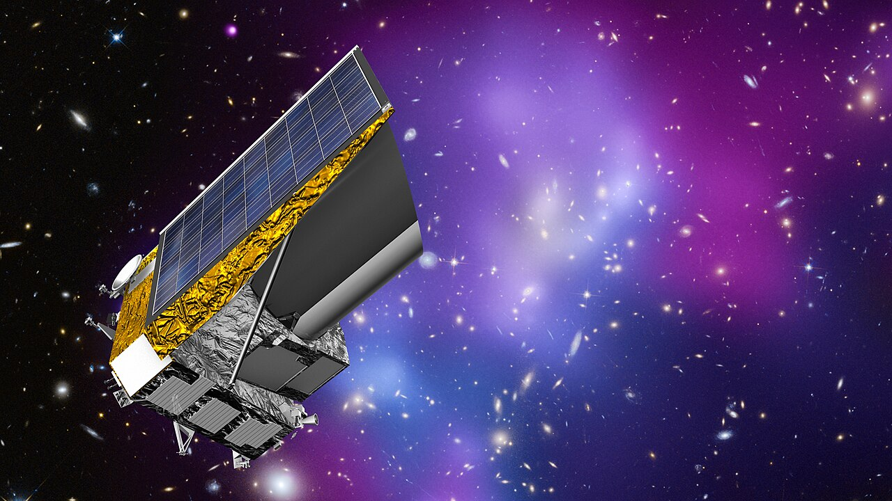

# 유클리드 우주망원경 사진, AI가 바로 배울 수 있을까?

_중국 국가천문대가 은하 사진 36만 장을 같은 규격으로 바꿔 두자, 처음 걸린 것은 빈 화면과 별빛 번짐 같은 불량 사진이었다_

## Executive Summary

> [!callout]
> 중국과학원 국가천문대와 국가천문데이터센터의 연구자 다섯 사람이 2026년 9월 26일 arXiv에 논문 한 편을 올렸다. 유럽우주국의 유클리드 우주망원경이 찍은 은하 사진 365,513장을 모두 같은 화소 크기로 바꾸고, 사진 한 장마다 384개의 숫자로 된 특징값을 미리 계산해 함께 공개한 작업이다. 논문 제목에는 'AI-Ready', 곧 AI가 바로 쓸 수 있는 상태라는 말이 붙어 있다. 이 글은 그 말이 실제로 무엇을 미리 정해 두는 일인지를 본다.

> 가장 눈에 띄는 수치는 1,681이다. 그렇게 준비한 자료에 이상 탐지를 돌려 추려 낸 후보의 개수다. 그런데 논문이 그 후보들을 그림으로 펼쳐 보인 자리에는 미지의 천체가 거의 없다. 아무것도 찍히지 않은 빈 화면, 가장자리에서 잘려 나간 사진, 밝은 별빛이 십자로 번진 자국, 서로 겹쳐 찍힌 은하가 대부분이다. 저자들도 이 결과가 데이터 품질 관리에 즉각적인 가치를 보여 줄 뿐 천체물리학적 이상현상을 확증하는 것은 아니라고 못 박았다.

> 1절부터 4절까지는 논문에 적힌 내용이다. 5절은 그 사실을 데이터 품질의 눈으로 다시 읽은 이 글의 해석이다.

### 주요 수치

출처: Xie, Xu, Zhang, Chen, Cui, ["Making Euclid VIS Imaging AI-Ready"](https://arxiv.org/abs/2609.32753) (arXiv:2609.32753, 2026년 9월 26일).

<!-- stat-card -->
**365,513장** — 같은 규격으로 바꾼 은하 사진 — 1차 생산에 48시간이 걸렸다. 저자들이 기록한 운영 추정치다

<!-- stat-card -->
**384차원** — 사진마다 미리 뽑아 둔 특징값 — 분류든 검색이든 이상 탐지든 같은 값을 다시 쓴다

<!-- stat-card -->
**1,681개** — 추려 낸 이상 후보 — 논문이 보여 준 표본은 대부분 빈 화면·별빛 번짐 같은 촬영 불량이다

<!-- stat-card -->
**0.484** — 나선은하 분류 점수 — 무조건 다수 쪽으로만 답하는 기준선 0.492보다 낮다

## 이틀 만에 36만 장, 같은 규격으로

유클리드는 유럽우주국이 2023년에 쏘아 올린 우주망원경이다. 우주의 팽창과 암흑물질 분포를 측정하기 위해 하늘을 넓게 훑으며 은하를 찍는데, 그 가시광 카메라가 남긴 사진은 이미 한 사람이 눈으로 볼 수 있는 양을 한참 넘어섰다. 이번 논문이 다룬 자료는 유클리드의 첫 공개분인 Quick Data Release 1과, 자원봉사자들의 분류를 바탕으로 만든 Galaxy Zoo Euclid 형태 목록이다. 뒤쪽 목록에 오른 고유 천체는 380,111개다.

*▲ 이번 논문이 다룬 사진을 찍은 카메라의 주인, 유클리드 우주망원경 상상도 | Source: [ESA/C. Carreau, CC BY-SA 3.0 IGO](https://commons.wikimedia.org/wiki/File:Euclid_ESA376594.jpg)*

목록에 적힌 형태 값은 사람이 은하마다 손으로 써 넣은 것이 아니다. 자원봉사자들이 남긴 응답으로 학습한 Zoobot 모델이 은하마다 내놓은 확률이고, 이 논문이 정답으로 쓴 것은 그 확률 가운데 확신이 높은 쪽만 문턱으로 걸러 낸 부분집합이다.

연구진이 공개한 것은 그 가운데 365,513줄이다. 천체 번호가 겹친 9줄을 걷어 내면 목록과 맞물리는 천체는 365,504개가 된다. 사진마다 128×128 화소짜리 원본 조각을 받아 224×224로 바꾸고, 같은 사진에서 뽑은 384개의 숫자를 나란히 붙였다. 자료는 국가천문데이터센터에서 내려받을 수 있고, 처리 코드는 MIT 라이선스로 공개했다.

*▲ 유클리드가 찍은 페르세우스 은하단 일부. 이런 사진 365,513장이 한 규격으로 바뀌었다 | Source: [ESA/Euclid/Euclid Consortium/NASA, image processing by J.-C. Cuillandre (CEA Paris-Saclay), G. Anselmi, CC BY-SA 3.0 IGO](https://commons.wikimedia.org/wiki/File:Euclid%E2%80%99s_view_of_Perseus_-_zoom_2_ESA25172046.jpg)*

이 일을 맡은 것은 국가천문데이터센터 안에 올려 둔 컷아웃 서비스다. 요청을 묶어 여러 워커에 나눠 주고, 좌표와 조각 크기와 관측 기기와 파일 형식과 파장대를 열쇠로 삼아 결과를 저장해 둔다. 같은 요청이 다시 들어오면 계산하지 않고 저장해 둔 것을 내준다. 반복 요청이 잦은 자료일수록 이 구조가 값을 한다.

1차 생산은 약 48시간에 끝났다. 초당 2.12장, 시간당 7,615장꼴이다. 다만 이 속도를 정밀 측정값으로 읽으면 논문보다 앞서 나간 것이 된다. 저자들은 이 수치가 타임스탬프를 모두 남긴 벤치마크가 아니라 자신들이 기록한 운영 추정치라고 본문에 적어 두었다. 이 글이 인용하는 숫자 가운데 성격이 다른 하나가 이것이다.

## 'AI-Ready'는 무엇을 미리 정해 두는가

논문에서 이 말을 정의하는 자리는 딱 한 곳, 첫 그림의 설명문이다. 거기에 적힌 AI-Ready는 두 가지를 가리킨다. 하나는 표준화된 사진 조각이고, 다른 하나는 여러 분석이 함께 쓸 수 있는 재사용 가능한 특징값이다. 저자들은 본문에서 한 번 더 선을 긋는다. "우리는 'AI-ready'를 이런 운영·공학적 의미로 쓰며, 하나의 표현이 모든 과학적 추론에 충분하다는 주장으로 쓰지 않는다."

첫 번째로 정해 둔 것은 화소 규격이다. 원본 조각을 32비트 실수로 읽고, 값이 비어 있는 화소를 걷어 내고, 밝기 분포의 아래위 1%를 잘라 낸 다음 0과 1 사이로 눌러 편다. 그리고 128화소를 224화소로 늘린 뒤 흑백 한 장을 세 겹으로 복제한다. 사진마다 제각각이던 밝기 범위와 크기가 이 단계에서 하나로 모인다.

두 번째는 특징 공간이다. 연구진은 메타가 공개한 범용 시각 모델 DINOv2의 작은 모델(ViT-S/14)을 가져와 가중치를 얼린 채로 썼다. 천문 사진으로 다시 학습시키지 않았다. 웹 이미지 1억 4,200만 장으로 배운 모델이 은하 사진을 보고 내놓는 384개의 숫자를, 그대로 이 자료의 공용 좌표로 삼은 것이다. 이후의 모든 분석은 사진을 다시 열지 않고 이 숫자만 읽는다.
