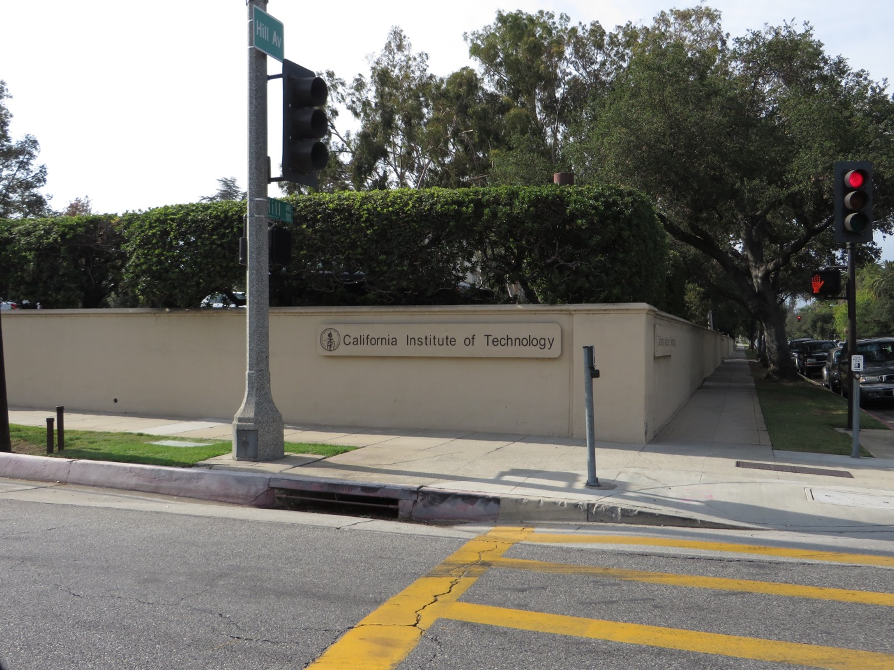
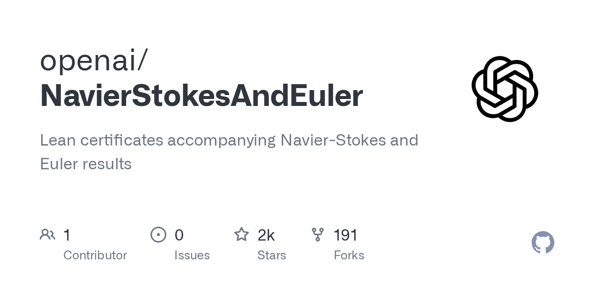
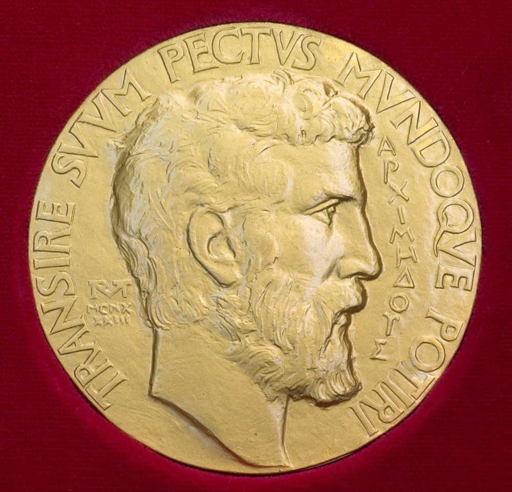

# 25 Fields Medalists Signed a Declaration Against How AI Proofs Are Announced

_OpenAI released a 166-page proof and its Lean code; where that proof came from stayed unverified_

## Executive Summary

> [!callout]
> On September 8, 2026, OpenAI announced a proof that finite-time singularities occur in the three-dimensional incompressible Navier-Stokes equations. Three days later, on September 11, twenty-five Fields Medalists signed a declaration titled "A Severe Misalignment of AI in Mathematics." This article looks at what the declaration objected to, what it did not object to, and what remained unconfirmed once the dust settled.

> One widely repeated reading is simply false: that OpenAI kept the proof to itself and announced only the result. A 166-page Navier-Stokes manuscript, a 57-page Euler manuscript and a Lean 4 formalization repository all went out on the day of the announcement. Anyone can download the repository and build it, and a machine rechecks the certificate. No line in the declaration calls the proof wrong either. Its complaint is that "solutions are announced in a rush, leaving no time for a proper writeup, the isolation of new methods and ideas, and citing relevant previous work of others."

> Sections 1 through 4 stay inside the published record: the two manuscripts, the two repositories, OpenAI's September 8 announcement, the full text of the declaration, and the statements the parties issued themselves. Section 5, where we carry the episode over to our own data practice, is this article's reading rather than anything those documents say.

### Key figures

Sources: agent, hour and token counts are the figures stated in [OpenAI's September 8 announcement](https://openai.com/index/navier-stokes-solution/); signatories from [mathandai.org](https://mathandai.org/)

<!-- stat-card -->
**88 hours** — Time it took roughly 10,000 agents to reach the result — Launched September 1, result September 5. Lean formalization and verification took 17 hours more

<!-- stat-card -->
**130 billion** — Output tokens spent on the Navier-Stokes work — 2.7 million messages. Counting the related attempts, roughly 300 billion

<!-- stat-card -->
**25** — Fields Medalists who signed the declaration — From Deligne (1978) to Yu Deng (2026). The declaration names no company

<!-- stat-card -->
**$1 million** — Prize money OpenAI said it would not claim — It wrote that it had established clauses (C) and (D), the ones that allow a forcing term

## The month that led to the declaration

The story does not begin at OpenAI. Tristan Buckmaster of NYU's Courant Institute and Levent Alpöge, a mathematician at Anthropic, had spent close to a year in a private collaboration chasing finite-time blow-up in the fluid equations. In the statement Buckmaster released himself, he dates the blow-up results for the Boussinesq equations with a smooth forcing term and for the three-dimensional Euler equations to August 15, and the completed Lean verification to August 22. He also listed the tools the two of them used: Anthropic's Claude and OpenAI's Codex.

On September 3, with rumors circulating that Anthropic had cracked a major problem, Buckmaster emailed a mathematician at OpenAI. This was a purely private collaboration rather than an institutional venture, he wrote, and the two of them would release the results together with the formalization shortly. Two phone calls followed on Sunday afternoon, September 6, with Sébastien Bubeck joining. On those calls Buckmaster was told that an internal OpenAI model had produced a blow-up proof for forced Navier-Stokes. On September 8 both sides released in parallel. In the early hours UTC, Alpöge and Buckmaster posted three papers, a Lean repository and a statement recounting what had happened; that evening, OpenAI published its manuscripts and its formalization.

| Date | What happened |
| --- | --- |
| Aug 15 | Alpöge and Buckmaster obtain blow-up results for forced Boussinesq and Euler |
| Aug 22 | Lean verification of the same results completed |
| Aug 28 | OpenAI begins training a new internal model. Training was still under way at the time of the announcement, the company wrote |
| Sep 1 | Hearing a rumor that two Millennium Problems had fallen, OpenAI turns agents loose on every unsolved Millennium Problem |
| Sep 3 | Buckmaster emails a mathematician at OpenAI to say the work is a private collaboration |
| Sep 5 | OpenAI's agents reach the result, 88 hours into the run |
| Sep 6 | Two phone calls with Bubeck present. Two proposals about authorship come up. OpenAI wrote that it finished its Lean verification that day and then contacted the pair |
| Sep 7 | Terence Tao writes up the Alpöge-Buckmaster work on his blog |
| Sep 8 | Alpöge and Buckmaster release three papers and a statement. OpenAI publishes its manuscripts and Lean formalization the same day |
| Sep 10 | OpenAI withdraws sponsorship of a Caltech mathematics event |
| Sep 11 | Twenty-five Fields Medalists sign the declaration |

The August 15, August 22, September 3 and September 6 entries are Buckmaster's account, from his four-page statement. The August 28, September 1 and September 5 entries, and the second half of the September 6 entry, are OpenAI's own words in its announcement.

Only a day separates the last two rows of that table. The withdrawal followed criticism from researchers at Caltech, and the declaration came the day after.

*▲ Caltech, whose mathematics event lost OpenAI's sponsorship | Source: [Wikimedia Commons (Ken Lund, CC BY-SA 2.0)](https://commons.wikimedia.org/wiki/File:California_Institute_of_Technology,_Pasadena,_California_(14516438274).jpg)*

## OpenAI did publish the proof

Some September 8 stories reported that the proof had not been published, and that line is still being quoted. The press briefing ran ahead of the announcement post. The Wayback Machine capture of the post at 17:15 UTC on September 8 already carries links to the manuscripts and to the Lean formalization side by side. "Finite Time Blowup for Navier–Stokes" runs 166 pages and "Finite Time Blowup for the Euler Equation" runs 57; the author field on both carries no human name, only OPENAI. The formalization sits at `github.com/openai/NavierStokesAndEuler`. It uses Lean 4.34.0-rc2 with Mathlib, and the repository instructions tell you to fetch the cache and run `lake build`. A separate document covers rechecking the formalization with an external checker.

*▲ OpenAI's Lean formalization repository, openai/NavierStokesAndEuler | Source: [GitHub](https://github.com/openai/NavierStokesAndEuler)*

Theorem 1.1 of the Navier-Stokes manuscript establishes the following. For any positive viscosity, pick one smooth external force with compact support in space and time, start the fluid from rest, and the kinetic energy stays bounded while the velocity goes to infinity in finite time. The manuscript states that this establishes clause (C) of Fefferman's official problem statement, and that compact support carries clause (D) on the three-dimensional torus along with it.

### 2.1. The problem statement itself is asymmetric

The fork here is worth checking in the original. Fefferman's statement, as published by the Clay Mathematics Institute, asks for a proof of one of four clauses. Clauses (A) and (B), which assert existence and smoothness, nail the external force to zero.

“(A) Existence and smoothness of Navier–Stokes solutions on R³. … Take f(x, t) to be identically zero.”

Clauses (C) and (D), which assert breakdown, carry no such condition. A smooth external force may be chosen.

“(C) Breakdown of Navier–Stokes solutions on R³. … Then there exist a smooth, divergence-free vector field u°(x) on R³ and a smooth f(x, t) on R³ × [0, ∞), satisfying (4), (5), for which there exist no solutions (p, u) …”

OpenAI established (C), and with it (D). Read as written, the statement is satisfied. But the Navier-Stokes problem many experts carry in their heads has no such force in it. [Scientific American](https://www.scientificamerican.com/article/ai-may-have-just-solved-a-million-dollar-math-problem-the-field-will-never-be-the-same/) put the gap this way.

“The Clay problem, as written, is solved. But the Clay problem, as many experts imagine it, lacks the piece that the forcing method relies on.”

OpenAI's own decision not to claim the prize money points at the same gap, and the Clay Mathematics Institute still lists the problem as open. OpenAI's Euler paper, by contrast, has no forcing term. It claims a finite-time singularity with no external force at all, starting from a single smooth, compactly supported initial velocity field, which puts it ahead of the forced Euler result from Alpöge and Buckmaster on that particular question. Neither manuscript has been read through by humans yet, and that review has only just started.

### 2.2. How far does a formalization go

At the root of the repository sits a one-page manifest called `formalization.yaml`. It lists four main results and reports, for each, zero instances of `sorry`, the marker for an unfinished proof, and only Lean's three standard axioms in use. Everything to that point is machine-checkable. The interesting lines come below. One records the review status as `self-assessed`. So the repository states on its own page that it has had no independent review.

The other line answers what the formalization was aimed at. The theorem statements used as the benchmark in the challenge file that runs under the external checker Comparator were not written by OpenAI. They are adapted from the Clay-problem formalization published by Google DeepMind's Formal Conjectures project, a file first committed on May 15, 2026, nearly four months before any of this. So the structure is not one of writing your own problem and then solving it, and the question of whether the formalization really captures the original problem has moved at least one step outside the company.

Nobody in this episode thought a certificate alone was enough, least of all the side that held one first. In his September 3 email, Buckmaster wrote that the two of them had “intentionally decided against rushing out a Lean certificate alongside an unpolished preprint.” His reason was that the first thing anyone reads should be a mathematical argument presented in the normal manner rather than just a formal certificate. One result the pair held back from their own same-day release: blow-up for hypo-dissipative Navier-Stokes, which they left out, the statement says, because the Lean verification was not finished.

> [!callout]
> "Can this be verified?" and "has this been verified?" are different questions. OpenAI's result answers the first. The manuscripts and the formalization are out, so anyone can download them and put them back through a machine. The second question, whether 166 pages of analysis actually support the formalized result, takes human time and is not finished. The repository saying its own review status is self-assessed amounts to the same thing.

## The declaration never said the proof was wrong

The declaration posted to [mathandai.org](https://mathandai.org/) on September 11 is titled "A Severe Misalignment of AI in Mathematics." All twenty-five signatories are Fields Medalists, running from Pierre Deligne, who won in 1978, to Yu Deng, who won in 2026, and including Artur Avila, Peter Scholze, Maryna Viazovska, June Huh, Terence Tao, Cédric Villani, Ngô Bảo Châu and Martin Hairer. The declaration names neither OpenAI nor Anthropic. It proposes no rule and no enforcement mechanism.

*▲ The Fields Medal — the honor all 25 signatories share | Source: [Wikimedia Commons (Stefan Zachow/IMU, Public Domain)](https://commons.wikimedia.org/wiki/File:FieldsMedalFront.jpg)*

It opens by granting the premise: over the past few months, language models have grown strong enough at mathematics to genuinely solve major open problems. Its objection is then to the use being made of that capability rather than to the capability itself. The target of the first paragraph is not a particular company either. The push by AI companies to solve mathematical problems as a benchmark, it says, is detrimental to the science of mathematics and to the mathematical community, and the goals of the two groups are severely misaligned.

“But solving problems is only a tool and proxy for achieving the primary goal of conceptual understanding and insight. Forgetting this in the world of AI may turn the tool against the primary goal. Indeed, the mass production at faster and faster pace of “true/false” statements could destroy fertile ground instead of breathing life into new ideas.”

The faster the sorting of true from false, in other words, the less ground is left for understanding to grow in. An abundance of true statements has never been the complaint. The question is how much is left once statements pile up faster than people can absorb them.

Then comes the paragraph closest to this episode, where the declaration says why speed is itself the problem.

“Often these solutions are announced in a rush, leaving no time for a proper writeup, the isolation of new methods and ideas, and citing relevant previous work of others. As in all creative professions, this raises severe attribution and plagiarism questions.”

Correctness hangs on none of it. The objection is that a rushed announcement drops three things: the proper writeup, the isolation of new methods and ideas, and the citation of other people's prior work. The declaration treats these as a problem of transmission rather than a scholarly luxury. Without people to take a result in, work it over and turn it into textbooks, even an idea an AI came up with fails to survive.

Tao, reposting the declaration on his blog, also recorded how it came together. Twenty-five people discussed it over the past week, and he concedes that the process fell short.

“It is unfortunate that we did not have the time to have a more consultative process, as with Leiden; but we decided that the urgency of the situation was such that we needed to release a statement sooner rather than later.”

Leiden here means the [Leiden Declaration](/blog/leiden-declaration-ai-mathematics/en/) that more than a thousand mathematicians issued in June. That one set conditions around consent for AI training, attribution and peer review, and it came with recommendations attached. Three months later the same community has raised a problem on the same axis, this time with no time to attach recommendations. The twenty-five are initial signatories, and as with Leiden, further signatures are being collected through ORCID or academic email verification.

The final paragraph addresses three audiences at once: the mathematical community, the companies building the technology, and a society that will meet the same problem in other forms. The paragraph before it says that whether this change helps or harms the discipline depends heavily on the decisions of the people holding the new technology. A declaration that proposed no rules left that sentence behind instead. It writes down who is in a position to decide.

### 3.1. The rushed release was not one side's doing

Read the declaration as a verdict on one company and you miss half the episode. The other half is a sentence Buckmaster wrote about his own manuscript. Saying in his statement that he was not satisfied with the quality of the release, he put it this way about the Euler writeup.

“The Euler writeup, in particular, can only be described as AI slop. I am sorry for this.”

This passage is the clearest illustration of the declaration's phrase "a proper writeup." Buckmaster called the model-generated proof Alpöge first sent him the worst writeup he had ever seen, and the two of them spent the following weeks turning it into something a human could read. Tao wrote on September 7 that the pair had been revising the manuscript for weeks and had to publish before it was fully digested. Obtaining the proof took a month; rendering it as human prose took longer.

Tao's September 7 post is also a demonstration of the very thing the declaration calls "the isolation of new methods and ideas." After a half-hour phone call in which Buckmaster explained the main ideas, Tao laid out on his blog the shape of the strategy that began with Córdoba and Martínez-Zoroa, and said that exposing the ideas that way is the principal value of work like this. He added that the actual solving of these problems is only a proxy goal for the primary goal of mathematical understanding and insight, and that without such understanding, even the Navier-Stokes regularity problem is of far less intrinsic significance to mathematics than popular media sometimes suggests. The sentence the declaration would commit to paper four days later, he had already carried out in his own post the day before the dispute went public.

## The open question is provenance

One of the questions Buckmaster put on the September 6 call never got an answer. The two of them had worked with their drafts sitting inside Codex sessions for the length of the project, and he asked whether those sessions had been trained on or accessed.

“I asked whether the model had been trained on, or had access to, our sessions in Codex, into which we had been putting all our drafts for the whole of this project. I was told the model did not look up user data. I asked again, about training, and I did not get an answer.”

OpenAI said that neither its researchers nor its agents saw any of the pair's work through any means until they released it publicly, and that no specific user data was accessed in order to solve the problem. It also declined to rule one thing out.

“While unlikely, we cannot rule out that de-identified data derived from their usage of our products helped improve our models.”

*▲ The Pioneer Building in San Francisco, where OpenAI is based | Source: [Wikimedia Commons (CC BY-SA 4.0)](https://commons.wikimedia.org/wiki/File:Pioneer_Building,_San_Francisco_(2019)_-1.jpg)*

That sentence is the part of this episode with the longest shelf life. Whether a proof is true, a machine answers in hours. Where that proof came from, nobody outside the company can check. A Lean certificate carries no record of origin. Formal verification is an instrument for guaranteeing that a result is true, not for recording where it came from.

Buckmaster drew the boundary of his own claim himself. He wrote that he had not seen the proof, did not know what the model did or how, and did not know whether their data had been used. "I am not accusing anyone of anything. I am stating what I was told, when, and what was proposed to me." The proposals he set down as fact were two: that his side post the Euler result first with OpenAI posting Navier-Stokes the next day, and that Buckmaster write the Navier-Stokes paper as sole author. He wrote that Bubeck twice asserted he wanted Alpöge removed from authorship and said it was annoying that Alpöge works at Anthropic. When he refused, the reply that came back was "Why would you ruin your career?" OpenAI and Bubeck disputed parts of this account and apologized for some of the language.

OpenAI wrote down the same September 6 in its own announcement, in a section headed "Concurrent work." Having completed the project and the Lean verification that day, and believing from the rumor that the pair also had a solution of Navier-Stokes, the company says it reached out to offer a concurrent release and to recognize their priority in a joint announcement. One sentence records an offer of visibility into all of the prompts the company used and, later, to see the proof, and the section closes by recognizing the pair's priority on forced Euler and congratulating them on a remarkable mathematical achievement. One side writes that it offered to recognize priority; the other writes that it was asked to drop a coauthor. Both records are public, and there is no third record to say which is closer to what was actually said that day.

The account of the process also arrived twice. Buckmaster was shown a single prompt, along with an explanation that the internal research model had been given only the problem statement, and he wrote that Alpöge was told there had been almost no human involvement. As the call went on, teammates sent corrections over internal chat and a different picture emerged: an entire team had been working on the problem, this was one of a number of things that was tried, easier problems such as Euler had been fed to the model first, and even the prompt he had been shown had itself been written by prompting Codex. OpenAI's announcement two days later tells the same story as that second picture. Groups of agents were set on different approaches, Codex was used to consolidate the most useful intermediate results from each group into follow-up prompts, and the group that found the Navier-Stokes solution was guided in that way, the announcement says. The same section records that unforced Euler, the easier problem given to the model first, fell to roughly a hundred agents in about fifty hours, after which resources were shifted to Navier-Stokes.

The point Buckmaster suspected most strongly also has an answer of sorts in the announcement. He wrote that when he heard the word "forced," it was "a bright red flag": hardly anyone had been working the (C) and (D) direction, and OpenAI had settled on it within days. OpenAI says it gave different variants of each problem to different groups of agents, and that for Navier-Stokes it assigned versions "A" and "B", which would amount to a proof, and versions "C" and "D", which would result in a disproof, to separate groups. Running all four branches at once rather than choosing one, in other words. Whether that account is accurate cannot be checked from outside. The sentences in the announcement are all there is.

The documents a machine can recheck in this episode are the two manuscripts and the two repositories. None of them records how it was made. Neither the 166-page manuscript nor the 57-page one contains an acknowledgments section or any note on how the work was carried out, and the words agent, language model and Lean do not appear once. The author field is a single line reading OPENAI. How many agents did what over how many days lives only on the company blog, and the model that did it has not been released. The announcement calls it only an internal model "significantly more capable than GPT-6 Astra." The certificate is open to anyone's inspection and the process description is open to anyone's reading, but the process cannot be run back the same way. The boundary between what is verifiable and what stays unconfirmed is right here.

### 4.1. The prior-work citations did not go missing

Of the three things the declaration named, "citing relevant previous work of others" is right there in the manuscripts. Both OpenAI papers open with a section on historical context and previous work. The Navier-Stokes manuscript walks from Leray's 1934 weak solutions through the Caffarelli-Kohn-Nirenberg partial regularity theorem, the Escauriaza-Seregin-Šverák regularity result, Tao's blow-up for an averaged equation and Buckmaster-Vicol non-uniqueness. The Euler manuscript cites Elgindi, Chen-Hou, Córdoba-Martínez-Zoroa-Zheng, Isett, and De Lellis-Székelyhidi in a row. A picture of a rushed manuscript skipping the literature does not fit what is on the page.

The friction sits elsewhere. Both OpenAI manuscripts cite the work of Diego Córdoba and Luis Martínez-Zoroa, the origin of this line of attack, several times over. Neither cites the Alpöge-Buckmaster preprints that came out the same day. Buckmaster appears by way of the 2019 Buckmaster-Vicol non-uniqueness paper. Results released on the same day failing to cite each other is unremarkable in itself. But the declaration's worry is aimed exactly at this spot: when releases overlap to the day, there is no time left to read one another and place the work.

The clearest statement about attribution came from a party to the dispute. Near the top of his statement, Buckmaster wrote that neither he and Alpöge nor a language model started or proposed this program. The credit for the basic idea belongs to Córdoba and Martínez-Zoroa, he wrote, and he and Alpöge had pushed that program, stuck until then at a rough forcing term, all the way to a smooth forcing term and the Euler equations with substantial help from language models. Then he added a line: in light of this body of work, he believes Luis Martínez-Zoroa deserves a Fields Medal. In the week a warning went out that attribution was breaking down, the sentence that carried attribution furthest sat inside the same episode.

## Why Pebblous is watching this

From here we leave the published documents and measure the episode from the side that handles data for a living. This episode leaves behind the fact that verifiability and provenance are two different objects. Mathematics already had a verification instrument no other field can match. A formalized proof gets rechecked by a machine, and no amount of persuasion gets it through. Both sides used that instrument, and the dispute did not subside, because the fight was over the origin of the result rather than its truth.

The distinction is familiar in data work. Mechanisms for checking whether a model's answer is correct keep multiplying. Mechanisms for tracing which data an answer came from have not kept pace. The sourcing of training data, the scope of consent and the path to reproduce it usually exist only in the builder's own description. That is the same reason OpenAI had no choice but to write that it could not rule the possibility out. Ruling it out requires a record of which data entered which training run, and that record has to be checkable from outside.

There is a second question. Who owns the drafts and session logs poured into a coding tool as a research asset? Buckmaster and Alpöge worked with a year of material inside Codex. In that same September 3 email, Buckmaster wrote that he pays for the tools his group uses out of his own research funds, including footing a large bill to OpenAI. Unpublished manuscripts from the side paying the bill had been accumulating for a year inside the product of the side collecting it. That record is product usage data and unpublished research at the same time. Two natures overlap in one file, and the contracts and record-keeping systems that would separate them do not yet exist. Any organization working with coding agents attached might start by checking which side its own logs fall on.

- Do you hold a mechanism for checking whether an output is true and, separately, a mechanism for tracing where it came from? With only the first, you stop where this episode stopped.
- Do you know, as a list, where and how much unpublished material of yours sits inside external tools? A sentence in a contract is not the same as knowing it as data.
- When someone wants to cite a result of yours, have you written down first what they should cite it on?

<!-- stat-card -->
**Editor's Note** — The reason Pebblous lists provenance as one of the quality dimensions when it talks about AI-Ready Data is laid out in this episode. Whether data is clean and where data came from are separate questions, and the second one cannot be reconstructed after the fact. Left unrecorded, it disappears at the moment it is created.

Thank you for reading this far. Every document cited in this article is public. We would encourage you to read the [declaration itself](https://mathandai.org/), [Buckmaster's statement](https://cims.nyu.edu/~tristanb/statement.pdf), [OpenAI's Lean repository](https://github.com/openai/NavierStokesAndEuler) and [Fefferman's problem statement](https://www.claymath.org/wp-content/uploads/2022/06/navierstokes.pdf) directly. If your organization has a way of tracing where a model's output came from, we would like to hear it.

## References

### Primary sources

- 1.OpenAI. (2026). "[On the Navier–Stokes Millennium Prize Problem](https://openai.com/index/navier-stokes-solution/)." OpenAI, September 8, 2026.
- 2.Fields Medalists (25 initial signatories). (2026). "[A Severe Misalignment of AI in Mathematics](https://mathandai.org/)." mathandai.org, September 11, 2026.
- 3.Buckmaster, T. (2026). "[Statement](https://cims.nyu.edu/~tristanb/statement.pdf)." New York University.
- 4.OpenAI. (2026). "[NavierStokesAndEuler](https://github.com/openai/NavierStokesAndEuler)." GitHub repository, September 8, 2026.
- 5.Google DeepMind. (2026). "[Formal Conjectures](https://github.com/google-deepmind/formal-conjectures)." GitHub repository — Clay problem formalization first committed May 15, 2026.
- 6.Fefferman, C. L. (2000). "[Existence and Smoothness of the Navier–Stokes Equation](https://www.claymath.org/wp-content/uploads/2022/06/navierstokes.pdf)." Clay Mathematics Institute — Millennium Prize Problems.
- 7.Tao, T. (2026). "[Finite time blowup with smooth forcing term for the incompressible porous medium, Boussinesq, and incompressible Euler equations](https://terrytao.wordpress.com/2026/09/07/finite-time-blowup-with-smooth-forcing-term-for-the-incompressible-porous-medium-boussinesq-and-incompressible-euler-equations/)." What's new, September 7, 2026.

### Industry & press

- 8.TechCrunch. (2026). "[OpenAI's feud with mathematicians is only escalating](https://techcrunch.com/2026/09/11/openais-feud-with-mathematicians-is-only-escalating/)." September 11, 2026.
- 9.TechCrunch. (2026). "[OpenAI "fought dirty" on career-making math problem, says NYU mathematician](https://techcrunch.com/2026/09/08/openai-fought-dirty-on-career-making-math-problem-says-nyu-mathematician/)." September 8, 2026.
- 10.Fortune. (2026). "[OpenAI says it cracked a Navier-Stokes math grand challenge — but Buckmaster's cheating, intimidation accusation has Tao lamenting](https://fortune.com/2026/09/08/openai-says-it-cracked-navier-stokes-math-grand-challenge-buckmaster-accusation-cheating-intimidation-tao-lament/)." September 8, 2026.
- 11.The Next Web. (2026). "[OpenAI's Navier-Stokes claim: verification and credit](https://thenextweb.com/news/openai-navier-stokes-claim-verification-credit)."
- 12.Scientific American. (2026). "[AI May Have Just Solved a Million-Dollar Math Problem. The Field Will Never Be the Same](https://www.scientificamerican.com/article/ai-may-have-just-solved-a-million-dollar-math-problem-the-field-will-never-be-the-same/)."
- 13.Implicator.ai. (2026). "[25 Fields Medalists Say AI Labs' Race to Solve Math Problems Is Harming Mathematics](https://www.implicator.ai/25-fields-medalists-say-ai-labs-race-to-solve-math-problems-is-harming-mathematics/)."
- 14.Unite.AI. (2026). "[Buckmaster and Alpöge Post AI Fluid Blow-Up Proofs, Dispute OpenAI Contact](https://www.unite.ai/buckmaster-and-alpoge-post-ai-fluid-blowup-proofs-dispute-openai-contact/)."
