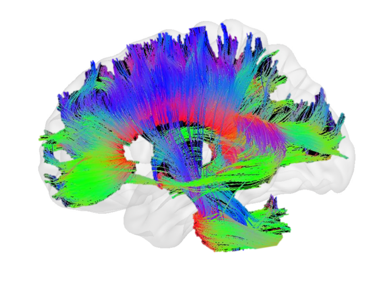

# Flourish Raised $500M to Build AI Wired Like the Brain

_Backed by Bezos and GV, Flourish uses connectomics to design a 20-watt Cortex AI_

## Executive Summary

> [!callout]
> In June 2026, a two-year-old startup called Flourish raised $500 million. Jeff Bezos put in roughly $100 million, with Alphabet's venture arm GV and Lux Capital filling out the rest, and a company with no revenue and no working product was valued at $2.5 billion. The bet that money rides on shrinks to a single sentence. The human brain learns over a lifetime on 20 watts, so why does AI have to run thousands of GPUs that each draw more than 700 watts?

> Flourish's answer is not to build a new chip. It is to study the cortex's repeating circuitry under an electron microscope, find the computational principles hidden inside it, and rewrite them as software. The target power draw is 20 to 50 watts, three to seven percent of a single GPU. But because decades of neuroscience have not even settled whether the brain has a single "core algorithm," what this company is selling is not a product but a hypothesis.

> For Pebblous readers there is a separate reason this matters. With data scarcity and the power crisis arriving at the same moment, the scaling consensus (run a bigger model on more data) is hitting its limits from both sides at once. If the key to intelligence lies not in scale but in structure and data efficiency, then the question data-centric AI has to ask shifts once again.

### Key figures

Sources: [SiliconAngle](https://siliconangle.com/2026/06/04/ai-startup-flourish-reportedly-raises-500m-round-backed-jeff-bezos/), [TechFundingNews](https://techfundingnews.com/bezos-flourish-500m-brain-inspired-ai-power-crisis/)

Four numbers show both the size of this bet and the tension inside it. The raise and the target power are what the company has promised; the last two explain why that promise is being made now. Data-center power is already full, and the human brain, as the point of comparison, widens the gap to 30x.

<!-- stat-card -->
**$500M** — Raised with no product — $2.5B valuation; Bezos invested about $100M

<!-- stat-card -->
**20–50W** — Cortex AI target power — 3–7% of one GPU's 700W+

<!-- stat-card -->
**30x** — GPU-vs-brain power gap — Against a 20W brain handling lifelong learning

<!-- stat-card -->
**95%+** — Data-center power used up — Power-allocation ceiling in key 2026 US markets

## One GPU Draws 30x More Than a Brain

Flourish's round closed fast. Talks opened in late April, and five weeks later, in early June, $500 million was in. Bezos doubled his initial $50 million commitment to roughly $100 million, and Alphabet's GV, Lux Capital, and the healthcare fund Catalio joined. What the company showed was not revenue but two résumés and the one problem the industry most desperately wants solved right now.

The founders' backgrounds explain half of that confidence. Thomas Reardon built Internet Explorer at Microsoft in 1994, then turned toward neuroscience and founded CTRL-labs, which used wrist-muscle signals to control a computer; Meta acquired it in 2019. Co-founder Rob Williams was a senior Amazon executive who led Alexa. On his way out of Amazon he followed company tradition and wrote a "press release for a product that doesn't exist yet," handing it to Bezos; Bezos's "yes" in December 2025 became the company's starting point.

After that "yes," the company took shape quickly. It moved into a ten-story building in New York's West SoHo with its own in-house data center, and by March 2026 it had gathered some 20 neuroscientists and AI researchers. There is still no revenue and no product, but the speed at which a promise in a press release turned into an organization and a physical space was the other half of the signal investors saw.

The problem they have declared they will solve comes down to one number. The human brain learns over a lifetime on about 20 watts, less than an incandescent bulb. An Nvidia H100 GPU, the workhorse behind AI training and inference, draws more than 700 watts at full load, and large models run thousands of those chips in parallel. For the same "intelligence," at least a 30x power gap has opened up between biology and silicon. The Cortex AI that Flourish wants to build targets 20 to 50 watts, aiming straight at that gap.

*▲ Lateral view of the human brain — the cortex Flourish targets for reverse-engineering is built from cortical columns stacked across the Frontal, Parietal, Temporal, and Occipital Lobes. | Source: [Wikimedia Commons](https://commons.wikimedia.org/wiki/File:Blausen_0101_Brain_LateralView.png) (BruceBlaus, CC BY 3.0)*

## Tracing the Brain Under an Electron Microscope

"AI modeled on the brain" is not a new phrase. The artificial neural network is itself a metaphor borrowed from neurons, and neuromorphic chips like Intel's Loihi and IBM's TrueNorth have tried to carry the brain's spiking style into hardware. Where Flourish differs is in the target and the layer of imitation. Its starting point is not a metaphor or a chip but the brain's actual wiring diagram.

That method is connectomics. An electron microscope slices brain tissue down to nanometer resolution, and from those images a map is drawn, one strand at a time, of how the neurons connect. The unit Flourish pays particular attention to is the cortical column, a small circuit module of about 10,000 neurons that repeats countless times across the cortex. If the brain handles vision, language, and movement by stacking the same structure over and over, the assumption is that intelligence's "core algorithm" lives inside that repeating unit. Finding that principle and re-implementing it in software is the company's blueprint.

What this design aims at is not power alone. Flourish targets a model that does not end with one enormous training run but keeps learning throughout its life from little data. By reworking how memory is handled, it intends to cut the demand for training data itself. The assumption is that power efficiency and data efficiency emerge together from the same structure.

*▲ DTI-derived tractography of human brain white matter pathways — neural connections color-coded by orientation and density. Flourish goes further, using electron microscopy to map circuits at nanometer resolution. | Source: [Wikimedia Commons](https://commons.wikimedia.org/wiki/File:DTI_derived_tractography_sagittal_view.png) (AlPi90, CC BY-SA 4.0)*

So Flourish is not a chip company. Unlike Groq or Cerebras, it does not design new silicon; it sees the bottleneck as software structure rather than chips. It targets an architecture that runs both on today's GPUs and on the chips still to come. Among its advisors is Greg Wayne, the DeepMind researcher who led Google's Project Astra, who devotes 20 percent of his working hours to it, alongside UC Berkeley's Ben Recht.

> [!callout]
> To sum up, the approaches split three ways. Neuromorphic chips carry the brain's mode of operation into hardware; inference-specialized chips etch the transformer into silicon. Beneath both, Flourish proposes to reverse-engineer the brain's actual circuits and rewrite the software architecture. Even under the same "brain inspiration," what gets copied is different.

## In 2026 the Bottleneck Is Power, Not Chips

Why $500 million came together right now is explained by a shift in where AI infrastructure bottlenecks. As recently as 2024, everyone was stuck unable to get enough GPUs. The constraint in 2026 is not chips but power. Data centers stall not because there is no room to put servers, but because there is no electricity left to feed them.

The numbers show the pressure. Data-center power allocation in major US markets is estimated to be more than 95 percent used up in 2026, and global data-center electricity consumption is on track to pass 1,000 terawatt-hours. More than 60 percent of that still comes from fossil fuels. That is why Microsoft, Google, and Amazon have signed nuclear power deals one after another and are rushing to bring in small modular reactors. To scale AI further now means building a power plant first.

*▲ CERN Computer Center server racks — AI hyperscalers run thousands of racks like these, with a single campus consuming hundreds of megawatts. In 2026, securing power is harder than securing chips. | Source: [Wikimedia Commons](https://commons.wikimedia.org/wiki/File:CERN_Computer_Center_02.jpg) (SimonWaldherr, CC BY-SA 4.0)*

At this point the brain, as a comparison, poses a provocative question. The human brain learns nonstop for decades on 20 watts. Is that gap simply because "the hardware hasn't advanced enough yet"? Or is it an inefficiency in the design itself, one that no amount of added power will close? Flourish's bet is the latter. If the problem is structural, you cannot reach it by running chips faster.

## Is Intelligence Scale, or Structure?

The consensus that drove AI for the past several years was simple: gather more data, make the model bigger, and performance follows. Flourish's $500 million is an expensive rebuttal to that consensus. The human brain not only runs on little power but learns quickly from few examples and keeps learning throughout life without one massive training run. Today's AI is the opposite. Enormous data is the premise, and because training and inference are separated, the cost of learning again is high.

There is a reason this contrast grows sharper from a data perspective. The two fuels that grow a model, data and power, have started to run low at the same time. The internet's supply of high-quality text is already largely spent, and as the previous section showed, power allocation has hit its ceiling too. Where both fuels shrink at once, the strategy of "more" is blocked on both sides. So a structure that learns more efficiently from less data emerges as the next candidate.

There are, of course, ample reasons for caution. Whether a single "core algorithm" truly exists in the brain is a question neuroscience has failed to answer for decades, and the five-year breakthrough timeline Flourish has set is not a proven promise. The history of countless brain-inspired projects, Loihi and TrueNorth among them, that never managed to replace the GPU paradigm is not light, either. Meanwhile, the possibility remains that the transformer camp solves part of the power problem through hardware optimization alone.

Even so, the question this bet takes aim at is precise. Is the core of intelligence scale, or structure? If the answer leans toward structure, the center of gravity in how we handle data shifts too. The axis of competition becomes not the volume scraped together without limit, but the efficiency and quality of drawing more out of less data. Whether Flourish succeeds or fails, $500 million has already marked the coordinates of the question data-centric AI will ask next.

> [!callout]
> **Editor's Note.** Pebblous pays attention to this event not because the conclusion is settled but because the question is changing. When the "more" of an era of infinite data and cheap power is blocked on both sides, the road that remains is "better." Drawing more signal out of less data, the quality and efficiency of data, is exactly the ground we have spent a long time looking at.

## References

### Industry & Press

- 1.SiliconAngle. (2026, June 4). _AI startup Flourish reportedly raises $500M round backed by Jeff Bezos_. [siliconangle.com](https://siliconangle.com/2026/06/04/ai-startup-flourish-reportedly-raises-500m-round-backed-jeff-bezos/)
- 2.TechFundingNews. (2026, June 4). _Bezos backs Flourish's $500M bet on brain-inspired AI amid the power crisis_. [techfundingnews.com](https://techfundingnews.com/bezos-flourish-500m-brain-inspired-ai-power-crisis/)
- 3.TechTimes. (2026, June 6). _Jeff Bezos bets on Flourish, a $500 million startup trying to copy the brain to fix AI's power crisis_. [techtimes.com](https://www.techtimes.com/articles/317921/20260606/jeff-bezos-bets-flourish-500-million-startup-trying-copy-brain-fix-ais-power-crisis.htm)
- 4.AI Weekly. (2026). _Flourish closes $500M round to build brain-inspired AI_. [aiweekly.co](https://aiweekly.co/alerts/flourish-closes-500m-round-to-build-brain-inspired-ai)
