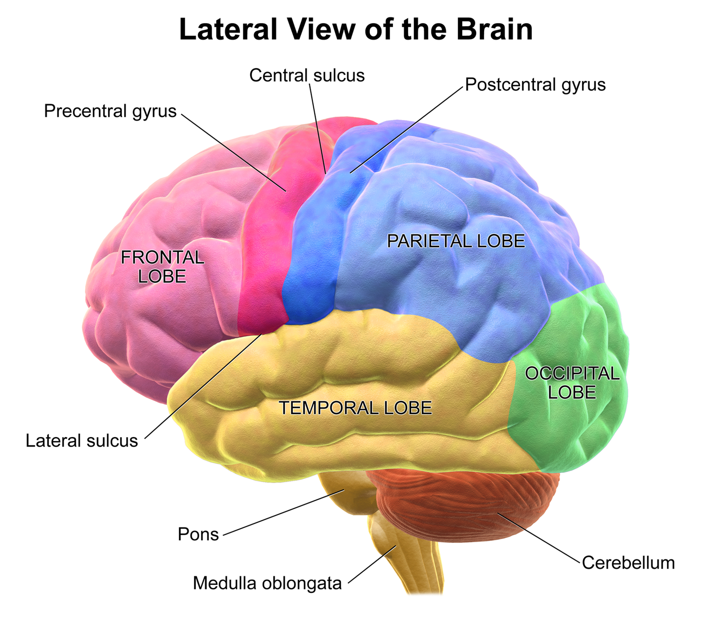
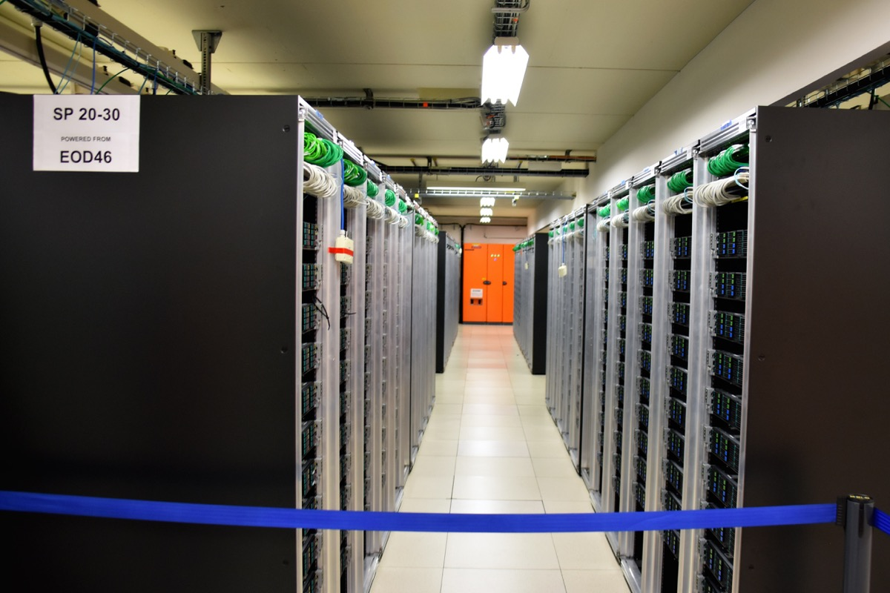

# 플로리시가 뇌 신경 배선을 본뜬 AI로 5억 달러를 유치했다

_베조스와 GV가 투자한 플로리시, 커넥토믹스로 20와트 코르텍스 AI를 설계한다_

## Executive Summary

> [!callout]
> 2026년 6월, 플로리시(Flourish)라는 2년차 스타트업이 5억 달러를 유치했습니다. 제프 베조스가 약 1억 달러를, 알파벳의 벤처 부문 GV와 Lux Capital이 나머지를 채웠고, 매출도 작동하는 제품도 아직 없는 회사의 밸류에이션은 25억 달러로 매겨졌습니다. 그 돈이 걸린 베팅은 한 문장으로 줄어듭니다. 사람 뇌는 20와트로 평생 학습하는데, 왜 AI는 한 장에 700와트가 넘는 GPU를 수천 개씩 돌려야 하는가.

> 플로리시의 답은 칩을 새로 만드는 것이 아닙니다. 뇌피질의 반복 회로를 전자현미경으로 들여다보고, 그 안에 숨은 계산 원리를 찾아 소프트웨어로 다시 짜겠다는 것입니다. 목표 소비전력은 20~50와트, GPU 한 장의 3~7퍼센트 수준입니다. 다만 수십 년의 신경과학이 뇌에 단 하나의 '핵심 알고리즘'이 있는지조차 확정하지 못했다는 점에서, 이 회사가 파는 것은 제품이 아니라 가설입니다.

> 페블러스 독자에게 이 사건이 중요한 이유는 따로 있습니다. 데이터 고갈과 전력 위기가 같은 시점에 닥치면서, '더 많은 데이터로 더 큰 모델을 돌린다'는 스케일링 합의가 양쪽에서 동시에 한계를 드러내고 있기 때문입니다. 지능의 열쇠가 규모가 아니라 구조와 데이터 효율에 있다면, 데이터 중심 AI가 던져야 할 질문 자체가 한 번 더 바뀝니다.

### 주요 수치

출처: [SiliconAngle](https://siliconangle.com/2026/06/04/ai-startup-flourish-reportedly-raises-500m-round-backed-jeff-bezos/), [TechFundingNews](https://techfundingnews.com/bezos-flourish-500m-brain-inspired-ai-power-crisis/)

네 숫자가 이번 베팅의 크기와 긴장을 함께 보여줍니다. 유치 금액과 목표 전력은 회사가 약속한 것이고, 마지막 두 숫자는 그 약속이 왜 지금 나왔는지를 설명합니다. 데이터센터 전력은 이미 다 찼고, 인간 뇌라는 비교 대상은 그 격차를 30배로 벌려 둡니다.

<!-- stat-card -->
**5억 달러** — 제품 없이 유치 — 밸류에이션 25억 달러, 베조스가 약 1억 달러 투자

<!-- stat-card -->
**20~50W** — 코르텍스 AI 목표 전력 — GPU 한 장 700W+의 3~7퍼센트 수준

<!-- stat-card -->
**30배** — 뇌 대비 GPU 전력 격차 — 사람 뇌 20W가 평생 학습을 처리하는 기준

<!-- stat-card -->
**95%+** — 데이터센터 전력 소진 — 2026년 미국 주요 시장의 전력 할당 한계

## GPU 한 장이 뇌보다 30배 더 먹는다

플로리시의 라운드는 빠르게 닫혔습니다. 4월 말 논의가 시작되고 5주 만인 6월 초에 5억 달러가 모였습니다. 베조스는 처음 약속한 5천만 달러를 두 배로 늘려 약 1억 달러를 넣었고, 알파벳의 GV, Lux Capital, 헬스케어 펀드 Catalio가 합류했습니다. 회사가 보여준 것은 매출이 아니라 두 사람의 이력서와, 업계가 지금 가장 절실하게 원하는 문제 하나였습니다.

창업자 두 사람의 배경이 그 신뢰의 절반을 설명합니다. 토머스 리어든은 1994년 마이크로소프트에서 인터넷 익스플로러를 만든 뒤 신경과학으로 방향을 틀어, 손목 근육 신호로 컴퓨터를 제어하는 CTRL-labs를 세웠고 2019년 메타가 이를 인수했습니다. 공동 창업자 롭 윌리엄스는 아마존의 핵심 경영진으로 알렉사를 이끌던 임원입니다. 그는 아마존을 떠나며 회사 전통대로 '아직 존재하지 않는 제품의 보도자료'를 써서 베조스에게 내밀었고, 2025년 12월 베조스의 "yes"가 회사의 출발점이 됐습니다.

그 "yes" 이후 회사는 빠르게 실체를 갖췄습니다. 뉴욕 웨스트소호의 10층 건물에 자체 데이터센터를 들이고, 2026년 3월까지 뇌과학자와 AI 연구자를 20여 명 모았습니다. 매출도 제품도 없는 단계지만, 보도자료 속 약속이 조직과 공간으로 옮겨가는 속도가 투자자들이 본 신호의 나머지 절반이었습니다.

이들이 푼다고 선언한 문제는 숫자 하나로 요약됩니다. 사람 뇌는 약 20와트, 백열전구보다 적은 전력으로 평생 학습합니다. 반면 AI 학습과 추론을 떠받치는 엔비디아 H100 GPU는 한 장이 풀로드에서 700와트를 넘고, 대형 모델은 이런 칩을 수천 장씩 묶어 돌립니다. 같은 '지능'을 두고 생물학과 실리콘 사이에 최소 30배의 전력 격차가 벌어져 있는 셈입니다. 플로리시가 만들겠다는 코르텍스 AI의 목표 소비전력은 20~50와트, 그 격차를 정면으로 겨눕니다.

*▲ 인간 뇌의 측면 구조도 — 플로리시가 역설계 대상으로 삼는 뇌피질은 Frontal·Parietal·Temporal·Occipital Lobe가 코르티컬 컬럼을 반복 쌓아 구성된다. | Source: [Wikimedia Commons](https://commons.wikimedia.org/wiki/File:Blausen_0101_Brain_LateralView.png) (BruceBlaus, CC BY 3.0)*

## 뇌를 전자현미경으로 베껴 그린다

'뇌를 본뜬 AI'라는 말은 새롭지 않습니다. 인공신경망 자체가 뉴런에서 빌려온 비유이고, 인텔의 로이히나 IBM의 트루노스 같은 뉴로모픽 칩도 뇌의 스파이킹 방식을 하드웨어로 옮기려 해 왔습니다. 플로리시가 다른 지점은 모방의 대상과 층위입니다. 비유나 칩이 아니라, 실제 뇌의 배선도 자체를 출발점으로 삼습니다.

그 방법이 커넥토믹스입니다. 전자현미경으로 뇌 조직을 나노미터 해상도까지 잘라 들여다보며, 뉴런이 어떻게 연결돼 있는지를 한 가닥씩 지도로 그립니다. 플로리시가 특히 주목하는 단위는 코르티컬 컬럼, 즉 뇌피질에 수없이 반복되는 약 1만 개 뉴런 규모의 작은 회로 모듈입니다. 뇌가 같은 구조를 거듭 쌓아 시각·언어·운동을 처리한다면, 그 반복 단위 안에 지능의 '핵심 알고리즘'이 담겨 있으리라는 가정입니다. 그 원리를 찾아내 소프트웨어로 다시 구현하는 것이 회사의 설계도입니다.

이 설계가 겨누는 것은 전력만이 아닙니다. 플로리시는 한 번의 거대한 훈련으로 끝나는 모델이 아니라, 적은 데이터로 살아가는 내내 학습을 이어 가는 모델을 목표로 합니다. 메모리를 다루는 방식을 다시 짜 훈련 데이터 요구량 자체를 줄이겠다는 것인데, 전력 효율과 데이터 효율이 같은 구조에서 함께 나온다고 보는 가정입니다.

*▲ DTI(확산텐서영상)로 재구성한 인간 뇌 백질 신경 경로 — 뉴런 간 연결망을 방향·밀도에 따라 색상으로 구분한다. 플로리시는 이보다 나노미터 해상도의 전자현미경 데이터로 뇌 회로를 매핑한다. | Source: [Wikimedia Commons](https://commons.wikimedia.org/wiki/File:DTI_derived_tractography_sagittal_view.png) (AlPi90, CC BY-SA 4.0)*

그래서 플로리시는 칩 회사가 아닙니다. 그록이나 세레브라스처럼 실리콘을 새로 설계하지 않고, 병목이 칩이 아니라 소프트웨어 구조에 있다고 봅니다. 기존 GPU 위에서도, 앞으로 나올 칩 위에서도 돌아가는 아키텍처를 목표로 합니다. 어드바이저로는 구글 프로젝트 아스트라를 이끈 딥마인드 연구자 그렉 웨인이 근무 시간의 20퍼센트를 떼어 참여하고, UC 버클리의 벤 레흐트도 이름을 올렸습니다.

> [!callout]
> 정리하면 접근의 결이 셋으로 갈립니다. 뉴로모픽 칩은 뇌의 작동 방식을 하드웨어로 옮기고, 추론 특화 칩은 트랜스포머를 실리콘에 새깁니다. 플로리시는 그 아래에서, 뇌의 실제 회로를 역설계해 소프트웨어 아키텍처를 다시 쓰겠다고 합니다. 같은 '뇌 영감'이라도 베끼는 대상이 다릅니다.

## 2026년 병목은 칩이 아니라 전력

왜 하필 지금 5억 달러가 모였는지는 AI 인프라의 병목이 바뀐 흐름으로 설명됩니다. 2024년만 해도 모두가 GPU 물량을 구하지 못해 발을 굴렀습니다. 2026년의 제약은 칩이 아니라 전력입니다. 서버를 놓을 자리가 없어서가 아니라, 그 서버에 줄 전기가 더 남아 있지 않아서 데이터센터가 멈춥니다.

숫자가 그 압력을 보여줍니다. 2026년 미국 주요 시장의 데이터센터 전력 할당은 95퍼센트 넘게 소진된 것으로 추정되고, 글로벌 데이터센터 전력 소비는 1,000테라와트시를 넘어설 전망입니다. 그중 60퍼센트 이상이 여전히 화석연료에서 나옵니다. 마이크로소프트, 구글, 아마존이 잇따라 원자력 발전 계약을 맺고 소형 모듈 원자로 도입을 서두르는 것도 이 때문입니다. AI를 더 키우려면 이제 발전소부터 지어야 하는 시대입니다.

*▲ CERN 컴퓨터 센터의 서버 랙 — AI 하이퍼스케일러들은 이런 서버 랙을 수천 개씩 묶어 운용하며, 단일 캠퍼스 전력 소비가 수백 메가와트에 달한다. 2026년 현재 전력 확보가 칩 확보보다 어려운 제약이 됐다. | Source: [Wikimedia Commons](https://commons.wikimedia.org/wiki/File:CERN_Computer_Center_02.jpg) (SimonWaldherr, CC BY-SA 4.0)*

이 지점에서 뇌라는 비교 대상이 도발적인 질문을 던집니다. 사람 뇌는 20와트로 수십 년 동안 쉬지 않고 학습하는데, 이 격차가 단지 '하드웨어가 아직 덜 발전해서' 생긴 것일까요. 아니면 더 많은 전력을 들이부어도 좁혀지지 않는, 설계 자체의 비효율일까요. 플로리시의 베팅은 후자입니다. 문제가 구조에 있다면, 칩을 더 빨리 돌리는 것으로는 닿을 수 없습니다.

## 지능의 핵심은 규모인가, 구조인가

지난 몇 년 AI를 이끈 합의는 단순했습니다. 데이터를 더 모으고 모델을 더 키우면 성능이 따라온다는 것입니다. 플로리시의 5억 달러는 그 합의에 대한 값비싼 반론입니다. 사람 뇌는 적은 전력으로 작동할 뿐 아니라, 적은 예시에서 빠르게 배우고, 한 번의 대규모 훈련 없이 살아가는 내내 학습을 이어 갑니다. 지금의 AI는 정반대입니다. 거대한 데이터가 전제이고, 훈련과 추론이 분리돼 있어 다시 배우는 비용이 큽니다.

이 대비가 데이터 관점에서 한층 날카로워지는 이유가 있습니다. 모델을 키우는 두 연료, 즉 데이터와 전력이 같은 시기에 바닥을 보이기 시작했기 때문입니다. 인터넷의 양질 텍스트는 이미 상당 부분 소진됐고, 앞 절에서 본 대로 전력 할당도 한계에 닿았습니다. 두 연료가 동시에 줄어드는 자리에서, '더 많이'라는 전략은 양쪽에서 막힙니다. 그래서 적은 데이터로 더 효율적으로 배우는 구조가 다음 후보로 떠오릅니다.

물론 신중할 이유도 충분합니다. 뇌에 단일한 '핵심 알고리즘'이 실재하는지는 신경과학이 수십 년째 답하지 못한 문제이고, 플로리시가 내건 5년 안 돌파라는 시한도 검증된 약속이 아닙니다. 로이히와 트루노스를 비롯한 수많은 뇌 영감 프로젝트가 GPU 패러다임을 끝내 대체하지 못한 역사도 가볍지 않습니다. 그사이 트랜스포머 진영이 하드웨어 최적화만으로 전력 문제의 일부를 풀어 버릴 가능성도 남아 있습니다.

그럼에도 이 베팅이 겨눈 질문은 정확합니다. 지능의 핵심이 규모인가, 구조인가. 답이 구조 쪽이라면, 데이터를 다루는 방식의 무게중심도 옮겨 갑니다. 무한정 긁어모은 양이 아니라, 적은 데이터에서 더 많이 끌어내는 효율과 품질이 경쟁의 축이 됩니다. 플로리시가 성공하든 실패하든, 데이터 중심 AI가 다음에 던질 질문의 좌표를 5억 달러가 미리 찍어 둔 셈입니다.

> [!callout]
> **Editor's Note.** 페블러스가 이 사건을 주목하는 이유는 결론이 정해져서가 아니라 질문이 바뀌고 있어서입니다. 데이터가 무한하고 전력이 값쌌던 시절의 '더 많이'가 양쪽에서 막히면, 남는 길은 '더 잘'입니다. 적은 데이터에서 더 많은 신호를 끌어내는 일, 곧 데이터의 품질과 효율이 우리가 오래 들여다봐 온 자리입니다.

## 참고문헌

### 업계·보도

- 1.SiliconAngle. (2026, June 4). _AI startup Flourish reportedly raises $500M round backed by Jeff Bezos_. [siliconangle.com](https://siliconangle.com/2026/06/04/ai-startup-flourish-reportedly-raises-500m-round-backed-jeff-bezos/)
- 2.TechFundingNews. (2026, June 4). _Bezos backs Flourish's $500M bet on brain-inspired AI amid the power crisis_. [techfundingnews.com](https://techfundingnews.com/bezos-flourish-500m-brain-inspired-ai-power-crisis/)
- 3.TechTimes. (2026, June 6). _Jeff Bezos bets on Flourish, a $500 million startup trying to copy the brain to fix AI's power crisis_. [techtimes.com](https://www.techtimes.com/articles/317921/20260606/jeff-bezos-bets-flourish-500-million-startup-trying-copy-brain-fix-ais-power-crisis.htm)
- 4.AI Weekly. (2026). _Flourish closes $500M round to build brain-inspired AI_. [aiweekly.co](https://aiweekly.co/alerts/flourish-closes-500m-round-to-build-brain-inspired-ai)
