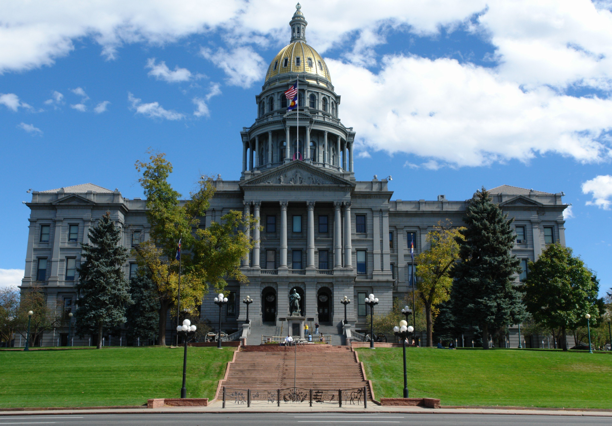

# AI 답변 조정을 소비자 기만으로 본 FTC 정책성명

_행정명령 후속으로 콜로라도 AI법까지 겨눈 정책초안, 의견수렴은 7월 31일 마감된다_

## Executive Summary

> [!callout]
> 2026년 7월 1일, 미국 연방거래위원회(FTC)가 「인공지능 시스템의 정확성 억압(Suppression of Accuracy in Artificial Intelligence Systems)」이라는 정책성명 초안을 공개했다. 핵심 주장은 하나다. AI 기업이 시스템의 출력을 몰래 특정 목표 쪽으로 조정하면서 그 사실을 소비자에게 알리지 않으면, 그 자체로 FTC법 제5조가 금지하는 소비자 기만이 될 수 있다는 것이다. 지금까지 AI '정확성'은 벤치마크 점수의 문제였지 법적 책임의 문제가 아니었다. 이제 그 경계선이 소비자보호법 안으로 넘어왔다. 연방 차원에서는 처음이다.

> 주의할 점은 이것이 확정된 규칙도, 집행 조치도 아니라는 사실이다. 위원회가 2대 0 표결로 공개한 비구속적 초안이며, 의견수렴은 7월 31일 마감된다. 성명은 기술적 한계에서 나오는 환각과 의도적으로 설계된 출력 조정을 명확히 구분하고, 후자만을 겨눈다. 편향이나 조정 자체를 전면 금지하지도 않는다. 소비자에게 명확하고 지속적으로 공시하면 책임을 피할 수 있다는 탈출구를 함께 열어 두었다.

> 그러나 '공시하라'는 요구는 곧바로 더 어려운 질문을 남긴다. 무엇을 왜 그렇게 조정했는지 증명하려면 학습·파인튜닝 데이터의 이력과 조정 의사결정 기록이 남아 있어야 한다. 출력만 감사해서는 의도적 조정인지 환각인지조차 가릴 수 없다. 정확성을 규제가 요구하는 순간, 문제는 데이터 거버넌스로 돌아온다.

<!-- stat-card -->
**78.5%** — AI 정보로 실제 의사결정 — Clear Spark Digital, 2026-04 (미국 성인 2,127명)

<!-- stat-card -->
**17.4%** — 항상 검증한다는 응답 — 나머지는 매번 검증하지는 않음

<!-- stat-card -->
**13%** — AI를 완전히 신뢰 — Klaviyo 소비자 신뢰 조사, 2026

<!-- stat-card -->
**7/31** — 의견수렴 마감 — 비구속적 정책초안, 위원회 2-0 공개

## 무엇이 발표됐나

2026년 7월 1일, FTC는 「인공지능 시스템의 정확성 억압」이라는 이름의 정책성명 초안을 발표했다. 연방관보에는 7월 7일 게재됐고(문서번호 2026-13628), 의견수렴 마감일은 7월 31일이다. 위원회는 2대 0 표결로 이 초안을 공개했으며, FTC 위원장 앤드루 퍼거슨은 이를 "AI 시스템을 이념적 목적으로 전복하는 행위"에 대응하는 조치로 규정했다고 알려졌다.

이 성명은 진공에서 나오지 않았다. 법적 뿌리는 2025년 12월 11일 서명된 행정명령 14365("AI를 위한 국가 정책 프레임워크 보장")다. 이 행정명령은 FTC 위원장에게 "AI 모델이 정확한 출력을 바꾸도록 요구하는 주법(州法)이 연방법과 어떻게 충돌하는지" 명확히 하라고 지시했고, 이번 정책성명이 바로 그 후속 조치다.

*▲ 앤드루 퍼거슨 FTC 위원장 | Source: [Wikimedia Commons (FTC, Public Domain)](https://commons.wikimedia.org/wiki/File:Andrew_N._Ferguson,_FTC_Commissioner.jpg)*

> [!callout]
> 성격 규정이 중요하다. 이것은 확정 규칙(rule)도 집행 조치(enforcement action)도 아니다. FTC법 제5조를 앞으로 어떻게 해석·적용할지에 대한 방향 제시일 뿐, 그 자체로 새로운 법적 의무를 만들지 않는다. 30일 의견수렴을 거쳐 위원회가 최종 입장을 확정하는 절차가 아직 남아 있다. "FTC가 AI 출력 조정을 금지했다"는 식의 확정형 서술은 현 단계에서 부정확하다.

한 가지 덧붙일 사실. FTC 공식 사이트의 보도자료와 성명 원문 PDF, 연방관보는 자동화 접근을 차단하고 있어, 이 글이 인용한 세부 내용은 법무·컴플라이언스 전문 매체(Reed Smith, Consumer Financial Services Law Monitor 등)의 분석과 요약을 교차 확인해 정리한 것이다. 원문을 직접 대조하지 못한 부분은 "알려졌다·보도됐다" 수준으로 표기했다.

## 왜 이것이 '기만'인가

FTC가 기만을 판단하는 틀은 오래됐고 단순하다. 어떤 표현(representation)이나 누락(omission), 관행(practice)이 있고, 그것이 합리적 소비자를 오도하며, 그 오도가 소비자의 실질적 판단이나 행동에 영향을 줄 때 기만이 성립한다. 새로운 법이 필요 없다. 40년 넘게 광고와 상거래에 적용해 온 제5조를 AI 출력에 그대로 겨눈 것이다.

성명의 논리는 이렇게 이어진다. AI 기업들은 수년간 자사 시스템이 기술·자원의 제약 안에서 가능한 한 최선의 정확한 출력을 낸다고 명시적으로든 묵시적으로든 표현해 왔다. 따라서 소비자는 AI가 진실하고 정확한 답을 지향한다고 합리적으로 기대할 권리가 있다. 만약 기업이 이 기대를 배신하고 모델을 미공개 목표 쪽으로 학습·설정한다면, 그 동기가 자발적이든 주법 준수든 상관없이 제5조 위반의 소비자 기만이 될 수 있다는 것이다.

### 2.1. 환각과 의도적 조정은 다르다

여기서 오해하기 쉬운 지점을 성명은 미리 잘라 둔다. 기술적·자원적 한계에서 나오는 환각(hallucination)은 설계 결정이 아니므로 그 자체로는 제5조 문제가 아니라고 명시했다. 표적은 모델의 불완전성이 아니라 의도적으로 설계된 조정(steering)이다. "AI가 틀리면 다 위법"이라는 해석은 성명의 취지가 아니다. 겨냥하는 것은 정확할 수 있는데도 다른 목표를 위해 일부러 비트는 행위다.

### 2.2. 탈출구는 공시

성명은 편향이나 조정 자체를 전면 금지하지 않는다. 기업이 정확성 외의 다른 목표를 우선시할 수는 있되, 그것을 소비자에게 명확하고(clear) 눈에 띄고(prominent) 지속적으로(persistent) 알리면 책임을 피할 수 있다는 구조다. 다만 이용약관 깊숙이 묻어 둔 한 줄짜리 고지, 어딘가에 한 번 숨겨 둔 일회성 공개로는 부족하다고 못 박았다.

성명을 둘러싼 비판도 이미 나온다. 문언을 그대로 읽으면, 챗봇이 특정 집단을 차별하는 답변을 내지 않도록 학습시키는 일 — 업계가 오랫동안 통상적인 안전장치로 여겨 온 조치 — 조차 '의도적 조정'으로 해석돼 같은 제5조 잣대에 걸릴 수 있다는 우려다. 어디까지가 정당한 안전 설계이고 어디부터가 미공개 목표를 위한 왜곡인지, 그 경계를 성명은 아직 선명하게 긋지 못했다. 규제가 겨눈 대상과 실무가 안전을 위해 해 온 일이 같은 문장 안에 담긴 셈이다.

> [!callout]
> 정확성을 벤치마크가 아니라 기만 여부로 판단하겠다는 순간, 질문은 자동으로 "그럼 무엇으로 정확성을 증명할 것인가"로 바뀐다. 정작 성명 자신은 그 답을 제시하지 못한다. "공시하라"고만 말할 뿐, 무엇을 어떻게 검증 가능하게 공시할지는 규정하지 않는다. 이 공백을 마지막 절에서 다시 짚는다.

## 콜로라도를 겨눈 선점 이론

성명이 소비자 기만만 이야기했다면 컴플라이언스 뉴스로 끝났을 것이다. 논쟁을 키운 대목은 따로 있다. 성명은 콜로라도 AI법(Colorado AI Act)을 콕 집어, 기업이 차별적 영향 책임을 피하려고 출력 정확성을 억압하도록 압박하는 주법의 예시로 지목했다. 그리고 그런 주법은 제5조가 세운 연방 규제체계와 충돌하는 한도 안에서 묵시적으로 선점된다(impliedly preempted)고 결론지었다.

콜로라도 AI법을 둘러싼 지난 2년의 궤적은 그 자체로 하나의 드라마다. 시간순으로 정리하면 흐름이 보인다.

*▲ 콜로라도 주 의사당(덴버) — 콜로라도 AI법이 제정·개정된 무대 | Source: [Wikimedia Commons (Hustvedt, CC BY-SA 3.0)](https://commons.wikimedia.org/wiki/File:Denver_capitol.jpg)*

- **2024-05** — 콜로라도 SB 24-205 제정.
- **2025-08** — SB 25B-004로 시행일을 2026-06-30으로 연기.
- **2025-12** — 행정명령 14365가 DOJ 내 'AI 소송 태스크포스'를 신설하고 콜로라도 AI법을 문제 사례로 지목.
- **2026-04** — xAI가 콜로라도 AI법에 대해 표현의 자유(수정헌법 1조) 침해를 주장하며 연방지방법원에 소송 제기, DOJ가 곧이어 참가.
- **2026-04** — 연방 치안판사가 콜로라도 AI법 집행을 정지(주 법무장관도 정지에 동의).
- **2026-05** — 콜로라도 주지사가 SB 26-189에 서명, 기존 SB 24-205를 폐지하고 자동화 의사결정기술(ADMT) 공시 프레임워크로 대체(시행 2027-01-01).
- **2026-07** — FTC 정책성명이 개정된 콜로라도법조차 선점 대상이 될 수 있다고 명시.

마지막 줄이 핵심이다. 콜로라도가 문제의 법을 스스로 폐지하고 새 틀로 갈아탄 뒤에도, FTC는 개정법을 준수하는 조치 자체가 '의도적 정확성 억압'으로 해석될 수 있다고 봤다. 기업 입장에서는 주법을 지키는 것과 연방 기준을 지키는 것이 서로를 밀어내는 상황에 놓일 수 있다는 뜻이다.

> [!callout]
> 다만 이 선점 이론은 아직 법원에서 검증된 적이 없다. FTC법은 주법을 명시적으로 선점하지 않으며, 성명이 기댄 것은 '묵시적 충돌 선점'이다. 이는 연방과 주의 요구를 동시에 지키는 것이 실제로 불가능하다고 법원이 인정해야 성립하는 까다로운 법리다. 주 정부들이 이 주장을 다툴 가능성이 높다는 것이 법률 전문가들의 공통된 지적이다. 지금은 방향이지 판결이 아니다.

## 소비자는 실제로 얼마나 검증하는가 — 엇갈리는 숫자들

FTC 논리의 바닥에는 소비자가 AI 답변을 상당 부분 그대로 받아들인다는 전제가 깔려 있다. 이 대목에서 흔히 "소비자의 90% 이상이 AI 답변을 검증 없이 수용한다"는 수치가 인용되곤 한다. 그런데 이 글이 확인한 범위에서 그 90%라는 숫자는 FTC 성명 원문에서도, 이를 다룬 법률 분석에서도 근거를 찾지 못했다. 정확성을 다루는 글이 정작 검증되지 않은 수치를 인용한다면 그 자체로 이 문제의 한 사례가 된다. 그래서 출처가 분명한 조사들을 대신 본다.

- **Clear Spark Digital(2026-04, 미국 성인 2,127명)** — AI가 준 정보로 실제 의사결정을 내린 사람은 78.5%. 그러나 "항상 검증한다"는 응답은 17.4%에 그쳤다. 뒤집으면 대다수가 매번 검증하지는 않는다는 뜻이다.
- **Yext(2026)** — AI 추천을 받은 뒤에도 62%가 구글에서 재검색하고, 58%가 업체 사이트를 직접 방문하며, 52%가 AI가 인용한 출처를 클릭했다. '신뢰하되 검증한다'에 가깝다.
- **Klaviyo(2026)** — AI를 "완전히 신뢰한다"는 응답은 13%뿐이었다.

숫자들은 한 방향을 가리키지 않는다. 검증을 거의 하지 않는 층도, 습관적으로 재검색하는 층도 동시에 존재한다. 그런데 이 상충이 오히려 FTC 논리를 받쳐 준다. 소비자의 검증 행태에 대한 조사 결과 자체가 갈릴 정도라면, 무엇이 '정확한 출력'인지 소비자가 스스로 판별하기 어렵다는 뜻이기 때문이다. FTC가 기대는 지점은 '소비자가 100% 맹신한다'가 아니라 '소비자가 AI는 정확성을 지향한다고 합리적으로 기대한다'는 쪽이다. 판별이 어려울수록 그 기대는 커진다.

> [!callout]
> 여기서 얻을 실무적 교훈은 통계 하나에 기대지 말라는 것이다. AI가 정확성을 지향한다는 소비자 기대는 특정 설문의 특정 퍼센트로 증명되는 것이 아니라, 기업이 시장에서 어떻게 표현해 왔는가에서 나온다. 규제의 무게 중심은 소비자의 신뢰도 수치가 아니라 기업의 표현과 그 표현을 뒷받침할 증거로 옮겨 간다.

## 결국 데이터 거버넌스로 돌아온다

정리하면 FTC는 정확성을 소비자보호의 언어로 옮겨 놓았지만, 정확성을 어떻게 증명하는지는 열어 두었다. 이 공백이 데이터 실무자에게 의미 있는 지점이다. 무엇을 왜 그렇게 조정했는지 보이려면, 학습·파인튜닝 데이터의 이력(data lineage)과 그 조정을 내린 의사결정 기록이 남아 있어야 한다. 완성된 모델의 출력만 사후에 감사해서는 그것이 의도적 조정인지 단순 환각인지조차 가릴 수 없다. FTC 스스로 둘을 구분해야 한다고 못 박았는데, 그 구분의 유일한 증거는 학습 파이프라인 안에 있다.

이 패턴은 미국만의 것이 아니다. 정확성을 규제가 요구하는 순간 데이터 거버넌스가 요구된다는 흐름은 세 갈래에서 반복된다. EU는 AI Act 제10조에서 고위험 AI의 학습·검증·테스트 데이터셋에 대한 문서화된 데이터 거버넌스를 요구하며, 이 조항은 2026년 8월 전면 집행을 앞두고 있다. 한국은 이미 2026년 1월 22일부터 AI 기본법을 시행 중이다.

*▲ 베를레몽 빌딩(브뤼셀), 유럽연합 집행위원회 본부 — AI Act 제10조 데이터 거버넌스 규정의 출처 | Source: [Wikimedia Commons (acediscovery, CC BY 4.0)](https://commons.wikimedia.org/wiki/File:Berlaymont_EU_Building-Brussels.jpg)*

### 5.1. 사전 규제와 사후 집행, 가는 길이 다르다

접근 방식은 대조적이다. 한국과 EU는 고위험 AI를 미리 분류하고 의무를 부과하는 사전 규제(ex-ante)에 가깝고, 미국 FTC는 기존 기만금지법을 사후에 적용하는 사후 집행(ex-post)을 택했다. 출발점은 다르지만 기업이 마주하는 요구는 비슷하게 수렴한다. 결국 데이터의 출처와 조정 이력을 문서로 남기고, 필요할 때 검증 가능한 형태로 내놓을 수 있어야 한다는 것이다. '정확성 공시'라는 결과는 같고, 그 결과를 떠받치는 것은 어느 관할이든 데이터 거버넌스다.

데이터 리더와 ML 엔지니어링 책임자 입장에서 이번 성명이 확정 규칙이 아니라는 사실은 유예가 아니라 준비 시간에 가깝다. 규제가 최종화된 뒤에 데이터 리니지를 소급해 만들어 낼 수는 없다. 어떤 데이터로 학습했고, 어떤 튜닝을 왜 적용했으며, 그 결정을 누가 언제 내렸는지가 기록으로 남아 있는 조직만이 '정확성을 증명하라'는 요구에 답할 수 있다. 그 기록은 규제가 오기 전에 쌓아야 쓸 수 있다.

<!-- stat-card -->
****편집자의 노트.** 페블러스는 데이터의 생성·진단·거버넌스를 하나의 파이프라인으로 다루는 Data Greenhouse를 만들고 있다. 데이터 리니지와 조정 이력을 운영 증거로 남기는 문제에 관심이 있다면 [관련 프로젝트 기록](https://blog.pebblous.ai/project/SyntheticData/en/)을 함께 참고할 수 있다. 이 노트는 본문 분석과 분리된 배경 안내다.**

## 자주 묻는 질문

<!-- stat-card -->
**FTC가 AI 출력 조정을 금지한 건가요?** — 아직 아닙니다. 2026년 7월 1일 공개된 것은 확정 규칙이나 집행 조치가 아니라 비구속적 정책성명 초안입니다. 위원회가 2대 0으로 공개했고 의견수렴은 7월 31일에 마감됩니다. FTC법 제5조를 앞으로 어떻게 적용할지에 대한 방향 제시일 뿐, 그 자체로 새로운 법적 의무를 만들지는 않습니다.

<!-- stat-card -->
**AI가 틀린 답을 하면 전부 소비자 기만이 되나요?** — 그렇지 않습니다. 성명은 기술적·자원적 한계에서 나오는 환각과 의도적으로 설계된 출력 조정을 명확히 구분합니다. 환각은 설계 결정이 아니므로 그 자체로는 제5조 문제가 아니라고 명시했습니다. 표적이 되는 것은 정확할 수 있는데도 미공개 목표를 위해 출력을 일부러 트는 행위입니다.

<!-- stat-card -->
**기업은 어떻게 하면 책임을 피할 수 있나요?** — 공시입니다. 성명은 편향이나 조정 자체를 전면 금지하지 않습니다. 정확성 외의 다른 목표를 우선시하더라도 그것을 소비자에게 명확하고, 눈에 띄고, 지속적으로 알리면 책임을 피할 수 있다는 구조입니다. 다만 이용약관에 묻어 둔 한 줄 고지나 일회성 공개로는 부족하다고 명시했습니다.

<!-- stat-card -->
**왜 하필 콜로라도 AI법을 지목했나요?** — FTC는 콜로라도 AI법을 기업이 차별적 영향 책임을 피하려고 출력 정확성을 억압하도록 압박하는 주법의 예시로 봤습니다. 그런 주법은 제5조가 세운 연방 규제체계와 충돌하는 한도에서 묵시적으로 선점된다는 결론입니다. 주목할 점은 콜로라도가 문제의 법을 이미 폐지하고 새 틀로 대체했는데도, 개정법 준수조차 선점 대상이 될 수 있다고 본 것입니다.

<!-- stat-card -->
**이 선점 이론은 확정된 것인가요?** — 아닙니다. 아직 법원에서 검증된 적이 없습니다. FTC법은 주법을 명시적으로 선점하지 않으며, 성명이 기댄 것은 '묵시적 충돌 선점'입니다. 연방과 주의 요구를 동시에 지키는 것이 실제로 불가능하다고 법원이 인정해야 성립하는 까다로운 법리라, 주 정부들이 이를 다툴 가능성이 높다는 지적이 많습니다.

<!-- stat-card -->
**"소비자 90%가 AI를 검증 없이 믿는다"는 통계는 사실인가요?** — 이 글이 확인한 범위에서는 그 90%라는 수치를 FTC 성명 원문에서도 법률 분석에서도 근거를 찾지 못했습니다. 실제 조사는 오히려 엇갈립니다. Clear Spark Digital(2026-04)에서는 78.5%가 AI 정보로 의사결정을 내렸지만 항상 검증한다는 응답은 17.4%였고, Klaviyo(2026)에서는 AI를 완전히 신뢰한다는 응답이 13%뿐이었습니다. 검증되지 않은 수치는 인용하지 않는 편이 낫습니다.

<!-- stat-card -->
**데이터 실무자 입장에서 지금 무엇을 준비해야 하나요?** — 데이터 리니지와 조정 이력을 기록으로 남기는 일입니다. '정확성을 증명하라'는 요구는 결국 어떤 데이터로 학습했고 어떤 튜닝을 왜 적용했는지의 문제로 이어집니다. 출력만 사후에 감사해서는 의도적 조정과 환각을 구분할 수 없습니다. 규제가 최종화된 뒤에는 리니지를 소급 생성할 수 없으므로, 기록은 미리 쌓아 두어야 합니다. EU AI Act 제10조, 한국 AI 기본법도 같은 방향을 가리킵니다.

## 참고문헌

### 공식 문서

- 1.Federal Trade Commission. (2026). "[FTC Seeks Public Comment on Policy Statement Addressing AI Accuracy](https://www.ftc.gov/news-events/news/press-releases/2026/07/ftc-seeks-public-comment-policy-statement-addressing-ai-accuracy)." FTC Press Releases, 2026-07-01.
- 2.Federal Trade Commission. (2026). "[Suppression of Accuracy in Artificial Intelligence Systems](https://www.ftc.gov/system/files/ftc_gov/pdf/ai-policy-statement_0.pdf)" (정책성명 초안).
- 3.Federal Register. (2026). "[Policy Statement Concerning the Suppression of Accuracy in Artificial Intelligence Systems](https://www.federalregister.gov/documents/2026/07/07/2026-13628/policy-statement-concerning-the-suppression-of-accuracy-in-artificial-intelligence-systems)." Document 2026-13628, 2026-07-07.
- 4.Executive Office of the President. (2025). Executive Order 14365, "Ensuring a National Policy Framework for Artificial Intelligence," 2025-12-11.
- 5.Colorado General Assembly. Colorado AI Act (SB 24-205, 2024-05 제정; SB 25B-004로 시행연기; SB 26-189로 폐지·대체, 2026-05).

### 법률·정책 분석

- 6.Consumer Financial Services Law Monitor. (2026). "[FTC Proposes Policy Statement on AI Accuracy and Ideological Manipulation of AI Outputs](https://www.consumerfinancialserviceslawmonitor.com/2026/07/ftc-proposes-policy-statement-on-ai-accuracy-and-ideological-manipulation-of-ai-outputs/)."
- 7.Reed Smith. (2026). "[FTC Proposes Policy Prohibiting Deceptive Steering of AI Products and Services](https://www.reedsmith.com/our-insights/blogs/viewpoints/102n7u7/ftc-proposes-policy-prohibiting-deceptive-steering-of-ai-products-and-services/)."
- 8.Eliot, L. (2026). "[FTC Floats AI Policy Aiming To Ensure That AI Makers Disclose The Truth About Biases In Their LLMs](https://www.forbes.com/sites/lanceeliot/2026/07/06/ftc-floats-ai-policy-aiming-to-ensure-that-ai-makers-disclose-the-truth-about-biases-in-their-llms/)." Forbes, 2026-07-06.
- 9.ppc.land. (2026). "[FTC Move Could Force Colorado to Rewrite New AI Bias Law](https://ppc.land/ftc-move-could-force-colorado-to-rewrite-new-ai-bias-law/)."
- 10.Jenner & Block. (2026). "[DOJ Joins xAI in Lawsuit Challenging Colorado AI Act](https://www.jenner.com/en/news-insights/client-alerts/doj-joins-xai-in-lawsuit-challenging-colorado-ai-act)."
- 11.Carpe Datum Law. (2026). "[Colorado's AI Reset: Two Weeks, a White House Callout, and a Pivot Away from the EU Model](https://www.carpedatumlaw.com/2026/05/colorados-ai-reset-two-weeks-a-white-house-callout-and-a-pivot-away-from-the-eu-model/)." 2026-05.

### 소비자 조사

- 12.Search Engine Land. (2026). "[AI Search Adoption Rises as Consumer Trust Declines: Study](https://searchengineland.com/ai-search-adoption-rises-consumer-trust-declines-study-480338)" (Clear Spark Digital 설문 인용). 2026-04.
- 13.Yext. (2026). "[7 Data-Backed Stats on AI Search Trust and Consumer Decision-Making in 2026](https://www.yext.com/blog/7-data-backed-facts-on-ai-trust-and-consumer-decision-making-in-2026)."
- 14.Klaviyo. (2026). "[Consumer Trust in AI: What Brands Need to Know in 2026](https://www.klaviyo.com/solutions/ai/consumer-trust-in-ai)."

### 참고 — 한국 AI 기본법

- 15.MS투데이. (2026). "[2026년 1월 시행 앞둔 'AI 기본법'…한국, 세계 첫 포괄적 AI 법제 시행](https://www.mstoday.co.kr/news/articleView.html?idxno=99963)." 2026-01.
