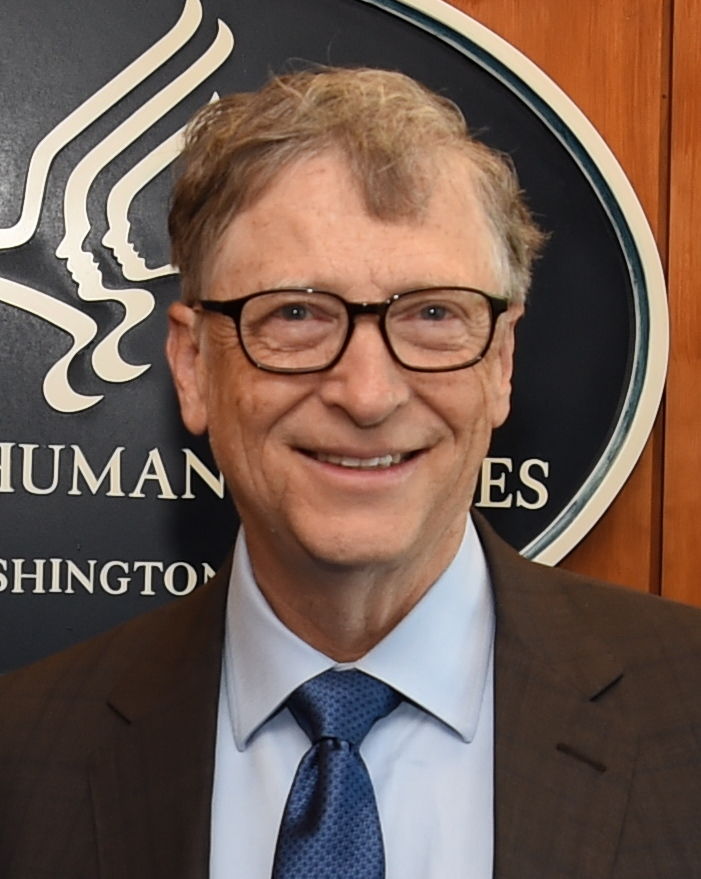

# Bill Gates

_He floated Human Reserved jobs for up to 40% of work and a tax on AI tokens, without saying who decides or by what criteria_

## Executive Summary

> [!callout]
> Deciding what work to keep in human hands means first knowing what AI has already taken from that work, and how much. On August 26, 2026, Bill Gates published a long essay on Gates Notes about AI and work. Two proposals sit inside it. One is Human Reserved, a domain of jobs society leaves to people even when AI could do them. The other is a tax on AI tokens and robots. Both point somewhere clear, and neither says what would have to be counted to get there.

> Gates wrote that the idea of Human Reserved raises a host of questions he does not have answers to, and he listed four. Who gets to decide what we reserve for humans. What criteria should we use. How do you keep companies from cheating and using robots anyway. What happens to international trade when one country lets robots make something and another country does not. A token tax bill filed in the U.S. House three weeks earlier answers none of the four. It indexes the rate to an unemployment measure instead, and it asks whether a model reduced anyone's workforce only when a company uses the model inside its own business.

> That structure stops at the same place as the California and Connecticut rules Pebblous covered in July. There, the duty to report was settled and only the test for what counts as a reportable event was left blank. This time the blank has moved from the stated reason for a layoff to the tax base and the list of protected occupations.

<!-- stat-card -->
**40%** — The ceiling Gates imagined — Share of jobs he could picture reserving for people, and no higher than that

<!-- stat-card -->
**50%** — The token tax level Gates named — An illustrative rate he gave to MIT Technology Review

<!-- stat-card -->
**2%** — The bill's base token tax rate — The floor that applies in a year when U-4 unemployment is 5% or below

<!-- stat-card -->
**19%** — Youth employment shortfall in exposed work — Stanford estimate for ages 22 to 25, widened from 15% a year earlier

## The Two Lines Gates Drew

The first line runs through the work itself. Gates believes that as AI and robots improve, we will set aside certain things for only people to do, and he wrote that he has started calling that domain Human Reserved. He explained the name as well. He likes the phrase because it makes him think of nature reserves, places where we could put buildings and roads but choose not to because the loss would be too great.

*▲ Bill Gates at the U.S. Department of Health and Human Services, March 2018 | Source: [Wikimedia Commons (U.S. HHS, Public Domain)](https://commons.wikimedia.org/wiki/File:Bill_Gates_2018.jpg)*

The idea starts somewhere personal. Gates's father died of Alzheimer's in 2020, and in the later stages of the illness he was cared for day and night by paid caregivers. He could not always tell them when he was hungry, Gates wrote, but they always knew. Of that team Gates wrote, "Something in the care they gave my dad was irreplaceably human. No robot could or should have done it."

Two kinds of reason support the line. One is economic. A role belongs in the reserve when letting machines take it over would displace a large number of people who cannot easily change jobs. His example is a 55-year-old who has worked in construction their whole career, and whom you cannot send to an elder care facility while expecting them to find it fulfilling. The other kind of reason has nothing to do with economics. Imagining a robot delivering the news that you have an incurable disease, he wrote, "There's no technical reason why it couldn't. Yet it shouldn't." In an interview with Axios he named child care and jury service as things humans are clearly better suited for, and put education and health care in a mixed category rather than a banned one. There, a profession stays protected while the workers inside it use AI to extend what they can do.

The second line runs through the tax code, and the argument is short. Hire someone and you pay payroll taxes on their earnings. Buy a robot and you can usually write it off right away as a business expense. In Gates's words, "The tax system nudges you toward replacing people with machines." So he proposes taxing AI tokens and robots to slow the rush away from human labor a little and to raise money for retraining and a stronger safety net. He attaches one condition: the tax would need to be targeted so that it does not slow down the purely beneficial uses of AI, like making medicine and education cheaper.

> [!callout]
> This is not the first time Gates has raised a robot tax. He proposed one years ago, and by his own account most of the reaction was that it was a strange idea. That version never made it into statutory language. Collecting a robot tax means first deciding what counts as a robot, and the line between an arm on a factory floor and software in an office has never been written into tax law. What is different this time is the unit. Tokens are already counted and priced inside the billing systems of AI companies.

## Even Gates Couldn't Answer His Own Four Questions

The essay adds one more paragraph behind the proposal. Gates wrote that the idea of Human Reserved raises a host of questions he does not have answers to, and set four of them in italics. Who gets to decide what we reserve for humans? What criteria should we use? How do you keep companies from cheating and using robots anyway? What happens to international trade when one country lets robots make something and another country doesn't? His only addition was that these will need to be worked out in public as part of the transition plan.

He lowered his own ceiling on the scale of it, too. He has been trying to calculate how much employment could plausibly be preserved this way, and told Axios that "in a very extreme form of it" he could imagine 40% of jobs initially reserved for humans. Then he shut the door on it right away. "But that's as high as I can get." Even reaching that number, he added, proved harder than he thought it would. The majority of the labor market stays with the market.

The MIT Technology Review interview published the same day shows a little more of where the 40% comes from. It is actually hard to get above like 30% or 40%, he said. At 50% you could start talking about early retirement and a shorter workweek for lots of people; down in the 10% to 15% range you get an utterly different society. One notch on that dial changes the shape of a society, and the notch has not been set by evidence yet. Gates conceded as much: there are professions he did not write the formula for, and when he does the full memo on the subject he will try to.

On tax, one more number came out. Asked how a robot and token tax might work, Gates answered that "you can say 50% of your revenue from a token tax is paid to the government, and the government has that money to help people who lose their job because of AI." Then he questioned himself. Should some token uses not be subject to the tax? Is there really a separation between AIs that help with invention versus AIs that do job substitution? His sentence continues: "If somebody can tell me how to tell the AI 'no job substitution.'" Having left that unresolved, he opened a second route as well. The government already owns part of the profits through the corporate profit tax, so it could simply raise that rate back to where it was. A token tax, he explained, is a sales tax, vertically oriented like an alcohol, tobacco, or luxury tax. Taxes of that kind only work once someone has decided what they attach to.

For the last of the four questions he did sketch an answer in the interview. Where the line falls will vary from country to country, he thinks. Some countries might insist on humans caring for the elderly, while a country like Japan, with a shrinking workforce, may welcome a caregiving robot. So each country draws its own line and changes its import policy to match. As the EU prices goods from countries with looser carbon rules through its carbon border adjustment mechanism, imports made by robots would be tariffed. For that to work, though, a customs officer has to stand in front of a container and judge how much of it a human hand touched. Even the outline of an answer asks for another measurement.

> [!callout]
> These sound like ethical questions, and at the implementation stage every one of them turns into a measurement question. Who decides comes down to deciding on the basis of which data. What criteria comes down to which quantity gets measured. Stopping companies from cheating comes down to whether AI use can be observed at the level of a single job task. The invention-versus-substitution problem is the same. Without an observable marker separating the two uses, tax law cannot write the distinction into a statute.

## What the Bill in Congress Counts

One document has already moved the same questions into statutory language. Three weeks before the essay, on August 6, 2026, Rep. Greg Casar (D-TX-35) introduced H.R. 10044, the AI Tax and Work Protection Act, with Reps. Valerie Foushee (D-NC-4) and Sara Jacobs (D-CA-51) as original cosponsors. On August 20, Rep. Ro Khanna (D-CA-17), whose district covers much of Silicon Valley, signed on as a third. The bill was referred to the Education and Workforce Committee and the Ways and Means Committee, and introduction is as far as it has gone. There is no Congressional Research Service summary and no Congressional Budget Office score yet, so the text itself is the only source.

*▲ The U.S. Capitol, where H.R. 10044 was introduced | Source: [Wikimedia Commons (David Maiolo, CC BY-SA 3.0)](https://commons.wikimedia.org/wiki/File:United_States_Capitol_Building.jpg)*

The bill adds a new §4491 to the Internal Revenue Code, imposing an excise tax on foundation models. The amount owed is the greater of two figures. One is the fair market value of the tokens the taxpayer processed in covered transactions during the year, multiplied by the applicable token percentage. The other is what the taxpayer received in exchange for AI services plus the fair market value of covered transactions with related parties, multiplied by the applicable transaction percentage. Neither percentage is fixed. When U-4 unemployment is 5% or below, the token rate is 2% and the transaction rate is 3%. Above 5%, each rises by the amount of the excess; above 7%, by twice the excess over 5%. The 50% Gates named in an interview and the 2% written into the bill are two settings of the same dial.

The judgment call sits in the trigger, not the rate. The text splits covered transactions into two kinds. Providing use of or access to a foundation model to an unrelated party in the course of business is taxable in itself. Using a foundation model in your own business, or passing that use to a related party, comes with a condition attached: it is taxable only if such use enables or results in a reduction in the workforce of the taxpayer or of the related party. The definition of who owes the tax carries the same split. A covered person develops a foundation model, sells access to one, or modifies an existing open-weight model, and either generates revenue from a covered transaction or uses the model to reduce its own workforce.
