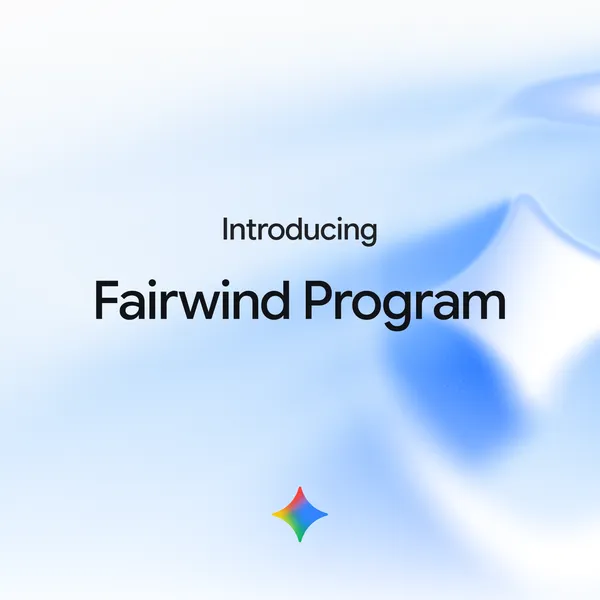

# Gemini 4 Argon Drops Its Safety Limits Only for Defenders Google Picks

_Google sends the build without cyber safety limits to its own teams and to security groups cleared by Fairwind, and never says which ones passed or why the others did not_

## Executive Summary

> [!callout]
> This article reads a single announcement: the Gemini 4 Argon post Google published on September 30, 2026. The post says the model can autonomously discover, verify and fix critical software vulnerabilities, and reports 68% on CWE-bench v1, a test of vulnerability repair, good for a tie at the top. The build with its cyber safety limits removed is not part of that public release. Google sends that build to its own internal teams and to security organizations that clear the Fairwind program.

> The 68% comes from a test Google neither built nor ran. CWE-bench v1 belongs to Collinear AI, which runs the models itself and publishes the leaderboard, and the same score seats OpenAI's GPT-6 Astra and xAI's Grok 4.7 alongside Argon at the top. So the test that scores the ability is not Google's to run. Google alone decides who gets the build with the safety limits off. The Fairwind page goes into real detail on who qualifies and on what is owed after approval. Neither the bar an applicant has to clear nor the people who judge it appear on the page.

> Sections 1 through 4 stay with what the Google post, the Fairwind page and the coverage of both actually say. Section 5 rereads the same material through the eyes of someone who works with data, and that rereading belongs to this article.

*▲ Gemini 4 Argon, announced by Google on September 30, 2026 | Source: [Google Blog](https://blog.google/innovation-and-ai/models-and-research/gemini-models/gemini-4-argon/)*

### Key figures

The numbers attached to this announcement point at two different things. One group describes what the model can do. The other describes how that capability travels and who receives it. The second group is thinner than the first.

Sources: [Google, Gemini 4 Argon announcement](https://blog.google/innovation-and-ai/models-and-research/gemini-models/gemini-4-argon/); [Google DeepMind, Fairwind program page](https://deepmind.google/fairwind-program/); SecurityWeek reporting (2026-09-30).

<!-- stat-card -->
**68%** — Tied for first on CWE-bench v1 — A vulnerability-repair test run by Collinear AI. GPT-6 Astra and Grok 4.7 hold the same score

<!-- stat-card -->
**650+** — Organizations in Fairwind — The count at the September 2 launch. How many of them receive Argon has not been published

<!-- stat-card -->
**0** — Published vetting decisions — Eligibility and post-approval duties are public; no roster of who passed, no reasons for rejection, no appeal route

<!-- stat-card -->
**$2 / $10** — Launch price per million tokens — Two dollars in, ten dollars out. The build without safety limits is distributed by vetting rather than by price

## The claim Google made on September 30

The central sentence of the September 30 post is short. "Argon can autonomously discover, verify and fix critical software vulnerabilities." Three verbs sitting on one line carry weight in security work. Finding a flaw, confirming that it can actually be exploited, and shipping corrected code have been separate stages until now, each of them routed through human hands.

The post also says Google engineers already use Argon in their daily work, from ordinary debugging through large codebase migrations and algorithm design. A model that reaches the outside world through one narrow door is, inside Google, already running every day.

Among the figures offered as evidence, the one this article follows is CWE-bench v1. SecurityWeek described the test as a vulnerability-repair benchmark created by Collinear AI and reported Argon at 68%, tied at the top with OpenAI's GPT-6 Astra and xAI's Grok 4.7. Nobody leads alone there. Three models standing on the same line also says this capability is not one company's secret.

Collinear has published what the test measures. It hands over whole open-source repositories that people actually use and asks the model to find and repair the real vulnerabilities inside them, across 120 tasks. The tasks span 73 weakness classes, every category in the OWASP top ten, and eight programming languages. The canonical score comes from machine verification of whether the repaired code runs, with a second reading from a judge panel built out of three models from different families. Running the models is the benchmark team's own job as well.

| Test | What it measures | Argon score |
| --- | --- | --- |
| CWE-bench v1 | Security vulnerability repairBuilt by Collinear AI | 68%Tied with GPT-6 Astra and Grok 4.7 |
| DeepSWE v1.1 | Software engineering task resolution | 77.9% |
| LVBench | Long video understanding | 91.7% |
| AutomationBench | Workflow automation | 51.3% |

▲ Headline results carried in the Google announcement. On Gray Swan IPI, which measures resistance to prompt injection, the post claims the lead without giving a number. Sources: Google Gemini 4 Argon announcement (2026-09-30); SecurityWeek.

*▲ The CWE-bench v1 leaderboard. The small label under each bar names the agent harness that model ran on (Antigravity, opencode, Codex, Claude Code) | Source: [Google Blog](https://blog.google/innovation-and-ai/models-and-research/gemini-models/gemini-4-argon/)*

Scrolling the leaderboard to the bottom shows that 68% is the most generous reading available. [Collinear's public leaderboard](https://cwe-bench.com/) keeps a separate column for the agent tooling each model ran on, and the Argon row carries Antigravity, Google's own harness. Under the standard that allows four attempts and counts one success, Argon reaches 75% and falls behind Grok 4.7 at 81%. Its judge-panel score of 62% is the lowest among the four models at the top. Its cost of $6.63 per run is the highest on the board.

A comparison that holds the harness constant exists too. Artificial Analysis applies one public harness of its own to every model on the same benchmark, and Argon has no row in that table yet. Whether a score produced on the model maker's tooling survives a run under matched conditions is therefore still unknown.

Pricing arrived with the announcement. Input runs $2 per million tokens and output $10, with cached input tokens discounted 95% off the input price. Google wrote that developers, enterprises and general users would get the model "as soon as possible" without naming a date. TechCrunch reported that, as of the announcement, Argon was going only to selected cyber partners through the Fairwind program.

## Argon reaches a vetted list before it reaches the public

Fairwind is not a channel built for Argon. Google opened the program on September 2 with the Gemini 3.8 Flash Cyber model bundled together with CodeMender, a harness that finds, verifies and repairs vulnerabilities and was introduced as capable of producing deployable patches within minutes. More than 650 organizations had joined at launch. Argon entered this existing cohort on September 30, and that entry is when a build with the cyber safety limits stripped out first appeared.

The announcement puts it this way: trusted defenders and Google's internal teams receive Argon without its cyber guardrails so they can use frontier-level cybersecurity defense capability in full. The September 2 post carries the reasoning behind the narrow door. Handing strong cyber capability to trusted defenders first gives them a window to harden systems before malicious actors reach the same capability.

Who may apply, and what an approved organization has to honor, sits on the program page. Reading it, nobody would call the document loose.

*▲ The Fairwind program, launched by Google on September 2, 2026 | Source: [Google Blog](https://blog.google/innovation-and-ai/technology/safety-security/fairwind-program/)*

| Item | What the page says |
| --- | --- |
| Eligibility | Governments and national cyber authorities, critical infrastructure operators (healthcare, telecom, energy, finance), and core technology platforms. Academic institutions researching defensive benchmarks may apply as well |
| Vetting | A demonstrated track record of ethical operation and research is confirmed. Applicant organizations undergo a background check covering security history and records of ethical operation |
| Duties after approval | Phishing-resistant multi-factor authentication, access confined to in-house security, incident response and penetration testing teams, tracking of staff access, and a ban on sharing, redistributing or selling access |
| Permitted and prohibited uses | Authorized threat simulation, reverse engineering and malware analysis, for defensive and academic research purposes only. Malicious work such as building malware is prohibited |
| If an application fails | The page points applicants toward the publicly released model paired with CodeMender |

▲ Summary of the Fairwind program page. Sources: Google DeepMind Fairwind program page; Google Fairwind launch announcement (2026-09-02).

## What the vetting page leaves out

Look at that table again and one side of it is empty. What Google has set down is **who is eligible to apply** and **what an organization has to follow once it is approved**. On the vetting itself there are two statements: a background check takes place, and a track record of ethical operation is the criterion. How strong a record has to be before it passes, who issues that judgment, whether a rejected organization learns the reason, whether any channel exists to contest it, how many have applied and how many have cleared — none of this appears in any document. Even the time to a reply is written only as "as soon as possible."

▲ Source: Google DeepMind Fairwind program page (checked 2026-10-03).

The first outlet to name this asymmetry was FourWeekMBA, a business analysis publication. Writing about the Argon announcement, it said the post carried no membership criteria, no participant count, no application path, and no account of who decides or whether an appeal exists. Judged against the announcement alone, that is fair. The program page does carry an application path and eligibility categories, so the empty column reads more precisely as an absence of decisions and their records than as an absence of criteria. The question the same piece posed lands harder for it. Who audits the gatekeeper.

> [!callout]
> Published criteria with unpublished outcomes leave an outsider nothing to verify. The list of organizations that cleared is not public, which leaves no way to weigh whether they really met the standard. And since a rejected applicant is never told the reason, nobody can check that the standard held from one decision to the next. Measuring the capability has a test run from the outside and a public table ranking model after model. Deciding who receives that capability has none of it. Set the two side by side and what is missing is easy to see.

In practice the sharper issue is the shape of an organization that can clear this. Background checks, multi-factor authentication and staff access tracking, all of them provable on demand, describe a large institution with a mature security team, a compliance function, and a desk that already talks to governments. Whether a mid-sized hospital, an independent open-source project, or an infrastructure operator in a developing country can reach that threshold has no published answer. They are attacked too, which leaves this gap sitting as a question of fairness.

## The same ability, pointed two ways

The reason for removing the safety limits holds up on its own terms. A model that refuses to reason about how a vulnerability could be exploited is of little use to the person who has to close that vulnerability. Defenders stop attacks by thinking the way attackers think. The trouble is that this reasoning matches, precisely, the reason wide release would be dangerous. Whatever the model declined to do with its limits on remains equally doable once the limits come off for defenders.

So the unit of safety moves. It shifts from what the model refuses to do toward who gets handed the model. Multi-factor authentication and background checks do not cover the case where one laptop inside an approved organization is compromised. Capability once released lives inside that organization, and the only account available from outside of what it actually does there is, for now, Google's own.

Google is hardly alone in the choice. Anthropic opened a preview of its unreleased model Claude Mythos on April 7 through Project Glasswing, reaching some 40 organizations including AWS, Apple, Cisco, CrowdStrike, JPMorgan Chase, Microsoft and Nvidia along with groups responsible for critical software infrastructure, and since September it has supplied Mythos 5.1 to selected organizations in the United States through its Cyber Verification Program. OpenAI's Daybreak splits defensive Blue and red-team Red between partners who clear its vetting. Microsoft gives MAI-Cyber-1-Flash to MDASH customers and states that no separate vetting applies.

Traffic does not all run one direction. On September 29, the day before the Argon announcement, OpenAI said it would make the Daybreak Blue model available through Codex Security Cloud to Pro, Business, Enterprise and Education subscribers with no separate application. One company narrowed the door and another widened it in the same week. Which choice turns out right remains unproven, and both companies settled on theirs by themselves.

## Why Pebblous Is Watching This Announcement

This announcement wears the clothes of a model launch, and what moves underneath is an access control problem. Deciding which capability opens to whom, preserving the grounds for that decision, and leaving it where someone can pull it back out later. Any organization that has worked on data governance knows the task, and the same three questions have always told it whether the work went well. Who approved this. On what standard. Is the record still there.

Fairwind answers the first two in part and leaves the third blank. An internal data access review built this way would not pass an audit. An approval system that keeps no trace of the permissions it granted cannot be verified even when the approver acts in good faith. What is at stake is not good faith but verifiability. Whether Google vets carefully and whether this structure is sound are two different questions.

One line comes back whenever Pebblous talks about AI-Ready Data. A judgment that goes unrecorded never becomes an asset. Data quality and model access permissions behave the same way here. When nobody tracks which data opened to whom, responsibility for the results built on that data goes untracked with it. Anyone can look up a model's performance on a leaderboard. For the distribution there is no such table. So the record is what there is to ask for.

The question this turns back on readers is about their own organizations rather than about Google. When your side opens sensitive data or strong permissions to someone, do the standard and the outcome of that decision survive in a form you could pull up today. If the standard lives in a document and the decisions live only in one person's memory, the structure running on your side matches the one described above.

Thanks for reading this far. The Gemini 4 Argon announcement and the Fairwind program page can be read in the original at [the Google blog](https://blog.google/innovation-and-ai/models-and-research/gemini-models/gemini-4-argon/) and the [DeepMind program page](https://deepmind.google/fairwind-program/). Try listing every permission your organization opened last quarter and see whether that list can be assembled before the day is out. We would be glad to hear where the gaps turned up.

## References

### Official announcements

- 1.Google. (2026). "[Gemini 4 Argon: our next era of frontier intelligence](https://blog.google/innovation-and-ai/models-and-research/gemini-models/gemini-4-argon/)." Google Blog (2026-09-30).
- 2.Google. (2026). "[Fairwind Program launch announcement](https://blog.google/innovation-and-ai/technology/safety-security/fairwind-program/)." Google Blog (2026-09-02).
- 3.Google DeepMind. "[Fairwind program](https://deepmind.google/fairwind-program/)." (accessed 2026-10-03).

### Benchmark source

- 4.Collinear AI. "[CWE-bench v1 public leaderboard](https://cwe-bench.com/)." (2026).

### Reporting and analysis

- 5.TechCrunch. (2026). "[Google releases Gemini 4 Argon, called its most powerful model yet](https://techcrunch.com/2026/09/30/google-releases-gemini-4-argon-called-its-most-powerful-model-yet/)." (2026-09-30).
- 6.SecurityWeek. (2026). "[Google Launches Gemini 4 Argon With Guardrail-Free Access for Vetted Defenders](https://www.securityweek.com/google-launches-gemini-4-argon-with-guardrail-free-access-for-vetted-defenders/)." (2026-09-30).
- 7.FourWeekMBA. (2026). "[AI Gemini 4 Argon Cyber Guardrails Fairwind Program](https://fourweekmba.com/ai-gemini-4-argon-cyber-guardrails-fairwind-program/)."
- 8.Creuto. (2026). "[Gemini 4 Argon: benchmarks, price, and the guardrail split](https://creuto.com/gemini-4-argon-benchmarks-price-guardrail-split)."
