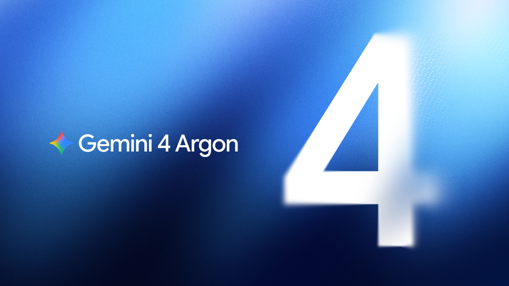
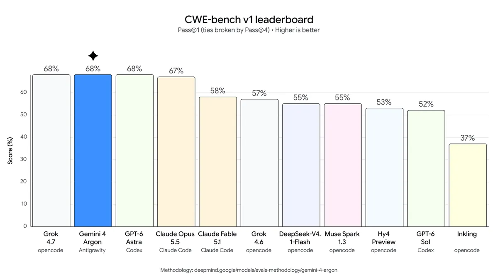

# Gemini 4 Argon, 안전장치는 구글이 고른 곳에만 푼다

_구글은 심사를 통과한 보안 조직에만 안전장치 없는 Argon을 먼저 주고, 어디가 통과했는지와 탈락 이유는 공개하지 않는다_

## Executive Summary

> [!callout]
> 이 글은 구글이 2026년 9월 30일 공개한 Gemini 4 Argon 발표 한 건을 읽는다. 발표문은 이 모델이 중요한 소프트웨어 취약점을 스스로 찾아내고 검증하고 고칠 수 있다고 적었고, 취약점 수리 시험 CWE-bench v1에서 68%로 공동 1위라고 밝혔다. 그런데 사이버 안전장치를 떼어 낸 판은 일반 공개 대상이 아니다. 구글은 그 판을 자사 내부 팀과 Fairwind 프로그램 심사를 통과한 보안 조직에 먼저 준다.

> 68%라는 점수가 나온 시험은 구글이 만든 것도, 구글이 돌린 것도 아니다. CWE-bench v1은 Collinear AI가 만들어 직접 돌리고 리더보드로 공개하는 외부 벤치마크이고, 같은 점수로 오픈AI의 GPT-6 Astra와 xAI의 Grok 4.7이 함께 1위에 올라 있다. 능력을 측정하는 시험은 이렇게 구글 손에 있지 않다. 반면 안전장치를 뗀 판을 누구에게 줄지는 구글이 혼자 정한다. Fairwind 안내 페이지는 신청 자격과 승인 후 의무를 꽤 상세히 적어 두었지만, 어느 선을 넘어야 통과인지와 누가 그 판정을 내리는지는 적혀 있지 않다.

> 1절부터 4절까지는 구글 발표문과 Fairwind 안내 페이지, 그리고 이를 전한 보도에 적힌 사실이다. 5절은 그 내용을 데이터를 다루는 사람의 눈으로 다시 읽은 이 글의 해석이다.

*▲ 구글이 2026년 9월 30일 공개한 Gemini 4 Argon | Source: [구글 블로그](https://blog.google/innovation-and-ai/models-and-research/gemini-models/gemini-4-argon/)*

### 주요 수치

이 발표에 붙은 숫자들은 서로 다른 두 가지를 가리킨다. 하나는 모델이 무엇을 할 수 있는지이고, 다른 하나는 그 능력이 어떤 경로로 어느 조직에 가는지다. 뒤쪽을 설명하는 숫자가 앞쪽보다 적다.

출처: [구글 Gemini 4 Argon 발표문](https://blog.google/innovation-and-ai/models-and-research/gemini-models/gemini-4-argon/), [구글 딥마인드 Fairwind 프로그램 안내](https://deepmind.google/fairwind-program/), SecurityWeek 보도(2026-09-30).

<!-- stat-card -->
**68%** — CWE-bench v1 공동 1위 — Collinear AI가 돌린 취약점 수리 시험. GPT-6 Astra·Grok 4.7도 같은 점수다

<!-- stat-card -->
**650곳+** — Fairwind 참여 조직 — 9월 2일 출범 당시 수치. 이 가운데 몇 곳이 Argon을 받는지는 구글이 밝히지 않았다

<!-- stat-card -->
**0건** — 공개된 심사 판정 기록 — 신청 자격과 승인 후 의무는 공개돼 있지만, 통과 명단·탈락 사유·이의 절차는 없다

<!-- stat-card -->
**$2 / $10** — 100만 토큰당 도입 가격 — 입력 2달러·출력 10달러. 안전장치를 뗀 판은 가격이 아니라 심사로 배분된다

## 구글은 무엇을 공개했나

9월 30일 발표문의 핵심 문장은 짧다. "Argon은 중요한 소프트웨어 취약점을 자율적으로 찾아내고, 검증하고, 고칠 수 있다." 보안 분야에서 이 세 동사가 한 줄에 붙은 것은 가볍지 않다. 취약점을 찾는 일과 그것이 진짜로 악용 가능한지 확인하는 일, 그리고 고친 코드를 내놓는 일은 그동안 사람 손을 거쳐 각각 따로 떨어져 있던 공정이었다.

발표문에는 구글 엔지니어들이 이미 Argon을 일상 업무에 쓰고 있다는 대목도 있다. 평범한 디버깅에서 시작해 대규모 코드베이스 이전과 알고리즘 설계까지다. 바깥에서는 아직 좁은 통로로만 나가는 모델이, 구글 안에서는 이미 매일 돌아가고 있다는 뜻이다.

근거로 제시된 수치 가운데 이 글이 보는 것은 CWE-bench v1이다. SecurityWeek은 이 시험을 Collinear AI가 만든 취약점 수리 벤치마크라고 전하면서, Argon이 68%로 오픈AI의 GPT-6 Astra, xAI의 Grok 4.7과 함께 공동 1위에 올랐다고 적었다. 단독 선두가 아니라 동점이다. 세 모델이 같은 선에 서 있다는 사실은 이 능력이 한 회사의 비밀이 아니라는 뜻이기도 하다.

이 시험의 내용은 Collinear가 공개해 두었다. 실제로 쓰이는 오픈소스 저장소를 통째로 떼어 주고 거기 들어 있는 진짜 취약점을 찾아 고치게 하는 과제 120개다. 다루는 취약점 분류는 73종이고, OWASP가 꼽은 상위 10개 범주와 여덟 개 언어를 덮는다. 채점은 고친 코드가 실제로 도는지 기계가 판정하는 쪽이 정본이고, 서로 다른 계열의 모델 셋으로 꾸린 심사단 점수를 두 번째 읽기로 따로 붙인다. 모델을 돌리는 일도 벤치마크를 만든 쪽이 직접 한다.

| 시험 | 측정하는 것 | Argon 점수 |
| --- | --- | --- |
| CWE-bench v1 | 보안 취약점 수리Collinear AI 제작 | 68%GPT-6 Astra·Grok 4.7과 공동 1위 |
| DeepSWE v1.1 | 소프트웨어 공학 과제 해결 | 77.9% |
| LVBench | 긴 영상 이해 | 91.7% |
| AutomationBench | 업무 자동화 | 51.3% |

▲ 구글 발표문에 실린 주요 성적. 프롬프트 주입 공격 저항 시험인 Gray Swan IPI에서는 점수 없이 선두라고만 적혀 있다. 출처: 구글 Gemini 4 Argon 발표문(2026-09-30), SecurityWeek.

*▲ CWE-bench v1 리더보드. 막대 아래 작은 글씨가 각 모델이 돌아간 에이전트 하네스(Antigravity, opencode, Codex, Claude Code)다 | Source: [구글 블로그](https://blog.google/innovation-and-ai/models-and-research/gemini-models/gemini-4-argon/)*

리더보드를 끝까지 내려 보면 68%가 가장 너그러운 읽기라는 것도 함께 드러난다. [Collinear의 공개 리더보드](https://cwe-bench.com/)는 모델마다 어떤 에이전트 도구에 얹어 돌렸는지를 칸으로 따로 적어 두는데, Argon의 칸에는 구글이 만든 하네스 Antigravity가 들어가 있다. 네 번 시도해 한 번만 맞히면 되는 기준으로 보면 Argon은 75%로, 81%를 받은 Grok 4.7에 밀린다. 심사단이 매긴 점수 62%는 1위권 네 모델 가운데 가장 낮다. 한 번 돌리는 데 드는 비용 6.63달러는 리더보드에 오른 모델 가운데 가장 비싸다.

하네스까지 똑같이 맞춰 돌리는 비교도 따로 있다. Artificial Analysis는 같은 벤치마크를 자기네 공개 하네스 하나로 통일해 모든 모델에 적용하는데, 그 표에 Argon은 아직 올라 있지 않다. 모델 제조사의 도구 위에서 나온 점수와 조건을 맞춰 다시 측정한 점수가 같을지는 그래서 아직 모른다.

가격도 함께 나왔다. 100만 토큰당 입력 2달러, 출력 10달러이고 캐시에 올라간 입력 토큰은 입력 가격의 95%를 깎아 준다. 구글은 개발자와 기업, 일반 사용자에게 "가능한 한 빨리" 내놓겠다고 했지만 날짜는 없다. 테크크런치는 발표 시점 기준으로 Argon이 Fairwind 프로그램을 통해 일부 사이버 파트너에게만 나가고 있다고 전했다.

## Argon은 Fairwind를 거쳐 먼저 나간다

Fairwind는 Argon을 위해 새로 만든 통로가 아니다. 구글은 9월 2일 이 프로그램을 열면서 Gemini 3.8 Flash Cyber 모델과 CodeMender를 묶어 제공했다. CodeMender는 취약점을 찾아 검증하고 고치는 하네스로, 배포 가능한 패치를 몇 분 만에 만들어 낸다고 소개됐다. 출범 당시 참여 조직은 650곳이 넘었다. Argon은 9월 30일에 이 코호트에 합류했고, 합류하면서 사이버 안전장치를 떼어 낸 판이 처음으로 등장했다.

발표문의 표현은 이렇다. "신뢰할 수 있는 방어자와 구글 내부 팀에게는 Argon을 사이버 안전장치 없이 공개해, 프런티어 수준의 사이버보안 방어 능력을 온전히 쓸 수 있게 하겠다." 왜 전부에게 열지 않는지에 대한 설명도 9월 2일 발표문에 있다. 강력한 사이버 능력을 신뢰할 수 있는 방어자에게 먼저 주면 악의적 행위자가 그 능력을 악용하기 전에 시스템을 단단히 할 적응 기간이 생긴다는 논리다.

누가 신청할 수 있고, 통과하면 무엇을 지켜야 하는지는 프로그램 안내 페이지에 적혀 있다. 읽어 보면 느슨한 문서가 아니다.

*▲ 구글이 2026년 9월 2일 공개한 Fairwind 프로그램 | Source: [구글 블로그](https://blog.google/innovation-and-ai/technology/safety-security/fairwind-program/)*

| 구분 | 내용 |
| --- | --- |
| 신청 자격 | 정부와 국가 사이버 당국, 핵심 인프라 운영자(의료·통신·에너지·금융), 핵심 기술 플랫폼. 방어 벤치마크를 연구하는 학술 기관도 받는다 |
| 심사 | 윤리적 운영과 연구의 입증된 이력을 확인한다. 신청 조직을 대상으로 배경 조회를 해 보안 이력과 윤리적 운영 기록을 살핀다 |
| 승인 후 의무 | 피싱에 견디는 다중 인증 적용, 사내 보안·침해대응·모의해킹 팀으로 접근 제한, 임직원 접근 기록 추적, 접근 권한의 공유·재배포·판매 금지 |
| 허용·금지 용도 | 승인된 위협 시뮬레이션, 리버스 엔지니어링, 악성코드 분석을 방어·학술 연구 목적으로만. 악성코드 제작 같은 악의적 작업은 금지 |
| 탈락 시 | 공개된 일반 모델과 CodeMender를 함께 쓰는 경로를 안내한다 |

▲ Fairwind 프로그램 안내 페이지에 적힌 내용 요약. 출처: 구글 딥마인드 Fairwind 프로그램 안내, 구글 Fairwind 출범 발표문(2026-09-02).

## 심사에서 적힌 것과 적히지 않은 것

앞 절의 표를 다시 보면 한쪽에 아무것도 없다. 구글이 밝혀 둔 것은 **누가 신청할 수 있는가**와 **통과한 뒤에 무엇을 지켜야 하는가**다. 심사 자체에 대해서는 배경 조회를 한다는 사실과 윤리적 운영 이력을 본다는 기준만 있다. 그 이력이 어느 선을 넘어야 통과인지, 누가 그 판정을 내리는지, 떨어진 조직에 사유를 알려 주는지, 다시 다툴 창구가 있는지, 지금까지 몇 곳이 신청해 몇 곳이 통과했는지는 어느 문서에도 없다. 회신까지 걸리는 기간도 "가능한 한 빨리"로만 적혀 있다.

▲ 출처: 구글 딥마인드 Fairwind 프로그램 안내 페이지(2026-10-03 확인).

이 비대칭을 가장 먼저 지적한 곳은 경영 분석 매체 FourWeekMBA다. 이 매체는 Argon 발표문을 두고 "멤버십 기준도, 참여자 수도, 신청 경로도, 누가 결정하고 이의 절차가 있는지에 대한 설명도 싣지 않았다"고 적었다. 발표문만 놓고 보면 과한 지적이 아니다. 다만 프로그램 안내 페이지에는 신청 경로와 자격 범주가 분명히 있으므로, 비어 있는 칸은 "기준이 없다"가 아니라 "판정과 그 기록이 없다"로 좁혀 읽는 편이 정확하다. 같은 글이 던진 질문은 그래서 더 날카롭다. 누가 문지기를 감사하는가.

> [!callout]
> 심사 기준이 공개돼 있어도 그 기준으로 내린 결정을 아무도 볼 수 없으면 바깥에서 검증할 수 있는 것은 없다. 통과한 조직이 어디인지 모르면 그 조직들이 정말 기준에 맞았는지 따져 볼 수 없고, 떨어진 조직이 왜 떨어졌는지 모르면 기준이 일관되게 적용됐는지도 알 수 없다. 능력을 측정하는 일에는 밖에서 돌리는 시험과 모델별 점수를 줄 세운 공개 표가 있는데, 그 능력을 누구에게 풀어 줄지 정하는 일에는 그런 것이 하나도 없다. 두 쪽을 나란히 놓으면 무엇이 모자라는지 분명해진다.

실무에서 더 걸리는 대목은 통과할 수 있는 조직의 모양이다. 배경 조회와 다중 인증과 접근 기록 추적을 모두 갖춰 증명할 수 있는 곳은 성숙한 보안 조직과 규정 준수 체계, 그리고 정부를 상대할 창구를 가진 큰 기관이다. 중견 병원이나 독립 오픈소스 프로젝트, 개발도상국의 인프라 운영자가 이 문턱을 넘을 수 있는지에 대한 공개된 답은 없다. 이들도 공격을 받는 쪽이라는 점에서 이 공백은 형평의 문제로 남는다.

## 같은 능력이 두 방향으로 쓰인다

안전장치를 떼는 이유 자체는 억지가 아니다. 취약점을 어떻게 악용할 수 있는지 추론하기를 거부하는 모델은 그 취약점을 막아야 하는 사람에게 별 쓸모가 없다. 방어자가 공격자처럼 생각할 수 있어야 공격을 막는다. 문제는 바로 그 논리가 넓게 공개했을 때 위험해지는 이유와 정확히 같다는 점이다. 안전장치가 걸려 있을 때 모델이 거부하던 작업은, 방어자를 위해 그 제한을 풀고 나면 그대로 할 수 있게 된다.

그래서 안전의 단위가 옮겨 간다. 모델이 무엇을 거부하도록 만드느냐에서, 그 모델을 어느 조직에 주느냐로. 다중 인증과 배경 조회는 승인된 조직의 노트북 한 대가 뚫리는 상황까지 막아 주지는 못한다. 한번 풀린 능력은 그 조직 안에 존재하고, 그 능력이 실제로 무엇을 하는지 바깥에서 확인할 방법은 지금으로서는 구글의 설명뿐이다.

이 선택을 구글만 한 것도 아니다. 앤트로픽은 4월 7일 Project Glasswing으로 공개 전 모델 Claude Mythos의 프리뷰를 AWS·애플·시스코·크라우드스트라이크·JP모건체이스·마이크로소프트·엔비디아를 비롯한 기업과 핵심 소프트웨어 인프라를 맡은 40여 조직에 열었고, 9월부터는 Cyber Verification Program을 통해 Mythos 5.1을 미국 내 일부 조직에 공급하고 있다. 오픈AI의 Daybreak는 심사를 통과한 파트너에게 방어용 Blue와 레드팀용 Red를 나눠 준다. 마이크로소프트는 MDASH 고객에게 MAI-Cyber-1-Flash를 주면서 별도 심사를 두지 않는다고 밝혔다.

방향이 한쪽으로만 흐르는 것은 아니다. 오픈AI는 Argon 발표 하루 전인 9월 29일, Daybreak Blue 모델을 Codex Security Cloud를 통해 Pro·비즈니스·기업·교육 요금제 사용자에게 별도 신청 없이 제공한다고 밝혔다. 문을 좁히는 쪽과 넓히는 쪽이 같은 주에 나란히 움직인 셈이다. 어느 쪽이 옳은지는 아직 아무도 증명하지 않았고, 두 선택 모두 각 회사가 스스로 정했다.

## 페블러스가 이 발표를 주목하는 이유

이 발표는 모델 출시 뉴스의 외양을 하고 있지만, 안에서 움직이는 것은 접근 권한 관리 문제다. 어떤 능력을 누구에게 열어 줄지 정하고, 그 판정의 근거를 남기고, 나중에 다시 꺼내 볼 수 있게 두는 일. 데이터 거버넌스를 해 본 조직이라면 낯설지 않은 작업이고, 그 작업이 잘 됐는지는 늘 같은 질문으로 확인해 왔다. 누가 승인했는지, 어떤 기준으로 승인했는지, 그 기록이 남아 있는지.

Fairwind는 앞의 두 가지를 부분적으로 답하고 세 번째를 비워 두었다. 사내 데이터 접근 심사였다면 감사에서 그냥 넘어가지 않았을 구성이다. 권한을 준 이력이 남지 않는 승인 체계는 승인자가 선의일 때도 검증이 불가능하다. 선의 여부가 아니라 검증 가능성이 쟁점이라는 점에서, 구글이 실제로 신중하게 심사하고 있는지와 이 구조가 괜찮은지는 서로 다른 질문이다.

페블러스가 AI-Ready Data를 이야기할 때 되풀이하는 말이 하나 있다. 기록되지 않은 판단은 자산이 되지 않는다. 데이터 품질에서나 모델 접근 권한에서나 같다. 어떤 데이터를 누구에게 열었는지가 추적되지 않으면, 그 데이터로 만든 결과의 책임도 추적되지 않는다. 성능은 누구나 리더보드에서 확인할 수 있는데 배분에는 열어 볼 표가 없다. 그럴 때 밖에서 요구할 수 있는 것은 기록뿐이다.

그래서 독자에게 남는 질문은 구글에 대한 것이 아니라 각자의 조직에 대한 것이 된다. 우리 쪽에서 민감한 데이터나 강한 권한을 누군가에게 열어 줄 때, 그 판정의 기준과 결과가 지금 꺼내 볼 수 있는 형태로 남아 있는가. 기준만 문서에 적혀 있고 판정 기록은 담당자의 기억에만 있다면, 우리도 같은 구조를 돌리고 있는 셈이다.

여기까지 읽어 주셔서 감사하다. 구글의 Gemini 4 Argon 발표문과 Fairwind 프로그램 안내는 [구글 블로그](https://blog.google/innovation-and-ai/models-and-research/gemini-models/gemini-4-argon/)와 [딥마인드 프로그램 페이지](https://deepmind.google/fairwind-program/)에서 원문을 볼 수 있다. 여러분의 조직에서 지난 분기에 누구에게 어떤 권한을 열어 주었는지 오늘 안에 목록으로 뽑을 수 있는지 한번 확인해 보시고, 어디가 비어 있었는지 들려주시면 좋겠다.

## 참고문헌

### 공식 발표

- 1.Google. (2026). "[Gemini 4 Argon: our next era of frontier intelligence](https://blog.google/innovation-and-ai/models-and-research/gemini-models/gemini-4-argon/)." Google Blog (2026-09-30).
- 2.Google. (2026). "[Fairwind Program launch announcement](https://blog.google/innovation-and-ai/technology/safety-security/fairwind-program/)." Google Blog (2026-09-02).
- 3.Google DeepMind. "[Fairwind program](https://deepmind.google/fairwind-program/)." (2026-10-03 확인).

### 벤치마크 소스

- 4.Collinear AI. "[CWE-bench v1 public leaderboard](https://cwe-bench.com/)." (2026).

### 보도·분석

- 5.TechCrunch. (2026). "[Google releases Gemini 4 Argon, called its most powerful model yet](https://techcrunch.com/2026/09/30/google-releases-gemini-4-argon-called-its-most-powerful-model-yet/)." (2026-09-30).
- 6.SecurityWeek. (2026). "[Google Launches Gemini 4 Argon With Guardrail-Free Access for Vetted Defenders](https://www.securityweek.com/google-launches-gemini-4-argon-with-guardrail-free-access-for-vetted-defenders/)." (2026-09-30).
- 7.FourWeekMBA. (2026). "[AI Gemini 4 Argon Cyber Guardrails Fairwind Program](https://fourweekmba.com/ai-gemini-4-argon-cyber-guardrails-fairwind-program/)."
- 8.Creuto. (2026). "[Gemini 4 Argon: benchmarks, price, and the guardrail split](https://creuto.com/gemini-4-argon-benchmarks-price-guardrail-split)."
