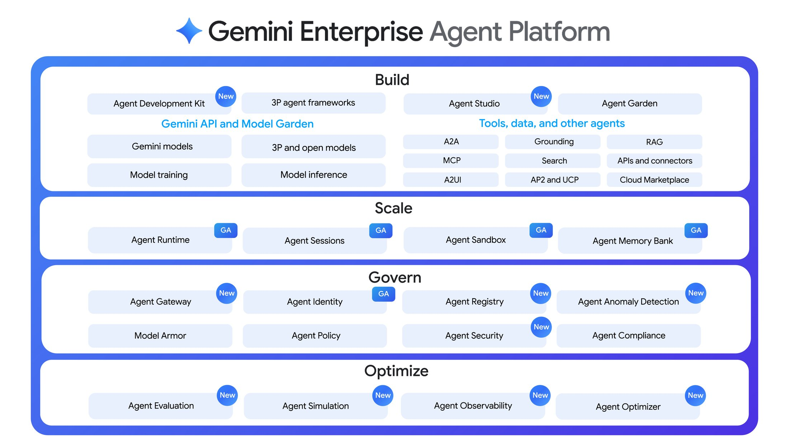
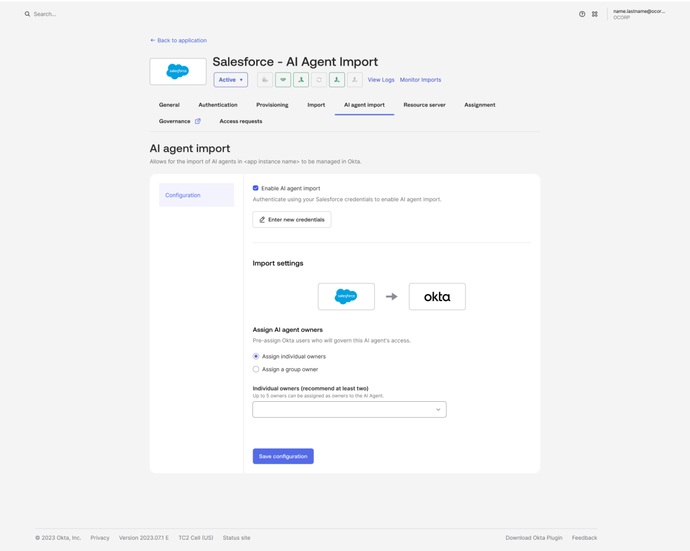

# Google Gave Every AI Agent Its Own Cryptographic ID

_Agents no longer borrow a human_

## Executive Summary

> [!callout]
> On April 22, 2026, at Google Cloud Next '26 in Las Vegas, Google unveiled the Gemini Enterprise Agent Platform. Among the announcements, one stands out. Agents no longer touch data by borrowing a human account. Each carries a cryptographic ID issued in its own name and moves only within the permissions an administrator grants directly to that ID. This piece looks at what that ID actually locks and what it leaves open.

> The core is a standard called SPIFFE. Every agent gets a unique, unforgeable identifier, and IAM policy binds least-privilege access straight to that identifier. A certificate that rotates automatically every 24 hours is cryptographically tied to the token, so a stolen token alone accomplishes nothing. Where Pebblous has repeatedly asked "who is this agent," a commercial infrastructure answer has, for the first time, been placed on the table.

> Yet the answer stops halfway. "Who" and "which tool is this agent entitled to call" are firmly locked, but which rows and columns of the data that tool returns the agent is entitled to see still falls to the underlying data source. How far that lock reaches, and where the gap still opens — that is the boundary the pages ahead trace.

*▲ Agent Identity sits under the Govern pillar | Source: [Google Cloud Blog](https://cloud.google.com/blog/products/ai-machine-learning/introducing-gemini-enterprise-agent-platform)*

Four numbers capture both the scale and the boundary of the announcement: the breadth of models the platform reaches, the short lifespan of the certificate that backs the ID, the time it took a competitor to ship the same answer, and the control layer still left to the underlying data source.

<!-- stat-card -->
**200+** — Models reachable in Model Garden — Gemini, Claude, and third parties (Google Cloud, 2026-04)

<!-- stat-card -->
**24 hrs** — Certificate lifespan — Auto-rotating X.509, no long-lived keys (Agent Identity docs)

<!-- stat-card -->
**8 days** — Gap to Okta's GA — Google 04-22, Okta 04-30 — same month's answer (Okta)

<!-- stat-card -->
**Data source** — Where row/column permission lives — Per-vector-index control sits outside the gate (not documented)

## Google Handed Agents a Name Tag Instead of a Human's Keys

Until now, the way an agent reached data inside a company was usually a single one. Many agents shared one human-created service account and borrowed its broad permissions wholesale. When something went wrong and you opened the logs, all you found was the name of the shared account. Exactly which agent touched what was hard to reconstruct after the fact.

Agent Identity in the Gemini Enterprise Agent Platform inverts this. Every agent an administrator deploys receives a unique cryptographic identifier of the form `spiffe://TRUST_DOMAIN/resources/SERVICE/RESOURCE_PATH`. SPIFFE is an open specification that standardizes identity between services; here it is used to pin an unforgeable name tag to a software actor rather than a person. Unlike a shared account, it cannot impersonate another identity, and no long-lived keys are issued.

That identifier goes straight in as the principal of an IAM policy. An administrator can write "this permission, to this agent only" directly onto a resource such as a GCS bucket or a BigQuery dataset. Exactly as least privilege is applied to a person, the access scope is narrowed for each individual agent. On the credential side, an X.509 certificate that auto-rotates every 24 hours is issued and cryptographically bound to the access token over mTLS. Steal the token alone, and you cannot replay it.

## Without a Name Tag, You Cannot Even Erase Who Touched It

Read this announcement as mere product news and you miss half of it. Where Google pulled out an ID, an old question was already waiting. Pebblous has pointed at that same spot three times over recent months. In order: the problem of an autonomous enterprise handing agents the ledger without giving them employee numbers; the problem of retrieval copying rather than inheriting the source's permissions; and the problem that memory piled up without a name tag cannot later be erased.

All three were "raising the problem." This piece is different in kind. The industry has begun to answer that gap with actual implementations, and pulling one answer apart shows where the lock holds and where it is still open. The table below sorts out which axis of those three earlier pieces this announcement answers.

| Earlier piece | Axis raised | Relation to this piece |
| --- | --- | --- |
| Running the Company, but No Employee ID2026-06-18 · SAP autonomous enterprise | Absence of agent identity policy. 78% of those surveyed had no policy at all | We take apart one vendor's actual implementation for that absence |
| Agents Don't Inherit the Source's Permissions2026-07-16 · the Meta incident | Entitlement drift from a vector index copying, not inheriting, the source's permissions | We test the first commercial answer to "so what did the industry ship" against this mechanism |
| Memory Without a Name Tag Cannot Be Erased2026-07-29 · memory provenance | Without a name tag at write time, deletion cannot be applied retroactively | This ID tags the actor itself, not the memory — a different layer, the same thesis |

[/blog/autonomous-enterprise-agent-identity/en/](/blog/autonomous-enterprise-agent-identity/en/)  
[/report/agent-entitlement-inheritance-retrieval/en/](/report/agent-entitlement-inheritance-retrieval/en/)  
[/report/agent-memory-provenance-deletion/en/](/report/agent-memory-provenance-deletion/en/)

One sentence runs through all three. No name tag, no control. If you don't know who touched something, you cannot narrow the permission, retrace the incident, or erase the data that got in by mistake. Agent Identity is the first commercial-grade attempt to carve that name tag into the actor layer itself.

## Who, and Which Tool, Is Now Firmly Locked

An ID alone does not end control. Google set up two more gates on top of identity. The first is the Agent Gateway, a control tower guarding the space between agents and tools (MCP servers and the like). It filters which agent may call which tool, at the granularity of the tool name and of whether the call is read-only or allowed to write. Model Armor, which blocks prompt injection and data exfiltration, also attaches to this path.

The second is delegated access. When an agent acts on a user's behalf, it uses not its own permissions but an OAuth token delegated from the user. The Agent Identity Auth Manager brokers and encrypts the credential so the agent cannot look at the original credential directly. Logs left along this path stamp both the agent ID and the user ID. "Who ordered it, and who carried it out" ends up on a single line.

On top of this come the Agent Registry, which gathers approved agents, tools, and skills in one place; Agent Threat Detection, which catches reverse shells and malicious IP connections in real time; and Agent Anomaly Detection, which flags abnormal reasoning using statistical models together with an LLM judge. Taken together, "who" (identity) and "which tool is this agent entitled to call" (the tool gate) are firmly locked. To this point, it is clear progress on the audit question Pebblous has been posing.

*▲ Agent Gateway, Agent Identity, Agent Registry, and Agent Anomaly Detection sit side by side under Govern | Source: [Google Cloud Blog](https://cloud.google.com/blog/products/ai-machine-learning/introducing-gemini-enterprise-agent-platform)*

> [!callout]
> Put together, the layers are distinct. Identity is handled by the SPIFFE identifier, authentication by the 24-hour certificate and mTLS, the right to call a tool by the Agent Gateway, and acting for a user by delegated OAuth. Of the audit question "who touched what data," the leading "who" is now answered by the infrastructure.

## A First Answer — but Never the Only One

The phrase "the industry's first commercial answer" should be used with care. Google was an early case of nailing identity down into commercial infrastructure, true, but it is not the world's first or the only solution. In the same month, competitors laid down their answers side by side.

- •**Okta for AI Agents** — GA on April 30, 2026, eight days after Google. Its Cross App Access (XAA) protocol standardizes the flow where an agent reaches several downstream services on a user's behalf.
- •**Auth0 Auth for GenAI** — developer preview in May 2026. It treats MCP and autonomous agents as first-class identities and integrates with LangChain, LlamaIndex, the Vercel AI SDK, and more.
- •**WorkOS** — positions itself as a lightweight alternative to Okta and detects non-human identities with a dedicated tool.

*▲ An Okta admin importing an AI agent and assigning its owners | Source: [Okta Blog](https://www.okta.com/blog/ai/okta-for-ai-agents-general-availability/)*

That the direction overlaps is itself a signal. The Cloud Security Alliance (CSA) diagnosed the gap in non-human identity governance as coming not from a lack of technology but from no one deciding where responsibility sits. Indeed, CSA put at nine in ten the organizations that lack a reliable way to govern what an agent does in production. That several vendors reached for identity first in the same month means the gap has become a hands-on problem that can no longer be deferred. So it is more accurate to read this announcement not as "a problem Google solved alone" but as "the flagship case of a problem the industry began answering all at once."

## The Permission on a Single Chunk Is Still Outside the Name Tag

Here we have to pull the previous report's question back out. A vector index stores the source document chopped into small pieces, and in that process the row- and column-level permissions the source held (like BigQuery's row-level security) do not come along. Because the permission is copied rather than inherited, even someone barred from the source can see the content through the chunk left in the index. This is the failure point Pebblous has called entitlement drift.

So did Agent Identity solve that point? Judging by the published documentation, the answer is "only partly." The Agent Gateway is the layer that controls "which agent may call which tool," not the layer that controls "which rows and columns of the data that tool returns the agent is entitled to see." The Gateway docs show no mention of row/column-level access control or of fine-grained permission enforcement at the vector-index level. The RAG Engine docs speak of data-lineage tracking, hygiene, and region-residency requirements, but there is no evidence they explicitly solve the problem of an index losing the source's permissions.

The answer splits by path. Run retrieval on the user's behalf through delegated OAuth, and the underlying data source's native security applies that user's original permissions as they are. In this case entitlement is preserved. Conversely, if the agent runs RAG on its own permissions, it ends up depending on "who attached which ACL metadata to that index." Someone has to reconcile the permissions of the vector index and the source system by hand. Unlike identity and the tool gate, which came down into the infrastructure, data permission at retrieval time still passes through an operator's hands.

So split the audit question "who touched what data" into two pieces and the state becomes clear. The leading "who" was, this time, turned into infrastructure all the way up through the identity and tool layers. The trailing "what data was it entitled to touch" is preserved automatically only on the delegated path; outside it, it still hangs on name-tag management at the data layer. One more step remains.

<!-- stat-card -->
**Editor's Note** — The point Pebblous stresses when it talks about AI-Ready Data is exactly this last step. Tagging the actor and carving provenance and permission into each individual chunk of data are jobs at different layers. Agent Identity turned the front half into infrastructure. The back half — keeping a retrieved chunk from losing its source permissions — is solved only by planting lineage from the moment the data is created.

## References

### Google Official Announcements & Docs

- 1.Google Cloud. (2026). "[Introducing Gemini Enterprise Agent Platform](https://cloud.google.com/blog/products/ai-machine-learning/introducing-gemini-enterprise-agent-platform)." Google Cloud Blog.
- 2.Google Cloud. "[Agent Identity overview](https://docs.cloud.google.com/gemini-enterprise-agent-platform/govern/agent-identity-overview)." Google Cloud Docs.
- 3.Google Cloud. "[Use Agent Identity with Agent Runtime](https://docs.cloud.google.com/gemini-enterprise-agent-platform/scale/runtime/agent-identity)." Google Cloud Docs.
- 4.Google Cloud. "[Agent Gateway overview](https://docs.cloud.google.com/gemini-enterprise-agent-platform/govern/gateways/agent-gateway-overview)." Google Cloud Docs.

### Competitor Responses

- 5.Okta. (2026). "[Okta for AI Agents: General Availability](https://www.okta.com/blog/ai/okta-for-ai-agents-general-availability/)." Okta Blog.
- 6.Auth0. (2026). "[Securing Gemini Enterprise Agent Platform Runtime](https://auth0.com/blog/securing-gemini-enterprise-agent-platform-runtime-auth0/)." Auth0 Blog.

### Industry Diagnosis

- 7.Cloud Security Alliance. (2026). "[AI Agent Identity Crisis: Standards Emerge as Enterprises Lag](https://labs.cloudsecurityalliance.org/research/csa-research-note-okta-ai-agent-iam-framework-enterprise-gap/)." CSA Research Note.
- 8.aiagentstore.ai. "[This week in AI agent news](https://aiagentstore.ai/ai-agent-news/this-week)."
