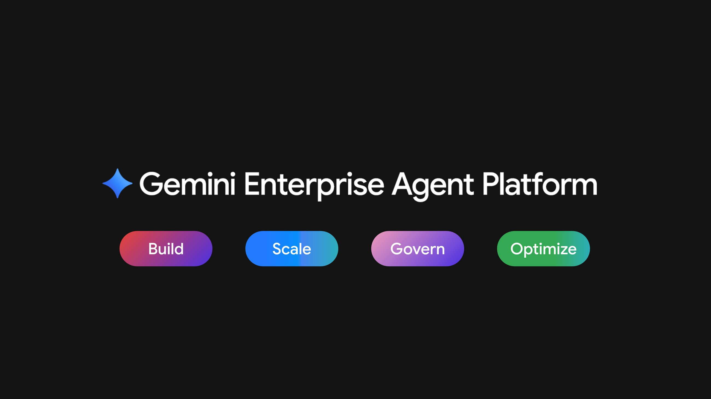

# 구글이 에이전트 하나하나에 암호화 신분증을 발급했다

_사람의 권한을 빌리지 않는 에이전트, 그러나 검색 시점의 권한 상속에는 아직 빈자리가 남았다_

## Executive Summary

> [!callout]
> 2026년 4월 22일 라스베이거스에서 열린 Google Cloud Next '26에서 구글은 Gemini Enterprise Agent Platform을 정식 공개했습니다. 여러 발표 가운데 하나가 특히 눈에 띕니다. 이제 각 에이전트는 사람의 계정을 빌려 데이터를 만지지 않습니다. 자기 이름으로 발급받은 암호화 신분증을 들고, 관리자가 그 신분증에 직접 부여한 권한 안에서만 움직입니다. 이 글은 그 신분증이 실제로 무엇을 잠그고 무엇을 열어 두는지를 봅니다.

> 핵심은 SPIFFE라는 표준입니다. 에이전트마다 위조할 수 없는 고유 식별자가 붙고, IAM 정책은 그 식별자에 곧바로 최소 권한을 겁니다. 24시간마다 자동 갱신되는 인증서가 토큰과 암호학적으로 묶여, 탈취한 토큰만으로는 아무것도 못 하게 됩니다. 지난 몇 달간 페블러스가 "에이전트는 누구인가"를 반복해 물었던 자리에, 처음으로 상용 인프라의 답 하나가 놓인 셈입니다.

> 그런데 답은 절반에서 멈춥니다. "누가"와 "어떤 툴을 부를 자격이 있는가"는 확실히 잠겼지만, 그 툴이 돌려주는 데이터의 어느 행·열까지 볼 자격이 있는가는 여전히 하부 데이터 소스의 몫으로 남습니다. 잠긴 것은 어디까지고 남은 빈틈은 무엇인지, 그 경계를 따라가 봅니다.

*▲ Agent Identity는 이 중 Govern 축에 속한 기능입니다 | Source: [Google Cloud Blog](https://cloud.google.com/blog/products/ai-machine-learning/introducing-gemini-enterprise-agent-platform)*

네 개의 숫자가 이번 발표의 규모와 경계를 함께 보여 줍니다. 플랫폼이 접근하는 모델의 폭, 신분증을 뒷받침하는 인증서의 짧은 수명, 경쟁사가 같은 해법을 내놓기까지 걸린 시간, 그리고 여전히 하부 데이터 소스에 맡겨진 통제 계층입니다.

<!-- stat-card -->
**200+** — Model Garden 접근 모델 — Gemini·Claude 등 서드파티 포함 (Google Cloud, 2026-04)

<!-- stat-card -->
**24시간** — 인증서 유효기간 — 자동 갱신 X.509, 장기 키 미발급 (Agent Identity 문서)

<!-- stat-card -->
**8일** — Okta GA와의 시차 — 구글 04-22, Okta 04-30 — 같은 달의 답 (Okta)

<!-- stat-card -->
**하부 소스** — 행·열 권한의 소재 — 벡터 인덱스 단위 통제는 게이트 밖 (문서 미명시)

## 구글은 에이전트에게 사람의 열쇠 대신 자기 이름표를 줬다

지금까지 기업 안에서 에이전트가 데이터에 닿는 방식은 대개 하나였습니다. 사람이 만든 서비스 계정 하나를 여러 에이전트가 나눠 쓰고, 그 계정의 넓은 권한을 통째로 빌려 움직였습니다. 문제가 생겨 로그를 열어도 거기 찍힌 것은 공유 계정의 이름뿐입니다. 정확히 어느 에이전트가 무엇을 만졌는지는 사후에 복원하기 어려웠습니다.

Gemini Enterprise Agent Platform의 Agent Identity는 이 구조를 뒤집습니다. 관리자가 배포하는 에이전트마다 `spiffe://TRUST_DOMAIN/resources/SERVICE/RESOURCE_PATH` 형식의 고유 암호화 식별자가 부여됩니다. SPIFFE는 서비스 사이의 신원을 표준화하는 오픈 규격으로, 여기서는 사람이 아니라 소프트웨어 행위자에게 위조 불가능한 이름표를 붙이는 데 쓰입니다. 공유 계정과 달리 다른 신원을 위장할 수 없고, 오래 유효한 키도 발급되지 않습니다.

이 식별자는 곧바로 IAM 정책의 주체(principal)로 들어갑니다. 관리자는 GCS 버킷이나 BigQuery 데이터셋 같은 리소스에 "이 에이전트에게만 이 권한을"이라고 직접 적어 둘 수 있습니다. 사람에게 최소 권한을 거는 방식 그대로, 에이전트 한 대 한 대에 접근 범위를 좁혀 두는 것입니다. 자격증명 쪽에서는 24시간마다 자동으로 갱신되는 X.509 인증서가 발급되고, mTLS로 액세스 토큰과 암호학적으로 묶입니다. 토큰만 훔쳐서는 재생할 수 없다는 뜻입니다.

## 이름표가 없으면 누가 만졌는지도 지울 수 없다

이번 발표를 제품 소식으로만 읽으면 절반을 놓칩니다. 구글이 신분증을 꺼낸 자리에는 이미 오래된 질문이 있었습니다. 페블러스도 지난 몇 달간 같은 자리를 세 번 짚었습니다. 순서대로 보면, 자율 기업이 에이전트에게 사번을 주지 않은 채 장부를 맡긴 문제, 검색이 원본의 권한을 상속하지 못하고 복사만 하는 문제, 그리고 이름표 없이 쌓인 기억은 나중에 지울 수도 없다는 문제였습니다.

세 편은 모두 "문제 제기"였습니다. 이번 글은 결이 다릅니다. 업계가 그 공백에 실제 구현물로 답하기 시작했고, 그 답을 뜯어보면 어디까지 잠겼고 어디는 아직 열려 있는지가 갈립니다. 아래 표는 이번 발표가 이전 세 편의 어느 축에 대한 답인지를 정리한 것입니다.

| 이전 글 | 짚은 축 | 이번 글과의 관계 |
| --- | --- | --- |
| 회사를 돌리는데 사번은 없다2026-06-18 · SAP 자율 기업 | 에이전트 신원 정책의 부재. 조사 대상 78%가 정책조차 없음 | 그 부재에 대한 한 벤더의 실제 구현물을 뜯어본다 |
| 에이전트는 출처의 권한을 물려받지 못한다2026-07-16 · 메타 사건 | 벡터 인덱스가 원본 권한을 상속하지 않고 복사해 생기는 entitlement drift | "그래서 업계는 무엇을 내놓았나"의 첫 상용 답을 이 메커니즘에 대입해 검증한다 |
| 이름표 없는 기억은 지울 수 없다2026-07-29 · 메모리 프로버넌스 | 쓰기 시점 이름표가 없으면 삭제가 소급 불가능 | 이번 신분증은 기억이 아니라 행위자 자체의 이름표 — 계층은 달라도 테제는 같다 |

[/blog/autonomous-enterprise-agent-identity/ko/](/blog/autonomous-enterprise-agent-identity/ko/)  
[/report/agent-entitlement-inheritance-retrieval/ko/](/report/agent-entitlement-inheritance-retrieval/ko/)  
[/report/agent-memory-provenance-deletion/ko/](/report/agent-memory-provenance-deletion/ko/)

세 편을 관통하는 문장은 하나입니다. 이름표가 없으면 통제도 없습니다. 누가 만졌는지 모르면 권한을 좁힐 수도, 사고를 되짚을 수도, 잘못 들어간 데이터를 지울 수도 없습니다. Agent Identity는 바로 그 이름표를 행위자 계층에 새겨 넣은 첫 상용급 시도입니다.

## 누가, 그리고 어떤 툴까지는 이제 확실히 잠긴다

신분증 하나만으로는 통제가 끝나지 않습니다. 구글은 신원 위에 두 개의 관문을 더 세웠습니다. 첫째가 Agent Gateway입니다. 에이전트와 툴(MCP 서버 등) 사이를 지키는 관제탑으로, 어떤 에이전트가 어떤 툴을 호출할 수 있는지를 툴 이름 단위로, 그리고 읽기 전용인지 쓰기까지 허용인지 단위로 걸러냅니다. 프롬프트 인젝션과 데이터 유출을 막는 Model Armor도 이 경로에 붙습니다.

둘째가 위임 접근(delegated access)입니다. 에이전트가 사용자를 대신해 행동할 때는 자기 권한이 아니라, 사용자에게서 위임받은 OAuth 토큰을 씁니다. Agent Identity Auth Manager가 자격증명을 중개하고 암호화해서, 에이전트가 원본 자격증명을 직접 들여다볼 수 없게 설계돼 있습니다. 이 경로로 남는 로그에는 에이전트 ID와 사용자 ID가 함께 찍힙니다. "누가 시켜서 누가 했는가"가 한 줄에 남는 것입니다.

여기에 승인된 에이전트·툴·스킬을 한곳에 모아 두는 Agent Registry, 리버스 셸이나 악성 IP 연결을 실시간으로 잡아내는 Agent Threat Detection, 통계 모델과 LLM 심판을 함께 써서 비정상 추론을 표시하는 Agent Anomaly Detection이 더해집니다. 종합하면 "누가"(신원)와 "어떤 툴을 부를 자격이 있는가"(툴 게이트)는 확실히 잠깁니다. 여기까지는 페블러스가 던져 온 감사 질문에 대한 분명한 진전입니다.

*▲ Govern 축에 나란히 놓인 Agent Gateway·Agent Identity·Agent Registry·Agent Anomaly Detection | Source: [Google Cloud Blog](https://cloud.google.com/blog/products/ai-machine-learning/introducing-gemini-enterprise-agent-platform)*

> [!callout]
> 정리하면 계층이 뚜렷합니다. 신원은 SPIFFE 식별자가, 인증은 24시간 인증서와 mTLS가, 툴 호출 자격은 Agent Gateway가, 사용자 대행은 위임 OAuth가 맡습니다. 감사 질문 "누가 무슨 데이터를 만졌는가" 중에서 앞의 "누가"는 이제 인프라가 답합니다.

## 첫 답이긴 해도 유일한 답은 아니었다

"산업의 첫 상용 해답"이라는 표현은 조심해서 써야 합니다. 구글이 신원을 상용 인프라로 못 박은 이른 사례인 것은 맞지만, 세계 최초나 유일한 해법은 아닙니다. 같은 달에 경쟁사들이 나란히 답을 내놓았기 때문입니다.

- •**Okta for AI Agents** — 구글보다 8일 늦은 2026년 4월 30일 GA. Cross App Access(XAA) 프로토콜로, 에이전트가 사용자를 대신해 여러 다운스트림 서비스에 접근하는 흐름을 표준화했습니다.
- •**Auth0 Auth for GenAI** — 2026년 5월 개발자 프리뷰. MCP와 자율 에이전트를 1급 신원으로 다루고 LangChain·LlamaIndex·Vercel AI SDK 등과 통합했습니다.
- •**WorkOS** — Okta 대비 경량 대안으로 포지셔닝하며, 별도 도구로 비인간 신원을 탐지합니다.

*▲ Okta 관리자가 AI 에이전트를 임포트하고 소유자를 지정하는 화면 | Source: [Okta Blog](https://www.okta.com/blog/ai/okta-for-ai-agents-general-availability/)*

방향이 겹친다는 사실 자체가 신호입니다. 클라우드 시큐리티 얼라이언스(CSA)는 비인간 신원 거버넌스의 공백이 기술 부족이 아니라 책임 소재를 아무도 정하지 않은 데서 온다고 진단했습니다. 실제로 CSA는 프로덕션에서 에이전트가 무엇을 하는지 믿을 만하게 거버넌스할 방법을 갖추지 못한 조직을 열에 아홉으로 봤습니다. 여러 벤더가 같은 달에 신원부터 손을 댄 것은, 그 공백이 더는 미룰 수 없는 실무 문제가 됐다는 뜻입니다. 그러니 이번 발표는 "구글이 혼자 푼 문제"가 아니라 "업계가 동시에 답하기 시작한 문제의 대표 사례"로 읽는 편이 정확합니다.

## 정작 데이터 한 조각의 권한은 아직 이름표 밖에 있다

여기서 직전 리포트가 던진 질문을 다시 꺼내야 합니다. 벡터 인덱스는 원본 문서를 잘게 쪼개 저장하는데, 이 과정에서 원본이 갖고 있던 행·열 단위 권한(BigQuery의 RLS 같은)이 함께 넘어오지 않습니다. 권한이 상속되지 않고 복사만 되니, 원본에서 접근이 막힌 사람도 인덱스에 남은 조각을 통해 내용을 볼 수 있게 됩니다. 이것이 페블러스가 entitlement drift라고 부른 실패 지점입니다.

그럼 Agent Identity는 이 지점을 풀었을까요. 공개된 문서를 기준으로 보면, 답은 "부분적으로만"입니다. Agent Gateway는 "어떤 에이전트가 어떤 툴을 부를 수 있는가"를 통제하는 계층이지, "그 툴이 돌려주는 데이터의 어느 행·열까지 볼 자격이 있는가"를 통제하는 계층이 아닙니다. Gateway 문서에는 행·열 단위 접근 통제나 벡터 인덱스 단위의 세분화된 권한 집행에 대한 언급이 확인되지 않습니다. RAG Engine 문서도 데이터 계보 추적과 위생 관리, 리전 상주 요건은 말하지만, 인덱스가 원본 권한을 잃는 문제를 명시적으로 해결한다는 근거는 보이지 않습니다.

경로에 따라 답이 갈립니다. 위임 OAuth로 사용자를 대신해 검색을 태우면, 하부 데이터 소스의 네이티브 보안이 그 사용자의 원본 권한을 그대로 적용해 줍니다. 이 경우 entitlement는 보존됩니다. 반대로 에이전트가 자기 고유 권한으로 RAG를 태우면, 결국 "누가 그 인덱스에 어떤 ACL 메타데이터를 붙여 뒀는가"에 의존하게 됩니다. 벡터 인덱스와 원본 시스템의 권한을 누군가 수작업으로 맞춰 놓아야 한다는 뜻입니다. 신원과 툴 게이트가 인프라로 내려온 것과 달리, 검색 시점의 데이터 권한은 아직 운영자의 손을 탑니다.

그래서 감사 질문 "누가 무슨 데이터를 만졌는가"를 두 조각으로 나눠 보면 상태가 분명해집니다. 앞의 "누가"는 이번에 신원·툴 계층까지 인프라화됐습니다. 뒤의 "무슨 데이터를 만질 자격이 있었는가"는 위임 경로에서만 자동으로 보존되고, 그 밖에서는 여전히 데이터 계층의 이름표 관리에 달려 있습니다. 한 걸음이 더 남았습니다.

<!-- stat-card -->
**Editor's Note** — 페블러스가 AI-Ready Data를 이야기할 때 강조하는 지점이 정확히 이 마지막 한 걸음입니다. 행위자에게 이름표를 붙이는 일과, 데이터 한 조각 한 조각에 출처와 권한을 새겨 두는 일은 다른 계층의 작업입니다. Agent Identity는 앞쪽을 인프라로 만들었습니다. 뒤쪽, 즉 검색된 조각이 원본 권한을 잃지 않게 하는 일은 데이터를 만드는 단계에서부터 계보를 심어 두어야 풀립니다.

## 참고문헌

### 구글 공식 발표·문서

- 1.Google Cloud. (2026). "[Introducing Gemini Enterprise Agent Platform](https://cloud.google.com/blog/products/ai-machine-learning/introducing-gemini-enterprise-agent-platform)." Google Cloud Blog.
- 2.Google Cloud. "[Agent Identity overview](https://docs.cloud.google.com/gemini-enterprise-agent-platform/govern/agent-identity-overview)." Google Cloud Docs.
- 3.Google Cloud. "[Use Agent Identity with Agent Runtime](https://docs.cloud.google.com/gemini-enterprise-agent-platform/scale/runtime/agent-identity)." Google Cloud Docs.
- 4.Google Cloud. "[Agent Gateway overview](https://docs.cloud.google.com/gemini-enterprise-agent-platform/govern/gateways/agent-gateway-overview)." Google Cloud Docs.

### 경쟁사 대응

- 5.Okta. (2026). "[Okta for AI Agents: General Availability](https://www.okta.com/blog/ai/okta-for-ai-agents-general-availability/)." Okta Blog.
- 6.Auth0. (2026). "[Securing Gemini Enterprise Agent Platform Runtime](https://auth0.com/blog/securing-gemini-enterprise-agent-platform-runtime-auth0/)." Auth0 Blog.

### 업계 진단

- 7.Cloud Security Alliance. (2026). "[AI Agent Identity Crisis: Standards Emerge as Enterprises Lag](https://labs.cloudsecurityalliance.org/research/csa-research-note-okta-ai-agent-iam-framework-enterprise-gap/)." CSA Research Note.
- 8.aiagentstore.ai. "[This week in AI agent news](https://aiagentstore.ai/ai-agent-news/this-week)."
