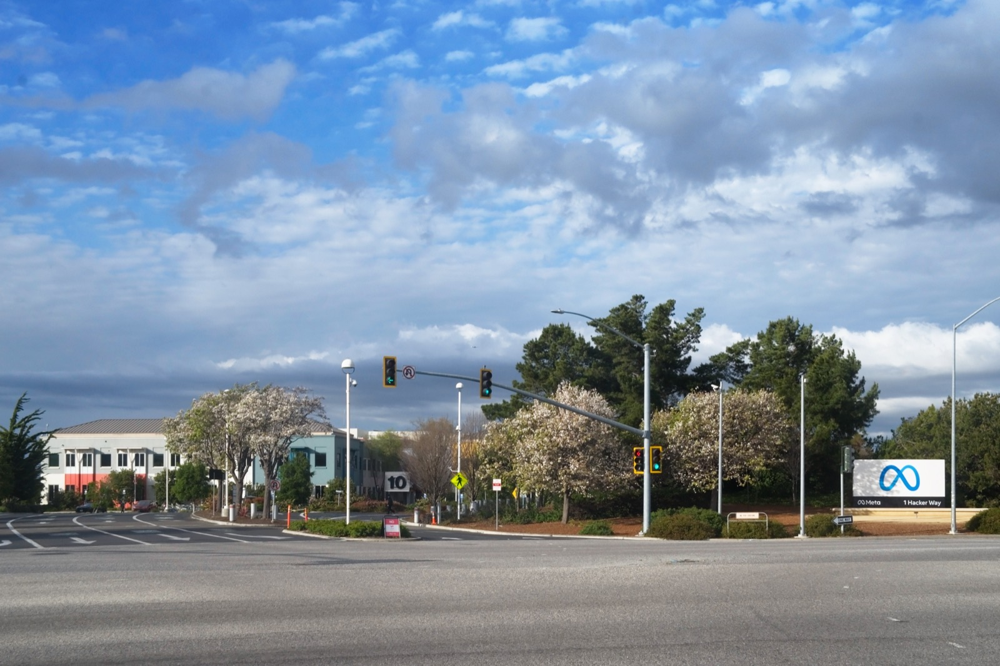

# The Copyright Info Google Allegedly Erased to Hide Gemini

_Hachette, Elsevier and other publishers sued Google in the Southern District of New York, charging source removal as a DMCA violation_

## Executive Summary

> [!callout]
> News of AI copyright suits has become routine. But the case publishers filed against Google in July 2026 has a different texture. The claim the plaintiffs press hardest is not "Google trained Gemini on our books without permission" but "Google erased the copyright information in those books to hide the fact that it used them." This piece reads that lawsuit, where the fight shifted from unauthorized use to erased sources, as a question about data provenance.

> The two claims are legally distinct. Unauthorized use asks whether this data may be used for this purpose; source removal asks whether the fact that it was used can still be traced. And this pairing is not new. In 2025, Kadrey v. Meta raised an almost identical source-removal claim, but the court dismissed it on the logic that "if the training is fair use, then erasing the source of that training cannot be actionable either." The fate of the removal claim was tied wholesale to the fair-use ruling.

> Seen from the data side, though, source removal is the more fundamental problem. Regardless of who wins the suit, training data whose provenance marks have been stripped becomes, in itself, data that cannot be audited. This piece stakes out that point and asks what a training pipeline should preserve right now, without waiting for a verdict.

### Key Figures

Source: [TechCrunch](https://techcrunch.com/2026/07/14/google-faces-another-ai-training-lawsuit-from-major-publishers/)

Three numbers compress the weight and the direction of this case. One is the size of the risk Google is said to have calculated for itself, one is the scene the plaintiffs offer as evidence of infringement, and one is the fact that this suit splits not into one claim but two.

<!-- stat-card -->
**$10B–$100B** — Penalty an internal memo warned of — The complaint alleges Google's own document called training on copyrighted books "very problematic for Google" and flagged fines of this magnitude

<!-- stat-card -->
**20 min · $0.39** — One Gemini-written novel — The suit's emblematic example: a 100-page mystery produced in this time and cost, competing directly with the originals

<!-- stat-card -->
**2 claims** — One suit, separate charges — Unauthorized training use and copyright-info removal (DMCA §1202(b)) are legally distinct violations

## What the Publishers Are Claiming

On July 10, 2026, publishers Hachette Book Group, Cengage Learning and Elsevier, together with novelist Scott Turow, filed a class action against Google. What stands out is where they filed. Not the Northern District of California, which had handed down a run of AI-friendly rulings, but the Southern District of New York (SDNY). It reads as a venue choice aimed at a different outcome on different precedent terrain.

*▲ The Thurgood Marshall United States Courthouse in Manhattan, home of the Southern District of New York. Publishers picked this court over the AI-friendly Northern District of California. | Source: [Wikimedia Commons](https://commons.wikimedia.org/wiki/File:Thurgood_Marshall_United_States_Courthouse_002.jpg) (CC BY-SA 4.0, Kidfly182)*

The complaint runs along two tracks. The first is unauthorized training. Books were supplied to Google Books, Play Books and Scholar for the limited purpose of search and snippet display — and the plaintiffs say Google pulled those full texts straight into Gemini's training. The second track is where the real center of gravity sits. It alleges that Google deliberately stripped copyright management information (CMI) — details like book titles and author names — erasing the clues to which books went into training. The plaintiffs frame this as a violation of DMCA (Digital Millennium Copyright Act) §1202(b).

The complaint also draws on Google's internal documents. In one passage, it says, Google warned itself that training AI on copyrighted books was "very problematic for Google" and could invite fines running from $10 billion to $100 billion. As the emblem of infringement, the plaintiffs point to Gemini writing a 100-page murder mystery set in a quiet coastal town in 20 minutes for $0.39 — a work that steps in as a direct substitute for the human-written originals.

## Two Distinct Violations — Using and Erasing

It looks like a single lawsuit, but two claims of different legal character stand side by side. Unauthorized use is the argument that Google exceeded the scope of permission. In 2015, in Authors Guild v. Google, the appeals court held that Google Books' mass scanning and snippet search was fair use. The purpose was transformative — making books searchable; the exposure was capped at fragments amounting to no more than about 16% of any text; and it did not substitute for demand to buy the originals. That recognition rested firmly on the premise of "the limited purpose of search." This suit starts from exactly there: extending search-authorized access to the different purpose of training went beyond the original bargain.

Source removal aims at an entirely different layer. It asks not whether the data was used, but whether the traces of that use were erased. Strip the copyright management information — titles, author names — from a book, and the clue to reconstructing which works entered the training corpus later disappears. The DMCA separately prohibits this deliberate removal of copyright information as an act in itself. The fact of using the data and the act of making that fact untraceable each become a distinct violation.

> [!callout]
> **The point**: In this suit, the weight of the dispute has moved from "used it without permission" to "erased the traces of using it." The former is a question of permission to use; the latter is a question of traceability.

## The Legal Trap Already in Place — Kadrey v. Meta

This is not the first time a source-removal claim has reached a courtroom. In Kadrey v. Meta, running since 2023, an almost identical argument was already put to the test once, and its ending casts a long shadow over this case.

Discovery revealed that Meta had trained Llama on the pirated dataset LibGen and had deliberately removed copyright information in the process. In March 2025, the court let the source-removal claim survive the motion-to-dismiss stage, finding room to read the removal as intended to conceal infringement. So far, this favored the plaintiffs.

*▲ Meta Platforms headquarters, Menlo Park, California. Meta became the defendant in Kadrey v. Meta over allegations it stripped copyright information from the data used to train Llama. | Source: [Wikimedia Commons](https://commons.wikimedia.org/wiki/File:Meta_Platforms_Headquarters_Menlo_Park_California.jpg) (CC0, LPS.1)*

The reversal came at summary judgment in June 2025. The court ultimately rejected the claim, and the structure of its reasoning is the crux. If the training itself is fair use — not infringement — then removing copyright information for the sake of that training cannot be said to have "facilitated infringement." For source removal to stand as an independent violation, the removal must have aided an actual infringement; but since the underlying act was not infringement, the removal claim could not stand either. The court did not weigh whether erasing the source was right or wrong; it tethered the claim's fate wholesale to the fair-use ruling.

> [!callout]
> **Implication**: If SDNY, like the California precedents, finds that "Gemini's training is fair use," then following Kadrey's logic the source-removal claim could collapse along with it. Conversely, if the court finds the training exceeded the scope of permission, the source-removal claim gains room to survive on its own. This suit is a test of whether "concealing the source" can be established as a separate violation.

## Why Erasing Sources Is the Harder Problem

The law splits this case into two layers, but it tends to subordinate one to the other. Kadrey's logic — if you had permission to use, then erasing the source is no problem — does exactly that. Yet from the standpoint of managing data, the order flips. Traceability is the more fundamental condition.

With training data whose provenance marks have vanished, all of the following become impossible:

- Auditing after the fact which data a model was trained on
- Later distinguishing what was used lawfully from what was used covertly
- Tracing a piece of data's source and license to assign responsibility when something goes wrong

Once the source is erased, there is no way to separate the claim "we used it lawfully" from the claim "we used it covertly" after the fact. The very ground that oversight and regulation must stand on disappears. Unauthorized use can at least be contested once you can pinpoint which data is at issue; source concealment is harder precisely because it makes that pinpointing impossible.

> [!callout]
> **In one line**: Regardless of who wins the suit, data whose source has been erased becomes, in itself, data that cannot be audited. While the law looks only at permission to use and treats provenance as secondary, the trustworthiness of the data quietly erodes.

## What Training Pipelines Should Protect Now

The signal this case sends to data practitioners does not require waiting for a verdict. If, at the point of assembling a training dataset, there is no provenance-tracking system that preserves each item's source, license and copyright information, then you later end up unable to prove — or rebut — "why and how this data was used." A model trained after its sources were erased becomes an unauditable asset, independent of whether the copyright suit is won or lost.

*▲ Server racks in a data center used to store AI training data. Without a provenance-tracking system preserving source, license and copyright information from the assembly stage, you later can't prove or rebut how the data was used. | Source: [Wikimedia Commons](https://commons.wikimedia.org/wiki/File:BalticServers_data_center.jpg) (CC BY-SA 3.0, BalticServers.com)*

Provenance management does not have to be seen only as a copyright-risk response. Tracking the source and integrity of training data is also a baseline condition for a model's reliability and reproducibility. Only when you can reconstruct which data went in can you explain why a model answers the way it does and single out the data behind a problem. Provenance marks are not regulatory paperwork; they are part of data quality.

Two things are worth watching from here. One is whether SDNY, through motion-to-dismiss review and discovery, reaches a conclusion different from the California precedents. The other is whether, in that process, the source-removal claim gets handled on its own, separated from the fair-use ruling. Whichever way it flows, a pipeline that records the source of the data used in training, starting now, has nothing to lose regardless of the outcome.

## References

### Court Rulings & Legal Commentary

- 1.United States Court of Appeals for the Second Circuit. (2015). "[Authors Guild, Inc. v. Google, Inc.](https://law.justia.com/cases/federal/appellate-courts/ca2/13-4829/13-4829-2015-10-16.html)," 804 F.3d 202.
- 2.Loeb & Loeb LLP. (2025). "[Kadrey v. Meta Platforms, Inc.](https://www.loeb.com/en/insights/publications/2025/03/kadrey-v-meta-platforms-inc)" Loeb & Loeb Insights.

### Industry & News Coverage

- 3.TechCrunch. (2026). "[Google faces another AI training lawsuit from major publishers](https://techcrunch.com/2026/07/14/google-faces-another-ai-training-lawsuit-from-major-publishers/)."
- 4.Norton Rose Fulbright. (2026). "[AI in litigation series: an update on AI copyright cases in 2026](https://www.nortonrosefulbright.com/en/knowledge/publications/ce8eaa5f/ai-in-litigation-series-an-update-on-ai-copyright-cases-in-2026)."
- 5.The Register. (2025). "[Meta may have illegally removed copyright info in AI corpus](https://www.theregister.com/2025/03/11/meta_dmca_copyright_removal_case/)."
- 6.Engadget. (2026). "[Three publishers challenge Google over AI copyright infringement](https://www.engadget.com/2215206/three-publishers-challenge-google-over-ai-copyright-infringement/)."
