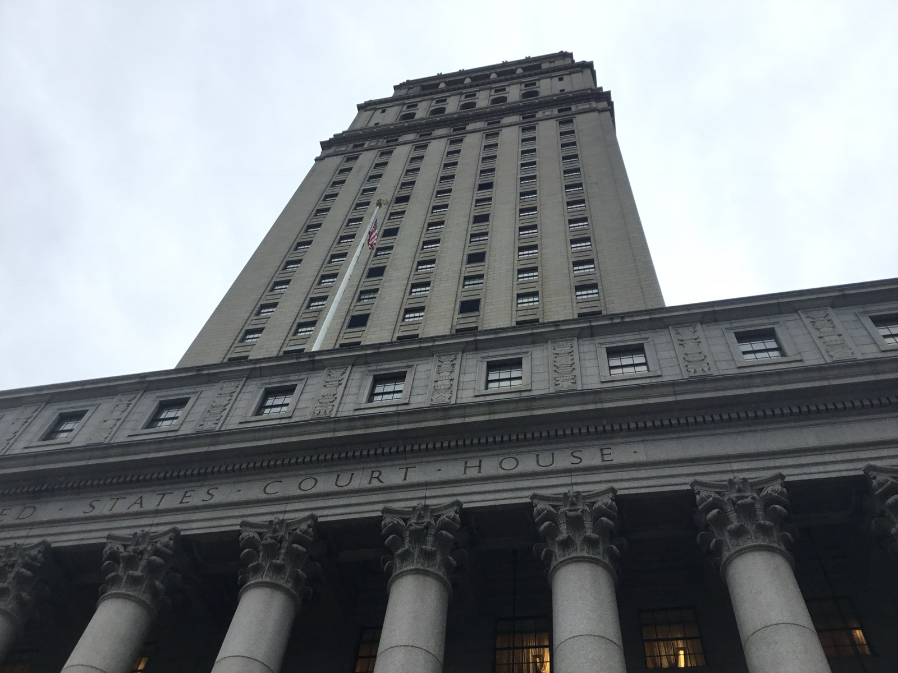

# 제미나이 학습을 가리려 지운 책의 저작권 정보

_하치엣·엘스비어 등 출판사들이 출처 삭제를 DMCA 위반으로 걸어 뉴욕남부지법에 제기한 소송_

## Executive Summary

> [!callout]
> AI 저작권 소송 뉴스는 이제 익숙합니다. 그런데 2026년 7월 출판사들이 구글을 상대로 낸 소송은 결이 조금 다릅니다. 원고들이 가장 강하게 내세운 청구가 "우리 책으로 제미나이를 무단 학습시켰다"가 아니라, "학습에 썼다는 사실을 감추려고 책의 저작권 정보를 지웠다"이기 때문입니다. 이 글은 쟁점이 무단 사용에서 출처 삭제로 옮겨간 이 소송을 데이터 계보의 문제로 읽습니다.

> 두 주장은 법적으로 별개의 청구입니다. 무단 사용은 "이 데이터를 이 목적으로 써도 되는가"를 묻고, 출처 삭제는 "썼다는 사실을 추적할 수 있는가"를 묻습니다. 그런데 이 구도는 처음이 아닙니다. 2025년 Kadrey v. Meta에서 거의 같은 출처 삭제 청구가 나왔지만, 법원은 "학습이 공정이용이라면 그 출처를 지운 것도 문제 삼을 수 없다"는 논리로 기각했습니다. 출처 삭제라는 청구의 운명이 공정이용 판단 하나에 통째로 매여 버린 셈입니다.

> 그러나 데이터를 다루는 쪽에서 보면 출처 삭제가 오히려 더 근본적인 문제입니다. 소송의 승패와 무관하게, 출처 표식이 사라진 학습 데이터는 그 자체로 감사할 수 없는 데이터가 되기 때문입니다. 이 글은 그 지점을 짚고, 학습 파이프라인이 판결을 기다리지 않고 지금 무엇을 보존해야 하는지를 묻습니다.

### 주요 수치

출처: [TechCrunch](https://techcrunch.com/2026/07/14/google-faces-another-ai-training-lawsuit-from-major-publishers/)

세 숫자가 이 소송의 무게와 방향을 압축합니다. 하나는 구글 스스로 계산했다는 위험의 크기, 하나는 원고가 침해의 증거로 든 장면, 그리고 하나는 이 소송이 하나가 아니라 둘로 갈라진다는 사실입니다.

<!-- stat-card -->
**$100억~1,000억** — 내부 문서가 경고한 벌금 — 저작권 책 학습이 "구글에 매우 문제적"이며 이 규모의 벌금을 부를 수 있다고 적었다는 주장

<!-- stat-card -->
**20분·$0.39** — 제미나이 소설 1편 — 100쪽 미스터리 소설을 이 시간·비용에 만들어 원작과 직접 경쟁한다는 소송의 상징적 사례

<!-- stat-card -->
**2건** — 하나의 소송, 별개의 청구 — 무단 학습 사용과 저작권 정보 삭제(DMCA §1202b)는 법적으로 서로 다른 위반이다

## 출판사들이 구글을 상대로 무엇을 주장했나

2026년 7월 10일, 출판사 하치엣 북 그룹·센게이지 러닝·엘스비어와 소설가 스콧 터로가 구글을 상대로 집단소송을 냈습니다. 눈에 띄는 것은 제기 장소입니다. AI에 우호적인 판결이 잇따랐던 캘리포니아 북부지법이 아니라, 뉴욕남부지법(SDNY)을 골랐습니다. 다른 판례 지형에서 다른 결론을 노린 관할 선택으로 읽힙니다.

*▲ 뉴욕남부지법(SDNY)이 있는 서고 마셜 연방법원, 맨해튼. 출판사들이 AI에 우호적인 캘리포니아 대신 이 법원을 택했다. | Source: [Wikimedia Commons](https://commons.wikimedia.org/wiki/File:Thurgood_Marshall_United_States_Courthouse_002.jpg) (CC BY-SA 4.0, Kidfly182)*

소장은 두 갈래로 주장을 폅니다. 첫째는 무단 학습입니다. 구글 북스·플레이 북스·스콜라에 검색과 스니펫 표시라는 제한된 목적으로만 제공된 책 전문을, 구글이 제미나이 학습에 그대로 끌어다 썼다고 원고는 말합니다. 둘째가 이 소송의 진짜 무게중심입니다. 구글이 책 제목과 저자명 같은 저작권 관리 정보(CMI)를 의도적으로 떼어내, 어떤 책이 학습에 들어갔는지 추적할 단서를 지웠다는 주장입니다. 원고는 이를 DMCA(디지털 밀레니엄 저작권법) §1202(b) 위반으로 걸었습니다.

소장은 구글 내부 문서도 끌어옵니다. 저작권 있는 책으로 AI를 학습시키는 일이 "구글에 매우 문제적"이며 100억에서 1,000억 달러에 이르는 벌금을 부를 수 있다고 스스로 경고했다는 대목입니다. 침해의 상징으로는 제미나이가 조용한 해안 마을을 배경으로 한 100쪽짜리 살인 미스터리를 20분, 0.39달러에 써낸다는 장면을 들었습니다. 사람이 쓴 원작을 고스란히 대체하는 생성물이라는 겁니다.

## 두 개의 다른 위반 — 쓴 것과 지운 것

하나의 소송처럼 보이지만, 법적으로는 성격이 다른 두 청구가 나란히 서 있습니다. 무단 사용은 허가 범위를 벗어났다는 주장입니다. 2015년 Authors Guild v. Google에서 항소법원은 구글 북스의 대량 스캔과 스니펫 검색을 공정이용으로 인정했습니다. 책을 검색 가능하게 만드는 변형적 목적이었고, 노출은 원문의 최대 16%가량 파편에 그쳤으며, 원작을 사려는 수요를 대체하지도 않았다는 이유였습니다. 그 인정에는 "검색이라는 제한된 목적"이라는 전제가 단단히 붙어 있었던 것입니다. 이번 소송의 논리는 여기서 출발합니다. 검색용으로 허락된 접근을 학습이라는 다른 목적으로 확장한 것은 애초 합의의 범위를 넘어섰다는 것입니다.

출처 삭제는 완전히 다른 층위를 겨눕니다. 데이터를 썼느냐가 아니라, 썼다는 흔적을 지웠느냐를 묻기 때문입니다. 책에서 제목과 저자명 같은 저작권 관리 정보를 떼어내면, 나중에 어떤 저작물이 학습 코퍼스에 들어갔는지 되짚을 단서가 사라집니다. DMCA는 이렇게 저작권 정보를 고의로 제거하는 행위 자체를 별도로 금지합니다. 데이터를 썼다는 사실과, 그 사실을 추적 불가능하게 만든 행위가 각각 다른 위반이 되는 구조입니다.

> [!callout]
> **핵심**: 이 소송에서 쟁점의 무게는 "무단으로 썼다"에서 "썼다는 흔적을 지웠다"로 옮겨갔습니다. 앞의 것은 사용 권한의 문제이고, 뒤의 것은 추적 가능성의 문제입니다.

## 이미 있었던 법리적 함정 — Kadrey v. Meta

출처 삭제 청구가 법정에 오른 것은 이번이 처음이 아닙니다. 2023년부터 이어진 Kadrey v. Meta에서 거의 같은 주장이 이미 한 차례 시험대에 올랐고, 그 결말이 이번 사건에 긴 그림자를 드리웁니다.

증거개시 과정에서 메타가 불법 복제 데이터셋 LibGen으로 라마(Llama)를 학습시키면서 저작권 정보를 의도적으로 제거했다는 사실이 드러났습니다. 2025년 3월, 법원은 이 삭제가 침해를 은폐하려는 의도로 볼 여지가 있다며 출처 삭제 청구를 각하 단계에서 통과시켰습니다. 여기까지는 원고에게 유리했습니다.

*▲ 메타 플랫폼스 본사, 캘리포니아 멘로파크. 라마 학습에 쓴 데이터의 저작권 정보 삭제 혐의로 Kadrey v. Meta의 피고가 됐다. | Source: [Wikimedia Commons](https://commons.wikimedia.org/wiki/File:Meta_Platforms_Headquarters_Menlo_Park_California.jpg) (CC0, LPS.1)*

반전은 2025년 6월 약식판결에서 왔습니다. 법원은 결국 이 청구를 기각했는데, 논리 구조가 문제의 핵심입니다. 학습 자체가 공정이용, 곧 침해가 아니라면 그 학습을 위해 저작권 정보를 지운 것도 "침해를 조장했다"고 볼 수 없다는 것입니다. 출처 삭제가 독립된 위반으로 서려면 그 삭제가 실제 침해를 도왔어야 하는데, 애초 행위가 침해가 아니니 삭제 청구도 성립하지 못한다는 판단이었습니다. 출처를 지운 행위의 옳고 그름을 따진 것이 아니라, 그 운명을 공정이용 판단에 통째로 매어 둔 셈입니다.

> [!callout]
> **함의**: SDNY가 캘리포니아 판례처럼 "제미나이 학습은 공정이용"이라고 본다면, Kadrey의 논리를 따라 출처 삭제 청구도 함께 무너질 수 있습니다. 반대로 학습이 허가 범위를 벗어났다고 본다면, 출처 삭제 청구가 독자적으로 살아남을 여지가 생깁니다. 이번 소송은 "출처 은폐"를 별도 위반으로 세울 수 있는지의 시험대입니다.

## 왜 출처 은폐가 더 다루기 어려운가

법은 이 사건을 두 층위로 나눠 보지만, 그중 하나를 다른 하나에 종속시키는 경향이 있습니다. 사용 권한이 있으면 출처를 지운 것도 문제 삼지 않는 Kadrey의 논리가 그렇습니다. 그런데 데이터를 관리하는 쪽에서 보면 순서가 뒤바뀝니다. 추적 가능성이 오히려 더 근본적인 조건이기 때문입니다.

출처 표식이 사라진 학습 데이터에서는 다음이 모두 불가능해집니다.

- 어떤 데이터로 학습했는지 사후에 감사하는 일
- 합법적으로 쓴 것과 몰래 쓴 것을 나중에 구별하는 일
- 문제가 생겼을 때 그 데이터의 출처와 라이선스를 되짚어 책임을 가리는 일

출처가 지워지면 "합법적으로 썼다"는 주장과 "몰래 썼다"는 주장을 사후에 가를 방법이 없어집니다. 감독과 규제가 딛고 설 지면 자체가 사라지는 것입니다. 무단 사용은 최소한 어떤 데이터가 문제인지 특정할 수 있어야 다툴 수 있지만, 출처 은폐는 그 특정 자체를 불가능하게 만들기 때문에 더 다루기 어렵습니다.

> [!callout]
> **한 줄 요약**: 소송의 승패와 무관하게, 출처를 지운 데이터는 그 자체로 감사할 수 없는 데이터가 됩니다. 법이 사용 권한만 보고 계보를 부차적으로 다루는 사이, 데이터의 신뢰성은 조용히 무너집니다.

## 학습 파이프라인이 지금 지켜야 할 것

이 사건이 데이터 실무자에게 주는 신호는 판결을 기다릴 필요가 없습니다. 학습 데이터셋을 조립하는 단계에서 각 데이터의 출처, 라이선스, 저작권 정보를 보존하는 계보 추적 체계가 없다면, 나중에 "이 데이터를 왜, 어떻게 썼는지"를 증명할 수도 반박할 수도 없는 상태에 놓입니다. 출처를 지운 채 학습한 모델은 저작권 소송의 승패를 떠나 감사 불가능한 자산이 됩니다.

*▲ AI 모델 학습 데이터를 저장하는 데이터센터 서버 랙. 출처·라이선스·저작권 정보를 조립 단계부터 보존하는 계보 추적 체계가 없으면 나중에 증명도 반박도 불가능해진다. | Source: [Wikimedia Commons](https://commons.wikimedia.org/wiki/File:BalticServers_data_center.jpg) (CC BY-SA 3.0, BalticServers.com)*

계보 관리를 저작권 리스크 대응으로만 볼 필요는 없습니다. 학습 데이터의 출처와 무결성을 추적하는 일은 모델의 신뢰성과 재현성을 위한 기본 전제이기도 합니다. 어떤 데이터가 들어갔는지 되짚을 수 있어야, 모델이 왜 그렇게 답하는지 설명하고 문제가 된 데이터를 골라낼 수 있습니다. 출처 표식은 규제 대응 서류가 아니라 데이터 품질의 일부입니다.

앞으로 지켜볼 지점은 두 가지입니다. 하나는 SDNY가 기각 심리와 증거개시를 거치며 캘리포니아 판례와 다른 결론에 이르는지, 다른 하나는 그 과정에서 출처 삭제 청구가 공정이용 판단과 분리돼 독자적으로 다뤄지는지입니다. 어느 쪽으로 흐르든, 학습에 쓴 데이터의 출처를 지금부터 기록해 두는 파이프라인은 소송 결과와 상관없이 손해 볼 일이 없습니다.

## 참고문헌

### 법원 판결 및 소송 해설

- 1.United States Court of Appeals for the Second Circuit. (2015). "[Authors Guild, Inc. v. Google, Inc.](https://law.justia.com/cases/federal/appellate-courts/ca2/13-4829/13-4829-2015-10-16.html)," 804 F.3d 202.
- 2.Loeb & Loeb LLP. (2025). "[Kadrey v. Meta Platforms, Inc.](https://www.loeb.com/en/insights/publications/2025/03/kadrey-v-meta-platforms-inc)" Loeb & Loeb Insights.

### 업계·보도

- 3.TechCrunch. (2026). "[Google faces another AI training lawsuit from major publishers](https://techcrunch.com/2026/07/14/google-faces-another-ai-training-lawsuit-from-major-publishers/)."
- 4.Norton Rose Fulbright. (2026). "[AI in litigation series: an update on AI copyright cases in 2026](https://www.nortonrosefulbright.com/en/knowledge/publications/ce8eaa5f/ai-in-litigation-series-an-update-on-ai-copyright-cases-in-2026)."
- 5.The Register. (2025). "[Meta may have illegally removed copyright info in AI corpus](https://www.theregister.com/2025/03/11/meta_dmca_copyright_removal_case/)."
- 6.Engadget. (2026). "[Three publishers challenge Google over AI copyright infringement](https://www.engadget.com/2215206/three-publishers-challenge-google-over-ai-copyright-infringement/)."
