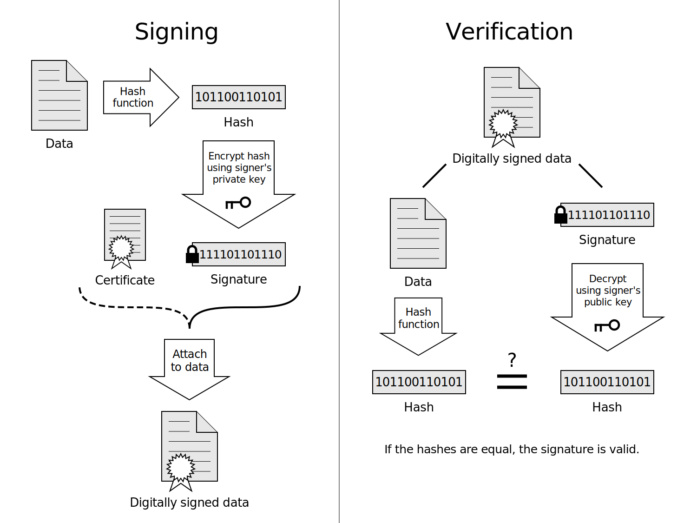

# Google AP2 — 에이전트 결제의 신뢰 문제를 푼다, 그리고 프로토콜 전쟁의 진실

_60개 파트너, 맨데이트 시스템, x402와의 협력 — 에이전트 결제 표준의 실체_

스테이블코인 시리즈 3편:
                        [① 스테이블코인 × 데이터 경제](/blog/stablecoin-data-ai-agent-economy-2026/ko/) ·
                        [② x402](/blog/x402-protocol-ai-payment-2026/ko/) · ③ AP2 (현재 글)

## Executive Summary

> [!callout]
> AI 에이전트가 결제를 하려면 두 가지가 필요하다. 하나는 실제로 돈을 보내는 방법, 다른 하나는 그 에이전트가 정말 사용자로부터 권한을 받았다는 증명이다. x402는 전자를 해결했다. Google이 2025년 9월 발표한 AP2(Agent Payments Protocol)는 후자를 해결한다.

> AP2는 암호학적으로 서명된 디지털 계약인 '맨데이트(Mandate)'를 통해 "이 에이전트가 이 금액을, 이 조건에서, 이 사용자를 대신해 쓸 수 있다"는 사실을 증명한다. American Express, Mastercard, PayPal, Coinbase, Etsy, Salesforce 등 60개 이상의 파트너가 참여한 오픈 표준이다.

<!-- stat-card -->
**60+** — 파트너 조직

<!-- stat-card -->
**2025.09** — Google 발표일

<!-- stat-card -->
**A2A+MCP** — 통합 프로토콜

<!-- stat-card -->
**x402** — 공동 확장 출시

> 언론은 이를 'AP2 vs x402 vs Visa TAP'의 프로토콜 전쟁으로 프레이밍한다. 그러나 실제로는 전쟁이 아니다. 이 세 표준은 서로 다른 레이어를 담당하는 보완적 스택이다. 그 구분이 무엇인지, 데이터 비즈니스에 무슨 의미인지를 이 글에서 정리한다.

## 왜 에이전트에겐 새 결제 레일이 필요한가

오늘날의 결제 인프라는 단순한 가정 위에 만들어졌다. 사람이 "구매" 버튼을 클릭한다. 브라우저가 카드 정보를 전송한다. 처리사가 승인한다. AI 에이전트는 이 흐름의 모든 가정을 깨뜨린다.

에이전트는 브라우저가 없다. 결제 폼을 채울 수 없고, 캡차를 풀 수 없고, "동의" 버튼을 클릭할 수 없다. 수십 개의 쇼핑몰을 초 단위로 비교하고, 조건을 협상하고, 사람의 개입 없이 구매를 실행해야 한다. 다른 에이전트에게 데이터나 컴퓨팅 자원을 사면서 시간당 수천 건, 건당 몇 센트 단위의 결제도 해야 한다.

*▲ Boston Dynamics Spot — 사람 없이 임무를 수행하는 자율 로봇처럼, AI 에이전트도 사람의 개입 없이 결제를 실행해야 한다 | Source: [Wikimedia Commons](https://commons.wikimedia.org/wiki/File:Spot_by_Boston_Dynamics.jpg) (CC BY-SA 4.0)*

그러나 단순히 돈을 보내는 것 이상의 문제가 있다. 기계가 사람을 대신해 돈을 쓸 때 상인은 어떻게 신뢰를 확인하는가? 세 가지 핵심 질문이 발생한다.

<!-- stat-card -->
**Authorization** — 에이전트가 이 특정 구매를 할 권한을 사용자로부터 실제로 받았는가

<!-- stat-card -->
**Authenticity** — 에이전트의 요청이 사용자의 실제 의도를 정확히 반영하는가

<!-- stat-card -->
**Accountability** — 잘못된 거래가 발생했을 때 책임 소재를 어떻게 판별하는가

x402는 결제 전송 자체를 해결한다. AP2는 이 세 가지 신뢰 문제를 해결한다.

## AP2의 핵심: 맨데이트(Mandate) 시스템

AP2의 기반은 맨데이트다. 암호학적으로 서명된 변조 불가능한 디지털 계약으로, 사용자가 에이전트에게 내린 지시를 검증 가능한 형태로 기록한다. 상인은 에이전트의 자기 주장을 믿는 대신, 이 맨데이트를 검증함으로써 거래의 정당성을 확인한다.

### 2.1 두 가지 맨데이트 유형

### 2.2 두 가지 쇼핑 모드

### 2.3 검증 가능한 자격증명(VC)의 역할

*▲ 디지털 서명의 원리 — AP2 맨데이트는 이와 같은 암호학적 서명으로 에이전트의 권한을 검증한다 | Source: [Wikimedia Commons](https://commons.wikimedia.org/wiki/File:Digital_Signature_diagram.svg) (CC BY-SA 3.0)*

### 2.4 A2A와 MCP 통합

## AP2 × x402 — 경쟁이 아닌 협력, A2A x402 확장

- • 사용자가 권한을 줬다는 암호학적 증명
- • 에이전트 신원 검증
- • 분쟁 시 감사 추적
- • 다양한 결제 방식 지원 (카드, 은행, 스테이블코인)

- • HTTP 레벨의 실제 결제 전송
- • 계정 없는 즉시 결제
- • 마이크로트랜잭션 효율성
- • 개발자 친화적 한 줄 구현

*▲ Coinbase — x402 공동 개발사, Google과 함께 A2A x402 확장을 출시해 AP2 생태계에서 스테이블코인 결제를 지원한다 | Source: [Wikimedia Commons](https://commons.wikimedia.org/wiki/File:Coinbase.svg)*

## '프로토콜 전쟁'의 진실 — 전쟁이 아니라 스택이다

### 4.1 네 가지 표준 비교

### 4.2 실제 구조: 레이어드 스택

## 한국 시장의 위치 — AP2가 가져오는 기회

### 5.1 카카오페이의 전략적 포지션

*▲ Linux Foundation — x402 프로토콜의 오픈소스 관리 기관. 카카오페이가 창립 멤버로 참여해 한국 기업 최초로 에이전트 결제 표준에 이름을 올렸다 | Source: [Wikimedia Commons](https://commons.wikimedia.org/wiki/File:Linux_Foundation_logo_2013.svg)*

### 5.2 B2B 에이전트 커머스의 기회

- •한국 SaaS·데이터 API 기업이 AP2 호환 엔드포인트를 추가하면 글로벌 AI 에이전트의 자동 구매 대상이 됨
- •Google Cloud Marketplace에서 AP2를 통한 에이전트 자동 소프트웨어 라이선스 구매가 가능해짐
- •디지털자산기본법 완성 후 원화 스테이블코인이 x402 퍼실리테이터로 통합되면 AP2 생태계 직접 참여 가능

## DataClinic이 AP2 경제에서 맡을 자리

### 6.1 위임 구매 시나리오

### 6.2 에이전트 마켓플레이스 등록

### 6.3 완전한 스택 시나리오
