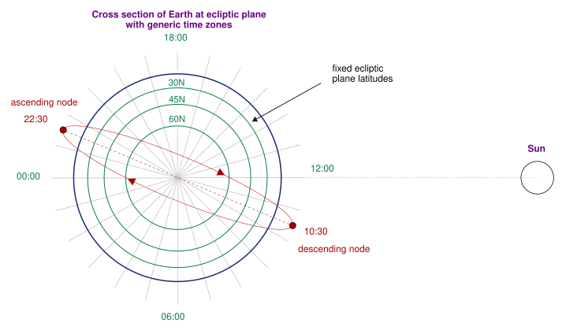

# Why Do AI Chips in Orbit Keep Shutting Down?

_Google is putting a refrigerator-sized satellite carrying four AI chips into low Earth orbit on a SpaceX rocket, and will spend a year measuring how well those chips hold up_

## Executive Summary

> [!callout]
> Google is putting one satellite carrying its own AI accelerators into low Earth orbit on October 1, aboard SpaceX's Transporter-18 rideshare. The craft is about the size of a refrigerator, four TPUs sit inside it, and the solar panels put out about a kilowatt. One data center server lifted whole into the sky is close enough as a picture. This article looks at what that satellite does in orbit and what it sends back down.

> The purpose Google wrote into its own post is not compute. The satellite is going up to gather orbital data on how its own TPUs stand up to the physical stress of spaceflight and to the radiation and temperature extremes of space. In practice the chips aboard run for about 15 minutes at a stretch and then shut down to cool. Where there is no air and heat can leave only by radiation, that is as far as the radiators carry it.

> Sections 1 through 4 follow what Google and the reporting have set out. The question in section 5 is one this article raises. When the physical place a computation sits changes, what changes about the conditions on the data that feeds it?

### Key Numbers

Sources: Google, [Project Suncatcher: the facts](https://blog.google/innovation-and-ai/models-and-research/google-research/google-project-suncatcher-facts/) (2026-09-24) · Duncan Riley, [SiliconANGLE](https://siliconangle.com/2026/09/24/googles-first-project-suncatcher-ai-satellite-set-to-blast-off-into-orbit-next-week/) (2026-09-24).

<!-- stat-card -->
**Four** — TPUs aboard the satellite — Google's own post gives no count. The number comes from the reporting, and it amounts to roughly one data center server's worth of compute

<!-- stat-card -->
**About 1 kW** — What the solar panels put out — Enough to run a microwave. It marks the size of this prototype rather than any advantage of generating power in orbit

<!-- stat-card -->
**15 minutes** — How long the chips run at a stretch — After that they switch off and dump heat. The cooling time has not been published

<!-- stat-card -->
**Eight times** — The upside of solar power in orbit — Measured against the same panel on the ground at mid-latitude across a year. It is energy generated, not hours of operation

## A Refrigerator-Sized Satellite With One Server Inside

The post Google published on September 24 says a short thing. The first prototype satellite of Project Suncatcher goes up next week. The vehicle is a Falcon 9, and it leaves Vandenberg tucked into SpaceX's Transporter-18 rideshare, the kind of flight that carries small satellites for many customers at once. The target is a dawn-dusk sun-synchronous orbit. That orbit follows the line between day and night around the Earth, so from the satellite's point of view the sun barely sets.

*▲ A Falcon 9 lifting off from Vandenberg (2019 Iridium-8 mission, illustrative photo) | Source: [U.S. Air Force / Wikimedia Commons](https://commons.wikimedia.org/wiki/File:SpaceX_Flacon_9_Iridium-8_Launches_from_Vandenberg_(5024378).jpg)*

It helps to keep apart what Google stated itself and what the reporting filled in. The official post records that the mission was developed in partnership with Planet, and that "future designs of our satellites will each carry dozens of TPU chips while orbiting the Earth in clusters." The name of the satellite is not in that post, and neither is the number of chips flying this time. That the craft is about the size of a refrigerator, holds four TPUs and is called MVP came from reporting in the days before launch. Those four are described as roughly one data center server's worth of compute.

The power matches that size. The solar panels put out a little over a kilowatt. Set against the terrestrial AI data centers now discussed in gigawatts, that is a millionth of the scale. Plenty of headlines have announced a data center in space. What goes up this time is not a data center. It is one server.

Even so, this one server has something unusual about it. The chips aboard were not built specially for space. Semiconductors flown on satellites are normally designed differently from the ground up to tolerate radiation, and they pay for that by running several generations behind their terrestrial counterparts. The chips going up here are the same Trillium TPUs that Google Cloud customers use. Checking whether a part sold for ground data centers can be put into orbit as it is: the character of this mission lies closer to that.

> [!callout]
> Google states the purpose of the mission in one sentence. The satellite is "designed to gather in-orbit data on how our TPUs handle the physical stress of spaceflight and the radiation and thermal extremes of space." The same post also says that "this first launch is about seeing what works, identifying points of failure, and applying those findings to future missions." Nowhere in it is there a promise to prove compute performance.

On the schedule alone, Google is in a hurry. When Project Suncatcher was made public in November 2025, the next step named was a pair of prototype satellites to be launched with Planet, and that pair still sits on the calendar for 2027. The single craft leaving now is what came of not waiting for the pair and putting chips on a satellite that already existed.

## Does Eight Times the Sunlight Mean Eight Times the Compute?

Google does not hide why this project started. Electricity. The sentence in the official post reads: "In low Earth orbit, satellites can access near-constant sunlight, generating up to eight times more solar power than on Earth."

Harvesting sunlight in orbit is not a new idea. The paper Google's researchers published in November 2025 traces the lineage back to a 1941 Isaac Asimov short story and cites the technical proposals that followed it. That lineage always stalled in the same place: getting the power generated up there back down to Earth. Google turned that around. Instead of sending the power down, send the computation up. Putting a data center in space came out of stepping around the problem that space-based solar power never solved.

The same paper sets out where the figure comes from. At 650 kilometers in a dawn-dusk sun-synchronous orbit, almost nothing of the sunlight is eaten by the atmosphere, and the orbit also escapes the day-and-night cycle below. Those two conditions are why a panel of the same area takes in far more energy up there than it would on the ground. The paper measures against a panel on Earth at mid-latitude, and the quantity compared is the total solar energy received over a year. A bonus comes attached. With no sunset there is no need to carry heavy batteries through the night. In space, where everything is bought by launch mass, shedding batteries is no small matter.

It still pays to read exactly what the number points at. Eight times is a quantity of electricity that can be made per unit of area. It is not a figure for how many hours that electricity can keep a chip running. Making a lot of power and spending all of it on computation are different problems, and what stands between them is heat.

Orbit does not hand out the power for free either. A ground plant pays in land and a grid connection; an orbital one pays in launch mass. Adding a square meter of solar panel means lifting a square meter on a rocket, and that mass is the base of the per-kilogram arithmetic further down. It is also why shedding batteries counts for so much. In orbit, mass is another name for cost.

*▲ General sun-synchronous orbit diagram — the example shown crosses at 10:30/22:30 local time, a different node time than the dawn-dusk (06:00/18:00) orbit Google's satellite uses | Source: [Menozzil14, Wikimedia Commons (CC BY-SA 4.0)](https://commons.wikimedia.org/wiki/File:Sun-Synchronous_Orbit_with_LST_Zones.svg)*

## More Time Cooling Than Computing

Travis Beals, senior director of Google's Paradigms of Intelligence research team, has described how this satellite will be operated, and the whole character of the mission is in that description. The chips will be able to run workloads only in short bursts of about 15 minutes, he said, before they have to be shut down to cool off. Inside those 15 minutes, he told the New York Times, the satellite can take a short query and have Gemini come back with an answer.

The thought that cooling must be easy because space is cold runs backwards. A vacuum has no air to carry heat away. Fans have nothing to push and coolant loops have nowhere to reject into, which leaves radiation. Heat out of the chip travels through thermal interface material and metal to a radiator panel, and that panel sheds it slowly into space as infrared. By Google's account this is done with a combination of heat pipes and radiators, an arrangement it has already run in a thermal vacuum chamber. Against a terrestrial data center that works twenty-four hours a day, a quarter of an hour lays out the distance between the two.
