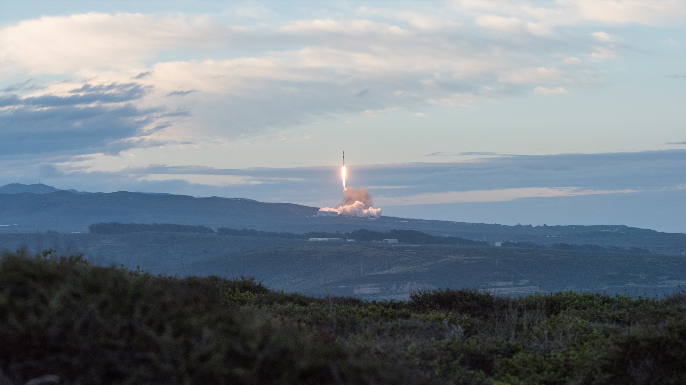

# 우주로 간 AI 칩은 왜 자꾸 멈춰 설까?

_구글이 AI 칩 네 개 실은 냉장고 크기 위성을 스페이스X 로켓으로 띄워, 궤도에서 칩이 얼마나 버티는지 1년간 측정한다_

## Executive Summary

> [!callout]
> 구글이 자사 AI 가속기를 실은 위성 한 기를 10월 1일 스페이스X 트랜스포터-18 편으로 저궤도에 올린다. 냉장고만 한 크기에 TPU 네 개가 들어갔고, 태양전지가 내는 전력은 약 1킬로와트다. 데이터센터 서버 한 대가 통째로 하늘에 올라간다고 보면 얼추 맞는다. 이 글은 그 위성이 궤도에서 무엇을 하고 무엇을 지구로 내려보내는지를 본다.

> 구글이 공식 글에 적어 둔 목적은 연산이 아니다. 이 위성은 자사 TPU가 우주 비행의 물리적 스트레스와 방사선·열 극한을 "어떻게 견디는지에 대한 궤도 데이터"를 모으려고 올라간다. 실제로 이 위성의 칩은 한 번에 15분가량 돌고 나면 식히려고 멈춘다. 공기가 없어 열을 복사로만 버려야 하는 곳에서 라디에이터가 감당하는 몫이 거기까지다.

> 1절부터 4절까지는 구글과 보도가 밝힌 내용을 따라간다. 5절의 물음은 이 글이 세운 것이다. 계산이 놓이는 물리적 자리가 바뀌면, 그 계산에 들어가는 데이터의 조건은 무엇이 달라지는가.

### 주요 수치

출처: Google, [Project Suncatcher: the facts](https://blog.google/innovation-and-ai/models-and-research/google-research/google-project-suncatcher-facts/) (2026-09-24) · Duncan Riley, [SiliconANGLE](https://siliconangle.com/2026/09/24/googles-first-project-suncatcher-ai-satellite-set-to-blast-off-into-orbit-next-week/) (2026-09-24).

<!-- stat-card -->
**4개** — 위성에 실린 TPU — 구글 공식 글은 대수를 적지 않았다. 보도가 밝힌 수이고, 데이터센터 서버 한 대 정도의 연산력이다

<!-- stat-card -->
**약 1kW** — 태양전지가 내는 전력 — 전자레인지 하나를 켤 만한 양이다. 궤도 발전의 이점을 나타내는 값이 아니라 이 프로토타입의 크기다

<!-- stat-card -->
**15분** — 한 번에 돌릴 수 있는 시간 — 그 뒤에는 칩을 끄고 열을 버린다. 냉각에 걸리는 시간은 공개되지 않았다

<!-- stat-card -->
**8배** — 궤도 태양광의 잠재력 — 중위도 지상에 둔 같은 패널이 1년간 받는 양과 견준 값이다. 발전량이지 가동 시간이 아니다

## 냉장고만 한 위성에 서버 한 대

9월 24일 구글이 낸 글의 요지는 짧다. 프로젝트 선캐처의 첫 시제 위성이 다음 주에 올라간다. 발사체는 팰컨 9이고, 여러 고객의 소형 위성을 한꺼번에 태우는 스페이스X 트랜스포터-18 공동 탑승 임무에 끼어 반덴버그에서 떠난다. 목표 궤도는 새벽-황혼 태양동기궤도다. 지구의 낮과 밤 경계선을 따라 도는 궤도라, 위성 입장에서는 해가 거의 지지 않는다.

*▲ 반덴버그에서 이륙하는 팰컨 9 (2019년 이리듐-8 임무, 예시 사진) | Source: [U.S. Air Force / Wikimedia Commons](https://commons.wikimedia.org/wiki/File:SpaceX_Flacon_9_Iridium-8_Launches_from_Vandenberg_(5024378).jpg)*

구글이 직접 밝힌 것과 보도가 채운 것을 갈라 두는 편이 좋겠다. 공식 글이 적은 것은 이 임무를 플래닛과 함께 개발했다는 사실, 그리고 앞으로 만들 위성은 "각각 수십 개의 TPU 칩을 실을 것"이라는 계획이다. 위성의 이름도, 이번에 실린 칩의 개수도 그 글에는 없다. 냉장고만 한 크기에 TPU 네 개가 들어갔고 MVP라는 이름이 붙었다는 것은 발사를 앞두고 나온 보도가 전한 내용이다. 그 네 개가 내는 연산력은 데이터센터 서버 한 대 수준으로 전해졌다.

전력도 그 크기에 맞는다. 태양전지가 내는 것은 1킬로와트 남짓이다. 기가와트 단위로 이야기되는 지상 AI 데이터센터의 백만분의 일 규모다. 우주에 데이터센터가 생겼다는 식의 제목이 여럿 붙었지만, 이번에 올라가는 것은 데이터센터가 아니라 서버 한 대다.

그래도 이 위성이 남다른 구석은 있다. 실린 칩이 우주용으로 따로 만든 물건이 아니라는 점이다. 위성에 쓰이는 반도체는 보통 방사선을 견디도록 설계 단계부터 달리 만들고, 그만큼 성능은 지상용보다 여러 세대 뒤처진다. 이번에 올라가는 것은 구글 클라우드 고객이 쓰는 그 트릴리움 TPU다. 지상 데이터센터에서 파는 물건을 그대로 궤도에 올려도 되는지를 확인하는 일, 이번 임무의 성격은 그쪽에 가깝다.

> [!callout]
> 구글이 이 임무의 목적을 적은 문장은 이렇다. "우리 TPU가 우주 비행의 물리적 스트레스와 우주의 방사선·열 극한을 어떻게 견디는지에 대한 궤도 데이터를 모으도록 설계됐다." 같은 글은 "이번 첫 발사는 무엇이 작동하는지 확인하고, 고장 지점을 찾아내고, 그 결과를 다음 임무에 적용하는 일"이라고도 적는다. 연산 성능을 증명하겠다는 말은 어디에도 없다.

일정만 보면 구글은 서두르고 있다. 2025년 11월에 프로젝트 선캐처를 공개할 때 밝힌 다음 걸음은 시제 위성 두 기를 플래닛과 함께 올린다는 것이었고, 그 두 기는 지금도 2027년 계획으로 남아 있다. 이번에 떠나는 한 기는 그 두 기를 기다리는 대신 이미 만들어져 있던 위성에 칩을 얹어 먼저 보내는 쪽을 택한 결과다.

## 햇빛이 여덟 배면 계산도 여덟 배가 되나

이 프로젝트가 왜 시작됐는지는 구글이 감추지 않는다. 전기다. 공식 글의 문장은 이렇다. "저궤도에서 위성은 거의 끊기지 않는 햇빛을 받을 수 있어, 지구에서보다 최대 여덟 배 많은 태양광 발전이 가능하다."

궤도에서 햇빛을 거두자는 발상 자체는 새것이 아니다. 구글 연구팀이 2025년 11월에 낸 논문은 그 계보를 1941년 아이작 아시모프의 단편까지 거슬러 적어 두고, 뒤이어 나온 기술 구상들도 함께 인용한다. 그런데 이 계보는 늘 같은 자리에서 막혔다. 궤도에서 만든 전기를 지구로 내려보내는 일이다. 구글은 그 지점에서 방향을 뒤집었다. 전기를 내리는 대신 계산을 올린다. 우주에 데이터센터를 두자는 구상은 우주 태양광 발전이 풀지 못한 문제를 비켜 가는 쪽에서 나왔다.

여덟 배가 어디서 나오는지도 같은 논문이 설명해 둔다. 고도 650킬로미터의 새벽-황혼 태양동기궤도에서는 대기가 햇빛을 깎아 먹는 몫이 거의 없고, 지상의 낮과 밤 주기에서도 벗어난다. 같은 면적의 태양전지가 지상보다 훨씬 많은 에너지를 받는다는 계산이 그 두 조건에서 나온다. 논문이 고른 상대는 중위도 지상에 놓인 같은 패널이고, 기준은 1년 동안 받는 태양 에너지의 총량이다. 덤도 하나 붙는다. 해가 지지 않으니 밤을 버틸 무거운 배터리를 싣지 않아도 된다. 발사 중량으로 사는 우주에서 배터리를 던다는 것은 작은 이야기가 아니다.

다만 이 수치가 무엇을 가리키는 값인지는 정확히 읽어야 한다. 여덟 배는 단위면적당 만들 수 있는 전기의 양이다. 그 전기로 칩을 몇 시간 돌릴 수 있는지에 대한 값이 아니다. 전기를 많이 만드는 일과 그 전기를 계산에 다 쓰는 일은 다른 문제이고, 둘 사이를 가로막고 선 것이 열이다.

궤도가 전기를 거저 주는 것도 아니다. 지상 발전소는 땅값과 전력망 접속을 치르고, 궤도 발전소는 발사 중량을 치른다. 태양전지를 1제곱미터 늘리려면 그만큼을 로켓에 실어 올려야 하고, 그 무게가 곧 뒤에 나올 킬로그램당 발사비 계산의 밑변이다. 배터리를 덜어 내는 이점이 큰 이유도 여기에 있다. 궤도에서는 무게가 비용의 다른 이름이다.

*▲ 태양동기궤도 일반 개념도 — 예시 궤도는 10:30/22:30 통과궤도이고, 구글 위성이 쓰는 새벽-황혼(06:00/18:00) 궤도와는 통과 시각이 다르다 | Source: [Menozzil14, Wikimedia Commons (CC BY-SA 4.0)](https://commons.wikimedia.org/wiki/File:Sun-Synchronous_Orbit_with_LST_Zones.svg)*

## 돌리는 시간보다 식히는 시간

구글 패러다임스 오브 인텔리전스 연구팀 선임 디렉터 트래비스 빌스가 설명한 운용 방식에 이 임무의 성격이 다 들어 있다. 칩은 "약 15분의 짧은 구간 동안만 작업을 돌릴 수 있고, 그 뒤에는 식히기 위해 꺼져야 한다". 뉴욕타임스에 그가 밝힌 바로는 그 15분 안에 짧은 질의 정도를 처리해 제미나이가 답을 내놓게 할 수 있다.

우주가 차가우니 냉각이 쉬울 것이라는 생각은 거꾸로다. 진공에는 열을 실어 나를 공기가 없다. 선풍기도 냉각수 배관도 할 일이 없고, 남는 방법은 복사뿐이다. 칩에서 나온 열을 열전도 물질과 금속을 거쳐 라디에이터 판까지 옮긴 다음, 그 판이 우주 공간으로 적외선을 내보내며 천천히 버린다. 구글의 설명으로는 히트파이프와 라디에이터를 조합해 이 일을 하고, 열진공 챔버에서 미리 돌려 봤다. 지상의 데이터센터는 하루 스물네 시간 돈다. 15분은 그 사이에 놓인 거리를 그대로 보여 준다.
