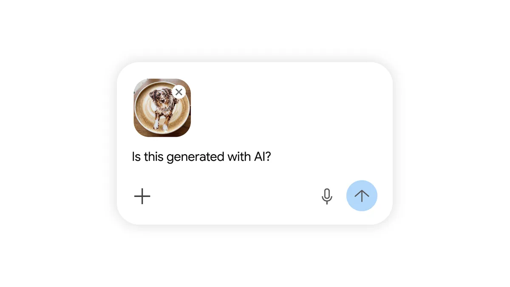

# 구글, AI 워터마크를 눈에서 파일 속으로 내렸다

_시각 표시를 끄는 토글과 함께 C2PA 검증 라이브러리 Credentio가 같은 날 공개됐다_

## Executive Summary

> [!callout]
> 구글이 2026년 8월 14일 제미나이로 만든 이미지와 영상, 음악에서 모서리에 붙던 반짝이 아이콘을 끌 수 있게 했습니다. 설정에 들어가 미디어 워터마크 항목을 내리면 그 뒤로 만드는 결과물에는 눈에 보이는 AI 표시가 남지 않습니다. 설정은 며칠에 걸쳐 배포되고, 한국에서는 유료 구독자만 이 항목을 볼 수 있습니다.

> 없어진 것은 표시가 아니라 표시를 읽는 방법입니다. 픽셀에 새겨지는 SynthID와 파일 메타데이터에 담기는 C2PA 콘텐츠 자격증명은 토글과 무관하게 계속 들어갑니다. 두 층은 눈으로 볼 수 없고 디코더나 파서를 거쳐야 읽힙니다. 같은 날 구글이 C2PA 검증용 오픈소스 라이브러리 Credentio를 공개한 것이 이 변화의 다른 쪽 면입니다.

> 확인할 수는 있습니다. 다만 그 확인은 읽을 도구를 가진 사람의 몫이 됩니다. 데이터 계보를 다뤄 온 쪽에는 익숙한 구조입니다. 메타데이터에 적힌 이력은 그것을 읽는 파이프라인이 있을 때에만 존재합니다.

### 주요 수치

보이지 않는 층은 이미 넓게 깔렸고, 그것을 읽는 쪽 사정은 이제 막 갖춰지는 중입니다.

출처: [구글 블로그](https://blog.google/innovation-and-ai/products/identifying-ai-generated-media-online/), [구글 개발자 블로그](https://developers.googleblog.com/introducing-credentio-open-source-c-library-for-c2pa-content-credentials-from-google/), [디지털트렌즈](https://www.digitaltrends.com/computing/googles-gemini-app-adds-a-toggle-to-disable-ai-watermarks-with-some-exceptions/)

<!-- stat-card -->
**1,000억+** — SynthID가 새겨진 이미지와 영상 — 2023년 도입 이후 누적, 오디오는 6만 년 분량이라고 구글이 5월에 밝혔습니다

<!-- stat-card -->
**5,000만 회** — 제미나이 앱의 AI 생성 확인 사용 — 이 기능을 쓰려면 파일을 앱에 올려 물어보는 행동이 먼저 필요합니다

<!-- stat-card -->
**0개** — Credentio의 생성 기능 — 지금은 검증만 합니다. 자격증명을 만들어 파일에 심는 기능은 로드맵에 있습니다

<!-- stat-card -->
**3개국** — 유료 구독자만 토글을 쓰는 나라 — 한국과 인도, 베트남입니다. 무료 사용자에게는 시각 표시가 그대로 남습니다

## 구글이 끈 것과 남긴 것

발표는 8월 14일 금요일에 나왔습니다. 제미나이 담당 부사장 조시 우드워드가 X에 올린 글에 따르면 토글은 이미지 모델 나노 바나나, 영상 모델 옴니, 음악 모델 리리아에 적용됩니다. 설정을 켜고 끄는 자리는 제미나이 앱과 영상 편집 도구 플로우이고, 검색에서도 곧 쓸 수 있게 할 예정입니다. 며칠에 걸쳐 배포되며, 사용자는 설정에서 미디어 워터마크 항목을 찾아 표시를 켜거나 끄면 됩니다. 선택한 값은 그 뒤에 만드는 이미지와 영상, 음악에 그대로 적용됩니다.

구글이 내세운 명분은 균형입니다. 우드워드는 창의적 통제와 안전 사이에서 균형을 잡는 결정이라고 적었습니다. 시각 워터마크는 이제 선택이지만 비가시 SynthID와 C2PA 메타데이터는 투명성을 위해 계속 들어가므로 제미나이나 검색으로 AI 생성 여부를 여전히 확인할 수 있다는 말도 덧붙였습니다. 이 문장에 이번 변경의 전제가 다 들어 있습니다. 확인이 불가능해진 것은 아니고, 확인하는 방법이 달라졌을 뿐이라는 것입니다.

법이 요구한 것이 무엇이었는지를 보면 이 재량의 크기가 잡힙니다. EU AI Act 제50조는 8월 2일부터 생성형 AI 사업자에게 기계가 읽을 수 있는 형태의 AI 생성 표시를 요구합니다. 사람 눈에 보이는 아이콘을 얹으라는 조항이 아닙니다. 모서리의 반짝이 아이콘은 그 요구를 넘어 구글이 스스로 붙인 상품 선택이었고, 그래서 떼는 일도 구글의 재량 안에 있었습니다. 시각 표시를 따로 의무화한 나라만 예외입니다.

요청은 사용자 쪽에서 먼저 왔습니다. 몇 달 전 우드워드는 제미나이에서 가장 불편한 점이 무엇인지 물은 적이 있습니다. 그때 나노 바나나의 시각 워터마크를 없애 달라는 요구가 상위 열 개 안에 들었다고 기즈모도가 안드로이드 어소리티를 인용해 전했습니다. 이미지 생성 도구를 쓰는 쪽에서 가장 걸리는 것이 AI를 썼다는 눈에 보이는 흔적이었다는 뜻입니다.

비판은 그 지점에서 나옵니다. 엔가젯은 시각 워터마크가 존재한 이유 자체가 사람들에게 AI 콘텐츠를 빠르게 알아볼 방법을 주기 위해서였는데 이번 결정이 그 목적을 스스로 약하게 만든다고 지적했습니다. 남은 두 층으로도 확인은 되지만, 챗봇에 물어보거나 검증 포털에 파일을 올리는 행동이 먼저 필요합니다. 표시를 보는 일과 표시를 조회하는 일 사이에는 그만큼의 문턱이 있습니다.

*▲ 시각 표시가 사라진 뒤 확인은 파일을 올리고 물어보는 절차가 된다 | Source: [Google Blog](https://blog.google/innovation-and-ai/products/identifying-ai-generated-media-online/)*

## 픽셀에 새긴 신호는 남고 메타데이터는 벗겨진다

남은 두 층은 성격이 다릅니다. SynthID는 3년 전 구글이 내놓은 워터마킹 기술로, 사람이 알아챌 수 없는 신호를 이미지와 영상의 픽셀, 오디오의 파형에 직접 심습니다. 구글은 지난 5월 이 기술이 이미지와 영상 1,000억 개 이상, 오디오 6만 년 분량에 들어갔다고 밝혔습니다. C2PA 콘텐츠 자격증명은 다른 방식입니다. 무엇으로 언제 만들었고 이후 어떻게 편집했는지를 서명된 기록으로 만들어 파일 메타데이터에 붙입니다. 앞쪽은 콘텐츠 자체에 새기는 신호이고, 뒤쪽은 파일에 동봉하는 이력서입니다.

견고성도 다릅니다. 기즈모도는 시각 워터마크를 지우는 데는 잘라 내거나 가리는 정도의 수고면 충분하고, 메타데이터인 C2PA도 지우기 쉬운 데다 대부분의 소셜 미디어가 업로드 과정에서 메타데이터의 일부 또는 전부를 벗겨 낸다고 적었습니다. 허위 정보를 퍼뜨리려는 쪽이 따로 손을 쓸 필요도 없다는 뜻입니다. SynthID는 상대적으로 질깁니다. 픽셀에 인코딩되기 때문에 자르고 크기를 줄이고 화질을 떨어뜨려도 남도록 설계됐고, 아스 테크니카의 실험에서도 그런 처리를 거듭하면 탐지가 어려워지기는 하지만 그쯤이면 이미지가 이미 쓸모없이 뭉개진 뒤였습니다. 다만 이 기술이 적대적 공격까지 견디도록 설계된 것은 아니고, 우회를 표방하는 상용 서비스와 공개 도구가 이미 나와 있다고 같은 기사가 전했습니다.

세 층을 나란히 놓으면 이번 변경이 무엇을 옮겼는지가 분명해집니다. 사라진 것은 가장 약하지만 가장 넓게 읽히던 층입니다.
