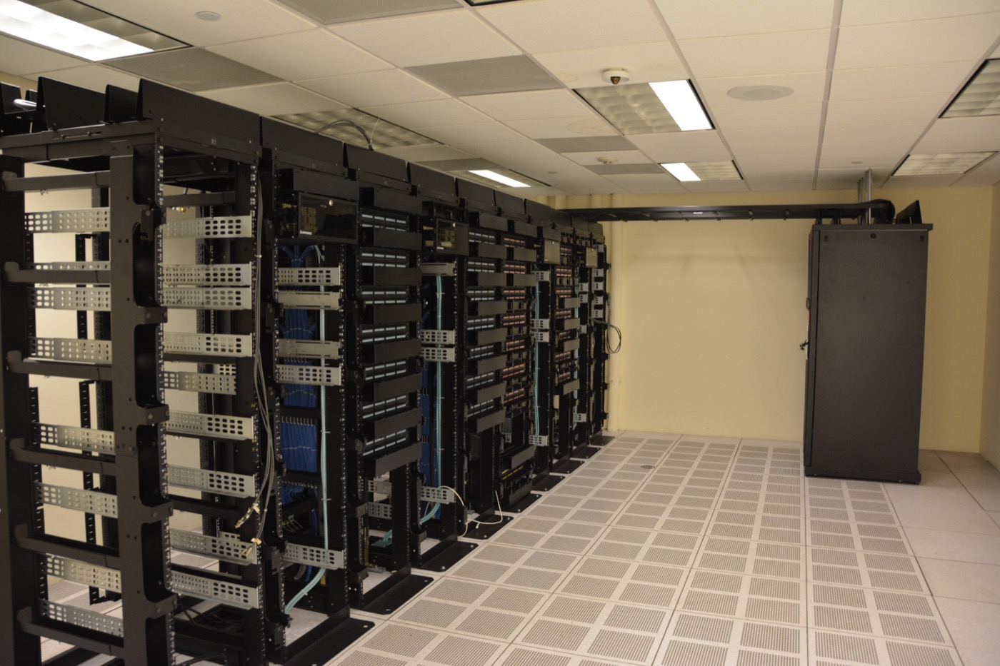

# Grounding Data Creates New Copyright Liability With Every Query

_The AI that answers by searching in real time takes on fresh copyright and operational risk at each response_

## Executive Summary

> [!callout]
> AI copyright has long been treated as a question of "what was it trained on." Yet most AI services today do not answer from learned knowledge alone. Every time a question arrives, they search external documents in real time and weave that content into the answer. It is in this real-time retrieval layer of retrieval-augmented generation (RAG), the grounding data, that the center of gravity for copyright liability is now growing. This article looks at why the legal risk of training data and grounding data is structurally different.

> The difference lies in when the risk occurs. Training data's copyright risk arises once, during development, and then hardens inside the model weights. Grounding data pulls the source back in each time a query comes in, so the moment a retrieved passage is reproduced in the answer, copyright risk is created anew with every response. And one more thing compounds it. A trained model keeps working even if access to the source is cut, but a grounding system cannot produce an answer the instant access is lost.

> Training-data litigation is taking shape through the Thomson Reuters and Anthropic rulings, while the copyright liability of grounding data still has almost no doctrine of its own. This article names that gap and asks what AI-ready data governance now has to track.

### Key Figures

Sources: [Sidley Austin](https://www.sidley.com/en/insights/newsupdates/2026/07/legal-implications-in-ai-development-and-deployment-training-data-and-grounding-data), [AIVortex](https://www.aivortex.io/legal/guides/ai-copyright-training-data-2026-landscape/)

Three numbers compress the asymmetry this article is about. On the training-data side there are already settlements in the billions and a first final ruling, while there is effectively no settled case law that squarely addresses grounding data. In between, grounding data's copyright risk keeps regenerating query by query, long after deployment is done.

<!-- stat-card -->
**$1.5B** — Training-data settlement — The Bartz v. Anthropic settlement. The training-data axis already carries a price tag

<!-- stat-card -->
**0** — Settled grounding-specific rulings — No ruling has yet squarely settled the copyright liability of grounding data

<!-- stat-card -->
**Per query** — Risk regeneration cycle — Training risk arises once at development; grounding risk arises anew with every response

## Case Law Piles Up for Training Data; Retrieval Data Has No Name Yet

The copyright liability of training data has gained shape fast in the courts over the past two years. **Thomson Reuters v. ROSS Intelligence** was recorded, in February 2025, as the first final ruling to come out of a copyright dispute over AI training. The court found that infringement can be established even when the source is not reproduced verbatim in the output, rejected the fair-use defense, and set "does the AI output compete with the market for the original" as the central yardstick. **Bartz v. Anthropic** followed, drawing a line between lawfully purchased books and pirated copies, leading to a settlement of roughly $1.5 billion, and cases such as NYT v. OpenAI and Getty Images v. Stability AI remain pending in a line.

The problem is that today's AI does not operate the way those precedents assume. Ask a chatbot something, and the model does not merely pull out learned knowledge — it searches external documents and the web in that moment to build the answer. This is retrieval-augmented generation, or grounding. The law firm Sidley Austin points out that this real-time retrieval layer carries legal risk entirely different from that of training data. Yet there is no case law that squarely addresses this risk. While precedent and damages pile up around training data, the retrieval layer handling millions of queries a day has not even been given a name tag yet.

*▲ The Lady Justice statue atop the Old Bailey (Central Criminal Court) in London — training-data copyright case law accumulates in courts like this, but grounding data has yet to become their subject | Source: [Wikimedia Commons (Erasoft24, CC BY 2.5)](https://commons.wikimedia.org/wiki/File:Statue_of_Justice,_Central_Criminal_Court,_London,_UK_-_20030311.jpg)*

> [!callout]
> **The point**: Training-data copyright has entered a mature phase where case law is accumulating, but the liability of grounding data, which builds answers through real-time retrieval, is still an empty zone with no doctrine of its own.

## Training Happens Once; Grounding Happens Every Time

Sidley Austin likens the two kinds of data to a student facing an exam. Training data is the textbook the student studied. It is not carried into the exam room, but what was studied is already in the mind, shaping how the student thinks. Grounding data is the factual reference material the student opens on the spot in the exam room. It is reached for and consulted with each problem, and without it, that problem cannot be solved.

*▲ A student writing an exam — training data is study finished before the exam; grounding data is reference material reopened with every question | Source: [Wikimedia Commons (Alison Wood, CC BY 3.0)](https://commons.wikimedia.org/wiki/File:Hand-writing-exam-classroom.jpg)*

This analogy separates when the copyright risk occurs. Training data melts statistically into the model weights once training ends. After that there is no need to access the source again, and the copyright risk hardens after arising once, at development time. Grounding data moves in exactly the opposite way. Each time a single query comes in, the source document is pulled back in real time and inserted into the prompt. The act of using the copyrighted work is repeated not "once at development" but "with every response."

> [!callout]
> **Why it matters**: A risk that arises once and stops is managed in a completely different way from one that keeps arising per query even after deployment. Training data is handled once and done; grounding data keeps its risk alive for as long as the system is alive.

## When a Retrieved Passage Comes Out Verbatim, New Liability Is Born

Grounding data splits into four distinct strands of risk, a taxonomy Sidley Austin lays out. Each strand calls for a yardstick different from the fair-use debate over training data.

- **Terms-of-service violations**: The very act of querying an external site in real time can breach that site's terms of service.
- **Bypassing access restrictions**: Retrieving content behind a paywall or login can be treated as circumventing access controls.
- **Output reproduction**: When a retrieved passage comes out in the answer almost verbatim, each such reproduction becomes a copyright-infringement risk.
- **Contractual usage limits**: If a database license explicitly excludes combination with AI-generated output, the grounding use itself is a breach of contract.

Training data's defense rests on the fair-use transformativeness argument that "the entire work was statistically absorbed and transformed into an entirely different purpose." Grounding cannot borrow this logic as-is. Because its structure pulls a specific document in whole and reproduces its sentences in the answer, calling it "transformed" is far harder. On top of that, this reproduction happens not once at development but every time a query arrives. For a service handling millions of queries a day, copyright risk piles up anew that many times over.

When a court finally weighs fair use, the factor it treats most heavily is "does the AI output compete with the market for the original." Both the Thomson Reuters ruling and the pending NYT v. OpenAI put this market-competition standard at the center of the dispute. This is exactly where grounding is vulnerable. Lay a retrieved passage directly onto the answer, and that answer easily becomes substitutive consumption that removes the reason to seek out and read the original. The more an output eats directly into the market for the source, the more it reads as evidence of market competition — and that output is created anew, per query, in the deployed system.

> [!callout]
> **In one line**: Training data defends itself through fair-use transformativeness, but that defense works poorly for grounding, which reproduces the retrieved source verbatim in the answer. And that risk arises anew with each single response.

## Lose Access, and the Deployed System Stops

Grounding data carries one more risk of a different character than copyright: operational dependency. Sidley Austin states flatly that grounding data "must remain continuously accessible, and losing access can directly impair the model's output." A trained model keeps producing answers from what it has already learned even without access to the source data. A grounding system is different. The moment the source it would retrieve disappears, it loses the very material for building an answer.

*▲ Datacenter server racks — grounding systems reach infrastructure like this to access the source with every query, and when that access is cut, the deployed service's output stops with it | Source: [Wikimedia Commons (Carl Lender, CC BY 2.0)](https://commons.wikimedia.org/wiki/File:Datacenter_Server_Racks_(22370909788).jpg)*

Access is cut in many ways. If a license agreement is terminated, if the target site blocks crawling via robots.txt, or if litigation bars the use of a specific source, a service that was fine yesterday cannot build an answer today. With training data, copyright risk and service availability were separate problems; with grounding data, the two overlap in the same layer. It is a structure where a copyright dispute spreads straight into a service outage.

> [!callout]
> **What changed**: Training data keeps the model running even when access is cut, but for grounding data, loss of access is directly output impairment. As IP risk and availability risk bind into one, copyright risk connects straight to operational-continuity risk.

## The Governance Surface Moves to the Retrieval Layer

This blog earlier addressed, in "Agents Don't Inherit Their Sources' Permissions," the problem of access-permission inheritance in the RAG pipeline. That article's axis was "who is entitled to see what" — access control. This article's axis is different. Even for content pulled in with permission and legitimately, the IP liability of reproducing its sentences and the availability dependence on that source arise anew with every query. If permission inheritance was the problem of "someone unauthorized sees it," this one is the problem of "even authorized, seen content carries fresh liability each time."

For practitioners handling AI-ready data, this distinction changes one item on the checklist. Until now, copyright due diligence has largely faced the training set. What data was it trained on, and how do you prove the rights to it — those were the questions. But the real-time retrieval layer of a deployed system often sits outside the field of view of that diligence. It is time to ask again whether the terms of service, licenses, and access availability of grounding sources are being tracked as closely as training data is.

The object of governance is moving from the static training set to the living retrieval layer. Training data is closer to a fixed asset that, once organized, stays on the ledger; grounding data is a flowing asset that is called up per query and vanishes when access is cut. The next place where copyright and availability will have to be weighed together is likely not the training set that has already hardened, but the retrieval layer that is pulling in documents at this very moment.

## References

### Primary Sources

- 1.Sidley Austin LLP. (2026-07). Legal Implications in AI Development and Deployment: Training Data and Grounding Data. [sidley.com](https://www.sidley.com/en/insights/newsupdates/2026/07/legal-implications-in-ai-development-and-deployment-training-data-and-grounding-data)
- 2.AIVortex. (2026-05, updated 2026-07). AI Copyright & Training Data: The 2026 Legal Landscape. [aivortex.io](https://www.aivortex.io/legal/guides/ai-copyright-training-data-2026-landscape/)

### Case Law

- 3.Thomson Reuters Enterprise Centre GmbH v. ROSS Intelligence Inc., D. Del. (2025-02). First final ruling in an AI training-data copyright dispute.
- 4.Kadrey v. Meta Platforms, Inc., N.D. Cal. (2025-06).
- 5.Bartz v. Anthropic PBC, N.D. Cal. (2025-06). Settled for roughly $1.5 billion.
- 6.The New York Times Company v. OpenAI, Inc., S.D.N.Y. (pending).
- 7.Getty Images (US), Inc. v. Stability AI, Inc., D. Del. (pending).
- 8.Concord Music Group, Inc. v. Anthropic PBC, M.D. Tenn. (2026-04, pending).
- 9.Disney Enterprises, Inc. v. Midjourney, Inc., C.D. Cal. (pending).
