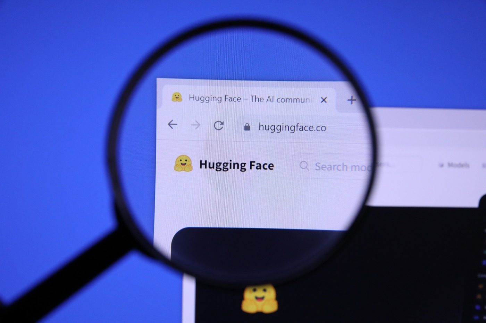

# A $13 Billion Price on Hugging Face, the Gateway to Open Models

_No buyer named and no deal agreed, yet the report leaves a working question for teams that source models through a single hub_

## Executive Summary

> [!callout]
> [Business Insider](https://www.businessinsider.com/hugging-face-could-be-acquired-13-billion-2026-8) reported over the weekend that Hugging Face has been approached to sell at a valuation of $13 billion or more, and TechCrunch wrote the report up on August 24. It is not clear who the company has been in talks with, and no deal has been reached. Hugging Face has reportedly been talking to banks to help evaluate the bids that came in.

> The last round, in 2023, put the company at $4.5 billion. Nearly tripling that in three years is not a story revenue can tell. CEO Clem Delangue said on a recent podcast that the company is "close to profitability" and has only "recently started to touch the money that [it] raised three years ago." What carries the price is not the income statement. It is the place developers pass through to find a model, test it and ship it.

> Yet the models and datasets stacked on that place were never the company's to sell. Hugging Face's terms of service say "You own the Content you create!", and anything sitting in a public repository already carries a perpetual, irrevocable licence granted to every user. A change of owner does not move title to that content. It moves the terms of the path leading to it. If your team has been sourcing models through a single hub, you can map that path now, without waiting to see how the talks end.

### Key Numbers

The first three figures are the prices attached to this company over three years. The last is the size of what has piled up on the spot that price refers to, and none of it belongs to the company.

Sources: [TechCrunch](https://techcrunch.com/2026/08/24/hugging-face-reportedly-in-talks-to-be-acquired-for-13b/) (2026-08-24), Hugging Face homepage counters (checked 2026-08-26)

<!-- stat-card -->
**$13B** — Reported sale valuation — The floor of the figure in the Business Insider report. No buyer has been named and no deal agreed

<!-- stat-card -->
**$4.5B** — Value set by the 2023 round — Post-money valuation of a round led by Salesforce Ventures, with Alphabet and IBM Ventures taking part

<!-- stat-card -->
**$7B** — Value of the offer turned down — Nvidia's $500 million investment, declined because the company did not want a single dominant investor to sway decisions

<!-- stat-card -->
**2M+** — Public models on the hub — The company's own counter on its homepage. The size of the priced position, and of the assets it does not own

## A Sale Report With No Buyer and No Deal

What is actually on the record is thinner than the headline suggests. Hugging Face has been approached at a valuation of $13 billion or more. It is not clear who the talks are with. No deal has been reached. The line about the company talking to banks to help evaluate bids is where the reporting ends.

*▲ The spot now drawing a $13B+ sale offer | Source: [Jernej Furman, CC BY 2.0, Wikimedia Commons](https://commons.wikimedia.org/wiki/File:Homepage_of_HUGGING_FACE_Website_magnified_on_logo_with_magnifying_glass_(53146954891).jpg)*

The company's own signals do not point one way either. Delangue said on a recent episode of the TechCrunch Equity podcast that Hugging Face is close to profitability and has only recently started to touch the money it raised three years ago, adding that the startup is thinking about how to optimise for "long-term sustainability of the company rather than short-term profits or fundraising maximization." On the community, he put it this way: "We're building a platform for the community, and they're trusting us with sharing their data and their models on the platform, so we have a long-term responsibility to them."

That is why readers split on whether the company is genuinely considering a sale or simply fielding offers to see where the number lands. There is a precedent worth holding onto. Earlier this year Hugging Face turned down a $500 million investment from Nvidia that would have valued it at $7 billion, saying at the time that it did not want a single dominant investor to sway decisions. This is a company that has already once chosen independence over the number on the table.

## The Price Attaches to the Gateway

Line up the three numbers in order and you can see how fast this position is being repriced. The August 2023 round closed at a $4.5 billion post-money valuation. Salesforce Ventures led it, with Alphabet, GV, IBM Ventures and others taking part. The Nvidia offer declined earlier this year implied $7 billion, and the figure reported now is $13 billion.
