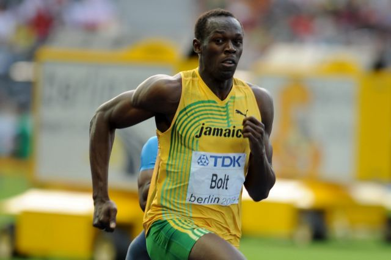

# 볼트보다 빨라진 휴머노이드가 못은 박지 못했다

_베이징 세계휴머노이드로봇대회 채점표는 스스로 해낸 로봇에만 만점을 줬다_

## Executive Summary

> [!callout]
> 베이징에서 열린 2회 세계휴머노이드로봇대회의 100m 금메달 기록은 8.64초였다. 작년 1회 대회에서 같은 로봇이 우승했을 때 기록은 21.5초였다. 1년 만에 기록이 2.5배 가까이 줄었다. 8월 22일부터 26일까지 이어진 이 대회에는 666개 팀이 로봇 2,056대를 데리고 나와 51개 종목에서 겨뤘다.

> 같은 대회장에서 로봇들은 코르크판에 못을 곧게 박아 넣는 데 애를 먹었다. 팀원이 장갑을 끼고 로봇의 손을 직접 조종하는 원격조작 상태에서도 그랬다. 전부 실패한 것은 아니어서, 네이처가 기사에 함께 건 CCTV+ 영상에는 못을 박아 넣은 로봇과 그러지 못한 로봇이 섞여 있다. 스탠퍼드대 캐런 리우는 사람이 쉽다고 여기는 일이 로봇에게는 백플립보다 어렵다고 말한다. 달리기는 정해진 궤적을 따라가는 일이고, 못 박기는 도구를 쥐고 힘을 전달하는 일이다.

> 조직위는 이 대비를 규칙으로 먼저 처리해 두었다. 시나리오 종목에서 과제를 스스로 해낸 로봇에는 만점을, 사람이 원격조작한 로봇에는 절반을 줬다. 능력을 재려면 누가 그 동작을 만들었는지를 먼저 적어야 했다는 뜻이다.

### 주요 수치

출처: [Nature News(2026-08-27)](https://www.nature.com/articles/d41586-026-02713-z) 및 대회 조직위 규정·현장 보도

<!-- stat-card -->
**8.64초** — 100m 금메달 기록 — 작년 같은 로봇은 21.5초였다

<!-- stat-card -->
**절반** — 원격조작 로봇이 받는 점수 — 시나리오 종목에서 자율 수행은 만점

<!-- stat-card -->
**3/12** — 소방 시나리오를 끝까지 마친 팀 — 30분 안에 위험물 식별부터 진화까지

<!-- stat-card -->
**2,056대** — 대회에 나온 로봇 — 666개 팀이 51개 종목에서 겨뤘다

## 1년 만에 21.5초가 8.64초가 됐다

베이징의 엑스휴머노이드가 만든 톈궁 울트라가 100m 금메달을 8.64초에 가져갔다고 네이처가 전했다. 우사인 볼트가 2009년에 세운 9초58보다 0.94초 빠르다. 같은 로봇이 작년 1회 대회에서 같은 종목을 우승했을 때 기록은 21.5초였다. 사람의 100m 기록이 한 세기 동안 1초 남짓 줄어드는 동안, 이 종목의 로봇 기록은 열두 달 만에 12초 넘게 줄었다.

*▲ 사람의 100m 기록은 9초58에서 굳어 17년째다. 로봇 기록은 1년 만에 21.5초에서 8.64초로 줄었다. | Source: [Erik van Leeuwen, Wikimedia Commons](https://commons.wikimedia.org/wiki/File:Usain_Bolt_16082009_Berlin.JPG)*

속도만 놓고 보면 완결된 성취처럼 보인다. 현장은 그렇지 않았다. 조직위는 결승선에서 몇 미터 떨어진 곳에 두꺼운 정지매트를 깔아 두었다. 로봇들이 안전하게 감속하지 못할 것을 예상했기 때문이다. ZME 사이언스에 따르면 톈궁 울트라는 결선에 앞선 라운드에서 8.86초를 찍은 직후 그 매트에 부딪혀 쓰러졌고 몸통 부근에서 불꽃이 일었다. 다른 준결승에서는 달리던 로봇이 그대로 분해됐고, 앞선 경기들에서는 넘어지거나 부딪히거나 실려 나간 로봇이 나왔다. 허리에서 부러진 로봇도 있었다. 금메달 기록 8.64초는 그 다음 날 대회를 닫는 대형 부문 결선에서 나왔다.

미 육군 연구소에서 일하는 퍼듀대 박사과정 디팜 파텔은 아스테크니카에 이 구조를 그대로 설명했다. 결승선을 통과하는 것이 목표이고, 멈추든 부서져 조각나든 그 목표와는 상관이 없다고 했다. 그는 회사마다 종목별로 다른 로봇을 내보냈다는 말도 덧붙였다. 스프린트 로봇은 직선 트랙을 최대한 빨리 지나가는 하나의 문제에 맞춰 다듬어졌고, 감속은 그 문제 바깥에 있었다.

정의가 좁은 문제일수록 최적화는 빠르다. 트랙은 평평하고 방해물이 없으며 시작과 끝이 정해져 있다. 창고나 주방처럼 물건이 늘 있어야 할 자리에 있지 않은 공간과는 조건이 다르다. 기록이 극적으로 줄었다는 사실과 그 기록이 무엇을 증명하는지는 따로 읽어야 한다.

## 대회 규칙은 원격조작에 절반을 매겼다

올해 대회는 스프린트와 점프에 머물지 않고 책을 서가에 꽂거나 침대를 정리하는 실제 과제로 종목을 넓혔다. 네이처는 이 시나리오 종목에서 과제를 스스로 완수한 로봇이 사람이 원격조작한 로봇보다 높은 점수를 받았다고 적는다. 조직위 규정을 보면 이 서술은 자율성 가중치라는 이름의 계수로 명문화돼 있다. 완전 자율은 사람이 제어 루프 안에 들어가지 않고 로봇이 종목을 끝내는 상태를 뜻한다. 완전 자율이 필수가 아닌 시나리오 종목에서는 자율로 수행한 로봇에 만점을, 원격조작에 의존한 로봇에 배점의 절반을 준다.

어떤 종목은 아예 자율 외의 선택지를 두지 않았다. 2026년 기준으로 스프린트, 4×100m 계주, 축구, 태극권, 체조는 완전 자율이 의무다. 반면 400m 장애물 코스와 킥복싱은 사람이 루프 안에 있어도 된다. 51개 종목 가운데 30개가 경기형, 21개가 공장과 식당과 사무실과 재난 현장을 흉내 낸 시나리오형이며, 40퍼센트가 넘는 종목이 완전 자율 수행을 요구했다.
