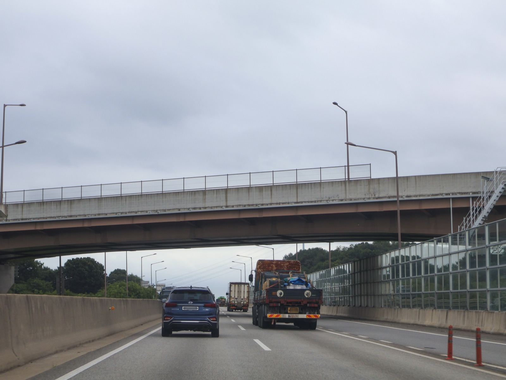
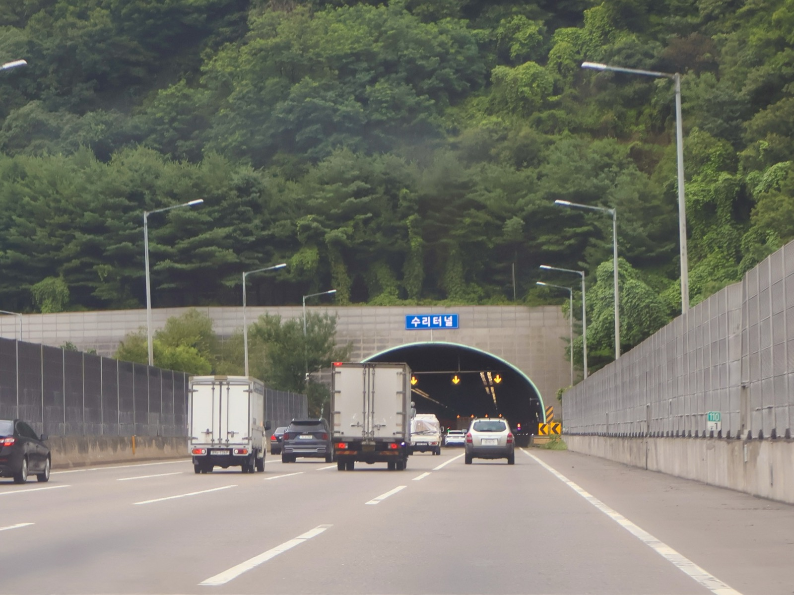

# Hyundai Motor Group Physical AI Heads for Korea

_Under a research agreement with Korea Expressway Corporation, robots from ZER01NE-backed startups are to gather inspection data under bridges and inside tunnels across 4,483 kilometers_

## Executive Summary

> [!callout]
> This article reads one research agreement, signed by Hyundai Motor Group and Korea Expressway Corporation on September 30, 2026 and made public the next day. The name Hyundai Motor Group gave it runs long, and it puts next-generation intelligent charging infrastructure ahead of everything else in the title. Three tasks sit inside it, covering charging at rest areas, safety and maintenance work on the road, and future road technology. The ceremony itself produced a single press release, and the space that release opens is the 4,483 kilometers of expressway the corporation runs.

> What deserves attention here is not a transfer of technology but a location. Robots from startups found and funded by ZER01NE, Hyundai Motor Group's open innovation platform, are to enter hazardous spots such as the undersides of bridges and the interiors of tunnels, gather inspection records there, and leave the judgment to people who read them. The thing holding physical AI back has been the scarcity of records of what happens outdoors rather than the capability of any model, and those records pass in the greatest volume through ground that a state-owned road operator administers.

> Sections 1 through 4 stay with what the two sides announced and with public material released in the same week. Section 5 rereads that material through the eyes of someone who works with data, and that reading belongs to this article.

### Key Figures

Sources: Korea Expressway Corporation data submitted to Rep. Jeong Hee-yong's office (October 1, 2026), and the [Hyundai Motor Group press release](https://www.hyundaimotorgroup.com/ko/news/hyundai-motor-group-korea-expressway-next-gen-charging-infrastructure-physical-ai).

<!-- stat-card -->
**4,483 km** — Size of the proving ground — Total expressway length under Korea Expressway Corporation management

<!-- stat-card -->
**8,469** — Structures to be inspected — 7,251 bridges and 1,218 tunnels taken together

<!-- stat-card -->
**1,436** — Structures past 30 years of service — 17.0% of the total, rising to 18.7% among bridges alone

<!-- stat-card -->
**125 billion won** — Size of ZER01NE's third fund — Closed in May 2025 to back AI, robotics and hydrogen startups

## The Signing at Yangjae and the Robot Demonstration

On September 30, at the Hyundai Motor and Kia headquarters in Yangjae-dong, Seoul, the two organizations signed a memorandum of understanding. Jung Ho-keun, executive vice president and head of Hyundai Motor Group's Future Strategy Division, attended for the group, and Cho Sung-min, head of the Road Traffic Research Institute, attended for Korea Expressway Corporation. The group announced the signing in a press release the following day, October 1. The title on the document is a mouthful: cooperation on research and validation of next-generation intelligent charging infrastructure and physical AI technologies based on highways.

A different name appears in the statement Korea Expressway Corporation put out the same day. There the agreement is cooperation on research, development and validation of robot technology based on expressway physical AI. One document, and Hyundai Motor Group led with charging infrastructure while the road operator led with robots. Agencies writing the title of a memorandum a little differently from one another is ordinary enough. Which line each side wanted read first, though, shows up in the difference.

Physical AI refers to machines with a body, robots above all, that use artificial intelligence to perceive and judge a real environment and then carry out work in it. It belongs on the side that goes outdoors and uses its hands, not the side that composes sentences or draws pictures inside a screen. The place both parties picked for that technology is the national expressway network.

Jung said at the ceremony that robotics and mobility technologies "can only be perfected through validation at an actual site," and he described the nationwide expressway infrastructure Korea Expressway Corporation operates as an optimal stage for demonstrating the group's charging technology and the physical AI of ZER01NE startups at scale. Cho, speaking for the corporation, called robot technology "a core field that can maximize expressway maintenance efficiency and worker safety at the same time." The two remarks point at different things, which is worth holding on to. One of them is talking about a space in which to validate technology, the other about places that are dangerous for a person to enter.

After the signing, a robot demonstration ran at the Yangjae site. An irrigation robot watering plants, a security robot on patrol and a logistics robot carrying goods each went through their work in front of the attendees. All three are indoor and on-campus machines that already run today. The point of the demonstration was not to unveil anything new but to let people gauge what machines of roughly this capability might do once they are out on an expressway.

*▲ The signing ceremony at the Yangjae headquarters on September 30. Source: [Hyundai Motor Group Newsroom](https://www.hyundaimotorgroup.com/ko/news/hyundai-motor-group-korea-expressway-next-gen-charging-infrastructure-physical-ai)*

## Two Tasks Are Specific, the Third Is Not

The agreement carries three tasks. The first is research into next-generation intelligent charging infrastructure with expressway rest areas as its hubs. As electric vehicles multiply, the goal is to raise how automated and how intelligent the charging equipment can be. The Korea Expressway Corporation statement listed charging robots and wireless charging in parentheses as the technologies going into that infrastructure. Instead of a person walking a cable over, a machine approaches the car, or the plugging motion disappears altogether. Validation happens in real road conditions rather than under laboratory settings.

The second task is the one this article is watching. Physical AI from startups that ZER01NE found and invested in gets applied to road maintenance and safety. The work named as the target covers inspecting expressway pavement condition, detecting hazards and maintaining facilities. Field data coming out of that work is to be accumulated precisely, used to advance the physical AI algorithms, and in turn to shorten the path to commercial deployment. The third task is technology and information exchange and joint research in future road technology, broader in scope than the first two and, for now, empty of detail.

| Task | Stage | Records accumulated |
| --- | --- | --- |
| Next-generation intelligent charging infrastructure | Expressway rest areas | Charging robots and wireless charging in live road operation |
| Physical AI for safety and maintenance | Main carriageway, bridge undersides, tunnels | Pavement condition, hazards, facility condition |
| Joint research on future road technology | Undecided | Technology and information exchange stage |

▲ The three tasks the agreement names. Sources: Hyundai Motor Group press release and follow-up coverage (ZDNet Korea, Newspim, M Post).

Follow-up reporting filled in a little more about how the second task is meant to run. Once physical AI is introduced on the expressway, robots go directly into hazardous spots that people reach with difficulty, such as the underside of a bridge or the inside of a tunnel, collect data there, and hand it to people who then make a precise assessment. Both organizations are looking past the data-gathering stage toward robots that perform the field work themselves. The benefits they expect are fewer workplace injuries, fewer secondary accidents and earlier detection of road damage.

Who supplies what is listed separately in the statements. Korea Expressway Corporation provides bridges, tunnels and rest areas, facilities already in daily use, as validation sites. Hyundai Motor Group brings the technology and experience it has built developing and operating service robots and charging robots. Korea Expressway Corporation supplies the place, Hyundai Motor Group the machines. That is where the substance of the agreement lies.

*▲ The underside of an expressway bridge managed by Korea Expressway Corporation — the hazard type the second task targets. Source: [Wikimedia Commons (CC0, LandAndTree)](https://commons.wikimedia.org/wiki/File:Pyeongtaek-Siheung_Expressway_Mado_JCTR-A_Bridge_20240729.jpg)*

ZER01NE opened in 2018 as Hyundai Motor Group's open innovation platform. A first fund of 10 billion won in 2018 and a second of 80.5 billion won in 2021 went into 105 companies and produced more than 200 collaborations with group affiliates, and in May 2025 a third fund of 125 billion won closed, including 40 billion won from Hyundai Motor, 40 billion from Kia and 10 billion from Hyundai Motor Securities. Its investment areas are AI, robotics, hydrogen and cybersecurity. This agreement becomes the passage that opens a nationwide outdoor testing ground to the companies inside that portfolio.

## What a Lab Cannot Reproduce

Language models and robots started from different lines. A model that handles sentences could pick up text already piled on the internet. Robots have no such warehouse. What a machine with a body saw and how it moved exists nowhere unless somebody actually ran that machine and wrote the result down.

The numbers show how far behind robot data is. Open X-Embodiment, the largest joint effort yet to gather robot learning data, took 21 institutions working together to scrape up 527 skills and some 160,000 tasks across 22 kinds of robot. Set against text corpora measured in trillions of tokens, the order of magnitude is different. Going outdoors raises the cost again. Waymo, which operates self-driving cars, only reported passing 200 million cumulative fully autonomous miles on public roads in February 2026. That is the volume one company accumulates over years.

Outdoors is expensive because the conditions refuse to hold still. On a factory floor the lighting and the traffic paths stay as people arranged them. An expressway does not. Night turns into day, rain and snow and fog take turns, work zones appear and vanish, and traffic volume differs by the day of the week. Most of the thresholds physical AI has to clear live inside that variation. Records of it cannot be manufactured in a laboratory.

The 4,483 kilometers Korea Expressway Corporation manages hold all of that variation at once. Its worth as a space is that road condition, climate and traffic volume, three separate variables, can be validated together at scale. Coastal stretches and mountain stretches sit inside a single route, and the same point wears a different face each season. If the records one robot would earn in a year become reachable at the scale of a whole route, the rate at which data arrives changes outright.

*▲ An expressway tunnel where day, night and weather keep changing — conditions a laboratory cannot reproduce. Source: [Wikimedia Commons (CC0, LandAndTree)](https://commons.wikimedia.org/wiki/File:Expressway_No.100_Suri_Tunnel_20240722.jpg)*

> [!callout]
> The Pebblous blog has been on this family of stories before. [The startup sending sensing pods onto factory floors](/blog/noetive-sensing-pods-physical-economy/en/), [the data gap in small Korean manufacturing plants](/blog/korea-sme-factory-physical-ai-data-custody/en/) and [Caterpillar naming the customer jobsite as the hard part](/blog/caterpillar-physical-ai-jobsite-deployment/en/) were all holding the same question. Where do you get the records that teach a machine? The earlier cases were mostly indoors or confined to one company's site, while the stage in this agreement is an outdoor asset owned by the state.

## The Inspection Load Grows Faster Than the Budget

On October 1, the day the agreement went public, the office of Rep. Jeong Hee-yong of the National Assembly's Land, Infrastructure and Transport Committee released data obtained from Korea Expressway Corporation. The corporation manages 8,469 first-, second- and third-class structures, of which 1,436, or 17.0%, have passed 30 years since completion. Among bridges, 1,354 of 7,251 fall into the aging bracket, reaching 18.7%, while 82 of 1,218 tunnels do, at 6.7%. Of the 36 routes in total, 14 have been in service for more than 30 years.

The ratio steepens as time passes. Aging expressway length stood at 569 km in 2026, 12% of the whole. The data projects that share passing 21% in 2030 and 45% in 2035 on the way to 63% in 2040. The structures curve lies almost on top of it, starting at 17.0% and arriving at 62.5% in 2040. The route with the longest aging stretch is the Jungbu Line at 107 km, followed by the Gyeongbu Line at 90.4 km and the Honam Line at 71 km.

The funding side comes with firmer numbers. Repaving between 2027 and 2035 was put at 6.44 trillion won and structural remodeling at 5.32 trillion won. Together that comes to 11.75 trillion won, against a budget projected at 8.87 trillion won over the same years. The 2.88 trillion won shortfall falls roughly half on pavement and half on structures.

The data also traces what happens if the gap stays. Holding budgets where they are, the pavement defect rate was projected to climb from 11% to 13%. Jeong pointed to the corporation's accumulated debt of more than 44.5 trillion won last year and warned that necessary safety investment may not arrive on time. A growing inspection load and funding that cannot keep pace sit side by side in one set of figures.

▲ Source: Korea Expressway Corporation data submitted to Rep. Jeong Hee-yong's office, October 1, 2026.

Whether the two announcements landing on the same day was aimed at each other cannot be settled from the public record. The conditions are clear enough, though. Structures needing inspection increase every year, the spots hardest to send a person into age first among them, and funding cannot match that pace. The reason somebody calls for robots is in those numbers. Automation starts to look less like an option and more like the result of arithmetic.

On the data side, more to inspect counts as a gain. Every time an inspection robot circles the underside of a bridge, a record is left, and that record makes the next robot run better. The heavier the maintenance demand, the more data piles up, and the more data piles up, the further the cost of automation falls. Infrastructure growing old turns out to be the steadiest teaching material physical AI has.

## Why Pebblous Is Watching This Agreement

The agreement itself takes a common form. Documents in which a large company and a public corporation promise to cooperate on research come out by the dozen every year. This agreement differs because what changes hands is not technology but a site. Hyundai Motor Group contributes charging technology and the ZER01NE portfolio, and what comes from Korea Expressway Corporation is access to the national expressway network. Which of those two is harder to come by in physical AI is exactly what the previous sections showed. None of this is a matter of reading between the lines. Both statements wrote out what each side contributes, and the differing titles on the agreement split along the same seam.

So one question survives a careful reading of the published statements. Into whose hands do the records from the expressway accumulate, and who gets to use them? Neither the press release nor the follow-up coverage touches ownership of the data or the terms of access. Nothing is strange about such clauses staying out of sight at the memorandum stage. But if the structure narrows the first beneficiaries of records gathered on a public asset to companies inside one investment portfolio, those terms will have to be handled somewhere public eventually. Cars on the road and the weather passing over it belong to everyone, and records made on top of them are not unrelated to that fact.

Turning the question inward gets more practical. There is a line Pebblous reaches for often when discussing AI-Ready Data. A site that goes unrecorded never becomes an asset. A factory, a distribution center, a repair depot, anywhere the same work happens in the same place every day, is already data. Only once somebody decides to store it and settles on a format, though. While that decision waits, the site keeps running, and the records it would have produced simply disappear.

What this agreement shows is the position an organization takes once it makes that decision. Korea Expressway Corporation held its 4,483 kilometers all along. What changed is that it found a counterpart to convert the activity on top of them into records. Hyundai Motor Group has gained something closer to a channel through which its portfolio companies can collect years of outdoor data at once, rather than spots to install chargers. The same calculation can be run against any organization.

Thank you for reading this far. The original announcement is available at the [Hyundai Motor Group newsroom](https://www.hyundaimotorgroup.com/ko/news/hyundai-motor-group-korea-expressway-next-gen-charging-infrastructure-physical-ai). Of the records passing through your own sites every day, what fraction is being stored right now, and how was it decided to let the rest go? We would be glad to hear what you find.

## References

### Primary Sources — Agreement Announcements

- 1.Hyundai Motor Group. (2026). "[고속도로 기반 차세대 지능형 충전 인프라 및 Physical AI 기술 연구·실증 협력](https://www.hyundaimotorgroup.com/ko/news/hyundai-motor-group-korea-expressway-next-gen-charging-infrastructure-physical-ai)" [Cooperation on Research and Validation of Next-Generation Intelligent Charging Infrastructure and Physical AI Technologies Based on Highways]. Hyundai Motor Group Newsroom, 2026-10-01.
- 2.Newspim. (2026). "[현대차그룹·한국도로공사, 고속도로 피지컬 AI 로봇 기술 연구 협력](https://www.newspim.com/news/view/20261001001329)" [Hyundai Motor Group and Korea Expressway Corporation Cooperate on Expressway Physical AI Robot Technology Research].
- 3.Financial News (파이낸셜뉴스). (2026). "[현대차그룹·한국도로공사 업무협약 체결](https://www.fnnews.com/news/202610010943235544)" [Hyundai Motor Group and Korea Expressway Corporation Sign MOU].

### Public Data — Aging Infrastructure Records

- 4.Money Today (머니투데이). (2026). "[한국도로공사 노후 구조물·유지보수 예산 자료](https://www.mt.co.kr/politics/2026/10/01/2026100113302434723)" [Korea Expressway Corporation Data on Aging Structures and Maintenance Budget]. Data submitted to the office of Rep. Jeong Hee-yong.
- 5.Special Times (스페셜타임스). (2026). "[한국도로공사 노후 구조물 자료, 2040년 노후율 63% 전망](https://www.specialtimes.co.kr/news/articleView.html?idxno=469434)" [Korea Expressway Corporation Aging Structure Data Projects 63% Aging Rate by 2040].

### Academic & Industry Data — The Physical AI Data Bottleneck

- 6.Open X-Embodiment Collaboration. (2023). "[Open X-Embodiment: Robotic Learning Datasets and RT-X Models](https://arxiv.org/abs/2310.08864)." arXiv:2310.08864 (ICRA 2024).
- 7.Waymo. (2026). "[The Waymo World Model: A New Frontier For Autonomous Driving Simulation](https://waymo.com/blog/2026/02/the-waymo-world-model-a-new-frontier-for-autonomous-driving-simulation/)." Waymo Blog, 2026-02.
