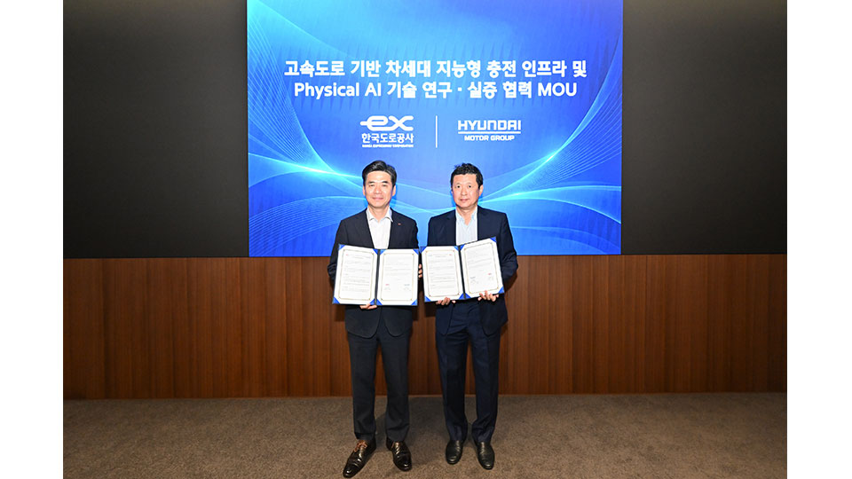

# 현대차그룹 피지컬 AI, 전국 고속도로에서 데이터를 모은다

_한국도로공사와 맺은 연구 협약에 따라, 제로원이 투자한 스타트업 로봇이 교량 하부와 터널에서 점검 데이터를 쌓는다_

## Executive Summary

> [!callout]
> 이 글은 현대자동차그룹과 한국도로공사가 2026년 9월 30일 맺고 이튿날 공개한 연구 협약 한 건을 읽는다. 현대차그룹이 붙인 이름은 '고속도로 기반 차세대 지능형 충전 인프라 및 피지컬 AI 기술 연구·실증 협력'이고, 과제는 휴게소 충전 인프라와 고속도로 안전 유지관리, 미래 도로 기술 세 갈래다. 협약식 자체는 보도자료 한 장으로 끝났지만 그 한 장이 여는 공간은 한국도로공사가 관리하는 고속도로 4,483km다.

> 눈여겨볼 대목은 기술 이전이 아니라 자리다. 현대차그룹 오픈이노베이션 플랫폼 제로원이 발굴해 투자한 스타트업의 로봇이 교량 하부와 터널 같은 위험 구간에 들어가 점검 데이터를 모으고, 사람이 그 데이터로 판단하는 체계가 목표로 적혀 있다. 지금까지 피지컬 AI를 막아 온 것은 모델의 성능보다 실외에서 벌어지는 일의 기록이었고, 그 기록이 가장 많이 지나가는 곳은 도로를 운영하는 공기업의 관할 구역이다.

> 1절부터 4절까지는 양측이 발표한 내용과 같은 시기에 공개된 공공 자료다. 5절은 그 내용을 데이터를 다루는 사람의 눈으로 다시 읽은 이 글의 해석이다.

### 주요 수치

출처: 한국도로공사 제출 자료(정희용 의원실, 2026-10-01), [현대차그룹 보도자료](https://www.hyundaimotorgroup.com/ko/news/hyundai-motor-group-korea-expressway-next-gen-charging-infrastructure-physical-ai).

<!-- stat-card -->
**4,483km** — 실증 무대의 길이 — 한국도로공사가 관리하는 고속도로 전체 연장

<!-- stat-card -->
**8,469개소** — 점검 대상 구조물 — 교량 7,251개소와 터널 1,218개소를 합한 수

<!-- stat-card -->
**1,436개소** — 준공 30년을 넘긴 구조물 — 전체의 17.0%. 교량만 보면 18.7%에 이른다

<!-- stat-card -->
**1,250억 원** — 제로원 3호 펀드 규모 — 2025년 5월 결성. AI·로봇·수소 스타트업에 투자한다

## 양재사옥의 서명식과 로봇 시연

9월 30일 서울 양재동 현대차·기아 사옥에서 두 기관이 업무협약서에 서명했다. 현대차그룹에서는 정호근 미래전략본부장 부사장이, 한국도로공사에서는 조성민 도로교통연구원장이 참석했다. 그룹은 이튿날인 10월 1일 이 사실을 보도자료로 알렸다. 협약서의 이름은 길다. '고속도로 기반 차세대 지능형 충전 인프라 및 피지컬 AI 기술 연구·실증 협력'이다.

같은 날 한국도로공사가 내놓은 발표문은 이 협약을 다른 이름으로 부른다. 이쪽은 '고속도로 피지컬 AI 기반 로봇 기술의 연구개발 및 실증 협력'이라고 썼다. 한 장의 문서를 두고 현대차그룹은 충전 인프라를 앞세웠고, 한국도로공사는 로봇 기술을 앞세운 것이다. 업무협약의 명칭이 기관마다 조금씩 달리 적히는 일은 드물지 않다. 다만 어느 줄을 먼저 읽고 싶은지는 그 차이에 드러난다.

피지컬 AI는 로봇처럼 물리적 실체를 가진 기계가 인공지능으로 현실 환경을 인식하고 판단해 직접 작업을 수행하는 기술을 가리킨다. 화면 안에서 문장을 만들거나 그림을 그리는 쪽이 아니라, 바깥에 나가 손을 쓰는 쪽이다. 양측은 이 기술을 시험할 곳으로 전국 고속도로망을 지목했다.

정호근 부사장은 협약식에서 "로봇과 모빌리티 기술은 실제 현장에서의 검증을 거쳐야 비로소 완성된다"라고 말하며, 한국도로공사가 운영하는 전국 고속도로망을 그룹의 충전 기술과 제로원 스타트업의 피지컬 AI 기술을 대규모로 실증할 수 있는 최적의 무대라고 평가했다. 조성민 원장은 "로봇 기술은 고속도로 유지관리 효율성과 작업자 안전을 동시에 극대화할 수 있는 핵심 분야"라고 말했다. 두 발언이 겨누는 지점이 다르다는 점은 기억해 둘 만하다. 한쪽은 기술을 검증할 공간을 말하고, 다른 한쪽은 사람이 들어가기 위험한 자리를 말한다.

서명이 끝난 뒤 양재사옥 현장에서는 로봇 시연이 이어졌다. 식물에 물을 주는 관수 로봇, 순찰을 도는 보안 로봇, 물건을 나르는 물류 배달 로봇이 각자의 업무를 수행하는 모습을 보여 줬다. 모두 이미 돌아가고 있는 실내·구내 업무용 기계다. 이날 시연의 목적은 새 기술을 처음 공개하는 데 있지 않고, 이만한 기계들이 고속도로 현장에 나갔을 때 무엇을 할 수 있을지를 가늠하는 데 있었다.

*▲ 9월 30일 양재사옥에서 열린 업무협약 서명식. Source: [현대차그룹 뉴스룸](https://www.hyundaimotorgroup.com/ko/news/hyundai-motor-group-korea-expressway-next-gen-charging-infrastructure-physical-ai)*

## 충전, 점검, 그리고 미래 도로

협약이 담은 과제는 셋이다. 첫째는 고속도로 휴게소를 거점으로 삼는 차세대 지능형 충전 인프라 연구다. 전기차가 늘어나는 속도에 맞춰 충전 설비의 자동화와 지능화 수준을 올리는 것이 목표다. 한국도로공사 발표문은 그 인프라에 들어갈 기술로 충전 로봇과 무선 충전을 괄호 안에 적어 두었다. 사람이 케이블을 들고 가는 대신 기계가 차에 다가가거나, 아예 꽂는 동작을 없애는 방향이다. 실험실 조건이 아니라 실제 도로 환경에서 검증한다는 단서가 붙었다.

둘째가 이 글이 주목하는 과제다. 도로 유지관리와 안전 분야에 제로원이 발굴하고 투자한 스타트업의 피지컬 AI 기술을 적용한다. 대상으로 적힌 작업은 고속도로 노면 상태 점검과 위험 요인 감지, 시설물 유지보수다. 여기서 나오는 현장 데이터를 정밀하게 축적해 피지컬 AI 알고리즘을 고도화하고 기술 상용화 속도를 높이겠다는 구상이다. 셋째는 미래 도로 분야의 기술·정보 교류와 공동 연구개발로, 앞의 둘보다 범위가 넓고 내용은 아직 비어 있다.

| 과제 | 무대 | 쌓이는 기록 |
| --- | --- | --- |
| 차세대 지능형 충전 인프라 | 고속도로 휴게소 | 충전 로봇·무선 충전의 실도로 작동 기록 |
| 피지컬 AI 기반 안전·유지관리 | 본선 노면, 교량 하부, 터널 | 노면 상태, 위험 요인, 시설물 상태 |
| 미래 도로 기술 공동 연구 | 미정 | 기술·정보 교류 단계 |

▲ 협약이 명시한 세 과제. 출처: 현대차그룹 보도자료 및 후속 보도(ZDNet Korea, 뉴스핌, M포스트).

둘째 과제의 운영 방식은 후속 보도에서 조금 더 구체적으로 드러났다. 피지컬 AI가 고속도로에 도입되면 교량 하부나 터널처럼 사람이 접근하기 어려운 위험 구간에서 로봇이 직접 데이터를 수집하고, 사람은 그 데이터를 받아 정밀하게 판단하는 점검 체계로 바뀐다는 설명이다. 두 기관은 데이터 축적에서 멈추지 않고 로봇이 현장 작업까지 직접 수행하는 단계를 바라보고 있다. 기대 효과로는 작업자 산업재해 감소와 2차 사고 예방, 도로 파손의 조기 발견이 꼽혔다.

누가 무엇을 대는지도 발표문에 갈라져 적혔다. 한국도로공사는 교량과 터널, 휴게소처럼 지금도 쓰이고 있는 고속도로 시설을 실증 현장으로 내준다. 현대차그룹은 서비스 로봇과 충전 로봇을 개발하고 운영하며 쌓은 기술과 경험을 가져온다. 도로공사가 대는 것은 장소이고, 현대차그룹이 대는 것은 기계다. 협약의 실질이 여기에 있다.

*▲ 한국도로공사가 관리하는 고속도로 교량 하부. 둘째 과제가 겨냥한 위험 구간 유형이다. Source: [Wikimedia Commons (CC0, LandAndTree)](https://commons.wikimedia.org/wiki/File:Pyeongtaek-Siheung_Expressway_Mado_JCTR-A_Bridge_20240729.jpg)*

제로원은 2018년 문을 연 현대차그룹의 오픈이노베이션 플랫폼이다. 2018년 100억 원 규모의 1호 펀드와 2021년 805억 원 규모의 2호 펀드로 105개사에 투자해 그룹과의 협업 사례 200여 건을 만들었고, 2025년 5월에는 현대차 400억 원·기아 400억 원·현대차증권 100억 원을 포함한 1,250억 원 규모의 3호 펀드를 결성했다. AI와 로봇, 수소, 사이버보안이 투자 영역이다. 이번 협약은 그 포트폴리오 안의 기업들에게 전국 규모의 실외 시험장을 열어 주는 통로가 된다.

## 왜 하필 전국 고속도로인가

언어모델이 걸어온 길과 로봇이 걸어온 길은 출발선부터 달랐다. 문장을 다루는 모델은 인터넷에 이미 쌓여 있던 글을 가져다 썼다. 로봇에게는 그런 창고가 없다. 몸을 가진 기계가 무엇을 보고 어떻게 움직였는지는 누군가 그 기계를 실제로 돌려 기록하지 않는 한 어디에도 남지 않는다.

격차는 숫자에서 바로 보인다. 로봇 학습 데이터를 모으겠다고 나선 가장 큰 공동 작업인 Open X-Embodiment는 21개 기관이 손을 모아 22종의 로봇에서 527가지 기술과 16만여 건의 과제를 간신히 끌어모았다. 글로 된 학습 데이터가 조 단위 토큰을 다루는 것과 견주면 자릿수가 다르다. 실외로 나가면 비용이 한 번 더 뛴다. 자율주행차를 운행하는 웨이모는 2026년 2월에야 공공도로 완전자율주행 누적 2억 마일을 넘겼다고 밝혔다. 한 기업이 수년을 들여야 쌓이는 분량이다.

실외가 비싼 이유는 조건이 가만히 있지 않아서다. 공장 바닥은 조명도 동선도 사람이 정해 둔 대로 유지되지만, 고속도로는 그렇지 않다. 밤과 낮이 바뀌고, 비와 눈과 안개가 번갈아 오고, 공사 구간이 생겼다 없어지고, 교통량은 요일마다 다르다. 피지컬 AI가 넘어야 할 문턱은 대부분 이 변동 안에 있다. 그런데 이런 기록은 실험실에서 만들어 낼 수 없다.

한국도로공사가 관리하는 4,483km는 그 변동을 한꺼번에 품고 있다. 도로 상태와 기후, 교통량이라는 서로 다른 조건을 동시에 검증할 수 있는 대규모 실외 환경이라는 점이 이 공간의 값어치다. 바닷가를 지나는 구간과 산악 구간이 한 노선 안에 섞여 있고, 같은 지점도 계절마다 다른 얼굴을 보인다. 로봇 한 대를 1년 돌려 얻을 기록을 노선 단위로 접근할 수 있다면, 데이터를 모으는 속도 자체가 달라진다.

*▲ 밤낮과 날씨가 끊임없이 바뀌는 고속도로 터널 구간. 실험실에서는 재현할 수 없는 조건이다. Source: [Wikimedia Commons (CC0, LandAndTree)](https://commons.wikimedia.org/wiki/File:Expressway_No.100_Suri_Tunnel_20240722.jpg)*

> [!callout]
> 페블러스 블로그가 이 계열의 이야기를 다룬 것은 처음이 아니다. [공장 바닥에 센싱 포드를 들여보내는 스타트업](/blog/noetive-sensing-pods-physical-economy/ko/)도, [중소 제조업 현장의 데이터 공백](/blog/korea-sme-factory-physical-ai-data-custody/ko/)도, [고객 현장을 관건으로 꼽은 캐터필러](/blog/caterpillar-physical-ai-jobsite-deployment/ko/)도 결국 같은 질문을 붙들고 있었다. 기계를 가르칠 기록을 어디서 구할 것인가. 다만 앞의 사례들이 대체로 실내이거나 특정 사업장이었다면, 이번 협약의 무대는 국가가 소유한 실외 자산이다.

## 점검할 구조물은 늘고 예산은 모자란다

협약이 공개된 10월 1일, 국회 국토교통위원회 정희용 의원실이 한국도로공사에서 받은 자료를 내놓았다. 공사가 관리하는 1·2·3종 구조물은 모두 8,469개소이고, 그중 준공 30년을 넘긴 것이 1,436개소로 17.0%다. 교량은 7,251개소 가운데 1,354개소가 노후 구간에 들어가 18.7%에 이르고, 터널은 1,218개소 중 82개소로 6.7%다. 전체 36개 노선 가운데 14개가 공용 연수 30년을 넘겼다.

시간이 지날수록 이 비율은 가팔라진다. 노후 고속도로 연장은 2026년 기준 569km로 전체의 12%다. 자료는 이 비율이 2030년 21%와 2035년 45%를 지나 2040년에 63%가 될 것으로 내다봤다. 구조물 쪽 궤적도 거의 포개져서 17.0%에서 출발해 2040년 62.5%에 닿는다. 노후 연장이 가장 긴 노선은 중부선으로 107km이고, 경부선 90.4km와 호남선 71km가 뒤를 잇는다.

재원 쪽 숫자는 더 구체적이다. 2027년부터 2035년까지 포장을 고치는 데 6조 4,379억 원, 구조물을 손보는 데 5조 3,159억 원이 든다고 봤다. 합치면 11조 7,538억 원인데 같은 기간 확보가 전망되는 예산은 8조 8,730억 원이다. 모자라는 2조 8,808억 원은 포장과 구조물 양쪽에 거의 반씩 걸쳐 있다.

부족분이 그대로 간다면 어떻게 되는지도 적혀 있다. 지금 예산을 유지할 경우 포장 불량률이 11%에서 13%까지 오를 것으로 봤다. 정희용 의원은 공사의 지난해 누적 부채가 44조 5,000억 원을 넘는다는 점을 들어 필요한 안전 투자가 제때 이뤄지지 못할 수 있다고 우려했다. 늘어나는 점검 대상과 따라붙지 못하는 재원이 한 자료 안에 나란히 놓인 셈이다.

▲ 출처: 한국도로공사 제출 자료(정희용 의원실, 2026-10-01).

두 발표가 같은 날 나온 것이 서로를 겨냥한 결과인지는 공개된 자료만으로 알 수 없다. 다만 점검해야 할 구조물은 매년 늘고, 사람을 보내기 어려운 자리는 그중에서도 먼저 늙고, 예산은 그 속도를 따라가지 못한다는 조건은 분명하다. 로봇을 부르는 쪽의 사정이 이 숫자들 안에 있다. 자동화가 선택지가 아니라 산수의 결론에 가까워지는 지점이다.

점검할 것이 늘어난다는 조건은 데이터 쪽에서는 이득이 된다. 점검 로봇이 교량 하부를 한 번 돌 때마다 기록이 남고, 그 기록은 다음 로봇을 더 잘 돌게 만든다. 유지관리 수요가 클수록 축적되는 데이터도 많아지고, 데이터가 많아질수록 자동화 비용이 내려간다. 늙어 가는 인프라가 피지컬 AI에게는 가장 꾸준한 교재가 되는 셈이다.

## 페블러스가 이 협약을 주목하는 이유

협약 자체는 흔한 형식이다. 대기업과 공기업이 연구 협력을 약속하는 문서는 해마다 수십 건씩 나온다. 이 건을 다르게 보는 이유는 거래되는 물건이 기술이 아니라 현장이기 때문이다. 현대차그룹이 내놓는 것은 충전 기술과 제로원 포트폴리오이고, 한국도로공사가 내놓는 것은 전국 고속도로라는 접근 권한이다. 피지컬 AI 판에서 뒤쪽이 더 구하기 어려운 물건이라는 사실은 앞 절에서 본 그대로다. 이것은 행간을 읽어 낸 결과가 아니다. 두 발표문이 각자 무엇을 내놓는지 문장으로 적어 두었고, 협약 이름을 서로 다르게 쓴 것도 거기서 갈린다.

그래서 공개된 발표문 앞에 남는 질문이 하나 있다. 고속도로에서 나온 기록은 누구 손에 쌓이고, 누가 쓸 수 있는가. 보도자료와 후속 기사 어디에도 데이터의 소유나 접근 조건을 다룬 대목은 없다. 업무협약 단계에서 그런 조항이 공개되지 않는 것은 이상한 일이 아니다. 다만 공공 자산 위에서 모은 기록의 1차 수혜자가 특정 투자 포트폴리오 안의 기업들로 좁아지는 구조라면, 그 조건은 언젠가 공개된 자리에서 다뤄져야 한다. 도로를 달리는 차와 그 위를 지나가는 날씨는 국민 모두의 몫이고, 그 위에서 만들어진 기록도 그 사실과 무관하지 않다.

질문을 조직 안으로 돌려보면 더 실용적이 된다. 페블러스가 AI-Ready Data를 이야기할 때 자주 꺼내는 말이 있다. 기록되지 않은 현장은 자산이 되지 않는다. 공장이든 물류센터든 수리 창고든, 매일 같은 자리에서 같은 일이 벌어진다면 그것은 이미 데이터다. 다만 누군가 저장하기로 결정하고 형식을 맞춰 두었을 때만 그렇다. 그 결정을 미룬 동안에도 현장은 계속 돌아가고, 돌아간 만큼의 기록은 그냥 사라진다.

이번 협약이 보여 주는 것은 그 결정을 내린 조직이 어떤 위치를 차지하게 되는가다. 한국도로공사는 4,483km를 예전부터 맡아 왔다. 달라진 것은 그 위에서 벌어지는 일을 기록으로 바꿔 둘 상대를 구했다는 점이다. 현대차그룹이 얻은 것은 충전기를 놓을 자리보다, 포트폴리오 기업들이 몇 년치 실외 데이터를 한꺼번에 모을 통로에 가깝다. 같은 계산을 각자의 조직에 대입해 볼 수 있다.

여기까지 읽어 주셔서 감사하다. 협약 원문은 [현대차그룹 뉴스룸](https://www.hyundaimotorgroup.com/ko/news/hyundai-motor-group-korea-expressway-next-gen-charging-infrastructure-physical-ai)에서 볼 수 있다. 여러분의 현장에서 매일 지나가는 기록 가운데 지금 저장되는 것은 몇 할쯤 되는지, 그리고 저장하지 않기로 한 나머지는 왜 그렇게 정해졌는지 한번 따져 보시고 무엇이 나왔는지 들려주시면 좋겠다.

## 참고문헌

### 1차 출처 — 협약 발표

- 1.현대자동차그룹. (2026). "[고속도로 기반 차세대 지능형 충전 인프라 및 Physical AI 기술 연구·실증 협력](https://www.hyundaimotorgroup.com/ko/news/hyundai-motor-group-korea-expressway-next-gen-charging-infrastructure-physical-ai)." Hyundai Motor Group Newsroom, 2026-10-01.
- 2.뉴스핌. (2026). "[현대차그룹·한국도로공사, 고속도로 피지컬 AI 로봇 기술 연구 협력](https://www.newspim.com/news/view/20261001001329)."
- 3.파이낸셜뉴스. (2026). "[현대차그룹·한국도로공사 업무협약 체결](https://www.fnnews.com/news/202610010943235544)."

### 공공 데이터 — 노후 구조물 자료

- 4.머니투데이. (2026). "[한국도로공사 노후 구조물·유지보수 예산 자료](https://www.mt.co.kr/politics/2026/10/01/2026100113302434723)." (정희용 의원실 제출)
- 5.스페셜타임스. (2026). "[한국도로공사 노후 구조물 자료, 2040년 노후율 63% 전망](https://www.specialtimes.co.kr/news/articleView.html?idxno=469434)."

### 학술·산업 데이터 — 피지컬 AI 데이터 병목

- 6.Open X-Embodiment Collaboration. (2023). "[Open X-Embodiment: Robotic Learning Datasets and RT-X Models](https://arxiv.org/abs/2310.08864)." arXiv:2310.08864 (ICRA 2024).
- 7.Waymo. (2026). "[The Waymo World Model: A New Frontier For Autonomous Driving Simulation](https://waymo.com/blog/2026/02/the-waymo-world-model-a-new-frontier-for-autonomous-driving-simulation/)." Waymo Blog, 2026-02.
