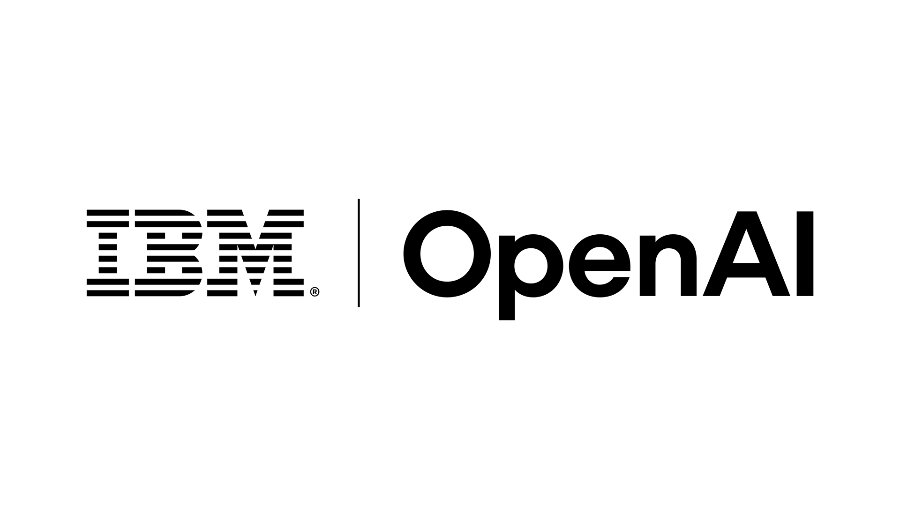

# IBM Retrains Tens of Thousands of Consultants on OpenAI Tools

_The August 13 partnership embeds GPT-5.6 in IBM_

## Executive Summary

> [!callout]
> IBM announced a partnership with OpenAI on August 13, 2026. Neither company disclosed the financial terms. The one item in the announcement that carries a number is people. IBM said it will stand up a dedicated OpenAI practice inside its consulting organization and spend the coming months retraining and certifying tens of thousands of consultants.

> Those retrained people are headed into finance, procurement, customer operations, and HR work at clients in financial services, government, telecom, and retail. GPT-5.6, Codex, and ChatGPT Work are being embedded in IBM Consulting Advantage, the delivery platform IBM consultants work in. Forrester counts 130,000 IBM consultants on that platform.

> Nothing in the published documents addresses data access scope, logging, or retention. Which client systems the retrained consultants can reach, and what their work leaves behind in them, are questions the buyer has to raise itself. The nearest guide to how that structure might look is the design the same two companies used in a cybersecurity service two months earlier.

### Key Numbers

The first two numbers show what this partnership moves. The last two are where that movement meets client data.

Sources: [TechCrunch (2026-08-13)](https://techcrunch.com/2026/08/13/ibm-partners-with-openai-to-bolster-enterprise-ai-push/), [Forrester](https://www.forrester.com/blogs/ibm-validates-openais-push-pull-partner-enterprise-strategy/), [IBM Newsroom (2026-06-22)](https://newsroom.ibm.com/2026-06-22-ibm-and-openai-bring-frontier-ai-to-cyber-defense-helping-enterprises-keep-pace-with-machine-speed-threats)

<!-- stat-card -->
**Tens of thousands** — Consultants to be trained and certified — Existing employees retrained, not new hires

<!-- stat-card -->
**130,000** — Consultants on the delivery platform — This is where GPT-5.6 is being embedded

<!-- stat-card -->
**40%+** — Consulting revenue tied to partners — Why a model vendor buys a channel

<!-- stat-card -->
**Read-only** — Code access in the June cyber service — August's wider scope has no such sentence

## The Number in the Announcement Is a Headcount

On August 13, IBM said it will deliver OpenAI's models and tools to enterprise clients through its global consulting business. Financial terms were not disclosed. One item, in the announcement and in the reporting around it, does carry a figure. Mike Healy, managing partner at IBM Consulting, said the company will "train and certify tens of thousands of consultants" over the coming months, primarily by retraining employees IBM already has rather than hiring new ones.

*▲ The IBM–OpenAI partnership announced on August 13, 2026 | Source: [IBM Newsroom](https://newsroom.ibm.com/2026-08-13-ibm-partners-with-openai-to-accelerate-secure-ai-deployment-for-enterprises-across-core-operations)*

The curriculum covers Codex, the API, cybersecurity, and consulting solution certifications. On top of that, IBM said it will field dedicated teams trained through the OpenAI Partner Network to work directly with clients in heavily regulated settings with complex workflows. The collaboration also moves IBM into OpenAI's elite partner tier, a group that already includes Accenture, BCG, Capgemini, and McKinsey.

Those teams are not staffed with consultants alone. The press release describes "forward-deployed units of highly specialized engineers and consultants," and Healy called the group Forward Deployed Experts. Forrester describes the same structure as "small teams of data science, engineering, and domain expertise." Data science, in other words, is one of the job families walking into the client's building.

The technical half of the deal is an embedding. GPT-5.6, Codex, and ChatGPT Work go into IBM Consulting Advantage. The industries named are financial services, government, telecom, and retail; the functions named are finance, procurement, customer operations, and HR. Andy Baldwin, global senior vice president at IBM Consulting, put the framing this way: "The challenge is not access to AI technologies — it's integrating AI securely and at scale into complex enterprise environments and workflows." Denise Dresser, OpenAI's chief revenue officer, added that "the organizations pulling ahead with AI are the ones turning it into a trusted part of how their business operates."

When a number appears, it helps to check what it is attached to. The tens of thousands is the training and certification population Healy gave TechCrunch. The figure the press release itself states is thousands of consultants and engineers obtaining expert-level certifications inside the dedicated OpenAI practice. The two describe different scopes. Laying the whole announcement out item by item the same way shows both the slots that carry numbers and the slots that are empty.

| Item | What was disclosed |
| --- | --- |
| People | Tens of thousands of consultants trained and certified, a dedicated OpenAI practice, forward-deployed specialists placed with clients |
| Technology | GPT-5.6, Codex, and ChatGPT Work embedded in IBM Consulting Advantage |
| Scope of application | Financial services, government, telecom, retail / finance, procurement, customer operations, HR |
| Contract terms | Not disclosed |
| Data access scope, logging, retention | No clause in any published document |

Compiled from the IBM Newsroom press release of August 13, 2026, and TechCrunch's reporting the same day.

> [!callout]
> A deal that sells a model states its size in tokens or licenses. The size in this announcement is measured in people. What the partnership actually delivers is tens of thousands more practitioners moving into finance, procurement, and HR work, and those practitioners are a lawful route into a client's internal data.

## The Models Enter a Platform 130,000 People Use

IBM Consulting Advantage is the internal delivery platform consultants use when they run a client engagement. AI agents, industry-specific assets, and cybersecurity capabilities sit in it together. Forrester counts 130,000 IBM consultants on the platform and reads the deal as making IBM both OpenAI's first customer and its enterprise-scale proving ground. The test bed covers a wide range of business functions rather than software development alone.

*▲ IBM Consulting Advantage, the delivery platform 130,000 IBM consultants use | Source: [IBM Consulting](https://www.ibm.com/consulting/advantage)*

The press release also says what the platform takes as input. IBM wrote that the capabilities within IBM Consulting Advantage "can analyze operating procedures and workflows to identify inefficiencies" and go on to redesign work in finance, procurement, customer operations, and HR. Redesigning a workflow requires reading the current one first. What gets read there is not published documentation but the record of how that organization has actually been doing its work.

The reason a consulting organization is worth money as a distribution channel shows up in the revenue mix. Forrester puts at least 40% of IBM Consulting revenue as partner-linked. Rather than build a direct sales force aimed at banks and government agencies, a model vendor moves faster by layering its technology onto an organization whose hands are already inside those clients' operating systems. This continues a pattern OpenAI has followed with large IT services firms such as Infosys and TCS.

The specificity of the commitments points the same way. Per Forrester, IBM "will commit to co-marketing and co-selling OpenAI's offerings, train its consultants and sales teams, and commit to a sales number." IBM also takes on wrapping OpenAI's solutions in deployment architectures that regulated firms can deploy with more confidence. A model company on its own struggles to clear the bar in finance and government; IBM opens that door under its own name and its own architecture.

IBM's own circumstances converge on the same moment. After July results came in below expectations, IBM lowered its 2026 revenue outlook. CEO Arvind Krishna held to the position that AI adoption is complementing mainframe demand rather than replacing it. An organization that needs consulting revenue to grow and a model company that needs a path into regulated industries signed the same document.

For the company adopting all this, the structure is more than one additional vendor relationship. IBM handles the models as an approved partner, and what comes through the client's door is a consultant who has been trained on them. The counterparty named in the contract and the party actually looking at the data are two different things.

## The Line the June Cyber Service Drew

The August announcement carries no access clause, but there is still something to go on. Two months earlier the same two companies shipped a service that runs on that same platform. On June 22, 2026, IBM joined OpenAI's Daybreak Cyber Partner Program and launched an application security service that uses OpenAI models to find and validate software vulnerabilities.

The design IBM described then is the concrete evidence behind this article's angle. The security harness that connects a client's application environment to the AI runs on IBM Consulting Advantage, operates inside the client environment, accesses code repositories on a read-only basis, and executes within bounded limits. The configuration exists to run exposure analysis at scale without widening the attack surface. Mark Hughes, global managing partner for cybersecurity services at IBM Consulting, framed it around attackers already operating at machine speed and defenders needing the same advantage under the security and control enterprises require.

*▲ The application security service IBM and OpenAI launched on June 22, 2026 — read-only, bounded execution was the design principle then | Source: [IBM Newsroom](https://newsroom.ibm.com/2026-06-22-ibm-and-openai-bring-frontier-ai-to-cyber-defense-helping-enterprises-keep-pace-with-machine-speed-threats)*

What entered the client in the June service, then, was not the model itself. An approved partner held the model access and read code within a defined scope inside the client's environment. That design is what the August deal extends into finance, procurement, customer operations, and HR.

The August release does not skip this territory entirely. One of the partnership's three pillars is cyber and AI model risk, and IBM said it will combine OpenAI models with its Autonomous Security services to manage "application-layer vulnerabilities, governance gaps, and operational risks that limits AI adoption." That is the one place the phrase governance gaps appears in the announcement. In that sentence, though, the gap is written as a problem the client carries, and how far the incoming people and models reach into client data does not appear in the same paragraph.

> [!callout]
> A wider scope cannot reuse June's sentence. Vulnerability analysis ends with reading code, while changing a procurement process or automating HR work does not. It writes data, produces intermediate artifacts, and rewrites business rules. June had a sentence about read-only access and bounded execution. The broader work announced in August has no published equivalent.

## Model Neutrality Now Runs Across Several Contracts

IBM has held the integrator position, combining multiple models around its own Granite family and the watsonx platform. This deal does not vacate that position. Ten months ago, on October 7, 2025, IBM struck a strategic partnership with Anthropic and put Claude into its software and a new development tool. Granite, Claude, and GPT now sit in the same drawer.

*▲ IBM and Anthropic's partnership, announced October 7, 2025 — Claude was already in IBM's drawer before OpenAI | Source: [IBM Newsroom](https://newsroom.ibm.com/2025-10-07-2025-ibm-and-anthropic-partner-to-advance-enterprise-software-development-with-proven-security-and-governance)*

Forrester singled out one trait of this alliance: "IBM is a product company first and service provider second." The relationship with OpenAI does not stop at the consulting organization; it reaches products such as Red Hat and watsonx Orchestrate. Forrester's read is that IBM is currently the only firm able to place a model inside enterprise workflows and secure it in that position. For the organization adopting it, that sentence is both a proof of capability and a notice that one company's products and people are coming in together, all the way inside the workflow.

So model neutrality means something different from the buyer's seat. It is a hedge against lock-in, and it also means several sets of hands on the same data. Forrester's three recommendations to technology executives aim at exactly this point: take a prove-it-to-me attitude and require evidence that the partnership shows up in the actual product roadmap; don't make OpenAI your only model, and route across models instead; and be wary of any offer to write OpenAI technology on IBM paper, keeping a separate relationship with each company.

That last one carries the most operational weight. Consolidating the counterparty into IBM alone simplifies the paperwork, but it also hides which model the data passes through and where it comes to rest. Since the contest in enterprise AI shifted toward [the trust of enterprise customers](/blog/anthropic-overtakes-openai-data-trust-moat/en/), the asset a model vendor is trying to secure is not a benchmark score. It is a legitimate path into some organization's data.

## Four Lines for the Company Doing the Adopting

Organizations adopting AI through a partnership like this usually spend the most review time on model performance and unit pricing. The real exposure sits elsewhere. How far a retrained consultant reaches into our systems, and where the traces of that work end up, are not on any performance sheet. Four lines in the contract turn the conversation concrete.

- **Access scope**: List which systems and which data are in reach, whether access stops at read or extends to write, and whether processing stays inside our environment or leaves it. Separate the work that can honestly be labeled read-only, as the June cyber service was, from the work that cannot.
- **Logging**: Record who queried what data when, and what was produced from which prompt. Then settle whether we can read those logs ourselves and how long they are kept.
- **Residue**: Account for the derived data an engagement creates. Intermediate artifacts, summaries, business data that went into prompts, and material used for fine-tuning all need owners and deletion terms. Whether any of it can be reused on another client's engagement belongs here too.
- **Privilege boundaries**: Specify how accounts held by retrained staff close when the engagement ends, and what procedure transfers access when people rotate off.

Answering any of the four requires records. If the pipeline does not hold where data came from, whose hands it passed through, and where it went, an access scope can be agreed and never verified. The evidence [Korea's AI Framework Act](/blog/korea-ai-basic-act-data-governance/en/) asks of high-impact AI comes down to the same material.

IBM and OpenAI will execute this announcement over the coming months. What needs settling before tens of thousands of newly certified people take a seat in client conference rooms is not which model to run. It is how far into our data they can see, and who keeps the record of it.

## References

### Official Documents

- 1.IBM Newsroom. (Aug. 13, 2026). "[IBM Partners with OpenAI to Accelerate Secure AI Deployment for Enterprises Across Core Operations](https://newsroom.ibm.com/2026-08-13-ibm-partners-with-openai-to-accelerate-secure-ai-deployment-for-enterprises-across-core-operations)."
- 2.IBM Newsroom. (Jun. 22, 2026). "[IBM and OpenAI Bring Frontier AI to Cyber Defense](https://newsroom.ibm.com/2026-06-22-ibm-and-openai-bring-frontier-ai-to-cyber-defense-helping-enterprises-keep-pace-with-machine-speed-threats)."
- 3.IBM Newsroom. (Oct. 7, 2025). "[IBM and Anthropic Partner to Advance Enterprise Software Development with Proven Security and Governance](https://newsroom.ibm.com/2025-10-07-2025-ibm-and-anthropic-partner-to-advance-enterprise-software-development-with-proven-security-and-governance)."

### Coverage and Analysis

- 4.Singh, Jagmeet. (Aug. 13, 2026). "[IBM partners with OpenAI to bolster enterprise AI push](https://techcrunch.com/2026/08/13/ibm-partners-with-openai-to-bolster-enterprise-ai-push/)." TechCrunch.
- 5.Schadler, Ted. (Aug. 13, 2026). "[IBM Validates OpenAI's Push-Pull-Partner Enterprise Strategy](https://www.forrester.com/blogs/ibm-validates-openais-push-pull-partner-enterprise-strategy/)." Forrester Blog.
- 6.Unite.AI. "[IBM Embeds OpenAI Models Into Its Consulting Delivery Platform](https://www.unite.ai/ibm-embeds-openai-models-into-its-consulting-delivery-platform/)."
