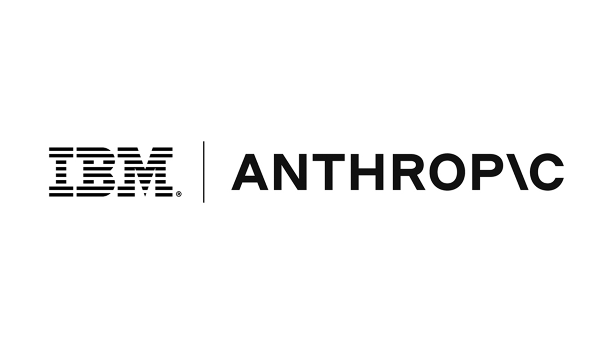

# 오픈AI 기술로 재교육되는 IBM 컨설턴트 수만 명

_GPT-5.6을 컨설팅 플랫폼에 넣은 8월 13일 파트너십이 금융·정부·통신의 업무 데이터로 사람을 들여보낸다_

## Executive Summary

> [!callout]
> IBM이 2026년 8월 13일 오픈AI와 파트너십을 발표했습니다. 계약 조건은 양쪽 모두 공개하지 않았습니다. 발표문에서 규모가 숫자로 적힌 항목은 인력입니다. IBM은 컨설팅 조직 안에 오픈AI 전담 조직을 두고 컨설턴트 수만 명을 몇 달에 걸쳐 재교육하고 인증하겠다고 밝혔습니다.

> 재교육된 인력이 향하는 곳은 금융서비스·정부·통신·유통 고객사의 재무, 조달, 고객운영, 인사 업무입니다. GPT-5.6과 Codex, ChatGPT Work는 컨설턴트용 딜리버리 플랫폼인 IBM Consulting Advantage에 들어갑니다. 포레스터 집계로 이 플랫폼을 쓰는 IBM 컨설턴트는 13만 명입니다.

> 정작 데이터 접근 범위와 기록에 관한 조항은 공개된 문서 어디에도 없습니다. 재교육된 인력이 고객 시스템의 어디까지 닿는지, 그 흔적이 어디에 남는지는 도입하는 쪽이 스스로 물어야 합니다. 구조를 짐작할 근거는 두 달 전 같은 두 회사가 사이버보안 서비스에서 쓴 설계입니다.

### 주요 수치

앞의 두 숫자는 이번 파트너십이 무엇을 움직이는지 보여 줍니다. 뒤의 두 항목은 그 움직임이 고객 데이터와 만나는 자리입니다.

출처: [TechCrunch (2026-08-13)](https://techcrunch.com/2026/08/13/ibm-partners-with-openai-to-bolster-enterprise-ai-push/), [Forrester](https://www.forrester.com/blogs/ibm-validates-openais-push-pull-partner-enterprise-strategy/), [IBM Newsroom (2026-06-22)](https://newsroom.ibm.com/2026-06-22-ibm-and-openai-bring-frontier-ai-to-cyber-defense-helping-enterprises-keep-pace-with-machine-speed-threats)

<!-- stat-card -->
**수만 명** — 재교육·인증 대상 컨설턴트 — 신규 채용이 아니라 기존 인력 재교육

<!-- stat-card -->
**13만 명** — 딜리버리 플랫폼 사용 규모 — GPT-5.6이 들어가는 곳이 이 플랫폼

<!-- stat-card -->
**40% 이상** — 파트너와 연관된 컨설팅 매출 — 모델 공급사가 채널을 사는 이유

<!-- stat-card -->
**읽기 전용** — 6월 사이버 서비스의 코드 접근 — 8월에 넓어진 업무에는 같은 문장이 없음

## 규모가 적힌 항목은 인력이었다

IBM은 8월 13일 오픈AI의 모델과 도구를 글로벌 컨설팅 사업을 통해 기업 고객에게 공급한다고 발표했습니다. 재무 조건은 공개되지 않았습니다. 대신 발표문과 후속 취재에 숫자가 붙은 항목이 하나 있습니다. 마이크 힐리 IBM 컨설팅 매니징 파트너는 수만 명의 컨설턴트를 몇 달에 걸쳐 교육하고 인증하겠다고 말했습니다. 새로 뽑는 인력이 아니라 이미 IBM에 있는 직원을 다시 가르치는 일입니다.

*▲ 2026년 8월 13일 발표된 IBM과 오픈AI의 파트너십 | Source: [IBM Newsroom](https://newsroom.ibm.com/2026-08-13-ibm-partners-with-openai-to-accelerate-secure-ai-deployment-for-enterprises-across-core-operations)*

교육 범위는 Codex와 API, 사이버보안, 컨설팅 솔루션 자격증입니다. IBM은 여기에 오픈AI 파트너 네트워크로 훈련한 전담 인력을 따로 편성해, 규제가 강하고 업무 흐름이 복잡한 환경에서 고객과 직접 일하게 한다고 밝혔습니다. 이번 협업으로 IBM은 오픈AI의 엘리트 파트너 등급에 들어갑니다. 액센처와 BCG, 캡제미니, 맥킨지가 이미 올라 있는 자리입니다.

이 전담 인력은 컨설턴트만으로 채워지지 않습니다. 보도자료는 고도로 전문화된 엔지니어와 컨설턴트로 구성된 전진 배치 유닛이라고 적었고, 힐리는 이 조직을 Forward Deployed Experts라고 불렀습니다. 포레스터는 같은 조직을 데이터 사이언스와 엔지니어링, 도메인 전문성을 모은 소규모 팀으로 설명합니다. 고객사 안에서 일할 사람의 직군에 데이터 사이언스가 들어간다는 뜻입니다.

기술 쪽 항목은 임베딩입니다. GPT-5.6과 Codex, ChatGPT Work가 IBM Consulting Advantage에 들어갑니다. 적용 대상으로 적힌 산업은 금융서비스와 정부, 통신, 유통이고, 업무 영역은 재무와 조달, 고객운영, 인사입니다. 앤디 볼드윈 IBM 컨설팅 글로벌 수석부사장은 문제가 AI 기술에 접근하는 것이 아니라 복잡한 기업 환경과 업무 흐름에 안전하게, 규모 있게 통합하는 것이라고 말했습니다. 데니즈 드레서 오픈AI 최고매출책임자는 앞서 나가는 조직은 AI를 사업 운영의 신뢰할 수 있는 일부로 바꾼 곳이라고 했습니다.

숫자를 읽을 때는 그 숫자가 어디에 붙은 것인지 봐야 합니다. 수만 명은 힐리가 TechCrunch에 말한 교육·인증 대상 규모이고, 보도자료가 직접 적은 숫자는 전담 조직에서 전문가 등급 인증을 받는 수천 명입니다. 둘은 서로 다른 범위를 가리킵니다. 같은 방식으로 발표문 전체를 항목별로 갈라 놓으면, 숫자가 붙은 자리와 비어 있는 자리가 함께 보입니다.

| 구분 | 공개된 내용 |
| --- | --- |
| 인력 | 컨설턴트 수만 명 재교육·인증, 전담 오픈AI 조직, 고객사에 직접 투입되는 전문 인력 편성 |
| 기술 | GPT-5.6·Codex·ChatGPT Work를 IBM Consulting Advantage에 임베드 |
| 적용 범위 | 금융서비스·정부·통신·유통 / 재무·조달·고객운영·인사 |
| 계약 조건 | 비공개 |
| 데이터 접근 범위·로그·보존 | 공개된 문서에 조항 없음 |

2026년 8월 13일 IBM 뉴스룸 보도자료와 같은 날 TechCrunch 보도를 기준으로 정리했습니다.

> [!callout]
> 모델을 파는 계약이라면 규모는 토큰이나 라이선스로 표시됩니다. 이번 발표문에서 규모가 붙은 곳은 사람입니다. 재무와 조달, 인사 업무에 들어가는 인력이 수만 명 단위로 늘어난다는 것이 이 딜의 실물이고, 그 인력은 고객 내부 데이터를 합법적으로 열어 보는 경로입니다.

## 13만 명이 쓰는 플랫폼에 모델이 들어간다

IBM Consulting Advantage는 컨설턴트가 고객 프로젝트를 수행할 때 쓰는 내부 딜리버리 플랫폼입니다. AI 에이전트와 산업별 자산, 사이버보안 역량이 함께 묶여 있습니다. 포레스터는 이 플랫폼을 쓰는 IBM 컨설턴트를 13만 명으로 집계하고, 오픈AI 입장에서 IBM이 첫 번째 고객이자 기업 규모의 시험장이 됐다고 평가했습니다. 소프트웨어 개발만이 아니라 여러 기업 업무를 실제 규모로 돌려 보는 자리라는 뜻입니다.

*▲ IBM 컨설턴트 13만 명이 쓰는 딜리버리 플랫폼, IBM Consulting Advantage | Source: [IBM Consulting](https://www.ibm.com/consulting/advantage)*

이 플랫폼이 무엇을 입력으로 받는지도 보도자료에 적혀 있습니다. IBM은 Consulting Advantage의 기능이 고객의 운영 절차와 업무 흐름을 분석해 비효율을 찾아내고, 재무와 조달, 고객운영, 인사의 일을 다시 설계하는 데 쓰인다고 설명했습니다. 업무 흐름을 다시 설계하려면 먼저 지금의 업무 흐름을 읽어야 합니다. 여기서 읽히는 것은 공개된 문서가 아니라 그 조직이 실제로 일해 온 기록입니다.

컨설팅 조직이 판매 채널로 값이 나가는 이유는 매출 구조에 있습니다. 포레스터는 IBM 컨설팅 매출의 최소 40%가 파트너와 연관돼 있다고 봅니다. 모델을 만든 회사가 금융과 정부 고객에게 직접 영업 조직을 세우는 대신, 이미 그 고객의 업무 시스템을 만지고 있는 조직에 기술을 얹는 편이 빠릅니다. 오픈AI가 인포시스와 TCS 같은 대형 IT 서비스 기업과 차례로 손을 잡아 온 흐름의 연장입니다.

약속의 구체성도 이 구조를 뒷받침합니다. 포레스터에 따르면 IBM은 공동 마케팅과 공동 영업, 컨설턴트와 영업 조직 교육에 더해 판매 목표 숫자까지 약속했습니다. 규제 산업 고객이 더 안심하고 배포할 수 있는 배포 아키텍처로 오픈AI 솔루션을 감싸는 일도 IBM이 맡습니다. 모델 회사 혼자서는 문턱을 넘기 어려운 금융과 정부의 자리를 IBM이 자기 이름과 자기 아키텍처로 열어 주는 셈입니다.

IBM 쪽 사정도 이 시점에 겹칩니다. IBM은 7월 실적이 기대에 못 미친 뒤 2026년 매출 전망을 낮췄습니다. 아빈드 크리슈나 최고경영자는 AI 도입이 메인프레임 수요를 대체하는 것이 아니라 보완하고 있다는 입장을 유지했습니다. 컨설팅 매출을 늘려야 하는 조직과 규제 산업 고객으로 들어갈 통로가 필요한 모델 회사가 같은 문서에 서명한 셈입니다.

도입하는 기업 입장에서 이 구조는 벤더 관계가 하나 늘어나는 문제로 끝나지 않습니다. 모델은 IBM이 승인된 파트너 자격으로 다루고, 고객사 안으로 들어오는 것은 그 모델을 배운 컨설턴트입니다. 계약서에 이름이 적히는 상대와 실제로 데이터를 보는 주체가 갈라집니다.

## 두 달 전 사이버보안 서비스가 그은 선

8월 발표문에 접근 범위 조항이 없다고 해서 단서까지 없는 것은 아닙니다. 두 달 전 이 두 회사가 같은 플랫폼 위에 서비스를 하나 올렸습니다. IBM은 2026년 6월 22일 오픈AI 데이브레이크 사이버 파트너 프로그램에 합류하고, 오픈AI 모델로 소프트웨어 취약점을 찾아 검증하는 애플리케이션 보안 서비스를 출시했습니다.

이때 IBM이 밝힌 설계가 이번 앵글의 실물 근거입니다. 고객 애플리케이션 환경과 AI를 잇는 보안 하니스는 IBM Consulting Advantage 위에서 돌고, 고객 환경 안에서 작동하며, 코드 저장소에는 읽기 전용으로 접근하고 실행 범위는 제한됩니다. 공격면을 넓히지 않고 대규모 노출 분석을 하기 위한 구성입니다. 마크 휴즈 IBM 컨설팅 사이버보안 서비스 글로벌 매니징 파트너는 공격자가 이미 기계 속도로 움직이는 만큼 방어자도 같은 이점을 기업이 요구하는 보안과 통제 아래 가져야 한다고 말했습니다.

*▲ 2026년 6월 22일 IBM과 오픈AI가 낸 애플리케이션 보안 서비스 — 읽기 전용·제한된 실행이 이때의 설계 원칙 | Source: [IBM Newsroom](https://newsroom.ibm.com/2026-06-22-ibm-and-openai-bring-frontier-ai-to-cyber-defense-helping-enterprises-keep-pace-with-machine-speed-threats)*

정리하면 6월 서비스에서 고객사로 들어간 것은 모델 자체가 아닙니다. 승인된 파트너가 모델 접근 권한을 쥐고, 고객 환경 안에서 정의된 범위로 코드를 읽는 구조입니다. 이 설계가 이번 8월 딜에서 재무와 조달, 고객운영, 인사로 넓어집니다.

8월 보도자료가 이 영역을 건너뛴 것은 아닙니다. 파트너십의 세 축 가운데 하나가 사이버보안과 AI 모델 리스크이고, IBM은 오픈AI 모델을 자사 자율 보안 서비스와 결합해 애플리케이션 계층 취약점과 거버넌스 공백, 도입을 가로막는 운영 리스크를 함께 관리하겠다고 밝혔습니다. 거버넌스 공백이라는 말이 발표문에 나오는 자리는 여기 한 번입니다. 다만 그 문장에서 공백은 고객사가 안고 있는 문제로 적혀 있고, 이번에 들어오는 인력과 모델이 고객 데이터의 어디까지 닿는지는 같은 문단에 없습니다.

> [!callout]
> 범위가 넓어지면 6월의 문장을 그대로 쓸 수 없습니다. 취약점 분석은 코드를 읽는 작업으로 끝나지만, 조달 프로세스를 바꾸거나 인사 업무를 자동화하는 일은 읽기만으로 끝나지 않습니다. 데이터를 쓰고, 중간 산출물을 만들고, 업무 규칙을 고칩니다. 6월에는 읽기 전용과 제한된 실행이라는 문장이 있었고, 8월에 넓어진 업무에는 그에 해당하는 문장이 아직 공개되지 않았습니다.

## 모델 중립은 계약서 여러 장으로 유지된다

IBM은 자사 Granite 모델과 watsonx 플랫폼을 두고 여러 모델을 조합하는 통합자 위치를 지켜 왔습니다. 이번 딜은 그 위치를 버린 것이 아닙니다. IBM은 열 달 전인 2025년 10월 7일 앤트로픽과 전략적 파트너십을 맺고 Claude를 자사 소프트웨어와 새 개발 도구에 넣었습니다. 지금 IBM의 서랍에는 Granite와 Claude, GPT가 함께 있습니다.

*▲ 2025년 10월 7일 IBM과 앤트로픽의 파트너십 — 오픈AI 이전에 이미 Claude가 IBM 서랍에 있었다 | Source: [IBM Newsroom](https://newsroom.ibm.com/2025-10-07-2025-ibm-and-anthropic-partner-to-advance-enterprise-software-development-with-proven-security-and-governance)*

포레스터는 IBM이 서비스 회사이기 전에 제품 회사라는 점을 이 제휴의 특징으로 짚었습니다. 오픈AI와의 관계가 컨설팅 조직에서 끝나지 않고 레드햇이나 watsonx Orchestrate 같은 제품 쪽에도 걸린다는 뜻입니다. 모델을 기업 업무 흐름 안에 집어넣고 그 상태로 보안을 거는 일을 지금 해낼 수 있는 곳은 IBM뿐이라는 것이 포레스터의 평가입니다. 도입하는 조직이 읽기에 이 문장은 역량의 증명인 동시에, 우리 업무 흐름 안쪽까지 한 회사의 제품과 인력이 함께 들어온다는 예고이기도 합니다.

그래서 모델 중립이라는 말은 도입 기업 쪽에서 뜻이 달라집니다. 하나를 골라 묶이지 않는다는 안전장치이기도 하지만, 우리 데이터를 다루는 손이 여럿이라는 뜻도 됩니다. 포레스터가 기술 임원에게 권한 세 가지는 이 지점을 겨냥합니다. 파트너십이 실제 제품 로드맵에 반영되는지 증명을 요구하라는 것, 오픈AI를 유일한 모델로 삼지 말고 모델 라우팅으로 조합하라는 것, 그리고 오픈AI 기술을 IBM 계약서에 얹어 파는 제안은 경계하고 두 회사와 각각 관계를 유지하라는 것입니다.

마지막 권고가 실무적으로 가장 무겁습니다. 계약 상대가 IBM 하나로 정리되면 문서는 간단해지지만, 데이터가 어느 모델을 거치고 어디에 남는지는 그 문서 뒤로 숨습니다. 엔터프라이즈 AI의 경쟁이 [기업 고객의 신뢰](/blog/anthropic-overtakes-openai-data-trust-moat/ko/)로 옮겨 간 뒤부터, 모델 공급사가 확보하려는 자산은 벤치마크 점수가 아니라 어떤 조직의 데이터에 정당하게 들어가는 경로입니다.

## 도입하는 쪽이 적어야 할 네 줄

이런 파트너십을 통해 AI를 도입하는 조직이 검토서에서 가장 오래 붙잡는 항목은 보통 모델 성능과 단가입니다. 실제 노출은 다른 곳에서 생깁니다. 재교육된 컨설턴트가 우리 시스템의 어디까지 들어오고, 그 흔적이 어디에 남는지가 성능표에는 적히지 않습니다. 계약서에 네 줄을 넣으면 이야기가 구체적으로 바뀝니다.

- **접근 범위**: 어떤 시스템과 어떤 데이터에 접근하는지, 읽기까지인지 쓰기까지인지, 고객 환경 안에서 도는지 밖으로 나가는지를 항목으로 적습니다. 6월 사이버 서비스처럼 읽기 전용이라고 쓸 수 있는 업무와 그렇지 않은 업무를 갈라 놓습니다.
- **기록**: 누가 언제 어떤 데이터를 조회하고 어떤 프롬프트로 무엇을 만들었는지 로그로 남기고, 그 로그를 우리가 볼 수 있는지와 보존 기간을 정합니다.
- **잔존물**: 프로젝트 중에 생긴 파생 데이터를 정리합니다. 중간 산출물, 요약본, 프롬프트에 들어간 업무 데이터, 미세조정에 쓰인 자료의 소유와 삭제 조건입니다. 다른 고객사 프로젝트에 재사용되지 않는지도 여기서 정합니다.
- **권한 경계**: 재교육된 인력의 계정을 프로젝트 종료와 함께 어떻게 닫는지, 인력이 교체될 때 접근 권한이 어떤 절차로 넘어가는지를 적습니다.

네 줄 모두 기록이 있어야 답할 수 있는 항목입니다. 데이터가 어디서 왔고 어떤 손을 거쳐 어디로 갔는지가 파이프라인에 남아 있지 않으면, 접근 범위를 정해도 지켰는지 확인할 방법이 없습니다. [AI 기본법](/blog/korea-ai-basic-act-data-governance/ko/)이 고영향 AI에 요구한 증빙도 결국 같은 재료를 묻습니다.

IBM과 오픈AI의 발표는 앞으로 몇 달에 걸쳐 실행됩니다. 수만 명이 교육을 마치고 고객사 회의실에 앉기 전에 정해 둘 것은 어느 모델을 쓸지가 아닙니다. 그들이 우리 데이터의 어디까지 볼 수 있고, 그 기록이 누구에게 남는지입니다.

## 참고문헌

### 공식 문서

- 1.IBM Newsroom. (2026.08.13). "[IBM Partners with OpenAI to Accelerate Secure AI Deployment for Enterprises Across Core Operations](https://newsroom.ibm.com/2026-08-13-ibm-partners-with-openai-to-accelerate-secure-ai-deployment-for-enterprises-across-core-operations)."
- 2.IBM Newsroom. (2026.06.22). "[IBM and OpenAI Bring Frontier AI to Cyber Defense](https://newsroom.ibm.com/2026-06-22-ibm-and-openai-bring-frontier-ai-to-cyber-defense-helping-enterprises-keep-pace-with-machine-speed-threats)."
- 3.IBM Newsroom. (2025.10.07). "[IBM and Anthropic Partner to Advance Enterprise Software Development with Proven Security and Governance](https://newsroom.ibm.com/2025-10-07-2025-ibm-and-anthropic-partner-to-advance-enterprise-software-development-with-proven-security-and-governance)."

### 보도·분석

- 4.TechCrunch. (2026.08.13). "[IBM partners with OpenAI to bolster enterprise AI push](https://techcrunch.com/2026/08/13/ibm-partners-with-openai-to-bolster-enterprise-ai-push/)."
- 5.Forrester Blog. "[IBM Validates OpenAI's Push-Pull-Partner Enterprise Strategy](https://www.forrester.com/blogs/ibm-validates-openais-push-pull-partner-enterprise-strategy/)."
- 6.Unite.AI. "[IBM Embeds OpenAI Models Into Its Consulting Delivery Platform](https://www.unite.ai/ibm-embeds-openai-models-into-its-consulting-delivery-platform/)."
