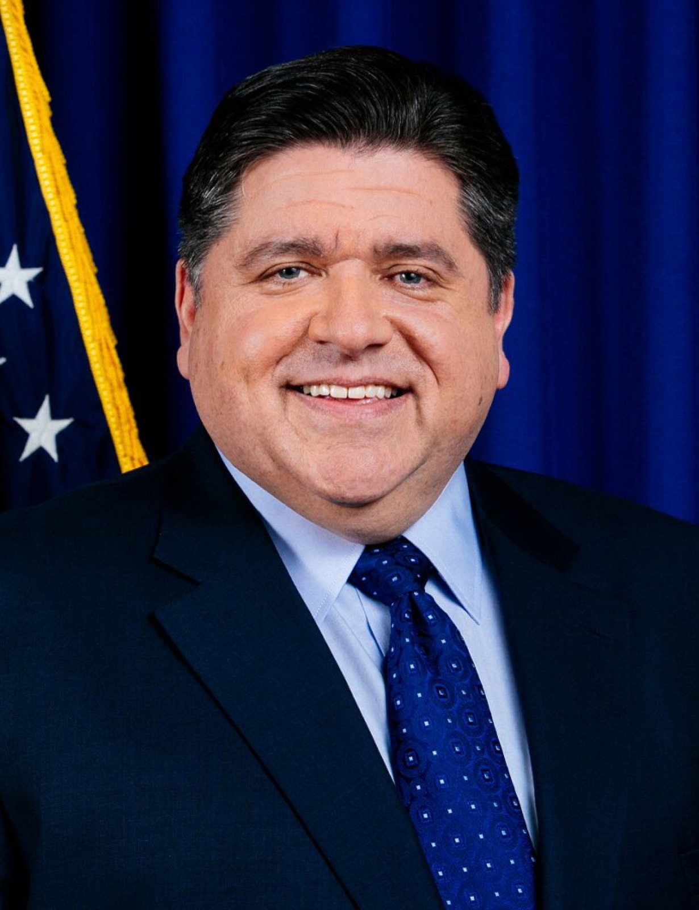
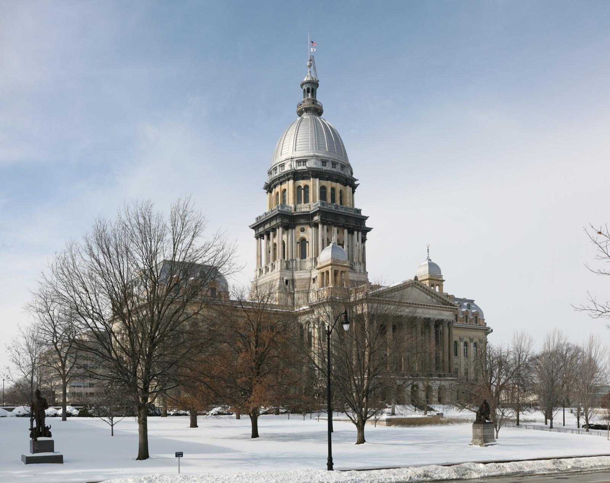
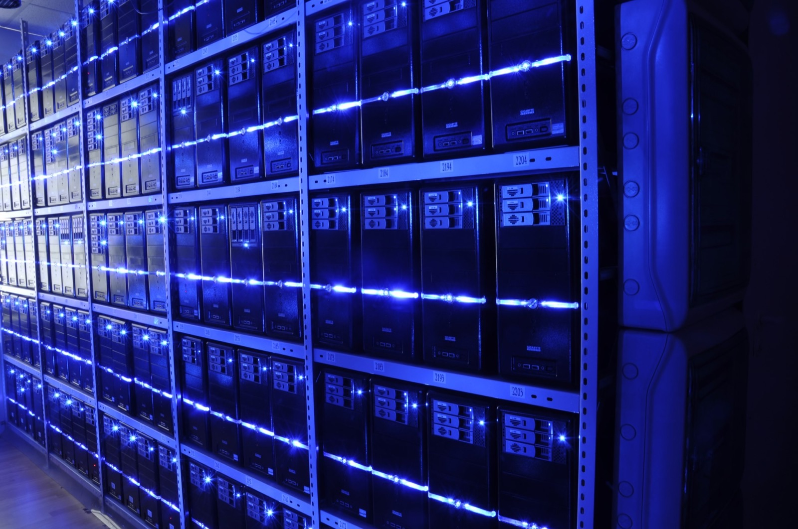

# Illinois Becomes the First State to Put Frontier AI Under Annual Outside Audit

_SB 315 adds an independent yearly safety audit that California and New York never required, and the evidence auditors will check ultimately points to data provenance and evaluation logs_

## Executive Summary

> [!callout]
> On July 6, 2026, Illinois Governor J.B. Pritzker signed SB 315, the Artificial Intelligence Safety Measures Act. The law requires large frontier AI developers to undergo an independent third-party annual safety audit. No other U.S. state had done this.

> California and New York had already moved to regulate frontier AI, but under both laws a company's obligation ends once it publishes its own safety framework. Nothing forced an outside party to check that the framework matched reality. Illinois added exactly that layer: every year, a party with no stake in the company audits the developer and releases a public summary.

> What the auditor will actually have to verify runs deeper than the statute spells out. It never names "training data," yet the moment an audit tries to secure substance rather than paperwork, the auditor's questions travel down to data provenance and evaluation logs.

### Key Figures

Who this law applies to, what it demands, and when it starts compress into four numbers. It targets the handful of large developers earning more than $500 million a year and training models above 10²⁶ compute operations; the annual independent third-party audit they must undergo is the first such mandate in the United States; and that audit obligation takes effect in January 2028.

Sources: [Governor Pritzker Newsroom (2026-07-06)](https://gov-pritzker-newsroom.prezly.com/gov-pritzker-signs-nation-leading-artificial-intelligence-safety-law), [Crowell & Moring](https://www.crowell.com/en/insights/client-alerts/illinois-imposes-transparency-and-safety-obligations-on-frontier-ai-systems)

<!-- stat-card -->
**U.S. First** — Annual frontier AI audit — First state law to mandate a third-party audit

<!-- stat-card -->
**$500M** — Revenue threshold for audits — Developers earning over $500M a year

<!-- stat-card -->
**10²⁶** — Frontier model compute — Models trained above 10²⁶ operations (FLOP)

<!-- stat-card -->
**Jan 2028** — Audit obligation begins — Effective date of the core provisions

## The First State to Put Frontier AI Under Yearly Outside Audit

SB 315's target is clear: large developers that earn more than $500 million a year and build frontier models trained on more than 10²⁶ compute operations. Companies at the scale of OpenAI, Anthropic, Google, and Meta fall inside that line. Each of them must undergo an independent third-party safety audit every year.

The audit report goes to the state, and a summary is made public within 30 days. Refusing an audit or making a material misrepresentation can carry civil penalties running as high as $1 million to $3 million depending on the case. With federal regulation stalled, a state has been the first to write the audit itself into law.

The bill passed both chambers by lopsided margins (110-0, 52-5). At the signing, Governor Pritzker described it as a "nation-leading" measure. Illinois is, in fact, the first U.S. state to force outside audits on large developers.

*▲ Governor Pritzker signed SB 315, creating the first state-mandated annual frontier AI audit in the U.S. | Source: [Wikimedia Commons](https://commons.wikimedia.org/wiki/File:Governor_JB_Pritzker_official_portrait_2019_(crop).jpg)*

## What California and New York Share, and What Only Illinois Has

California's SB 53 (September 2025) and New York's RAISE Act (December 2025) also require large developers to publish a frontier AI safety framework and report critical incidents. On direction, the three states agree. But in California and New York the obligation stops once a company issues its own framework. There is no procedure for anyone outside to confirm that the framework holds up.

Illinois SB 315 laid an audit on top of that gap. Every year, a third party with no financial stake verifies whether the company's framework matches its actual operations and files the result with the state. California's original SB 1047 draft had contained a third-party audit clause, but it was dropped before final passage. Illinois filled the empty seat.

*▲ The Illinois State Capitol in Springfield, where SB 315 passed and was signed into law | Source: [Wikimedia Commons](https://commons.wikimedia.org/wiki/File:Illinois_State_Capitol_pano.jpg)*

| State Law | Core Obligation | Third-Party Annual Audit |
| --- | --- | --- |
| California SB 53 | Publish safety framework · report incidents | None (ends at self-disclosure) |
| New York RAISE Act | Publish detailed framework · report incidents | None (ends at self-disclosure) |
| Illinois SB 315 | Publish framework + annual audit · public summary | Yes (independent third party) |

The difference fits in one line. Where California and New York made "the company speak," Illinois made "an outsider confirm."

## What the Auditor Sees, and Why It Descends to the Data

The frontier AI framework the law defines covers five things: assessing and mitigating catastrophic risk, internal governance, cybersecurity practices, incorporating third-party evaluation results, and risks arising from internal use. The auditor verifies whether the company's approach to these five items matches its actual operations, and records any material deviation from compliance in the report.

Here is where the point that matters to data and AI practitioners appears. The statute itself does not use the words "training data." What is audited is, strictly speaking, the approach the company describes. But for an audit to secure substance rather than confirm paperwork, the auditor eventually has to look at verifiable underlying evidence. You cannot answer "did you properly mitigate catastrophic risk" without checking which data evaluated what, and whether those evaluation logs still exist.

This reasoning is backed by the audit-methodology literature. The body of work on frontier AI auditing organized by researchers at GovAI and others points out that self-reported company documents yield only a low level of assurance. To reach high assurance, an auditor must have direct access to non-public information such as the training process, compute allocation, and evaluation records. Beneath each item in the catalog sits the same question: when, with what data, and with which logs was this confirmed?

*▲ What an auditor ultimately has to check isn't paperwork — it's the servers holding training data and evaluation logs (illustrative) | Source: [Wikimedia Commons](https://commons.wikimedia.org/wiki/File:BalticServers_data_center.jpg)*

> [!callout]
> Even where the statutory text avoids the word, an audit with substance turns data provenance and evaluation logs into evidence. At the audit stage, "is the AI safe" becomes "with what data, and with what records, did you confirm it?"

## An Imperfect Audit, but an Era Already Underway

This does not mean the audit regime is airtight. The same research flags its limits. Some developers have publicly narrowed the scope of their own audits to confirming procedural compliance rather than guaranteeing substantive outcomes, and there is concern that audit firms are exposed to a conflict of interest in not wanting to lose a large client. The risk is a "compliant" verdict where the reality is noncompliance. The Illinois law bars a financial relationship between auditor and developer, but the industry group TechNet objected that, with no national standard or credentialing system, it leaves a subjective judgment to private actors.

Even so, the current runs one way. Just three weeks ago, Pebblous noted that a [U.S. House GAAIA draft would institutionalize this audit as a licensed profession (the IVO)](../../gaaia-ivo-ai-audit-license/en/). That was still a discussion draft. Illinois SB 315 got there first, actually signed into law and set to take effect in January 2028. The distance between a draft and an enacted law is the distance between "someday" and "starting now."

*▲ Congress is still working from a draft. Illinois got there first with a signed law | Source: [Wikimedia Commons](https://commons.wikimedia.org/wiki/File:United_States_Capitol_dome_daylight.jpg)*

> [!callout]
> Once audits harden into an institution, a gap opens between organizations that start leaving audit-worthy evidence now and those that scramble to reconstruct it afterward. The moment where data provenance and passed evaluations are kept in traceable form becomes the practical currency of regulatory compliance.

## References

### Primary Sources & Official Statements

- 1.Office of Governor JB Pritzker. (2026). "[Gov. Pritzker Signs Nation-Leading Artificial Intelligence Safety Law](https://gov-pritzker-newsroom.prezly.com/gov-pritzker-signs-nation-leading-artificial-intelligence-safety-law)." _Illinois Governor's Newsroom_.
- 2.Illinois General Assembly. (2026). "[SB 315 — Artificial Intelligence Safety Measures Act](https://www.ilga.gov/Legislation/BillStatus?DocNum=315&DocTypeID=SB&GA=104&GAID=18&SessionID=114)." _104th General Assembly_.

### News Coverage & Legal Analysis

- 3.The Hill. (2026). "[Illinois becomes first state to require third-party audit of AI models](https://thehill.com/policy/technology/5955442-illinois-ai-safety-bill/)." _The Hill_. — Vote counts, penalty amounts, and industry reaction.
- 4.Capitol News Illinois. (2026). "[Pritzker signs landmark AI regulation bill that aims to mitigate risks](https://capitolnewsillinois.com/news/pritzker-signs-landmark-ai-regulation-bill-that-aims-to-mitigate-risks/)." _Capitol News Illinois_.
- 5.StateScoop. (2026). "[Illinois governor signs AI safety law requiring audits of frontier models](https://statescoop.com/illinois-ai-safety-law-audits-frontier-models/)." _StateScoop_.
- 6.Crowell & Moring LLP. (2026). "[Illinois Imposes Transparency and Safety Obligations on Frontier AI Systems](https://www.crowell.com/en/insights/client-alerts/illinois-imposes-transparency-and-safety-obligations-on-frontier-ai-systems)." _Crowell & Moring Client Alerts_. — Detailed analysis of the five audit-framework items and effective dates.
- 7.Buchanan Ingersoll & Rooney PC. (2026). "[Illinois SB 315: Pioneering AI Safety Regulations and the Future of Responsible AI Governance](https://www.bipc.com/illinois-sb-315-pioneering-ai-safety-regulations-and-the-future-of-responsible-ai-governance)." _Buchanan Ingersoll & Rooney Insights_.
- 8.Akerman LLP. (2026). "[Illinois SB 315: A State Strategy for Enduring National AI Safety Standards](https://www.akerman.com/en/perspectives/illinois-sb-315-a-state-strategy-for-enduring-national-ai-safety-standards.html)." _Akerman Perspectives_. — Analysis of audit reliability concerns and TechNet's objections.

### Comparative Analysis

- 9.Future of Privacy Forum. (2026). "[The RAISE Act vs. SB 53: A Tale of Two Frontier AI Laws](https://fpf.org/blog/the-raise-act-vs-sb-53-a-tale-of-two-frontier-ai-laws/)." _FPF Blog_.
- 10.Future of Privacy Forum. (2026). "[California's SB 53: The First Frontier AI Law, Explained](https://fpf.org/blog/californias-sb-53-the-first-frontier-ai-law-explained/)." _FPF Blog_.

### Academic Papers & Industry Technical Reports

- 11.Centre for the Governance of AI (GovAI). (2026). "[Frontier AI Auditing: Toward Rigorous Third-Party Assessment of Safety and Security Practices at Leading AI Companies](https://arxiv.org/abs/2601.11699)." _arXiv_. — On the low assurance of self-reported documents and the need for access to non-public information.
- 12.Centre for the Governance of AI, Cambridge, Oxford Martin, METR. (2025). "[Third-Party Compliance Reviews for Frontier AI Safety Frameworks](https://arxiv.org/pdf/2505.01643)." _arXiv_. — Compliance-review methodology, conflict-of-interest and self-reporting limits.
- 13.Frontier Model Forum. (2025). "[Third-Party Assessments](https://www.frontiermodelforum.org/technical-reports/third-party-assessments/)." _Frontier Model Forum Technical Reports_.
