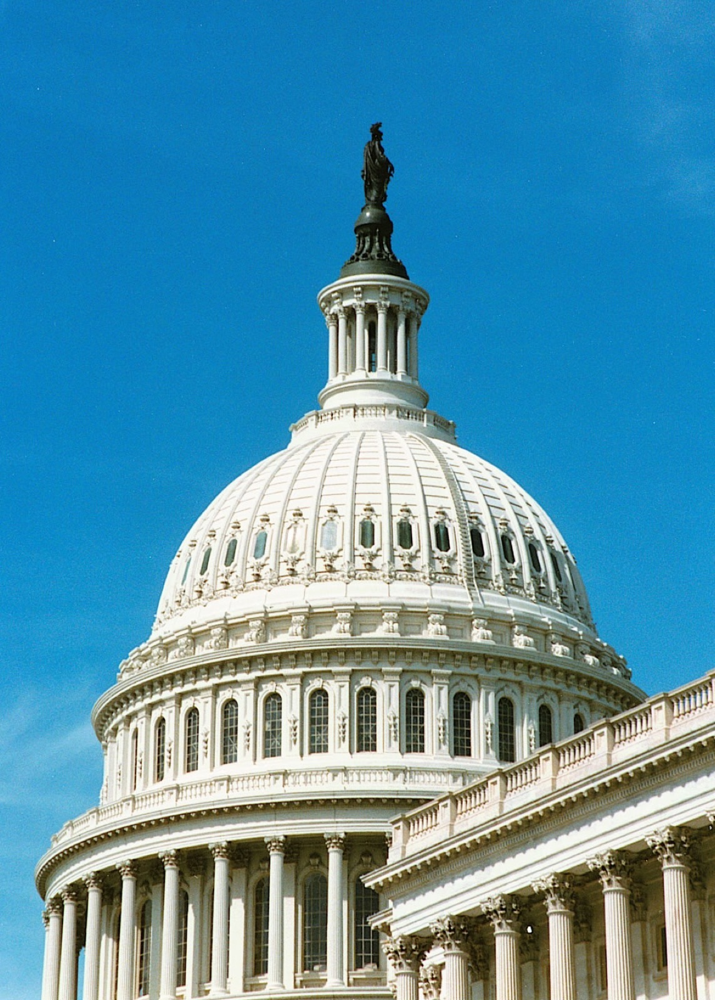

# 프런티어 AI를 매년 외부 감사에 맡긴 미국 첫 주법

_일리노이 SB 315가 캘리포니아·뉴욕에 없던 제3자 연례 감사를 의무화하며, 감사관이 검증할 증거가 결국 데이터 출처와 평가 로그로 수렴한다_

## Executive Summary

> [!callout]
> 2026년 7월 6일, 일리노이 주지사 J.B. 프리츠커가 SB 315 인공지능 안전조치법(Artificial Intelligence Safety Measures Act)에 서명했다. 이 법은 대형 프런티어 AI 개발사에게 독립적인 제3자의 연례 안전 감사를 의무화한다. 미국의 어느 주도 하지 않았던 조항이다.

> 캘리포니아와 뉴욕도 앞서 프런티어 AI를 규제했지만, 두 법은 회사가 스스로 안전 프레임워크를 공개하면 의무가 끝난다. 그 내용을 외부가 강제로 확인하는 절차는 없었다. 일리노이가 여기에 매년 이해관계 없는 제3자가 감사하고 요약본을 공개하는 한 겹을 더했다.

> 정작 감사관이 검증하게 될 대상은 조문에 다 적혀 있지 않다. 법 조문은 "학습데이터"를 명시하지 않지만, 감사가 형식을 넘어 실질을 담보하려는 순간 감사관의 질문은 결국 데이터 출처와 평가 로그로 내려간다.

### 주요 수치

이 법이 누구에게, 무엇을, 언제부터 요구하는지는 네 개의 숫자로 압축된다. 대상은 연매출 5억 달러를 넘고 10²⁶ 연산 이상으로 학습된 소수의 대형 개발사이고, 이들이 매년 받아야 하는 독립 제3자 감사는 미국에서 일리노이가 처음 강제했으며, 그 감사 의무는 2028년 1월부터 효력을 갖는다.

출처: [Governor Pritzker Newsroom (2026-07-06)](https://gov-pritzker-newsroom.prezly.com/gov-pritzker-signs-nation-leading-artificial-intelligence-safety-law), [Crowell & Moring](https://www.crowell.com/en/insights/client-alerts/illinois-imposes-transparency-and-safety-obligations-on-frontier-ai-systems)

<!-- stat-card -->
**미국 1호** — 프런티어 AI 연례 감사 — 제3자 감사를 강제한 첫 주법

<!-- stat-card -->
**$500M** — 감사 의무 매출 기준 — 연매출 5억 달러 초과 개발사

<!-- stat-card -->
**10²⁶** — 프런티어 모델 컴퓨팅 — 연산(FLOP) 이상으로 학습된 모델

<!-- stat-card -->
**2028.01** — 감사 의무 시행 — 핵심 조항 시행 예정 시점

## 프런티어 AI를 매년 외부 감사에 맡긴 첫 주법

SB 315가 겨냥하는 대상은 분명하다. 연매출 5억 달러를 넘고, 10²⁶ 연산 이상의 컴퓨팅으로 학습된 프런티어 모델을 만드는 대형 개발사다. OpenAI, Anthropic, Google, Meta 수준의 회사가 여기에 해당한다. 이들은 매년 독립적인 제3자의 안전 감사를 받아야 한다.

감사 보고서는 주 정부에 제출되고, 요약본은 30일 안에 공개된다. 감사를 거부하거나 중대한 허위 진술을 하면 사안에 따라 최대 100만~300만 달러의 과징금이 붙는다. 연방 차원의 규제가 교착에 빠진 사이, 주 정부가 먼저 감사라는 장치를 법에 새겨 넣은 셈이다.

법안은 양원에서 압도적 지지로 통과했다(110-0, 52-5). 프리츠커 주지사는 서명 자리에서 이 법을 "국가를 선도하는(nation-leading)" 조치로 소개했다. 실제로 대형 개발사에게 외부 감사를 강제한 주는 미국에서 일리노이가 처음이다.

*▲ 프리츠커 주지사가 SB 315에 서명하며 미국 최초의 프런티어 AI 연례 감사 의무를 만들었다 | Source: [Wikimedia Commons](https://commons.wikimedia.org/wiki/File:Governor_JB_Pritzker_official_portrait_2019_(crop).jpg)*

## 캘리포니아·뉴욕에도 있던 것, 일리노이에만 있는 것

캘리포니아 SB 53(2025년 9월)과 뉴욕 RAISE Act(2025년 12월)도 대형 개발사에게 프런티어 AI 안전 프레임워크를 공개하고 중대 사고를 보고하도록 요구한다. 규제의 방향은 세 주가 같다. 다만 캘리포니아와 뉴욕은 회사가 스스로 프레임워크를 발행하는 데서 의무가 멈춘다. 그 말이 맞는지 바깥에서 확인하는 절차가 빠져 있다.

일리노이 SB 315는 그 지점에 감사를 얹었다. 매년 재정적 이해관계가 없는 제3자가 회사의 프레임워크와 실제 운영이 일치하는지 검증하고, 결과를 주 정부에 제출하도록 했다. 원래 캘리포니아 SB 1047 초안에도 제3자 감사 조항이 있었지만 최종 통과 전에 빠졌다. 일리노이가 그 빈자리를 메웠다.

*▲ 스프링필드에 있는 일리노이 주 의사당. SB 315가 통과되고 서명된 곳이다 | Source: [Wikimedia Commons](https://commons.wikimedia.org/wiki/File:Illinois_State_Capitol_pano.jpg)*

| 주법 | 핵심 의무 | 제3자 연례 감사 |
| --- | --- | --- |
| 캘리포니아 SB 53 | 안전 프레임워크 공개 · 사고 보고 | 없음(자기 공개로 종료) |
| 뉴욕 RAISE Act | 프레임워크 상세 공개 · 사고 보고 | 없음(자기 공개로 종료) |
| 일리노이 SB 315 | 프레임워크 공개 + 연례 감사 · 요약 공개 | 있음(독립 제3자) |

차이는 한 줄로 요약된다. 캘리포니아와 뉴욕이 "회사가 말하게" 했다면, 일리노이는 "외부가 확인하게" 했다.

## 감사관은 무엇을 보는가, 그리고 왜 데이터로 내려가는가

법이 규정한 프런티어 AI 프레임워크는 다섯 가지를 담는다. 재난급 위험(catastrophic risk) 평가와 완화, 내부 거버넌스, 사이버보안 실행, 제3자 평가 결과의 반영, 그리고 내부 사용에서 생기는 위험이다. 감사관은 이 다섯 항목에 대한 회사의 접근 방식이 실제 운영과 일치하는지 검증하고, 준수에서 벗어난 실질적 이탈(material deviation)을 보고서에 적는다.

여기서 데이터·AI 실무자가 주목할 지점이 나온다. 법 조문 자체는 "학습데이터(training data)"라는 단어를 쓰지 않는다. 감사 대상은 어디까지나 회사가 기술한 접근 방식이다. 그러나 감사가 서류 확인을 넘어 실질을 담보하려면, 감사관은 결국 검증 가능한 근거 자료를 봐야 한다. 어떤 데이터로 무엇을 평가했고, 그 평가 로그가 남아 있는지를 확인하지 않고서는 "재난급 위험을 제대로 완화했는가"에 답할 수 없다.

이 추론은 감사 방법론 연구가 뒷받침한다. GovAI를 비롯한 연구진이 정리한 프런티어 AI 감사 문헌은, 회사의 자기보고 문서만으로는 낮은 수준의 확신(assurance)밖에 얻지 못한다고 지적한다. 높은 확신을 얻으려면 훈련 과정, 컴퓨팅 배분, 평가 기록 같은 비공개 정보에 감사관이 직접 접근해야 한다는 것이다. 카탈로그의 항목 하나하나 아래에는 결국 "언제, 어떤 데이터로, 어떤 로그로 이것을 확인했는가"가 놓인다.

*▲ 감사관이 결국 확인해야 하는 것은 서류가 아니라 학습데이터와 평가 로그가 쌓인 서버다 (개념 이미지) | Source: [Wikimedia Commons](https://commons.wikimedia.org/wiki/File:BalticServers_data_center.jpg)*

> [!callout]
> 법 문언이 그 단어를 쓰지 않아도, 감사가 실질을 가지려면 데이터의 출처와 평가 로그가 증거가 된다. "AI가 안전한가"라는 물음은 감사 단계에서 "그것을 무슨 데이터로, 어떤 기록으로 확인했는가"라는 물음으로 바뀐다.

## 완벽하지 않은 감사, 그러나 이미 시작된 시대

이 감사 체계가 완벽하다는 뜻은 아니다. 같은 연구들은 한계도 짚는다. 어떤 개발사는 자사 감사 범위를 절차 준수의 확인일 뿐 실질 결과에 대한 보증은 아니라고 스스로 좁혀 공개했고, 감사기관이 큰 고객을 잃지 않으려는 이해충돌에 노출된다는 우려도 있다. 실제로는 미준수인데 준수로 판정하는 위험이다. 일리노이법은 감사자와 개발자 사이의 재정적 이해관계를 금지했지만, 업계 단체 TechNet은 국가 표준이나 자격 체계 없이 민간에 주관적 판단을 맡긴다고 반발했다.

그럼에도 흐름은 한곳으로 모인다. 불과 3주 전, 페블러스는 [미 하원 GAAIA 초안이 이 감사를 면허받은 전문 직업(IVO)으로 제도화하려 한다](../../gaaia-ivo-ai-audit-license/ko/)고 짚었다. 그것은 아직 토론용 초안이었다. 일리노이 SB 315는 그보다 앞서 실제로 서명되어 2028년 1월 시행을 앞두고 있다. 초안과 발효된 법의 차이는 "언젠가"와 "이제부터"의 차이다.

*▲ 연방 의회는 아직 초안 단계다. 일리노이는 이미 서명된 법으로 앞서 나갔다 | Source: [Wikimedia Commons](https://commons.wikimedia.org/wiki/File:United_States_Capitol_dome_daylight.jpg)*

> [!callout]
> 감사가 제도로 굳어지면, 통과할 증거를 지금부터 남기는 조직과 사후에 급히 재구성하려는 조직 사이에 격차가 벌어진다. 데이터가 어디서 왔고 어떤 평가를 통과했는지를 추적 가능한 형태로 남기는 일이, 규제 준수의 실질적 통화가 되는 순간이다.

## 참고문헌

### 1차 소스·공식 발표

- 1.Office of Governor JB Pritzker. (2026). "[Gov. Pritzker Signs Nation-Leading Artificial Intelligence Safety Law](https://gov-pritzker-newsroom.prezly.com/gov-pritzker-signs-nation-leading-artificial-intelligence-safety-law)." _Illinois Governor's Newsroom_.
- 2.Illinois General Assembly. (2026). "[SB 315 — Artificial Intelligence Safety Measures Act](https://www.ilga.gov/Legislation/BillStatus?DocNum=315&DocTypeID=SB&GA=104&GAID=18&SessionID=114)." _104th General Assembly_.

### 뉴스 보도·법률 분석

- 3.The Hill. (2026). "[Illinois becomes first state to require third-party audit of AI models](https://thehill.com/policy/technology/5955442-illinois-ai-safety-bill/)." _The Hill_. — 표결 결과와 과징금 액수, 업계 반응.
- 4.Capitol News Illinois. (2026). "[Pritzker signs landmark AI regulation bill that aims to mitigate risks](https://capitolnewsillinois.com/news/pritzker-signs-landmark-ai-regulation-bill-that-aims-to-mitigate-risks/)." _Capitol News Illinois_.
- 5.StateScoop. (2026). "[Illinois governor signs AI safety law requiring audits of frontier models](https://statescoop.com/illinois-ai-safety-law-audits-frontier-models/)." _StateScoop_.
- 6.Crowell & Moring LLP. (2026). "[Illinois Imposes Transparency and Safety Obligations on Frontier AI Systems](https://www.crowell.com/en/insights/client-alerts/illinois-imposes-transparency-and-safety-obligations-on-frontier-ai-systems)." _Crowell & Moring Client Alerts_. — 감사 프레임워크 5개 항목 및 시행일 해설.
- 7.Buchanan Ingersoll & Rooney PC. (2026). "[Illinois SB 315: Pioneering AI Safety Regulations and the Future of Responsible AI Governance](https://www.bipc.com/illinois-sb-315-pioneering-ai-safety-regulations-and-the-future-of-responsible-ai-governance)." _Buchanan Ingersoll & Rooney Insights_.
- 8.Akerman LLP. (2026). "[Illinois SB 315: A State Strategy for Enduring National AI Safety Standards](https://www.akerman.com/en/perspectives/illinois-sb-315-a-state-strategy-for-enduring-national-ai-safety-standards.html)." _Akerman Perspectives_. — 감사 신뢰성과 TechNet 반발 관련 분석.

### 비교 분석

- 9.Future of Privacy Forum. (2026). "[The RAISE Act vs. SB 53: A Tale of Two Frontier AI Laws](https://fpf.org/blog/the-raise-act-vs-sb-53-a-tale-of-two-frontier-ai-laws/)." _FPF Blog_.
- 10.Future of Privacy Forum. (2026). "[California's SB 53: The First Frontier AI Law, Explained](https://fpf.org/blog/californias-sb-53-the-first-frontier-ai-law-explained/)." _FPF Blog_.

### 학술 논문·업계 기술 보고서

- 11.Centre for the Governance of AI (GovAI). (2026). "[Frontier AI Auditing: Toward Rigorous Third-Party Assessment of Safety and Security Practices at Leading AI Companies](https://arxiv.org/abs/2601.11699)." _arXiv_. — 자기보고 문서의 낮은 확신 수준, 비공개 정보 접근의 필요성.
- 12.Centre for the Governance of AI, Cambridge, Oxford Martin, METR. (2025). "[Third-Party Compliance Reviews for Frontier AI Safety Frameworks](https://arxiv.org/pdf/2505.01643)." _arXiv_. — 준수 감사(compliance review) 방법론, 이해충돌·자기보고 한계.
- 13.Frontier Model Forum. (2025). "[Third-Party Assessments](https://www.frontiermodelforum.org/technical-reports/third-party-assessments/)." _Frontier Model Forum Technical Reports_.
