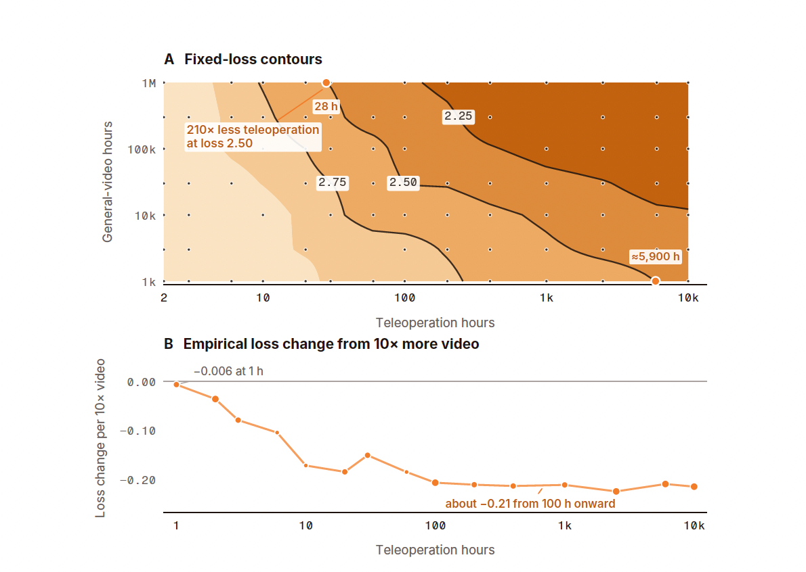

# Perceptron

_Isaac 0.5 learned from one million hours of general video, and the EU AI Act requires that origin on file_

## Executive Summary

> [!callout]
> On August 26, Perceptron, a startup founded by two former Meta FAIR research scientists, released Isaac 0.5, a robot foundation model built for factories and warehouses. It is a 36-billion-parameter model trained on three trillion multimodal tokens, one million hours of general video among them, and the company says it is releasing the model with open weights. But how far that word open reaches turns out to differ item by item.

> TechCrunch, reporting the launch, glossed open-weight to mean that the model's parameters and training materials can be inspected by anyone. A few paragraphs later the same article notes that the company is not disclosing the sources of its training data. The 52-page technical report reads the same way. It states that the training mixture is drawn from 529 source streams and reports the share of every component to one decimal place, and it never identifies a single one of those 529 streams. One clause saying that some of the robot material came from public datasets is the whole of it.

> This blank is not a matter of taste. Ai2's MolmoAct 2, which this blog covered in June, shipped 720 hours of robot data alongside its weights, and Isaac 0.5's own comparison table files both models under the same heading, Open source: Yes. The same check mark is covering two very different thicknesses. And the company that puts this model on a European factory line is the party that will have to fill in the training-data documentation the EU AI Act requires.

### Key numbers

Source: [Perceptron, Isaac 0.5 technical report](https://pub-d90b81cad7254a1aa6b148ac18153c0c.r2.dev/isaac-0.5.pdf) (checked August 28, 2026)

The technical report carries some of its numbers out to the decimal place and leaves other slots entirely blank. It works out how far cheap video displaced expensive robot data (210×), and how many streams the training mixture was drawn from (529). Not one passage says what those streams are (0), and next to the price it puts on an hour of video ($0.10) there is no name for whoever licensed it.

<!-- stat-card -->
**210×** — Drop in required teleoperation — Raising general video from 1,000 to one million hours moved the crossing from 5,884 hours to 28. The adjacent measured rungs bound it at 83× to 300×

<!-- stat-card -->
**529** — Source streams in the mixture — Component shares are published to one decimal place; the name and origin of each individual stream is not

<!-- stat-card -->
**0** — Data-source statements in the report — The words data source, privacy, consent and copyright never appear across the 52 pages

<!-- stat-card -->
**$0.10** — Planning price per hour of general video — The cost item is listed as licensing, filtering, storage. Nobody is named as the licensor

## What Isaac 0.5 Promises the Factory

Isaac 0.5 is a 36-billion-parameter sparse model that handles video understanding, spatial grounding, task-progress estimation and robot control on a single backbone. A Qwen-family backbone holds 256 experts, and every token routes to anywhere between zero and eight of them, which lets the model spend different amounts of compute on visual tokens and on action tokens. Training drew on 100,000 hours of robot experience gathered across more than 35 robot systems, the model card says.

*▲ Four source families merge into one backbone through the mHarmony compiler. The original notes that "every source keeps provenance, time, and embodiment" — yet neither this diagram nor the report body says what that provenance actually is | Source: [Perceptron, Isaac 0.5 model card (Figure 2)](https://huggingface.co/PerceptronAI/Isaac-0.5)*

Table 1 of the technical report breaks those 100,000 hours apart. Ten thousand hours are high-quality demonstrations recorded by people driving robots directly, 40,000 hours are broader and more heterogeneous robot trajectories, and the remaining 50,000 hours come from video games and simulation. Half of what the label robot experience covers is not a recording of a real robot. The video is not one thing either. Next to the million hours of general video sit 375,000 hours of egocentric video, shot by people wearing cameras, and 375,000 hours of UMI video, which records human hand motion through a handheld gripper rig. The report scaled all three together at a fixed 80:30:30 ratio. The pile usually summarized as a million hours is in fact 1.75 million, and 750,000 of those hours are footage of people.

The example the company reaches for is a package-sorting robot in a warehouse. Read the label on the box, work out where the boxes are and how they sit, decide which one to pick up first. Today separate pieces of software handle those steps. Co-founder Akshat Shrivastava says the goal is to have one model carry the sequence through from end to end. The company lists manufacturing, logistics and warehousing, security, mobility, and media and entertainment as its target industries.

The finding the technical report leads with, though, is not a benchmark score. It is an exchange rate. Teleoperation data is demonstration footage produced by a person driving a robot, and every hour of it ties up a robot, an operator and a task setup for that entire hour. The report's planning price for it is $100 an hour. General video, by contrast, is cheap and plentiful. The researchers raised the general-video budget from 1,000 hours to one million and measured the point where the teleoperation hours needed to reach the same action-prediction loss fell from 5,884 to 28. That is a factor of 210.3.

The report attaches its own cautions to that number. That 210.3× is a crossing found inside the measurement grid, and bounded by the adjacent measured teleoperation rungs the report puts the range at 83× to 300×. A second caution follows. The figure holds when the action-loss threshold sits at 2.50; in Appendix Table 14, loosening the threshold to 2.75 gives 27.6× and 3.00 gives 5.7×. The report itself states that "video scale is a lever on robot-data efficiency within this recipe, not a replacement for action-grounded data." Neither the sensitivity nor the 83× to 300× bracket was carried over into the model card. The direction holds all the same. If expensive robot data can be substituted in large part by cheap video, the axis of competition among robot foundation models moves from how many robots a company owns to how much video it has secured.

*▲ Loss contours across general-video and teleoperation hours. Raising video to one million hours reaches the same loss at 28 teleoperation hours that 1,000 hours of video needed 5,900 hours to reach (A). The loss improvement per 10× more video flattens out past 100 hours (B) | Source: [Perceptron, Isaac 0.5 technical report](https://pub-d90b81cad7254a1aa6b148ac18153c0c.r2.dev/isaac-0.5.pdf)*

> [!callout]
> **Key point**: Isaac 0.5's real claim is about procurement, not performance. Buy one million hours of general video instead of 5,884 hours of teleoperation and you arrive at the same place. Which makes the next question the obvious one. Where did that million hours come from?

## No Weights Behind the Open-Weight Label

Perceptron calls Isaac 0.5 an open model, and the closing paragraph of the model card says the company is releasing it "with its weights, code, interfaces, benchmarks, and manifests so others can inspect, reproduce, and extend the work." TechCrunch picked up the same framing and wrote that its parameters and training materials can be inspected by anyone. Opened item by item through the public channels, that sentence turns out to cover five things in five different states.

| Item | As announced | Checked on August 28, 2026 |
| --- | --- | --- |
| Code | Open | The GitHub repository is open under Apache-2.0. What is inside it is a LICENSE, a README, and a submodule pointing at the company's own LeRobot fork |
| Weights | Open-weight | The model card link reads Download the weights (COMING SOON). No weight files in the repository, downloads at 0 |
| License | Not stated | An editor's note telling someone to add the final license before publication is still sitting at the top of the model card |
| Training objective | Described in the paper | The report calls it proprietary itself. The target construction and the loss implementation are withheld |
| Training data | Volume only | Volumes and component ratios published in detail, sources and collection methods not stated |

At the moment it was being reported as open-weight, the weight files did not exist. Three days after the announcement, on August 28, the model card link still reads COMING SOON and the download count is still zero. The unsettled license is enough on its own to halt an adoption review, because there is no way to tell whether commercial use is permitted. For reference, the earlier Isaac 0.1 and its base model in the same line can still be downloaded today, under CC BY-NC 4.0, which rules commercial use out.

The release list also contains a promise about data. One item pledges checkpoint, data, and model-I/O manifests, and a data manifest reads like an inventory of what was used. In the 52-page report the word manifest is used in exactly one place, and it refers to an input-output contract that fingerprints the token encoding. The GitHub repository that is open right now measures 11 kilobytes in total.

The model card carries a comparison table headed Where Isaac sits among open models, and the rightmost column is labeled Open source. Isaac 0.5 is Yes. MolmoAct2 is Yes, π0.5 is Yes, SmolVLA and Octo and OpenVLA are Yes. A model whose 720 hours of robot data can be downloaded this minute and a model whose weight file has not been uploaded sit in the same column under the same word.

> [!callout]
> **Key point**: open-weight comes without gradations. Code, weights, license, training objective and data each open and close on their own schedule, and the table has one box for all five. An adoption review has to set that word aside and ask about the five states one at a time.

## The Report Names None of Its 529 Streams

The Isaac 0.5 technical report is not a document that is stingy about data. Quite the opposite. The training mixture is made of 529 source streams, and the report gives both the rate at which the scheduler draws each component (69.7% perception and reasoning, 30.3% robotics) and the share of packed tokens that actually reached training (20.4% and 79.6% respectively), to one decimal place. It goes on to explain why the two figures invert, and what reading only one of them would lead you to misjudge.

The counting is meticulous. The 529 streams are broken out by task with counts attached: 199 for visual question answering and reasoning, 135 for video understanding, 76 for pointing and spatial grounding, 56 for robotics and control, 32 for document and OCR, 20 for captioning, and 11 for the remaining instruction data that belongs nowhere else. The 135 video streams split again into 105 general, 18 egocentric and 12 UMI. A category of 11 was counted out, and not one of the streams inside it was named.

Streams are not the only thing left unnamed. Search the 52 pages and the words data source, privacy, consent and copyright never appear once. The word provenance appears four times, in a different sense. It describes the company's own pipeline carrying a timestamp and a coordinate frame along with each event, internal plumbing rather than an account of where the data came from. Ego4D appears twice, as someone else's dataset named in a related-work paragraph and in the bibliography. Twenty tables are included, among them benchmark tables and lists of robot platforms, and none of them sets out the sources of the training data.

The sentence that comes closest to a source turns up in an unlikely place. While explaining how the pipeline filters out stretches of a recording where nothing happens, the report notes in passing that "in the open-source robotics datasets we process, a recorded trajectory can contain long periods of waiting." Some of the robot material came from public datasets, then, though which datasets goes unsaid, and the 1.75 million hours of video get not even this much. What the company has said publicly about sources amounts to one sentence in an interview. Shrivastava told TechCrunch that the company had "internally built petabyte-scale datasets that span across modalities, whether it's images, text, video, etc. all the way through robotic trajectories." Internally built could mean shot in-house, or bought, or gathered from public material. The word petabyte does not appear in the 52-page report, and neither does internally.

In the cost table the blank surfaces as a price. Planning future data purchases, the report puts an hour of general video at $0.10 and lists the treatment for that item as licensing, filtering, storage. It writes down that the video is licensed and does not write down who licenses it. Inside the plan, that item's share is strikingly small. The combined recipe costs $329.30 per accepted teleoperation hour, and the ten hours of general video inside it come to $1. The passive egocentric capture and the UMI rig work, meanwhile, are $112.50 each. Video shot by paying people is itemized down to capture and quality assurance, and video said to be licensed is handled at ten cents an hour. The training annotations are in a similar position. Activity-segment annotations were generated with the company's own proprietary Perceptron Mk1 model, the report says, and Mk1 is a commercial product reachable only through an API.

*▲ The report's modeled optimal data mix at each budget (A) and the loss curve along that path (B), holding teleoperation to general-to-egocentric-to-UMI video at a fixed 1:10:3.75:3.75 ratio. The report does not say where the video behind this curve came from | Source: [Perceptron, Isaac 0.5 technical report (Figure 8)](https://pub-d90b81cad7254a1aa6b148ac18153c0c.r2.dev/isaac-0.5.pdf)*

Egocentric video is a slightly different case. How that footage was processed is described in detail. In each frame the left and right hands are localized with boxes and anatomical keypoints, and time-aligned labels record what each hand is doing, which object it is manipulating, whether contact occurred and whether the hand is visible. The worked example is someone laying a fried egg onto a sandwich. That treatment was applied to 375,000 hours of human hands, and who those people are and whether they agreed to be recorded is not written down anywhere. Zero occurrences of privacy across those 52 pages, and zero of consent.

[Ai2's MolmoAct 2](/blog/molmoact2-open-robot-data/en/), which this blog covered in June, parts ways with Isaac 0.5 right here. MolmoAct 2 released a 720-hour bimanual manipulation dataset of 34,500 real demonstrations in full, together with the weights, the training code and the evaluation procedures. The conclusion drawn at the time was that the measure of openness is not the weights but the data that shaped them, and that piece also noted the condition sitting behind it. Ai2 is a nonprofit, so opening the data is mission execution rather than a competitive loss.

Isaac 0.5 stands on the other side of that condition. The million-hour video asset was assembled by a for-profit company that paid for it, and the same company sells Mk1, a closed API model, alongside its open-weight line. Opening the data would mean opening the only moat. So MolmoAct 2 was the exception, and Isaac 0.5 confirms the industry default. Being the default, though, does nothing to lighten the load on the company that adopts it.

## In Europe, the Factory Files the Evidence

In front of a regulator this blank stops being a disposition and becomes a filing problem. The EU AI Act (Regulation (EU) 2024/1689) writes "data collection processes and the origin of data" into the data governance obligations covering the training, validation and testing data of high-risk AI systems (Article 10(2)(b)). The same point adds that where personal data is involved, the original purpose of the data collection has to be recorded as well. Hold that next to the 375,000 hours of egocentric video from the previous section and the qualifier stops being somebody else's problem. Annex IV, which governs technical documentation, goes a step further. It requires a general description of the training data sets, "information about their provenance, scope and main characteristics; how the data was obtained and selected; labelling procedures ...; data cleaning methodologies" (point 2(d)).

So who writes that file? Article 25 is what operates here. Take a general-purpose AI system that has not been classified as high-risk, modify its intended purpose so that the system becomes high-risk, and the party that did so is considered the provider and carries the provider obligations of Article 16 (paragraph 1(c)). The party that first placed the system on the market is then no longer considered the provider of that system (paragraph 2). The moment a factory takes an open-weight model, fine-tunes it for its own line and wires it into a safety function, the party standing where the data-source documentation has to be filled in is the factory, not the company that published the model. With no raw material published to fill it in with.

The regulation saw this coming and installed a device for it. An initial provider that has dropped out of provider status still has to cooperate closely with the new provider and "make available the necessary information and provide the reasonably expected technical access" (Article 25(2)). The provision orders the information handed over, but if the document was never produced in the first place, this clause does not fill the blank either.

Does open source not exempt it? The AI Act does exempt models released under a free and open-source licence from two of the general-purpose AI provider obligations, drawing up technical documentation and supplying downstream information (Article 53(2)). Two things get in the way.

- •The exemption does not reach the obligation to put a copyright policy in place, nor the obligation to publish "a sufficiently detailed summary about the content used for training" (Article 53(1), points (c) and (d)). The one obligation that does not slip through the net of the exemption is the training-data summary.
- •Qualifying for the exemption requires that the parameters, including the weights, be made publicly available. Isaac 0.5's weights have not been uploaded and its license has not been settled, so as things stand it fails that precondition before anything else.

The timing is close as well. The AI Act applies in full from August 2, 2026. Article 6(1), which covers high-risk AI embedded in machinery products, and the obligations attached to it are pushed back to August 2027, but standalone high-risk uses have been inside the applicable window since this month. Whether there is a grace period turns not on the robot arm itself but on what the perception system bolted to that arm is used for.

> [!callout]
> Opening the weights is no longer the hard part. It takes uploading one file, and it can be written down as done before the file is even up. The hard part is writing down what those weights were made of. A model that cannot answer in one line where its million hours came from leaves that blank in the technical documentation of the company that adopts it, the moment it enters a European factory. Next time you see an open-weight label, look for that line before you look for the file.

## References

### Primary sources

- 1.Perceptron. (2026). "[Isaac 0.5: Percepts Scale Control](https://pub-d90b81cad7254a1aa6b148ac18153c0c.r2.dev/isaac-0.5.pdf)." Technical report, 52 pages.
- 2.Perceptron. (2026, August 26). "[PerceptronAI/Isaac-0.5](https://huggingface.co/PerceptronAI/Isaac-0.5)." Hugging Face model card. Checked August 28, 2026.
- 3.Perceptron. (2026). "[perceptron-ai-inc/isaac](https://github.com/perceptron-ai-inc/isaac)." GitHub, Apache-2.0.

### Legislation

- 4.European Parliament and Council. (2024). "[Regulation (EU) 2024/1689 (Artificial Intelligence Act)](https://eur-lex.europa.eu/legal-content/EN/TXT/HTML/?uri=CELEX:32024R1689)." EUR-Lex. Articles 10, 11, 25, 53 and 113, and Annex IV.

### Industry press

- 5.Ropek, L. (2026, August 26). "[Ex-Meta scientists want to bring visual AI to the factory floor](https://techcrunch.com/2026/08/26/ex-meta-scientists-want-to-bring-visual-ai-to-the-factory-floor/)." TechCrunch.

### Pebblous blog

- 6.Pebblous Data Communication Team. (2026, June 20). "[Ai2 Open-Sourced 720 Hours of Robot Training Data, Not Just the Weights](/blog/molmoact2-open-robot-data/en/)."
