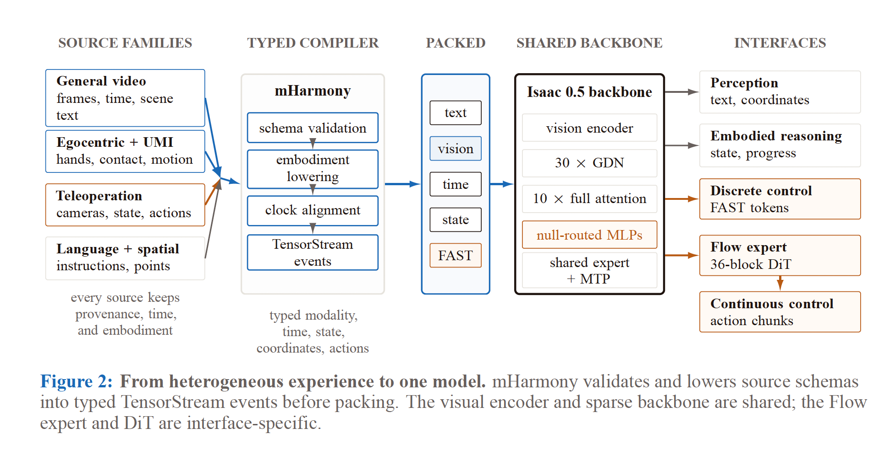
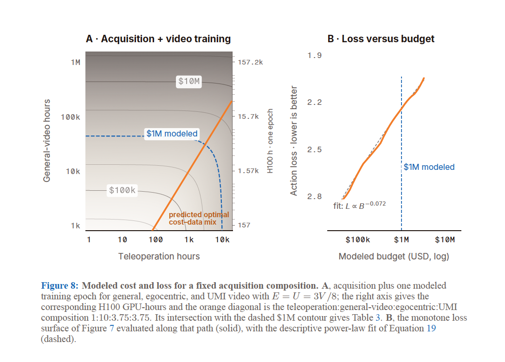

# 학습 데이터 출처를 비워 둔 공장용 오픈웨이트 로봇 모델

_Perceptron이 영상 100만 시간으로 학습한 Isaac 0.5, EU 인공지능법은 출처 문서를 요구한다_

## Executive Summary

> [!callout]
> 메타 FAIR 출신 연구자 두 사람이 세운 스타트업 Perceptron이 8월 26일 공장과 창고에서 쓸 로봇 파운데이션 모델 Isaac 0.5를 내놓았습니다. 일반 영상 100만 시간을 포함해 3조 개 멀티모달 토큰으로 학습한 360억 파라미터 모델이고, 회사는 이 모델을 오픈웨이트로 공개한다고 밝혔습니다. 다만 그 오픈이라는 표시가 덮는 범위는 항목마다 다릅니다.

> 발표를 전한 TechCrunch는 오픈웨이트를 파라미터와 학습 자료를 누구나 검사할 수 있다는 뜻으로 풀어 썼습니다. 그런데 같은 기사 몇 문단 뒤에는 회사가 학습 데이터의 출처를 밝히지 않는다는 문장이 나옵니다. 직접 열어 본 52쪽 기술보고서도 마찬가지였습니다. 학습 혼합이 529개 소스 스트림으로 이뤄졌다는 사실과 각 성분의 비중은 소수점 한 자리까지 적혀 있지만, 그 529개가 각각 무엇인지는 한 곳도 지목하지 않습니다. 로봇 자료의 일부가 공개 데이터셋에서 왔다고 밝힌 구절 하나가 전부입니다.

> 이 공백은 취향의 문제로 끝나지 않습니다. 지난 6월 이 블로그가 다룬 Ai2의 MolmoAct 2는 가중치와 함께 720시간 로봇 데이터를 통째로 열었는데, Isaac 0.5의 자체 비교표는 두 모델을 똑같이 Open source: Yes로 적어 둡니다. 같은 체크마크가 서로 다른 두께를 덮고 있는 셈입니다. 그리고 이 모델을 유럽 공장에 들이는 기업은 EU 인공지능법이 요구하는 데이터 출처 문서를 스스로 채워야 합니다.

### 주요 수치

출처: [Perceptron, Isaac 0.5 기술보고서](https://pub-d90b81cad7254a1aa6b148ac18153c0c.r2.dev/isaac-0.5.pdf) (2026년 8월 28일 확인)

기술보고서는 어떤 숫자에는 소수점까지 공을 들이고, 어떤 자리는 통째로 비워 둡니다. 값싼 영상이 비싼 로봇 데이터를 얼마나 갈음했는지(210배)와 학습 혼합이 몇 갈래에서 왔는지(529개)는 계산돼 있습니다. 그 갈래가 각각 무엇인지 밝힌 대목은 한 곳도 없고(0건), 영상 1시간에 매긴 값(0.10달러) 옆에도 라이선스를 준 쪽의 이름은 없습니다.

<!-- stat-card -->
**210배** — 줄어든 원격조종 요구량 — 일반 영상을 1,000시간에서 100만 시간으로 늘리자 5,884시간이 28시간으로. 측정된 인접 구간 기준으로는 83~300배

<!-- stat-card -->
**529개** — 학습 혼합의 소스 스트림 — 성분별 비중은 소수점 한 자리까지 공개, 개별 스트림의 이름과 출처는 미공개

<!-- stat-card -->
**0건** — 보고서의 데이터 출처 서술 — 52쪽 전문에 data source, privacy, consent, copyright라는 단어가 한 번도 없음

<!-- stat-card -->
**$0.10** — 일반 영상 1시간 계획 단가 — 비용 항목은 licensing, filtering, storage로 표기. 라이선스를 준 쪽은 기재되지 않음

## Isaac 0.5가 공장에 약속한 것

Isaac 0.5는 영상 이해, 공간 파악, 작업 진행도 추정, 로봇 제어를 하나의 백본에서 처리하는 360억 파라미터 희소 모델입니다. Qwen 계열 백본에 256개의 전문가를 두고 토큰마다 0개에서 8개까지 골라 쓰게 해, 시각 토큰과 동작 토큰에 서로 다른 계산량을 배분합니다. 35종이 넘는 로봇 시스템에서 모은 10만 시간의 로봇 경험이 학습에 들어갔다고 모델카드는 적습니다.

*▲ 네 갈래 소스가 mHarmony 컴파일러를 거쳐 하나의 백본으로 합쳐지는 구조. 원문은 "모든 소스가 출처·시각·구현체 정보를 유지한다"고 적지만, 그 출처가 무엇인지는 이 도식에도 보고서 본문에도 나오지 않는다 | Source: [Perceptron, Isaac 0.5 모델카드 (Figure 2)](https://huggingface.co/PerceptronAI/Isaac-0.5)*

그 10만 시간의 내역은 기술보고서 표 1에 나뉘어 있습니다. 사람이 로봇을 직접 조종해 만든 고품질 시연이 1만 시간, 성격이 제각각인 로봇 궤적이 4만 시간, 그리고 나머지 5만 시간은 비디오 게임과 시뮬레이션입니다. 로봇 경험이라는 이름표가 덮고 있는 분량의 절반은 실제 로봇에서 나온 기록이 아닙니다. 영상도 한 종류가 아닙니다. 일반 영상 100만 시간 옆에 사람이 몸에 카메라를 달고 찍은 1인칭 영상 37만 5,000시간과, 집게 모양 손잡이 장치로 사람의 손동작을 기록한 UMI 영상 37만 5,000시간이 함께 놓여 있습니다. 보고서는 이 셋의 비율을 80 대 30 대 30으로 고정한 채 같이 늘렸습니다. 흔히 100만 시간으로 요약되는 자료 더미는 실제로는 175만 시간이고, 그중 75만 시간은 사람을 찍은 영상입니다.

회사가 드는 예는 창고의 분류 로봇입니다. 상자에 붙은 라벨을 읽고, 상자들이 어디에 어떻게 놓였는지 파악하고, 어느 것부터 집을지 순서를 정하는 일. 지금은 이 단계들을 서로 다른 소프트웨어가 나눠 맡습니다. 공동창업자 아크샤트 슈리바스타바는 이 과정을 하나의 모델이 이어서 하게 만드는 것이 목표라고 말했습니다. 회사는 제조, 물류·창고, 보안, 모빌리티, 미디어를 적용 후보로 꼽습니다.

다만 기술보고서가 앞세우는 발견은 벤치마크 점수가 아니라 데이터 교환비입니다. 원격조종 데이터는 사람이 로봇을 직접 조종해 만드는 시연 기록인데, 한 시간을 얻으려면 로봇 한 대와 조작자 한 명과 작업 환경을 그 시간 내내 붙들어 둬야 합니다. 보고서가 계획 단가로 잡은 값이 시간당 100달러입니다. 반면 일반 영상은 싸고 많습니다. 연구진은 일반 영상 분량을 1,000시간에서 100만 시간으로 늘리면서, 같은 동작 예측 손실에 도달하는 데 필요한 원격조종 시간이 5,884시간에서 28시간으로 떨어지는 지점을 측정했습니다. 210.3배입니다.

보고서는 이 숫자를 곧이곧대로 받지 말라는 단서도 함께 답니다. 210.3배는 측정 격자 안에서 잡은 교차점이고, 실제로 측정한 인접 구간으로 범위를 두면 83배에서 300배 사이라고 적어 두었습니다. 단서는 하나 더 있습니다. 210.3배는 동작 손실의 합격선을 2.50으로 잡았을 때의 값이고, 부록 표 14에서 합격선을 2.75로 낮추면 27.6배, 3.00에서는 5.7배로 줄어듭니다. 보고서 스스로도 영상 규모는 이 학습 구성 안에서 로봇 데이터의 효율을 끌어올리는 지렛대이지 동작 데이터를 대신하는 것이 아니라고 못 박습니다. 다만 모델카드에는 이 민감도도, 83배에서 300배라는 범위도 옮겨 적히지 않았습니다. 그래도 방향은 분명합니다. 비싼 로봇 데이터를 값싼 영상으로 상당 부분 갈음할 수 있다면, 로봇 파운데이션 모델 경쟁의 축은 보유 로봇 대수에서 확보한 영상 분량으로 옮겨 갑니다.

*▲ 일반 영상과 원격조종 시간의 손실 등고선. 영상을 100만 시간으로 늘리면 원격조종 28시간으로 1,000시간 영상 기준 5,900시간과 같은 손실에 도달한다(A). 영상 10배 증가당 손실 개선폭은 100시간 이후 완만해진다(B) | Source: [Perceptron, Isaac 0.5 기술보고서](https://pub-d90b81cad7254a1aa6b148ac18153c0c.r2.dev/isaac-0.5.pdf)*

> [!callout]
> **핵심**: Isaac 0.5의 진짜 주장은 성능이 아니라 조달입니다. 원격조종 5,884시간 대신 일반 영상 100만 시간을 사면 같은 곳에 도달한다는 것. 그래서 다음 질문이 자연스럽게 따라옵니다. 그 100만 시간은 어디서 왔습니까.

## 오픈웨이트인데 가중치 파일이 없다

Perceptron은 Isaac 0.5를 오픈 모델이라 부르고, 모델카드 마지막 문단에서 다른 이들이 검사하고 재현하고 확장할 수 있도록 가중치와 코드와 인터페이스와 벤치마크를 함께 공개한다고 적었습니다. 발표를 전한 TechCrunch도 그 표현을 받아 파라미터와 학습 자료를 누구나 검사할 수 있다고 썼습니다. 그 문장이 가리키는 범위를 공개 채널에서 항목별로 열어 보면, 다섯 갈래가 저마다 다른 상태에 있습니다.

| 항목 | 발표된 상태 | 2026년 8월 28일 확인 결과 |
| --- | --- | --- |
| 코드 | 공개 | GitHub 저장소가 Apache-2.0으로 열려 있음. 다만 저장소 실체는 LICENSE와 README, 그리고 자사 LeRobot 포크를 가리키는 서브모듈 |
| 가중치 | 오픈웨이트 | 모델카드 링크가 Download the weights (COMING SOON). 저장소에 가중치 파일 없음, 다운로드 0 |
| 라이선스 | 미표기 | 모델카드 상단에 최종 라이선스를 공개 전에 넣으라는 편집자 주석이 그대로 남아 있음 |
| 학습 목적함수 | 논문에 서술 | 보고서가 스스로 proprietary라고 명시. 타깃 구성 방식과 손실 구현은 비공개 |
| 학습 데이터 | 규모만 공개 | 분량과 성분비는 상세 공개, 출처와 수집 방법은 기재 없음 |

오픈웨이트라는 이름으로 보도된 시점에, 정작 그 가중치 파일은 존재하지 않았습니다. 발표 사흘째인 8월 28일에도 모델카드의 링크는 여전히 COMING SOON이고 다운로드 수는 0입니다. 라이선스가 정해지지 않았다는 사실은 그 자체로 도입 검토를 멈추게 합니다. 상업적 사용이 가능한지 알 수 없기 때문입니다. 참고로 같은 계보의 이전 모델 Isaac 0.1과 그 베이스 모델은 지금도 내려받을 수 있는데, 붙어 있는 라이선스는 상업적 사용을 막는 CC BY-NC 4.0입니다.

공개 목록에는 데이터에 관한 약속도 하나 들어 있습니다. 체크포인트와 데이터와 모델 입출력 매니페스트를 함께 내놓겠다는 항목인데, 데이터 매니페스트라는 말은 어떤 자료를 썼는지 적은 목록처럼 읽힙니다. 정작 52쪽 보고서에서 매니페스트라는 단어가 쓰인 곳은 한 군데뿐이고, 그것은 토큰 인코딩 방식을 지문처럼 기록해 두는 입출력 규약을 가리킵니다. 지금 열려 있는 GitHub 저장소의 전체 크기는 11킬로바이트입니다.

모델카드에는 Where Isaac sits among open models라는 비교표가 실려 있고, 맨 오른쪽 열의 이름이 Open source입니다. Isaac 0.5는 Yes입니다. MolmoAct2도 Yes, π0.5도 Yes, SmolVLA와 Octo와 OpenVLA도 Yes입니다. 720시간 로봇 데이터를 지금 당장 내려받을 수 있는 모델과, 가중치 파일이 아직 올라오지 않은 모델이 같은 칸에 같은 글자로 적혀 있습니다.

> [!callout]
> **핵심**: 오픈웨이트라는 말에는 눈금이 없습니다. 코드와 가중치와 라이선스와 목적함수와 데이터는 각각 따로 열리고 따로 닫히는데, 표에는 칸이 하나뿐입니다. 도입을 검토하는 쪽은 그 칸의 글자 대신 다섯 항목의 상태를 하나씩 물어야 합니다.

## 보고서는 529개 스트림의 이름을 적지 않았다

Isaac 0.5의 기술보고서는 데이터에 인색한 문서가 아닙니다. 오히려 반대입니다. 학습 혼합은 529개의 소스 스트림으로 이뤄져 있고, 스케줄러가 각 성분을 뽑는 비율(지각·추론 69.7%, 로보틱스 30.3%)과 실제로 학습에 들어간 토큰 비율(각각 20.4%, 79.6%)이 소수점 한 자리까지 적혀 있습니다. 두 숫자가 왜 뒤집히는지, 어느 쪽만 보면 무엇을 오해하게 되는지까지 설명합니다.

숫자를 세는 데는 공을 들였습니다. 529개 스트림은 과제별로 나뉘어 개수까지 붙어 있습니다. 시각 질의응답과 추론에 199개, 영상 이해에 135개, 위치 지시에 76개, 로보틱스와 제어에 56개, 문서 인식에 32개, 캡션에 20개, 그리고 어디에도 속하지 않는 나머지 지시 데이터에 11개입니다. 영상 이해 135개는 다시 일반 영상 105개, 1인칭 영상 18개, UMI 12개로 갈립니다. 11개짜리 항목까지 세어 두고, 그 안에 든 스트림의 이름은 하나도 적지 않았습니다.

이름이 비어 있는 것은 스트림만이 아닙니다. 52쪽 전문을 검색하면 data source, privacy, consent, copyright라는 단어가 한 번도 나오지 않습니다. provenance는 네 번 나오는데 성격이 다릅니다. 자사 파이프라인이 이벤트마다 시각과 좌표계를 함께 실어 나른다는 내부 배관 설명이지, 데이터가 어디서 왔는지에 관한 서술이 아닙니다. Ego4D는 두 번 나오지만 관련 연구를 소개하는 문단과 참고문헌 목록이 전부인 남의 데이터셋 이름입니다. 표는 스무 개가 실려 있고 그중 벤치마크 표와 로봇 플랫폼 목록은 있어도 학습 데이터 출처를 정리한 표는 없습니다.

출처에 가장 가까운 문장은 엉뚱한 자리에서 나옵니다. 녹화분에서 아무 일도 일어나지 않는 구간을 걸러 내는 방법을 설명하다가, 우리가 처리하는 오픈소스 로보틱스 데이터셋에는 대기 구간이 섞여 있다고 지나가듯 적습니다. 로봇 자료의 일부가 공개 데이터셋에서 왔다는 뜻이지만 어느 데이터셋인지는 없고, 영상 175만 시간에 대해서는 이만한 언급조차 없습니다. 회사가 출처를 두고 공개적으로 한 말은 인터뷰의 한 문장이 전부입니다. 슈리바스타바는 TechCrunch에 회사가 이미지와 텍스트와 영상에서 로봇 궤적까지 아우르는 페타바이트 규모의 데이터셋을 내부적으로 구축했다고 말했습니다. 내부적으로 구축했다는 말은 직접 찍었다는 뜻일 수도, 사들였다는 뜻일 수도, 공개된 자료를 모았다는 뜻일 수도 있습니다. 52쪽 보고서에는 petabyte라는 단어도, internally라는 단어도 나오지 않습니다.

비용 표에서는 그 공백이 값으로 드러납니다. 보고서는 앞으로 데이터를 사들일 계획을 세우면서 일반 영상 1시간의 계획 단가를 0.10달러로 잡고, 그 항목의 처리 내역을 licensing, filtering, storage라고 적었습니다. 영상을 라이선스한다고 가격표에 써 놓고 누구에게서 라이선스하는지는 쓰지 않은 것입니다. 계획표 안에서 이 항목의 몫은 유난히 작습니다. 원격조종 1시간을 기준으로 짠 조합의 총원가가 329.30달러인데, 거기 들어가는 일반 영상 10시간의 값은 1달러입니다. 반면 착용 카메라로 찍는 1인칭 영상과 UMI 장비 운용에는 각각 112.50달러가 붙습니다. 사람을 써서 찍는 영상은 촬영과 품질 관리까지 쪼개 놓고, 라이선스를 받는다는 영상은 시간당 10센트로 처리했습니다. 학습 주석도 사정이 비슷합니다. 활동 구간 주석은 자사의 비공개 모델 Mk1으로 생성했다고 밝히는데, Mk1은 API로만 접근할 수 있는 상용 제품입니다.

*▲ 보고서가 모델링한 예산별 최적 데이터 배합(A)과 그 배합에서의 손실 곡선(B). 원격조종 대 일반·1인칭·UMI 영상 비율을 1:10:3.75:3.75로 고정한 채 예산을 늘리는 경로다. 이 곡선을 만든 영상의 출처는 보고서에 나오지 않는다 | Source: [Perceptron, Isaac 0.5 기술보고서 (Figure 8)](https://pub-d90b81cad7254a1aa6b148ac18153c0c.r2.dev/isaac-0.5.pdf)*

1인칭 영상은 성격이 조금 다릅니다. 이 영상을 어떻게 가공했는지는 보고서가 자세히 설명합니다. 프레임마다 사람의 왼손과 오른손을 상자와 관절점으로 찍고, 각 손이 무엇을 쥐었는지 접촉했는지 화면에 보이는지를 시각에 맞춰 붙입니다. 예시로 실린 것은 누군가 샌드위치에 달걀부침을 얹는 장면입니다. 그렇게 다뤄진 사람의 손이 37만 5,000시간 분량인데, 그 사람들이 누구이고 촬영에 동의했는지는 적혀 있지 않습니다. privacy도 consent도 52쪽에서 각각 0회입니다.

지난 6월 이 블로그가 다룬 [Ai2의 MolmoAct 2](/blog/molmoact2-open-robot-data/ko/)는 여기서 갈립니다. MolmoAct 2는 34,500개 실제 시연으로 이뤄진 720시간 양손 조작 데이터를 가중치, 학습 코드, 평가 절차와 함께 통째로 공개했습니다. 그때 정리한 결론은 개방의 척도가 가중치가 아니라 그 가중치를 빚은 데이터라는 것이었고, Ai2가 비영리 기관이라 데이터 공개가 경쟁력 손실이 아니라 미션의 실행이라는 조건도 함께 짚었습니다.

Isaac 0.5는 그 조건의 반대편에 서 있습니다. 100만 시간짜리 영상 자산은 영리 회사가 돈을 들여 모은 것이고, 회사는 오픈웨이트 계열과 별개로 비공개 API 모델 Mk1을 팔고 있습니다. 데이터를 열면 유일한 해자를 여는 셈입니다. 그러니 예외였던 쪽은 MolmoAct 2이고, Isaac 0.5는 업계의 기본값을 다시 확인해 줍니다. 다만 기본값이라는 사실이 도입 기업의 부담을 덜어 주지는 않습니다.

## 증거를 내야 하는 쪽은 유럽의 공장이다

규제 앞에 서면 이 공백은 회사의 성향이 아니라 서류의 문제가 됩니다. EU 인공지능법(Regulation (EU) 2024/1689)은 고위험 AI 시스템의 학습·검증·시험 데이터에 대해 데이터 수집 절차와 데이터의 출처를 데이터 거버넌스 항목으로 못 박아 두었습니다(제10조 2항 b호). 같은 호는 개인정보가 섞여 있는 경우 그 데이터를 처음 수집한 목적까지 적으라고 덧붙입니다. 앞 절에서 본 1인칭 영상 37만 5,000시간을 떠올리면 이 단서는 남의 이야기가 아닙니다. 기술문서를 규정한 부속서 IV는 한 걸음 더 들어갑니다. 학습 데이터셋의 출처와 범위와 주요 특성, 데이터를 어떻게 획득하고 선별했는지, 라벨링 절차와 정제 방법까지 적으라고 요구합니다(2항 d호).

그럼 그 서류는 누가 씁니까. 제25조가 여기서 작동합니다. 고위험으로 분류되지 않은 범용 AI 시스템을 가져다 사용 목적을 바꿔 고위험 시스템으로 만들면, 그렇게 만든 쪽이 공급자가 되고 제16조의 공급자 의무를 집니다(1항 c호). 그리고 처음 시장에 내놓은 쪽은 그 시스템에 대해 더는 공급자로 보지 않습니다(2항). 오픈웨이트 모델을 받아 자기 라인에 맞춰 미세조정하고 안전 기능에 물리는 순간, 데이터 출처 문서를 채워야 하는 자리에 서는 것은 모델을 공개한 회사가 아니라 그 공장입니다. 채워 넣을 원자료는 공개돼 있지 않은데 말입니다.

규정도 이 상황을 내다보고 장치를 하나 두었습니다. 공급자 지위에서 빠진 최초 공급자라도 새 공급자와 긴밀히 협력하고, 의무를 이행하는 데 필요한 정보와 합리적으로 기대되는 기술적 접근을 제공해야 합니다(제25조 2항). 조문은 정보를 넘기라고 정해 두었지만, 넘길 문서가 처음부터 만들어지지 않았다면 이 조항으로도 빈칸은 채워지지 않습니다.

오픈소스라서 면제되지 않느냐는 반문이 가능합니다. 실제로 인공지능법은 범용 AI 모델 공급자의 의무 가운데 기술문서 작성과 다운스트림 정보 제공을 자유·오픈소스 라이선스로 공개된 모델에 한해 면제합니다(제53조 2항). 다만 두 가지가 걸립니다.

- •그 면제는 저작권 정책 수립과, 학습에 사용한 콘텐츠에 대한 충분히 상세한 요약의 공개 의무에는 적용되지 않습니다(제53조 1항 c호·d호). 면제의 그물을 빠져나가지 못하는 단 하나가 하필 학습 데이터 요약입니다.
- •면제를 받으려면 가중치를 포함한 파라미터가 공개돼 있어야 합니다. Isaac 0.5의 가중치는 아직 올라오지 않았고 라이선스도 정해지지 않았으니, 현재 상태로는 그 조건부터 충족하지 못합니다.

시점도 임박해 있습니다. 인공지능법은 2026년 8월 2일부터 전면 적용됩니다. 기계류에 내장되는 고위험 AI를 다루는 제6조 1항과 그에 딸린 의무는 2027년 8월까지 미뤄졌지만, 독립형 고위험 용도는 이미 이번 달부터 적용 구간에 들어와 있습니다. 로봇 팔 자체가 아니라 그 팔에 붙은 인식 시스템을 어디에 쓰느냐에 따라 유예가 있을 수도, 없을 수도 있다는 뜻입니다.

> [!callout]
> 가중치를 여는 일은 이제 어렵지 않습니다. 파일 하나를 올리면 되고, 올리기 전에도 열었다고 적을 수 있습니다. 어려운 쪽은 그 가중치가 무엇으로 만들어졌는지 적는 일입니다. 100만 시간이 어디서 왔는지 한 줄로 답하지 못하는 모델은, 유럽 공장에 들어가는 순간 그 빈칸을 도입 기업의 기술문서에 남깁니다. 다음에 오픈웨이트라는 표시를 만나면, 올라온 파일보다 그 한 줄이 적혀 있는지를 먼저 확인해 보시기 바랍니다.

## 참고문헌

### 1차 자료

- 1.Perceptron. (2026). "[Isaac 0.5: Percepts Scale Control](https://pub-d90b81cad7254a1aa6b148ac18153c0c.r2.dev/isaac-0.5.pdf)." 기술보고서, 52쪽.
- 2.Perceptron. (2026, August 26). "[PerceptronAI/Isaac-0.5](https://huggingface.co/PerceptronAI/Isaac-0.5)." Hugging Face 모델카드. 2026년 8월 28일 확인.
- 3.Perceptron. (2026). "[perceptron-ai-inc/isaac](https://github.com/perceptron-ai-inc/isaac)." GitHub, Apache-2.0.

### 법령

- 4.European Parliament and Council. (2024). "[Regulation (EU) 2024/1689 (Artificial Intelligence Act)](https://eur-lex.europa.eu/legal-content/EN/TXT/HTML/?uri=CELEX:32024R1689)." EUR-Lex. 제10조, 제11조, 제25조, 제53조, 제113조 및 부속서 IV.

### 업계 보도

- 5.Ropek, L. (2026, August 26). "[Ex-Meta scientists want to bring visual AI to the factory floor](https://techcrunch.com/2026/08/26/ex-meta-scientists-want-to-bring-visual-ai-to-the-factory-floor/)." TechCrunch.

### 페블러스 블로그

- 6.페블러스 데이터 커뮤니케이션팀. (2026, June 20). "[Ai2가 로봇 학습 데이터 720시간을 모델과 함께 공개했다](/blog/molmoact2-open-robot-data/ko/)."
