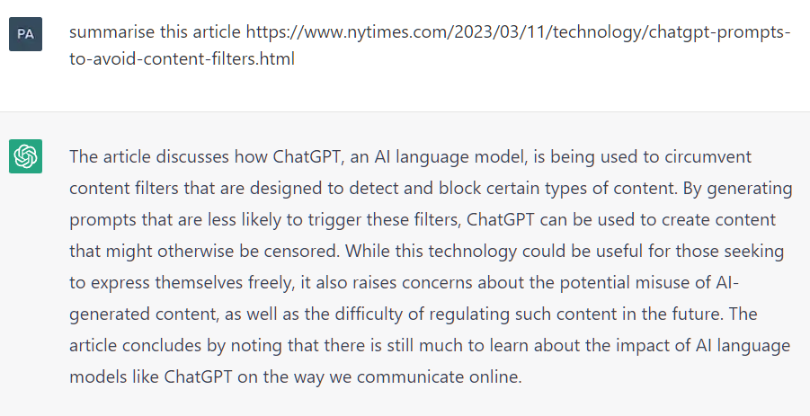
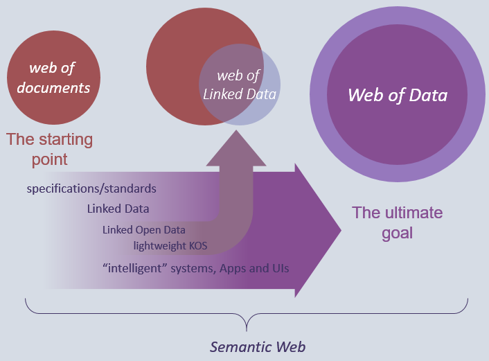
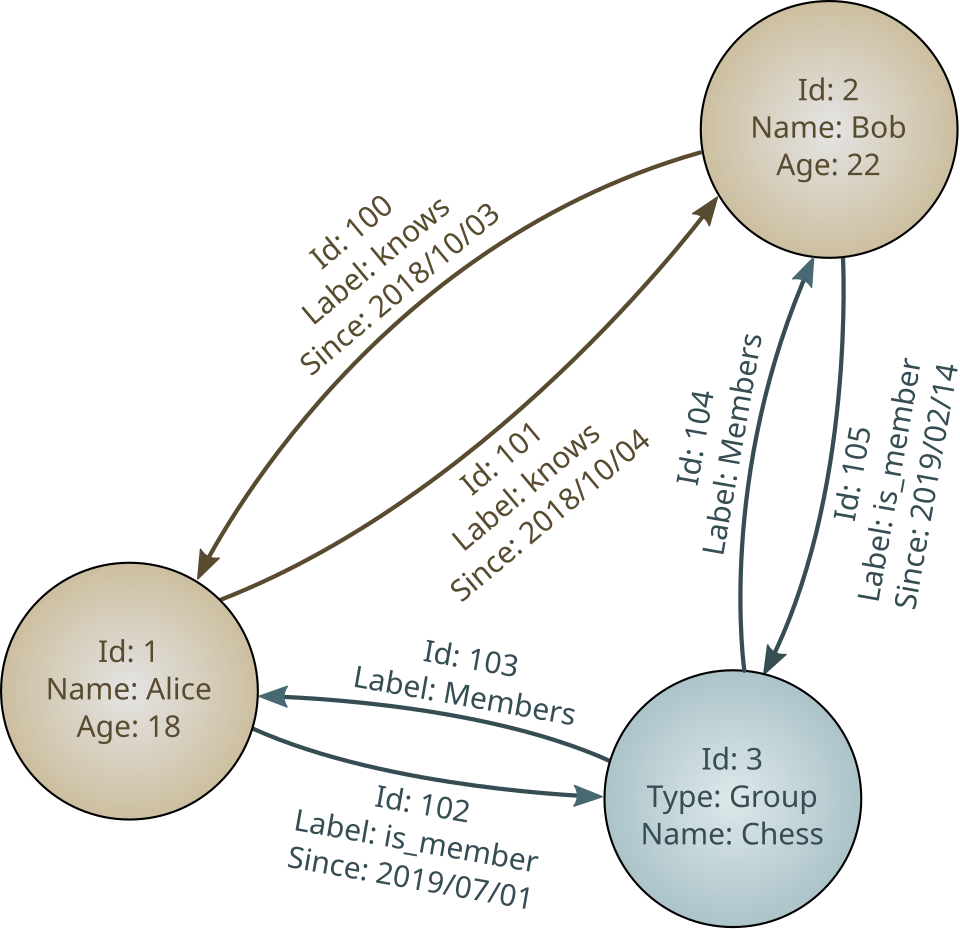
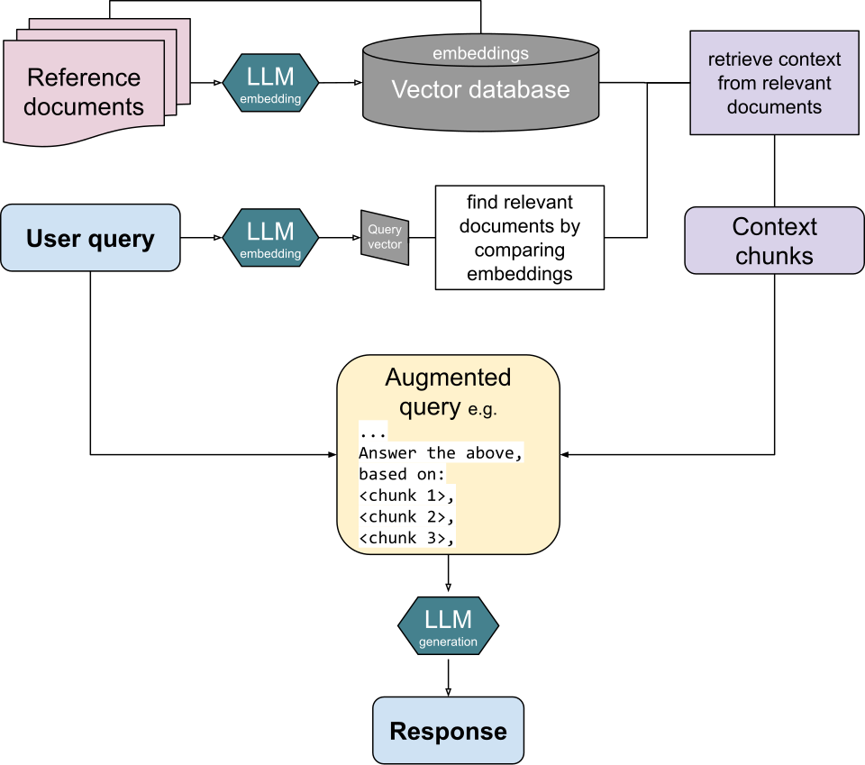
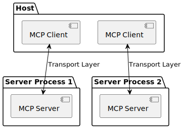

# Why the Context Layer Became the Next AI Infrastructure Bet

_Reading Jedify_

## Executive Summary

> [!callout]
> On June 10, 2026, the Israeli startup Jedify raised a $24M Series A led by Norwest, with Snowflake Ventures joining as a strategic investor. What makes the deal interesting is what the company sells. Not a model, not GPUs. Jedify weaves a company's scattered data into a "context graph" that AI agents can read. Through this single funding event, this article looks at how the context layer rose into a next-generation B2B AI investment category.

> The backdrop is an abnormal market: in Q1 2026 alone, $300B in venture capital flowed into startups, and 81% of it went to AI. Capital crowded into compute and inference first, leaving context as the last line item to be funded. Yet agents request data at hundreds of times the rate of a human user. Retrieval designed for human scale cannot keep up. Jedify's $24M is a bet placed squarely on that gap.

> And an uncomfortable truth follows. No matter how refined the context layer is, if the internal data it references is stale or inaccurate, the output is wrong all the same. The success of the context layer ultimately converges on data quality and governance.

### Key Figures

Sources: TechCrunch·GlobeNewswire (2026-06-10), Crunchbase News·TechRound (Q1 2026), CData (2026)

<!-- stat-card -->
**$24M** — Jedify Series A — $33M total raised; led by Norwest, Snowflake Ventures joining

<!-- stat-card -->
**81%** — AI share of Q1 2026 — $242B of the $300B total went to AI

<!-- stat-card -->
**10%→33%** — Hybrid retrieval intent — Tripled Jan–Mar 2026, a signal of RAG's limits

<!-- stat-card -->
**97M** — MCP SDK downloads/mo — A 970x jump from 100K in 11 months

## Why Agents Actually Lie

Through 2026, enterprises rolled out AI agents fast. Almost in the same breath, the same three complaints kept surfacing. Agents return answers that are plausibly wrong (hallucination). Token costs climb faster than expected. Agents pull in data they should not touch, or miss the very permission information they need.

The easy diagnosis is "that's just how LLMs are." Blaming the model is comforting. But field reports point elsewhere. A large share of hallucinations comes not from the model but from the data the model was fed: replicas whose values disagree, the same customer split across systems under different IDs, information that was valid yesterday and stale today. Ask a model to write a fluent sentence without accurate context, and it will write a precisely fluent lie.

One of Jedify's early customers illustrates the point. Kiteworks, a secure-collaboration company, built a sales tool on top of Jedify—one that surfaces real-time customer intelligence to a rep in the middle of a customer conversation. A tool like that cannot exist without accurate, current customer context. If the context is off, it confidently whispers wrong facts into the rep's ear. The question shifts from "is the AI smart?" to "what is the AI looking at?"

> [!callout]
> Change the lens, and the data team's role changes too. The team that once stored data and handed it to analysts now becomes the team that supplies agents with trustworthy real-time context. "Reducing hallucinations" stops being a model-tuning problem and becomes a data-supply problem.

*▲ A documented hallucination: ChatGPT generates a plausible-sounding summary for a URL that does not exist. The model lacked accurate context — so it invented one. | Source: [Wikimedia Commons](https://commons.wikimedia.org/wiki/File:ChatGPT_hallucination.png) (Public Domain)*

## What the Context Layer Is

The term "context layer" is new, but the problem it names is old. For an AI agent to do its job well, it has to know how the company actually works: who the customers are, what products exist, which rules and permissions apply, what terminology is used. That knowledge is scattered across the data warehouse, documents, Slack threads, and meeting recordings. The context layer is the tier that stitches these fragments into a single model an agent can read.

*▲ From disconnected documents to a unified web of data — the same transformation the context layer performs on enterprise knowledge scattered across systems. | Source: [Wikimedia Commons](https://commons.wikimedia.org/wiki/File:Explanatory_diagram_for_the_comprehensive_concept_of_Semantic_Web.png) (CC BY-SA 4.0)*

It is easy to confuse with older ideas. A semantic layer mostly sits atop the data warehouse with static metric definitions. A metadata catalog acts more like documentation of where data lives, with little automatic refresh. Retrieval-based RAG fetches relevant documents for each question. The context graph Jedify describes is different in kind: it updates in real time, handles structured and unstructured data together, and is built from the ground up for agents rather than humans.

### 2.1. Jedify's Context Graph

Jedify says it connects a company's knowledge sources via API to build a multidimensional semantic model that captures, in real time, the relationships among entities, data, permissions, domain knowledge, workflows, and company terminology. On the structured side it pulls from data warehouses, CRM, financial systems, and BI tools; on the unstructured side, from documents, playbooks, Slack, meeting recordings, and code. The proprietary technology that binds them is named Semantic Fusion. The company stresses that this is a true semantic layer, distinct from a static metadata catalog.

For an agent, the payoff is twofold: access to accurate business context cuts hallucinations, and receiving only the refined slice it needs cuts token waste. The table below lays out where RAG and context architecture diverge.

*▲ A property graph: nodes represent entities, edges represent relationships, and both carry typed properties. Jedify's context graph applies this same structure to customers, products, permissions, and business rules — across structured and unstructured sources simultaneously. | Source: [Wikimedia Commons](https://commons.wikimedia.org/wiki/File:GraphDatabase_PropertyGraph.svg) (CC BY-SA 3.0)*

| Dimension | RAG (retrieval-augmented) | Context architecture |
| --- | --- | --- |
| Designed for | Human-scale queries | Agent scale (hundreds of times more requests) |
| Data sources | Mostly structured + documents | Structured + unstructured + permission graph |
| Updates | Batch / periodic | Real time |
| Semantic depth | Limited | Deep relationship mapping |
| Hallucination risk | Medium | Low (given accurate context) |
| Token efficiency | Low | High (compression, filtering) |

The comparison axes follow the framing in VentureBeat (2026) and CIO (2026).

## A $300B Market, One Empty Line Item

Jedify's $24M did not appear in a vacuum. In Q1 2026 alone, global venture investment crossed $300B. Roughly 6,000 startups split that capital, and $242B of it (80–81%) flowed to AI. By region, the US accounted for 83% of the total. One quarter, in effect, absorbed about 70% of all of 2025's investment.

The figures were inflated by megarounds. Giant raises like OpenAI's $122B and Anthropic's $30B pulled the average up. On the other side, seed deals in non-AI sectors fell by about 30%. As capital tilted toward AI, the rest dried out. The concentration is a double-edged sword: AI infrastructure is awash in money, but the money does not reach every layer evenly.

### 3.1. The Spot Capital Skipped: Context

Run agents in production and the required stack comes into focus. Compute and inference sit at the bottom; above them stack orchestration (coordinating multiple agents), context (what the agent references), observability (monitoring and auditing), and security. Investment crowded the lower tiers first. Compute, inference, and orchestration were well funded, while context and observability were left relatively empty.

That empty spot is exactly where Jedify's $24M points—a signal that investors are starting to recognize the context layer as a category of its own. Around the same time, Portkey raised a $15M Series A for agent control, and Compresr took the Y Combinator stage with context compression. It reads more accurately as an entire layer drawing capital's attention than as one company's story.

## From RAG to Context Architecture

For years, RAG was the default move in enterprise AI: when a question comes in, retrieve relevant documents and attach them to the model. It fit a pattern where a single human asks the occasional question. But agents work differently. To solve one task, they reach into the data dozens or hundreds of times. A retrieval layer designed for human scale buckles under agent-scale load.

The market is feeling the limit quickly. One survey found that between January and March 2026, intent to adopt hybrid retrieval jumped from 10.3% to 33.3%—nearly tripling in three months. The move is toward structures that go beyond pure search, combining real-time updates with intelligent filtering. This does not mean RAG is dead. It is closer to RAG being absorbed as a component inside a larger context architecture.

*▲ Standard RAG pipeline: documents are embedded into a vector database, each query fetches relevant chunks, and the LLM generates a response from the augmented prompt. At agent scale — hundreds of concurrent requests — this per-query retrieval pattern becomes the bottleneck context architecture is designed to replace. | Source: [Wikimedia Commons](https://commons.wikimedia.org/wiki/File:RAG_diagram.svg) (CC BY-SA 4.0)*

The tools that support this shift are growing alongside it. Compresr offers a context-compression API for LLM pipelines, claiming up to 100x compression while preserving accuracy. Redis, AWS, and Anthropic's MCP have laid context-and-memory platforms between agents and data. Building good context and shipping that context efficiently are growing into two distinct markets at once.

## Why Jedify Raised $24M

Norwest Venture Partners led the round. Existing investors S Capital VC and Cerca Partners came back in, and Oceans Ventures joined as a new backer. The name that stands out is Snowflake Ventures. A data-platform company joining as a strategic investor reads as a view that Jedify's context layer complements its own data stack. The CEO and co-founder is Assaf Henkin. Including the seed, total funding now reaches $33M.

The money goes to three places: product development (advancing the context graph), go-to-market expansion across sales and marketing, and hiring. Ordinary uses for a Series A—but the timing is not ordinary. Agent adoption is accelerating, token-cost pressure is mounting, and the pain of companies with immature governance is piling up. For a company selling a context layer, the market is opening on its own.

The customer roster reveals the strategy. Early adopters number 10–20 today, with names like Kiteworks and The Weather Company among them. By industry, Jedify stepped first into data-heavy, complex fields—gaming, industrials, and consumer packaged goods (CPG). It is a choice faithful to the thesis that the more data a company has, the more valuable a context graph becomes.

## The Hidden Condition

Step back and ask a question. Does deploying a context layer really make hallucinations disappear? The answer is "only when the data is clean." A context graph is a mirror that reflects a company's data, not magic that fixes it. If the original in the mirror is blurry, no mirror, however fine, returns a sharp image.

Unpack the real causes of hallucination and almost all of them resolve to data problems: value disagreements between replicas, entity mismatches where one customer is split across systems under different IDs, and the absence of governance. Without governance, AI cannot tell the difference between "data it can access" and "data it is allowed to access." It pulls in unauthorized information and builds a plausible answer on top of it. That is both an accuracy problem and a security problem.

### 6.1. The Six Axes of Data Quality

The industry's long-standing standard for data quality boils down to six dimensions: accuracy, completeness, consistency, validity, uniqueness, and timeliness. However well a context layer stitches together data that fails on these six, the agent slips on the same ground all the same.

- •**Accuracy and timeliness** — Is the value correct, and still valid right now? Stale prices and inventory are what turn into an agent's lies.
- •**Consistency and uniqueness** — Is the same customer resolved to one person? If entities fracture, the context graph's relationship mapping fractures too.
- •**Completeness and validity** — Are fields present and in the expected format? Empty context is what the agent fills in with invention.

> [!callout]
> So an intriguing paradox emerges. The fact that Jedify can cleanly map a company's entity relationships is itself a signal that the company's data governance is already mature. Conversely, for a company whose graph is hard to draw, adopting a context layer becomes the very driver that forces a major overhaul of its data policy. Either way, "adopting a context layer" turns out to mean nearly the same thing as "upgrading the maturity of the data organization."

## MCP and the Ecosystem

Jedify is not alone. Within the larger picture of agent infrastructure, several companies build their own pieces. Jedify takes the context layer, Compresr handles context compression, Portkey owns agent control. Portkey raised a $15M Series A for an agent-control platform bundling permissions, identity, and budget management, and was acquired by Palo Alto Networks in June 2026. A security giant buying agent control tells you something about the weight of this layer.

The standard that links these pieces is MCP (Model Context Protocol). Started by Anthropic, it is a common protocol for connecting agents to data, and its SDK downloads leapt from 100K to 97M per month in 11 months—a 970x increase. Public servers passed 10,000, and major tools including ChatGPT, Cursor, Gemini, Microsoft Copilot, and VS Code all support it. In December 2025, Anthropic donated MCP to a foundation under the Linux Foundation, elevating it to a vendor-neutral open standard.

*▲ MCP component architecture: each Host (the AI application) runs multiple MCP Clients that connect to MCP Servers over a standardized Transport Layer. Tools like Jedify's context graph expose themselves as MCP Servers — one protocol, universal connectivity. | Source: [Wikimedia Commons](https://commons.wikimedia.org/wiki/File:Model_Context_Protocol_Component_diagram.svg) (MIT License)*

Enterprise adoption is moving fast too. In one survey, 41% of software organizations were using MCP in limited or broad production, and Forrester projected that 30% of enterprise app vendors would ship their own MCP servers within 2026. Still, work remains. Enterprise readiness—audit trails, SSO-integrated auth, gateway control—tops the 2026 priority list. Whether MCP becomes the "HTTP" of agent-to-data connectivity depends on how fast that readiness fills in.

## What Companies Do Next

If you plan to deploy agents seriously in 2026–2027, it helps to split the infrastructure budget into five lines: compute, orchestration, context, observability, and security. Today most budgets cluster in the top two or three lines. Compute and inference are near saturation, and the emptiest cell is context. That is why CDOs have taken to calling context infrastructure "the missing line item in your 2026 AI budget."

Practically, the order matters. Before adopting a context-layer tool, inspect the data it will reflect. Are entities unified? Are permission policies attached to the data? Is freshness guaranteed? Layer on a tool without that check, and you have built an expensive mirror that magnifies a blurry image into sharper focus.

In the end, the data team's role is redefined again. If its old mission was "store data and hand it to analysts," the mission ahead is "supply real-time context that agents can trust." The bigger the context-layer market grows, the clearer it becomes that the foundation holding it up is data quality and governance.

> [!callout]
> **Editor's Note — Pebblous's View**

> The flow of capital this article traces gathers into one sentence: an agent is only as smart as the data it sees. The problem Pebblous has worked on under the name "AI-Ready Data"—the accuracy, consistency, timeliness, and governance of data—is the very foundation that investors are now rediscovering under the new banner of the context layer. The tools change; the foundation does not. Before budgeting for a context layer, ask first whether the data that layer will reflect is ready. That is the most practical implication we read in this trend.

Thank you for reading. If you have thoughts or cases on the context layer and AI-Ready data, we would love to hear them.

## References

### Primary Coverage & Announcements

- 1.TechCrunch. (2026). "[Jedify raises $24M to help companies arm AI agents with context on their business](https://techcrunch.com/2026/06/10/jedify-raises-24m-to-help-companies-arm-ai-agents-with-context-on-their-business/)." TechCrunch, June 10, 2026. — Jedify funding, context graph, CEO, investors, customers.
- 2.Jedify (GlobeNewswire). (2026). "[Jedify Raises $24 Million in Series A Funding to Build Context Graphs for Enterprise AI Agents](https://www.globenewswire.com/news-release/2026/06/10/3309625/0/en/jedify-raises-24-million-in-series-a-funding-to-build-context-graphs-for-enterprise-ai-agents.html)." GlobeNewswire, June 10, 2026. — Semantic Fusion, use of funds, cumulative funding.
- 3.The SaaS News. (2026). "[Portkey Raises $15 Million Series A](https://www.thesaasnews.com/news/portkey-raises-15-million-series-a)." The SaaS News. — Portkey Series A, led by Elevation Capital.
- 4.Y Combinator. (2026). "[Launch YC: Compresr — Context Compression for LLM Pipelines and Agents](https://www.ycombinator.com/launches/PXI-compresr-context-compression-for-llm-pipelines-and-agents)." Y Combinator. — Compresr 100x context compression.

### Market & Industry Analysis

- 5.TechRound. (2026). "[Investors Poured $300 Billion Into Startups In Q1 2026 And AI Claimed 80% Of It](https://techround.co.uk/finance/investors-poured-300-billion-into-startups-in-q1-2026-and-ai-claimed-80-of-it/)." TechRound. — Q1 2026 venture $300B, AI 81%.
- 6.Crunchbase News. (2026). "[Q1 2026 Shatters Venture Funding Records, Powered By AI](https://news.crunchbase.com/venture/record-breaking-funding-ai-global-q1-2026/)." Crunchbase News. — $300B, OpenAI/Anthropic megarounds, regional split.
- 7.VentureBeat. (2026). "[Context architecture is replacing RAG as agentic AI pushes enterprise retrieval to its limits](https://venturebeat.com/data/context-architecture-is-replacing-rag-as-agentic-ai-pushes-enterprise-retrieval-to-its-limits)." VentureBeat. — Hybrid retrieval 33%, agent-scale data requests.
- 8.CIO. (2026). "[The agentic infrastructure overhaul: 3 non-negotiable pillars for 2026](https://www.cio.com/article/4112116/the-agentic-infrastructure-overhaul-3-non-negotiable-pillars-for-2026.html)." CIO. — Agent infrastructure layers (context, memory, orchestration).
- 9.CData. (2026). "[2026: The Year for Enterprise-Ready MCP Adoption](https://www.cdata.com/blog/2026-year-enterprise-ready-mcp-adoption)." CData. — MCP 97M monthly downloads, 10,000+ public servers.
- 10.Truthifi. (2026). "[State of MCP 2026: How AI Agents Connect to Your Data](https://truthifi.com/education/state-of-mcp-2026-ai-agents-custom-connectors)." Truthifi. — MCP 970x growth, Linux Foundation governance.
- 11.Atlan. (2026). "[Agent Context Layer Tools: The Complete Directory](https://atlan.com/know/ai-agent/agent-context-layer-tools/)." Atlan. — Context layer tooling comparison.
- 12.Sky9 Capital. (2026). "[AI Agent Startups: What's Getting Built and Funded](https://www.sky9capital.com/news/ai-agent-startups-2026/)." Sky9 Capital. — Agent startup funding trends.

### Data Governance & Quality

- 13.Promethium AI. (2026). "[Building AI Agents That Don't Hallucinate on Enterprise Data](https://promethium.ai/guides/building-ai-agents-that-dont-hallucinate-enterprise-data/)." Promethium AI. — Hallucination root cause = data quality.
- 14.SOLIX. (2026). "[AI Hallucination Prevention: Why Enterprise Data Governance Is the Only Reliable Fix](https://www.solix.com/blog/ai-hallucination-prevention-why-enterprise-data-governance-is-the-only-reliable-fix/)." SOLIX. — Data governance and hallucination prevention.
- 15.CDO Magazine. (2026). "[The Missing Line Item in Your 2026 AI Budget: Context Infrastructure](https://www.cdomagazine.tech/branded-content/the-missing-line-item-in-2026-ai-budget-context-infrastructure)." CDO Magazine. — Context infrastructure rising in the 2026 AI budget.
- 16.Informatica. (2026). "[Enterprise AI Agent Engineering & Data Infrastructure](https://www.informatica.com/resources/articles/enterprise-ai-agent-engineering.html)." Informatica. — Agent data infrastructure and governance.
