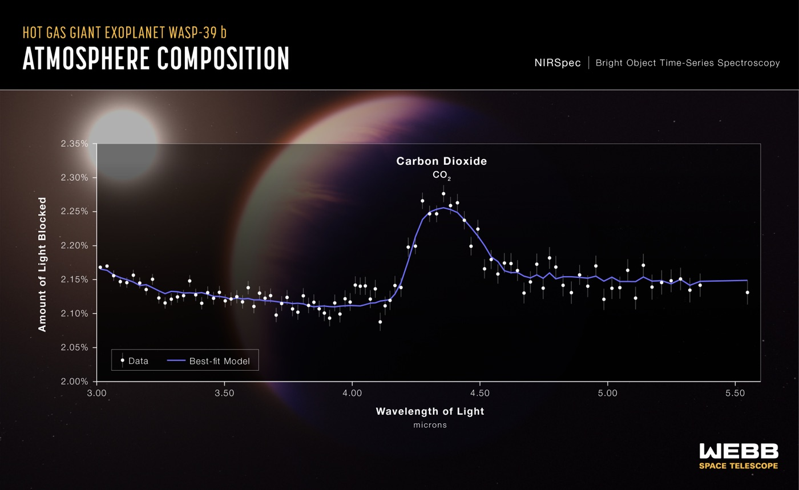

# JWST Exoplanet AI Breaks When Planet Radius Is Left Out

_Adding planet radius to the list of variables the model estimates dropped its mismatch with the WASP-39b spectrum from 301 to 0.06, an arXiv report finds._

## Executive Summary

> [!callout]
> This article reads a paper posted to arXiv on September 30, 2026. It concerns an AI estimator that reads the temperature and composition of an exoplanet atmosphere out of a spectrum taken by the James Webb Space Telescope. On the fake spectra its simulator produced, the estimator was accurate. In front of the WASP-39b spectrum JWST actually took, its answer fell apart. The authors name the culprit not as the physics model but as one slot missing from the estimator's list of variables: the planet radius.

> Once radius went into the list and a calibration step was run, the fit statistic measuring the gap between model and observation came down from 301 to 0.06. With no radius, there is nowhere to put the roughly 3% offset in how deep the planet sits in front of its star, and the atmospheric composition and temperature end up carrying that offset instead. That is the authors' own account. One other number rose alongside it: how many of the seven variables ended up with calibrated intervals containing the reference value. On that one the authors draw their own line. The reference is something they fitted to, they write inside the paper, so it is not independent evidence about the real spectrum.

> Sections 1 through 4 are facts as set down in the paper, its appendix, and its checklist. Section 5 is this article's own reading of those facts, through the eyes of people who work with data.

### Key figures

Four numbers carry this paper. The first gives the distance before and after the fix, and the second gives the offset that opened that distance. The third is a value checked separately with the neural network taken out of the loop, and the last is the weakest score among the three targets. The fit statistic χ²/N is the mismatch between observation and model divided by the number of data points, and a value near 1 means a good fit.

Source: [Chakravertty & Raj, arXiv:2610.02245 (September 30, 2026)](https://arxiv.org/abs/2610.02245).

<!-- stat-card -->
**301 → 0.06** — WASP-39b fit, χ²/N — Value after radius joined the variables and calibration ran

<!-- stat-card -->
**~3%** — Baseline offset left unabsorbed — With no radius slot, the atmosphere takes this on

<!-- stat-card -->
**38.44 → 0.76** — Fit checked without the network — Adding physics held near 38; freeing the radius dropped it

<!-- stat-card -->
**6/7** — K2-18b parameters covering the reference — Lowest of the three targets. The other two covered all seven

## The Estimator Fit Synthetic Spectra and Collapsed on the Real One

When an exoplanet passes in front of its own star, part of the starlight travels through the planet's atmosphere. If there is water up there, the wavelengths water eats grow slightly darker; if there is carbon dioxide, the wavelengths carbon dioxide eats grow darker. Line up how much darker each wavelength became and you have a transmission spectrum, and JWST records one more sharply than any telescope before it. Working backwards from that curve to the temperature and composition of the atmosphere is what astronomers call retrieval.

The traditional way to do it is sampling: build candidate atmospheres by the thousand and walk toward the one closest to the observation. It is accurate and it is slow. So another route opened over the past few years. Use a radiative transfer simulator to produce hundreds of thousands of fake spectra, train a neural network on them in advance, and then hand it a real spectrum and get an answer back immediately. The name for this is simulation-based inference, or SBI. The estimator in this paper follows that shape, with training data from TauREx 3 and a flow-based posterior estimator on top.

The catch is that the whole arrangement rests on the simulator. That is the warning the paper's introduction cites from earlier work. When the simulator and the real instrument disagree, the posterior does not go quiet. It piles up confidently in the wrong place, producing a narrow distribution around a clearly wrong answer.

Two of the places where fake and real usually drift apart were closed off in advance. One is the wavelength grid. The training spectra were computed on the same wavelength grid as the real observations they would later be evaluated against, so no interpolation or regridding step sits between simulation and real data. The other is noise. A network raised on clean or independent noise falls over in front of a real JWST spectrum, because the noise a real instrument leaves behind is correlated across wavelengths. So every training spectrum got correlated noise mixed in at random, carrying the domain randomization used to raise robots in simulators over into spectroscopy. The collapse happened with both of those doors already shut.

The first target the authors fed in as real data was WASP-39b. They used the JWST NIRSpec PRISM spectrum published in 2023, and of its 52 bins the 47 actually covered went into the fit statistic. What the estimator returned was a nearly cold, flat atmosphere. Two numbers summarize the outcome. The effective sample size of the importance sampling fell to 1, and the best-fit χ²/N came out at 301. An effective sample size of 1 means that out of thousands of draws, essentially one is usable; a χ²/N of 301 means observation and model are hundreds of times apart. This was the same estimator that had been perfectly healthy on synthetic spectra.

*▲ The real JWST NIRSpec transmission spectrum of WASP-39b. The y-axis — the amount of starlight blocked — is exactly the "baseline plus atmospheric bump" depth this article is about | Credit: [NASA, ESA, CSA, L. Hustak (STScI)](https://commons.wikimedia.org/wiki/File:Hot_Gas_Giant_Exoplanet_WASP-39_b_(NIRSpec_Transmission_Spectrum)_(weic2213b).jpeg)*

## They Suspected the Physics Model First

When this happens, the reflex in the field is to doubt the fidelity of the forward model. A molecule was left out, or the opacity tables are dated, or flattening the atmosphere into a single temperature was too crude. WASP-39b is a particularly easy target to level that suspicion at. Since JWST began observing it, its spectrum has been reported more than once as a case that gives models trouble.

The clue in the authors' hands pointed the other way, though. In already published retrievals, the same class of forward model fits WASP-39b. That meant the shortfall was not in the physics but somewhere in their own setup, in whatever made it differ from everyone else's.

The part of their test design worth noticing is the order of operations. They added each candidate piece of physics to the forward model and then re-fit it with nested sampling rather than with the neural network. In the paper's words, "thus, the test is independent of the amortized network." They took the possibility that the network was the culprit out of the accounting entirely and measured the physics on its own.

There were three candidates: a temperature gradient breaking the isothermal assumption, sulfur dioxide opacity, and a higher-precision opacity table. Table 1 of the paper sets the first two of those beside the isothermal baseline.

| Forward-model variant (radius fixed unless noted) | Best-fit temperature (K) | χ²/N |
| --- | --- | --- |
| Physical atmosphere, isothermal | 700 | 38.44 |
| + temperature gradient | 700 | 38.48 |
| + sulfur dioxide opacity | 700 | 38.46 |
| Planet radius as a free variable | 606 | 0.76 |

************▲ From Table 1 of the paper. The two physics additions moved only the second decimal place | Source: arXiv:2610.02245

Adding physics left the fit stuck near 38. Both of the variants the table reports came out very slightly worse than the isothermal baseline. Across all three candidates the estimate stayed in the same unphysical cold, flat corner. Then, in the last row, where the radius was released from its fixed value, 38.44 fell to 0.76 and the inferred temperature came down from 700 K to 606 K. The paper describes that state as a return to "a warm (∼600 K), water-rich, literature-consistent atmosphere." Between adding physics and freeing one variable, the second is what decided the outcome.

## With the Radius Slot Empty, the Atmosphere Takes the Hit

What the estimator originally set out to infer was six things: one atmospheric temperature and the log abundances of five molecules. The planet radius was not on that list. On the simulator side, the side that made the training data, radius was in use as an input the whole time. The slot was empty only on the list belonging to the side that had to infer it back.

Why that asymmetry is fatal becomes visible in the shape of a spectrum. The vertical axis of a transmission spectrum is depth, how much of the star is blocked. That depth splits in two. There is the baseline the bulk of the planet blocks, and there is the wiggle the atmosphere adds on top of it, wavelength by wavelength. What sets the height of the baseline is the planet radius. With radius absent from the variables, the baseline stays pinned, and when the real observation's baseline sits about 3% away from that pinned value, the model has nowhere to put the difference. Only one route remains: twist the slots it can still move, meaning the atmospheric composition and temperature, until that 3% is covered.

▲ Pebblous original diagram | Source: arXiv:2610.02245, introduction and section 3

So the symptom on the surface looks exactly like model error. Observation and model disagree, and it reads as missing physics. What actually happened is a collapse of identifiability. Different radii paired with different atmospheric compositions produce nearly the same spectrum, and with the radius slot shut, the estimator could only resolve that ambiguity on the composition side. The paper's concluding sentence draws the distinction briefly.

A factor the simulator encodes but the inference omits can make even a well-specified forward model look misspecified, so the fix is identifiability, not fidelity.

The repair is less grand than its name. The setup the authors call MIRAGE widens the variables from six to seven so radius is included, trains on spectra whose observing conditions were randomly shaken, and then pulls the overdispersed flow posterior onto an independent nested-sampling reference using an optimal-transport map and importance sampling. The paper sums it up itself: not a new architecture, just one variable and a calibration.

The appendix makes clear this was not a result bought with scale. Training used 28,000 pairs, with another 4,000 held out for validation. The network is a small model of roughly a million parameters, and training finished on a single Apple silicon machine rather than a GPU cluster. Only the branch handling the covariance was numerically unstable enough to be run on CPU. Under those conditions, the thing they touched was the number of variables to infer.

## The Numbers Flipped, and the Authors Drew Their Own Limits

On WASP-39b the best-fit χ²/N came down from 301 to 0.06, and the number of the seven variables whose calibrated intervals contained the reference value rose from two to seven. The same method was applied, untouched, to two other targets. The range the paper claims opens along three directions. Planet type runs from a hot Saturn to a cold sub-Neptune; instruments cover NIRSpec PRISM and NIRISS SOSS; and the spectra come both from someone else's publication and from the authors' own reduction starting at the raw MAST data.

The evidence holding that range up sits in the third column of the table below. The planet radius recovered by the calibrated posterior comes first, with the previously published value in parentheses, and on all three targets the two are close. On WASP-96b, the one they reduced themselves, the water feature at 1.4 micrometres came back as well. That is the ground on which the authors put source diversity forward as one axis of their range.

| Planet | Instrument | Recovered radius (published), Jupiter radii | Parameters covering the reference |
| --- | --- | --- | --- |
| WASP-39b | NIRSpec PRISM | 1.227 (1.28) | 7/7 |
| WASP-96b | NIRISS SOSS | 1.196 (1.20) | 7/7 |
| K2-18b | NIRISS SOSS | 0.232 (0.24) | 6/7 |

▲ From Table 2 of the paper. The coverage column counts the variables whose calibrated intervals contain the nested-sampling reference value | Source: arXiv:2610.02245

Up to here it is tidy. Then the paper draws a line directly through its own result. Section 5 writes down three limits, and the checklist at the end concedes two more. All five take air out of the claim.

### 4.1. Coverage Counts Are Not Independent Evidence

Calibration works by running nested sampling once per target to build a reference, then moving the flow posterior onto it. But the standard used to count coverage is that same reference value. Coverage evaluated against that same reference, the authors write, derives from the construction rather than being independent evidence about the real spectrum, since the map is fitted such that the transported samples match the nested-sampling reference. It shows that the transport was solved, not that the network recovered the true posterior. The one piece the authors keep as independent is that the recovered radii come out close to the published values. That is the column written as 1.227 against 1.28, 1.196 against 1.20, and 0.232 against 0.24 in the table above.

The reason the paper never reports an effective sample size after calibration touches the same point. When the likelihood stands sharply on one spot, as it does with a real observation, that number stays low. So section 2.3 states that whether calibration worked is reported through coverage rather than through effective sample size. The 1 that appeared in section 1 is a diagnostic from before calibration, and the matching figure from after it is not in the paper.

The benefit of amortization gets trimmed by about as much. What the paper says transfers unchanged is the method, not the trained weights. Look at the priors in the appendix and the hot Saturns search for radius between 0.8 and 1.6 Jupiter radii, while the cold sub-Neptune K2-18b searches between 0.10 and 0.40. The temperature ranges split the same way. Since section 2.1 states that the training set is built by drawing from the prior, the training sets for the two regimes cannot be the same. On top of that, one nested-sampling run is still paid per target, as the paper itself puts it. A fast method built to replace a slow one carries the slow one along as its anchor.

### 4.2. The Noise Fix That Worked in Simulation Did Not Carry Over

Conditioning on the covariance of the observational noise raised coverage from 0.587 to 0.687 on a synthetic benchmark, and the gain grew as the noise grew. On the one real target, that gain did not appear. The paper attributes this to real instrument noise falling outside the distribution of the noise model used in training. It adds that it reports this as an honest boundary rather than a flaw to be explained away. An attempt to close the domain gap on the input side with a generative model goes down as the paper's third limitation, and it did no better than structured randomization either. The attempt was a CycleGAN translating synthetic spectra toward the distribution of the real ones. The real-side sample was built by perturbing the single WASP-39b spectrum with noise until there were 500 of them. The authors call the result a clean negative and decided to keep training with structured randomization.

### 4.3. No Error Bars, and the Code Is Not Out Yet

The checklist attached to the paper concedes two things. One is that the text reports point estimates such as χ²/N and coverage counts without error bars, confidence intervals, variation across repeated runs, or any procedure for statistical significance. The other is that while the paper says it will release reproducible artifacts, the text carries no code or data address and no concrete reproduction instructions. The authors state they will publish once acceptance is settled. This is worth reading with the format in mind: a short report of six pages with two figures and two tables.

## Why Pebblous Is Watching This Paper

Exoplanets are far away, but the structure is familiar. Whether the side producing the data and the side consuming it are holding the same field list is not something we usually check. More often the two lists started out identical in one person's head and then quietly parted ways on the way down into code and tables. In this paper the gap between them was exactly one slot wide.

What makes this kind of defect surface so late is that synthetic evaluation cannot see it. On held-out data from the simulator, the producing side and the consuming side share the same settings, so no baseline can be off, and the estimator scores well. The hole in the list shows itself only at the moment outside data arrives. Even then it does not arrive wearing the face of "I don't know." It arrives as a narrow, confident, wrong answer. This is the spot where a model that outputs uncertainty gets the uncertainty wrong too.

The order in which they ran the diagnosis transfers too. When performance degraded, the authors did not go straight for a bigger model. They did add candidate physics, but they checked what came of it with an independent estimator that had nothing to do with the neural network. That one step split "the physics is short" from "the variable list is short." Seeing whether the symptom survives with the learned component removed from the accounting is a cheap procedure in any pipeline. The same attitude shows up on the design side. Because the training spectra were put on the same wavelength grid as the real observations, the route to blaming any later mismatch on the grid was closed from the start. Shortening the list of things to suspect ahead of time costs less than diagnosing after the accident.

When Pebblous talks about AI-Ready Data, the premise it keeps returning to is that the context in which data was produced has to be recorded. This paper receives that premise from a slightly different angle. Even where the record exists, if the receiving side never reads that field, it may as well not be there. The simulator knew the radius. It was missing only from the estimator's list. As long as a data contract writes down the producing schema and not the consuming one, the same kind of blank will keep appearing.

Thanks for reading this far. The body, tables, appendix, and checklist of the paper were checked directly against the [full text on arXiv](https://arxiv.org/html/2610.02245). If you can share when you last lined up the variable list on the side that builds your training data against the one on the side that does inference and serving, and what face the mismatch wore in your metrics, we would like to hear it.

## References

- 1.Chakravertty, A. & Raj, P V V. (2026). "[A Missing Latent, Not a Missing Simulator: Radius-Augmented Inference for Real JWST Retrieval](https://arxiv.org/abs/2610.02245)." arXiv:2610.02245.
- 2.Rustamkulov, Z., Sing, D. K., Mukherjee, S. et al. (2023). "[Early Release Science of the exoplanet WASP-39b with JWST NIRSpec PRISM](https://www.nature.com/articles/s41586-022-05677-y)." Nature, 614, 659–663.
- 3.Madhusudhan, N., Sarkar, S., Constantinou, S., Holmberg, M., Piette, A. A. A. & Moses, J. I. (2023). "[Carbon-bearing Molecules in a Possible Hycean Atmosphere](https://arxiv.org/abs/2309.05566)." The Astrophysical Journal Letters, 956, L13.
