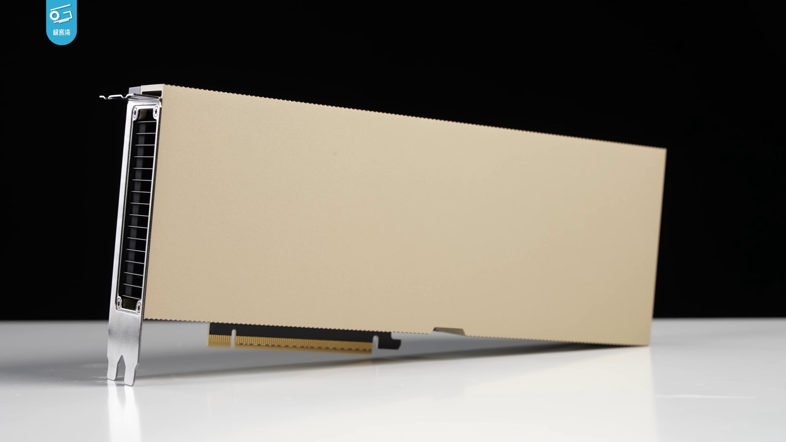
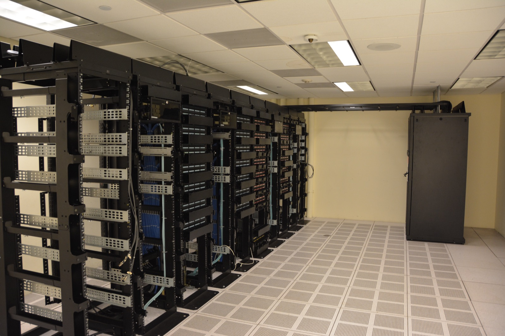

# Open-Weight Kimi K3 Makes Data Sovereignty a Hardware Question

_Self-hosting keeps prompts out of Chinese jurisdiction, but few organizations can afford the infrastructure it demands_

## Executive Summary

> [!callout]
> On July 27, China's Moonshot AI releases the weights of Kimi K3, a 2.8-trillion-parameter model. It is the largest open-weight release in history. The first reason this makes news is usually the price tag: the model is free. But for any organization that handles data, what matters is not the price. It is where your data travels. This article looks for the real value of open weights not in cost, but in the address where your data lives.

> Call the API and your prompts and internal documents pass through servers under Chinese jurisdiction. Self-hosting keeps that traffic inside your own borders. Even quantized to 4-bit, though, the weights come to 1.4 terabytes, and holding all of that in accelerator memory takes at least eighteen 80GB-class GPUs. In other words, the price of data sovereignty is the ability to carry the infrastructure.

> That is where the paradox of openness appears: anyone can download it, but not everyone can run it. The real stakes lie in what self-hosting blocks and what it never can, and in how far the sheer weight of 1.4 terabytes narrows the choices in front of a data leader.

Just how big this model is, and why its size turns straight into an infrastructure barrier, is already visible in the four numbers below.

<!-- stat-card -->
**2.8T** — Total parameters — 16 of 896 experts (~50B) active per token

<!-- stat-card -->
**1.4TB** — 4-bit weight size — About 5.6TB at 16-bit precision

<!-- stat-card -->
**18** — Minimum 80GB-class accelerators — Weight loading alone; excludes context and concurrency

<!-- stat-card -->
**8** — 192GB single-node floor — Eight Blackwell / MI400 cards, almost no headroom

## The largest open weight yet, and the real payoff isn't the price tag

Kimi K3 is a 2.8-trillion-parameter Mixture-of-Experts (MoE) model built by Moonshot AI in Beijing, China. The full model holds 2.8 trillion parameters, but each token activates only 16 of its 896 experts, so a single inference actually runs about 50 billion parameters. The API and services opened first, on July 16; the weights themselves go up on Hugging Face at 00:00 UTC on July 27. By release size alone, it is the largest open weight in history.

Performance is part of the story too. On the same compute it reached roughly 2.5x the training efficiency of the previous generation (K2), and it lands near the top on several public benchmarks. One industry analyst judged that the release narrows the gap between open and closed models from the previous six-to-nine months down to three-to-five months. It is a signal that open weights are now trailing the frontier closely.

For organizations that work with data, though, the heart of this event is not the benchmark ranking. What open weights really change is not how much you pay to use a model but where your data travels. Every API call sends prompts and documents to a server outside the company. Holding the weights lets you end that flow inside your own infrastructure. That is why the worth of open weights should be read in the address of your data, not in its cost.

## Keeping your prompts out of Beijing

Use the API that Moonshot hosts and your prompts are processed on servers located in China. Chinese law applies there, regardless of your company's location or privacy policy. Article 7 of the National Intelligence Law obliges Chinese firms to cooperate with national intelligence work, and as of a January 2026 amendment the Cybersecurity Law and the Data Security Law, which now explicitly cover AI systems, apply alongside it. Wherever you place the server, and even if you set up a Singapore entity, the obligation on the company remains.

This is not an abstract worry. In April 2026, Kimi exposed one user's resume, including name, phone number, and work history, to another user, a data-isolation failure. Its consumer privacy policy does not state where the servers sit, and while it discloses that prompts are used for training, it had not documented an opt-out through the middle of 2026. According to one security study, in enterprise settings Kimi generated 3.5x more so-called shadow-AI traffic than competing models, and the data that leaked most was code, financial forecasts, and M&A information.

What self-hosting does here is clear. Because inference traffic never reaches Moonshot's servers, prompts never physically arrive at a server under Chinese jurisdiction. This structural protection is real. It is not a cure-all, however. The legal obligations on Moonshot as a company exist independently of whether you self-host, and self-hosting does not fully rule out the possibility of a bias or trigger planted somewhere in the weights. Self-hosting cuts the path your data travels; it is not a certificate that the model itself can be trusted unconditionally.

> [!callout]
> Within a single month, access to cutting-edge AI itself became a geopolitical variable. In June, the United States briefly cut off access to certain top-tier models entirely, then restored it under conditions. The fact that which border your prompts stay inside can be shaken by a single line of policy is what turns self-hosting from a mere cost decision into a matter of risk management.

## 1.4 terabytes, where the hardware decides for you

The moment you choose self-hosting, though, the problem shifts from law to physics. Even quantized to MXFP4 4-bit, Kimi K3's weights come to about 1.4 terabytes. At the original 16-bit precision it is 5.6 terabytes. This mass does not sit on disk; it has to live entirely in accelerator memory throughout inference. This is exactly the point that separates who can actually run it.

Put in numbers: loading the 4-bit weights alone takes about eighteen 80-gigabyte-class accelerators. Factor in a one-million-token context and concurrent requests and the requirement grows further. The realistic minimum unit is a single node binding eight Blackwell or MI400 accelerators of 192 gigabytes each, and even that leaves almost no room. The table below lays out the mass by precision and the hardware it maps to.

| Configuration | Weight size | Hardware required (weights only) |
| --- | --- | --- |
| MXFP4 4-bit | ~1.4TB | ~18 80GB-class accelerators, or one node of eight 192GB cards |
| 16-bit | ~5.6TB | ~4x the card count of the same accelerator; effectively impossible on a single node |

What matters here is that the bottleneck has moved. With only 50 billion active parameters, the compute itself is not that heavy. What holds you back is not computation but the capacity and bandwidth of the memory needed to hold all 2.8 trillion weights. The common assumption that an open-weight model runs on a laptop or workstation collapses at this scale. The mass is the barrier, and its height is set not by us but by the hardware.

*▲ An 80GB-class data-center accelerator card, the unit Kimi K3's 1.4 terabytes of 4-bit weights must be spread across | Source: [Geekerwan, Wikimedia Commons (CC BY 3.0)](https://commons.wikimedia.org/wiki/File:NVIDIA_H100_(%E6%9E%81%E5%AE%A2%E6%B9%BEGeekerwan)_001.png)*

## Anyone can download it, not everyone can run it

Saying the weights are public is not the same as saying I can run them. The places that own a cluster able to keep 1.4 terabytes resident are cloud providers, large inference vendors, and well-capitalized enterprises and research institutes. The picture of the ordinary open-source developer running a quantized small model on a laptop does not reproduce at this scale. The weights are decentralized, but the ability to actually operate them concentrates back in the hands of infrastructure providers.

*▲ Sustaining a cluster at this scale narrows down to cloud providers and large inference vendors | Source: [Wikimedia Commons (CC BY 2.0)](https://commons.wikimedia.org/wiki/File:Datacenter_Server_Racks_(22370909788).jpg)*

How heavy this mass is was first shown by Moonshot itself, the maker of the model. Ahead of the release it had to pause its subscription service for a time, and a tight supply of its own GPUs was pointed to as the reason. If even the creator is chased by compute, the option to download it and run it yourself narrows further for the vast majority of organizations below.

So one analyst expects that most buyers who adopt Kimi K3 will end up renting it. Whether they use Moonshot's API or rent a cloud that hosts the weights for them, they inherit the very same vendor lock-in they tried to escape. Open weights look like they grant freedom, but at the operational stage they circle back to a rental structure. This is the paradox of openness.

There are compromises. As in Europe, a third-country inference provider can serve the model from a data center in its own territory, charging per token while keeping the data inside that jurisdiction. But this is closer to a rental with a changed jurisdiction than to self-hosting. On top of that, serving frameworks such as vLLM, tuned to the new attention structure called KDA, are still being reworked, so production-grade stable serving is expected to become real only in Q4 2026. The door to downloading is open, but the door to running is still narrow.

## Turning data sovereignty from a promise into a capability

To sum up, there is a gap of 1.4 terabytes between "we obtained the open weights" and "we secured data sovereignty." What closes that gap is not a license but infrastructure readiness. If you are a data leader evaluating open weights, it is worth confirming at least the following before you decide to adopt.

- Do we have the memory capacity and bandwidth to actually serve the downloaded weights on our own infrastructure, or will we end up renting from someone after all?
- If we have to rent, which jurisdiction is that provider in, and inside which border do the prompts and documents stay?
- Even if we host the model ourselves, can we explain the lineage of the input and output data, where it came from and how it was processed?
- Counting the maturity of the serving framework and the operations staff, can we sustain this deployment for years rather than months?

Open weights open the door toward data sovereignty. But opening the door and keeping house inside it are two different things. The capacity to control, on your own, where your data sits and whose hands it passes through is infrastructure readiness, and it is the practical data governance of the open-weight era.

Editor's Note

This is where the concern Pebblous has worked on, AI-Ready Data, overlaps. Making it possible for an organization to explain and maintain, on its own, where its data came from, how it was processed, and which border it now sits inside: before you hold open weights in your hands, the thing to have first is not the model but this control.

## References

### Industry Analysis

- 1.Lambert, N. (2026). "[Kimi K3: The Open-Weights Escalation](https://www.interconnects.ai/p/kimi-k3-the-open-weights-escalation)." Interconnects.ai.
- 2.Techi. (2026). "[Kimi K3 Open-Weights Inference Economics](https://www.techi.com/kimi-k3-open-weights-inference-economics/)." Techi.com.

### News Coverage

- 3.TechTimes. (2026). "[Kimi K3 Open Weights Arrive Sunday: Self-Hosting Cuts China Data Risk the API Never Can](https://www.techtimes.com/articles/321551/20260725/kimi-k3-open-weights-arrive-sunday-self-hosting-cuts-china-data-risk-api-never-can.htm)." (2026-07-25).
- 4.TechTimes. (2026). "[Kimi K3 Open Weights Drop July 27: Near-Frontier Coding, Undisclosed Hallucination Risk](https://www.techtimes.com/articles/321499/20260724/kimi-k3-open-weights-drop-july-27-near-frontier-coding-undisclosed-hallucination-risk.htm)." (2026-07-24).
- 5.TechTimes. (2026). "[Kimi K3 Subscription Pause Exposes GPU Crunch Behind Open-Weight Strategy](https://www.techtimes.com/articles/321155/20260721/kimi-k3-subscription-pause-exposes-gpu-crunch-behind-open-weight-strategy.htm)." (2026-07-21).
