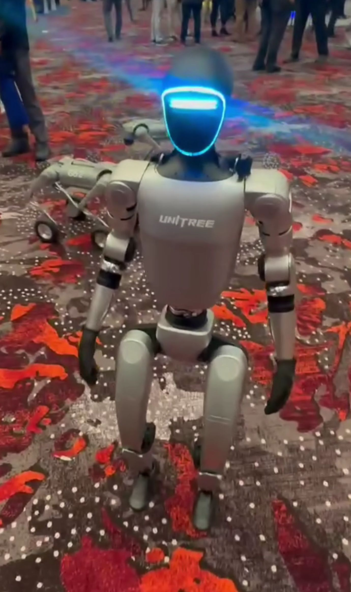
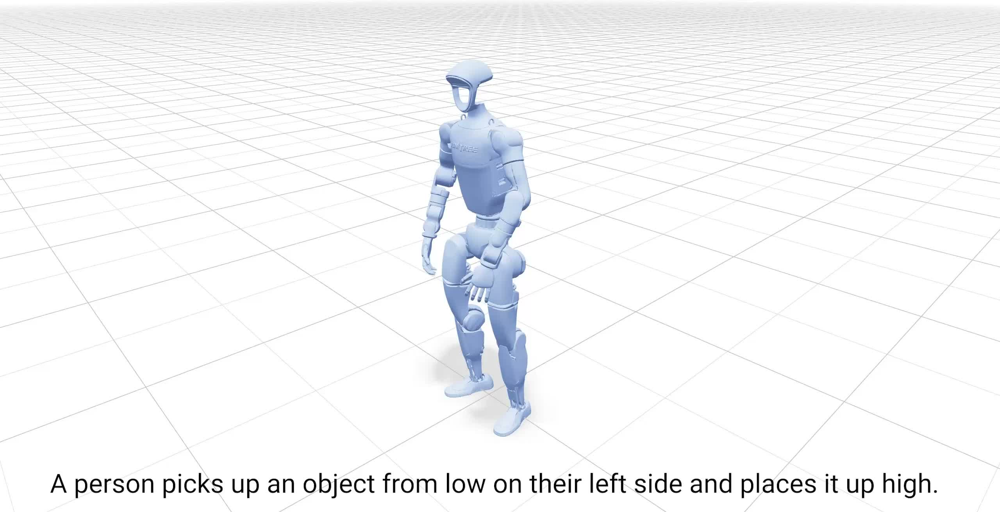
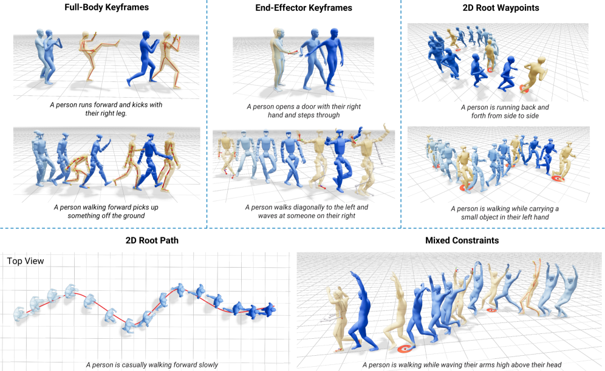
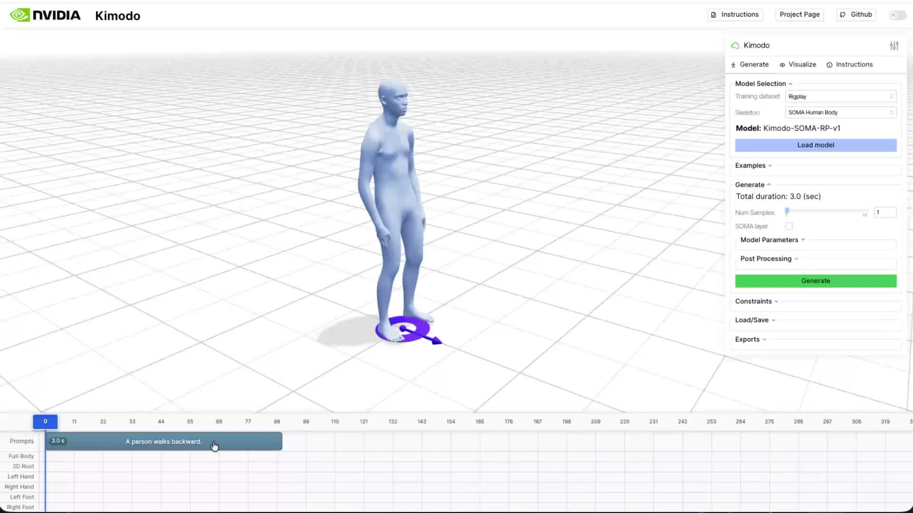
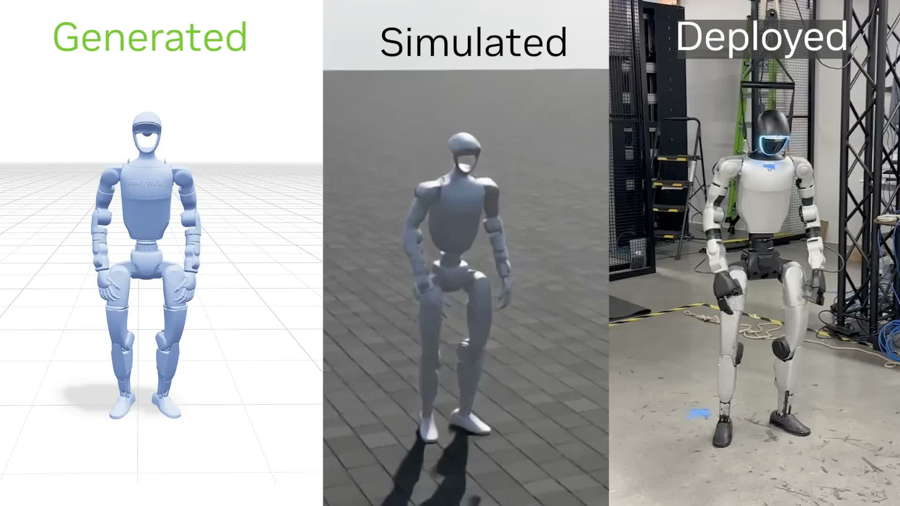

# The Code Is Open. The Data Isn

_NVIDIA Kimodo and the Humanoid Motion Data Race_

## Key Takeaways

> [!callout]
> NVIDIA's Kimodo (arXiv:2603.15546) is a text-to-motion model that generates full-body motion sequences for the Unitree G1 humanoid robot from plain-English commands — in 2 to 5 seconds on a single GPU. Released under Apache-2.0, it's a 282M-parameter two-stage transformer denoiser that outputs MuJoCo-compatible kinematic sequences up to 10 seconds long.

> But the real story isn't the architecture. It's the training data. Kimodo was trained on **Rigplay 1** — 700 hours of professional motion capture footage assembled by NVIDIA. The code ships. The dataset doesn't. That asymmetry is worth understanding carefully, because it's the same pattern that has defined competitive advantage in AI for the past decade: the model is the demo, the data is the moat.

> As Boston Dynamics, Figure AI, Agility Robotics, and a dozen well-funded startups race toward deployable humanoid robots, the bottleneck is shifting. It's no longer compute. It's not even model architecture. It's the quality and coverage of motion data — who has it, how it was labeled, and what gaps it leaves. Kimodo makes that dynamic impossible to ignore.

## What Kimodo Does

The pitch is straightforward. You type "pick up the box and place it on the upper shelf." Kimodo generates a full-body motion sequence — the torso lean, the arm extension, the weight shift, the reach — that a Unitree G1 humanoid can execute. No hand-coded animation. No motion designer. Just a text prompt and 2 to 5 seconds of inference time.

The project dropped on arXiv in late March 2026 (2603.15546) alongside a GitHub repository (nv-tlabs/kimodo). It comes from NVIDIA's Isaac Lab research team — the same group behind the GPU-accelerated physics simulation infrastructure that underpins much of NVIDIA's robotics bet. The full name is **"Text-Driven Whole-Body Motion Generation for Real-World Humanoids."**

What sets Kimodo apart from earlier text-to-motion work — Stanford's CALM, Berkeley's motion diffusion experiments, CMU's MDM — is the explicit focus on a **real robot with real physical constraints**. Previous models generated plausible human motion. Kimodo generates motion that a specific robot's joints can actually execute, accounting for the Unitree G1's actual range-of-motion limits.

- • Project page: [research.nvidia.com/labs/sil/projects/kimodo](https://research.nvidia.com/labs/sil/projects/kimodo/)
- • Paper: arXiv 2603.15546 / Repo: nv-tlabs/kimodo
- • License: Apache-2.0
- • Parameters: 282M (two-stage transformer denoiser)
- • Generation time: 2–5 seconds (single GPU)
- • Maximum clip length: 10 seconds
- • Target platform: Unitree G1 humanoid
- • Output format: MuJoCo-compatible kinematic sequences
- • VRAM requirement: ~17GB

<!-- stat-card -->
**Kimodo at a glance (March 2026)**

*▲ NVIDIA Kimodo official architecture — Stage 1 (text → whole-body kinematics) and Stage 2 (G1 robot retargeting) pipeline | Source: [NVIDIA Research (2026)](https://research.nvidia.com/labs/sil/projects/kimodo/)*

*▲ Unitree G1 humanoid robot — Kimodo's official target platform. Its price accessibility has made it the de-facto research standard for humanoid robotics labs worldwide | Source: [Wikimedia Commons (CC0)](https://commons.wikimedia.org/wiki/File:Unitree_G1.jpg)*

The Unitree G1 choice is deliberate. It's the most accessible humanoid research platform available — affordable enough that university labs and well-funded startups can run fleets of them. By targeting G1, NVIDIA is signaling that Kimodo is meant to be used, not just cited.

## Under the Hood

Kimodo's two-stage design reflects a clean separation of concerns — one that makes the architecture more extensible than it might first appear.

### Stage 1: Text to Whole-Body Motion

The first stage handles the semantic lift: turning language into motion. Instead of reaching for CLIP's text encoder — the default choice in most cross-modal generation work — Kimodo uses **LLM2Vec**, an LLM-based text representation. The payoff is richer semantic grounding. Compound instructions ("walk toward the shelf while raising your right hand") get encoded with the kind of compositional understanding that older text encoders struggle to capture.

That encoded representation feeds a transformer denoiser that outputs a full-body joint angle sequence — pure kinematics, no physics. Think of it as choreography on paper: geometrically correct positions for every joint at every timestep, without accounting for the forces required to get there.

### Stage 2: Robot-Specific Retargeting

Stage 2 is where the human motion gets translated into something the G1 can actually do. The gap between human movement and robot execution is non-trivial — shoulder rotation ranges differ, wrist axes are mismatched, center-of-mass dynamics behave differently. Stage 2 retargets the Stage 1 output onto the G1's actual joint constraints, producing MuJoCo-compatible sequences the robot can ingest directly.

The architectural implication: swap out Stage 2, and you have a pathway to supporting other humanoid platforms. NVIDIA hasn't announced this, but the design makes it possible. That modularity is likely intentional.

*▲ NVIDIA Kimodo text-to-motion demo — the Unitree G1 executing a whole-body motion sequence generated from a single natural language prompt, after Stage 1 (text → kinematics) and Stage 2 (G1 retargeting) | Source: [NVIDIA Research (2026)](https://research.nvidia.com/labs/sil/projects/kimodo/)*

> [!callout]
> Why two stages matter

> Separating semantic generation (Stage 1) from robot-specific retargeting (Stage 2) means the motion understanding layer doesn't need to be retrained for each new robot platform. The text-to-motion core stays stable; only the retargeting head changes. This is the right abstraction if you're building toward a multi-platform future — which NVIDIA almost certainly is.

## The Real Story: 700 Hours of Motion Capture

If you've been following AI long enough, you've seen this pattern before. A lab releases a model. The model is genuinely impressive. The paper is transparent about architecture. And quietly, in the data section, you find the sentence that explains everything: the primary training data is proprietary and will not be released.

For Kimodo, that sentence refers to **Rigplay 1**.

### Rigplay 1: The Closed Half

Rigplay 1 is NVIDIA's proprietary motion capture dataset — 700 hours of professional performers, athletes, stunt coordinators, and technical workers executing thousands of motion scenarios in controlled capture environments. The dataset includes careful text annotation linking specific actions to motion sequences. It's what makes Kimodo actually understand what "pick up," "reach," and "hand over" mean in terms of joint trajectories.

The code is Apache-2.0. Rigplay 1 is not available. Researchers who want to reproduce Kimodo's results, fine-tune for specific domains, or benchmark against it are starting from zero on the data side.

*▲ Kimodo paper Fig. 1 — whole-body motion generation examples driven by single text prompts. Trained on Rigplay 1 (700h) + BONES-SEED (288h) | Source: [Zhu et al. (2026), arXiv:2603.15546](https://arxiv.org/abs/2603.15546)*

### BONES-SEED: The Open Half

The 288-hour publicly available dataset BONES-SEED rounds out Kimodo's training corpus, bringing the total to roughly 1,000 hours. BONES-SEED handles foundational motion primitives — locomotion, balance, basic posture transitions — that form the substrate of more complex movements.

But BONES-SEED alone doesn't produce Kimodo. The quality differential between general-purpose open motion data and purpose-built, richly annotated capture is exactly where NVIDIA's advantage lives.

| Dataset | Volume | Access |
| --- | --- | --- |
| Rigplay 1 | 700 hours | Proprietary (NVIDIA) |
| BONES-SEED | 288 hours | Public |

<!-- stat-card -->
**Training data breakdown**

### Why Motion Data Is Hard to Commoditize

Unlike text or images, motion capture data can't be scraped from the internet. Every hour of high-quality mocap requires physical infrastructure — a capture studio, marker suits, camera arrays, post-processing pipelines — plus skilled performers and careful annotation. The marginal cost of producing more is roughly constant, which means no one stumbles into a large motion dataset by accident.

Beyond sheer volume, motion data has specific quality failure modes that compound over time if left unaddressed:

- •**Marker occlusion gaps:** When a performer's arm crosses their torso, reflective markers drop out of camera view. The resulting tracking gaps must be interpolated — and how that's done affects the plausibility of generated motion at exactly those inflection points.
- •**Annotation inconsistency:** Is "brisk walking" the same as "quick gait"? Where does "reaching" end and "grabbing" begin? Inconsistent labeling corrupts the text-motion alignment that makes instruction-following work.
- •**Distribution gaps:** 700 hours of motion capture still leaves enormous gaps. Industrial-specific movements — welding postures, confined-space maintenance, fork-truck-adjacent material handling — almost certainly aren't in there. Models trained on Rigplay 1 will degrade gracefully right up until you ask them to do something the dataset doesn't cover.

> [!callout]
> The open-source theater problem

> This isn't a criticism of NVIDIA specifically — it's a structural pattern across frontier AI. Meta's LLaMA ships without pretraining data. OpenAI's technical reports describe GPT-4 without the weights or training corpus. The pattern is consistent: publish enough to establish legitimacy and attract community contribution, retain enough to maintain competitive advantage. With Kimodo, "enough" is a 700-hour motion capture dataset that no external lab can realistically replicate without comparable resources.

## Inside NVIDIA's Robotics Stack

Kimodo doesn't stand alone. It's a load-bearing piece inside a carefully assembled NVIDIA robotics pipeline that runs end-to-end on Isaac Lab infrastructure — NVIDIA's GPU-accelerated physics simulation platform.

<!-- stat-card -->
**The NVIDIA robotics pipeline** — SOMARaw motion capture processing and retargeting. Turns messy mocap output into clean robot-ready training data. — Kimodo ←Text-to-motion generation. Takes SOMA-processed data as training input, outputs kinematic sequences for downstream controllers. — ProtoMotionsPhysics-based reinforcement learning. Turns Kimodo's kinematic sequences into physically realizable control policies. — GEAR-SONICEnd-to-end deployment pipeline integrating control policies with sensor data for real robot execution.

*▲ NVIDIA Kimodo official UI — natural language text prompts drive the motion generation pipeline. This is the entry point for the SOMA → Kimodo → ProtoMotions stack | Source: [NVIDIA Research (2026)](https://research.nvidia.com/labs/sil/projects/kimodo/)*

The pipeline architecture is important because it shows what Kimodo actually is and isn't. It's a motion choreographer, not a robot controller. The output of Kimodo — a kinematic sequence — requires ProtoMotions to become an executable policy. "Text to robot motion" is accurate but needs a footnote: there are two more steps between Kimodo's output and a robot actually moving.

It also shows NVIDIA's strategic position. Every component in this stack runs on NVIDIA hardware, is trained in NVIDIA simulation environments, and is evaluated in NVIDIA-accelerated benchmarks. The community contribution NVIDIA gets from open-sourcing Kimodo's code also happens inside NVIDIA's ecosystem. That's not a criticism — it's a well-executed platform strategy.

### The competitive landscape

The text-to-motion space has precedents: MDM, MotionDiffuse, T2M-GPT. But those were designed to generate plausible human animation for games and film — not to produce executable robot control sequences. Kimodo is the first serious attempt to close the gap between the two. Google DeepMind's TAPAS and Boston Dynamics' internal motion library tackle similar problems from the top-down (proprietary platforms, no open access). Kimodo occupies a distinctive position: genuinely open-source code, real-robot focus, backed by NVIDIA's infrastructure.

## Honest Limitations

The paper is upfront about these, which is worth acknowledging. Kimodo is a strong research result, not a shipping product.

### No physics

Kimodo outputs kinematic sequences — joint positions over time. It has no model of the forces required to achieve those positions, the torques involved, or what happens when the robot hits something unexpected. ProtoMotions handles the physics translation, but that's a separate model requiring separate training. Teams trying to deploy Kimodo need to budget for that full pipeline, not just the text-to-motion piece.

### Ten seconds is a hard ceiling

The maximum output is 10 seconds of motion. Most real tasks take longer. "Walk to the workstation, pick up the component, carry it to the assembly line, and set it down" is a 30-second operation if executed at reasonable speed. Kimodo can generate individual motion primitives; it can't yet plan and execute long-horizon tasks as a single sequence. That's a fundamental limitation for industrial deployment.

### Not real-time

2–5 seconds of generation time works fine for pre-planned motion sequences. It doesn't work for reactive control — the robot can't Kimodo its way out of an unexpected obstacle mid-task. This positions Kimodo as a motion library tool rather than an online controller. Useful, but a different use case than it might initially suggest.

*▲ NVIDIA Kimodo dance demo — G1 whole-body motion from a single text prompt. Even within the current 10-second limit, Kimodo generates expressive, coordinated sequences | Source: [NVIDIA Research (2026)](https://research.nvidia.com/labs/sil/projects/kimodo/)*

### 17GB VRAM and the reproducibility gap

Running Kimodo at reasonable speed requires an A100- or H100-class GPU. And even with the right hardware, reproducing Kimodo's benchmark results requires Rigplay 1. Without it, you're fine-tuning on BONES-SEED and whatever proprietary data you can assemble — which will produce a model, but not Kimodo's model.

> [!callout]
> Where Kimodo earns its place right now

> Three legitimate use cases, as the technology stands: rapid motion prototyping in simulation before committing to costly physical trials; synthetic motion data generation to augment narrow domain datasets; and as a research baseline for the growing community working on text-conditioned robot control. All three are valuable. None of them are "deploy to the factory floor next quarter."

## Conclusion: The Humanoid Arms Race Is a Data Race

Warren Buffett popularized the concept of an economic moat — the durable competitive advantage that keeps competitors from eroding your position. In AI, for the better part of a decade, the moat was compute. Then it shifted to model architecture. Both of those moats have been commoditized faster than anyone expected.

Kimodo is a data point — in both senses — for what the next moat looks like. The code is Apache-2.0. The architecture is published. The results are reproducible if you have the data. And the data requires years of investment in physical infrastructure, performer relationships, annotation pipelines, and quality control that no one builds in a sprint.

This is why the humanoid robot arms race between Figure AI, 1X, Agility, Boston Dynamics, and now NVIDIA's ecosystem partners is also, at its core, a motion data race. The companies that build the most diverse, highest-quality, best-annotated motion capture libraries — and develop the diagnostic tools to understand and fix their data quality gaps — will have training assets that genuinely can't be replicated by simply running the published code.

Motion data has the same quality failure modes as every other training modality: distribution gaps, annotation inconsistency, occlusion artifacts, domain mismatch. The difference is that in robotics, those data quality failures don't produce hallucinations. They produce robots that fall over, or drop things, or fail at the exact industrial tasks you needed them to perform. Diagnosing and remedying that — systematically, at scale — is where the real work of physical AI will happen.

**Pebblous Data Communication Team**  
April 1, 2026
