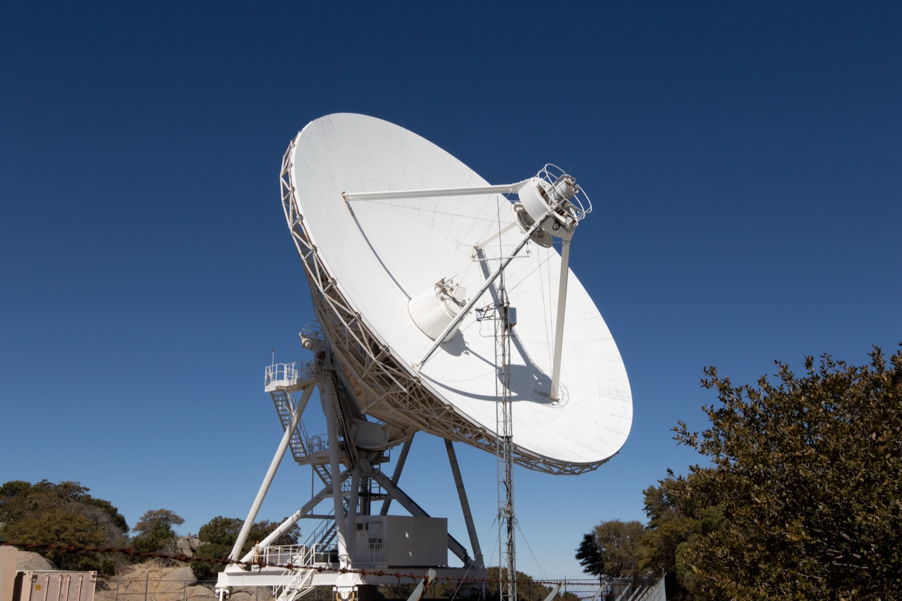

# A Neural Field Turned 116 VLBA Observations of Blazar 3C 345 Into One Video

_kine, published in Nature, fits 27 years of radio epochs into a single function and measures the jet plasma_

## Executive Summary

> [!callout]
> A paper published in Nature on August 26 reconstructed the jet of blazar 3C 345 as a single video. The raw material is 116 observations taken by the VLBA at 15 GHz between 1995 and 2022. Radio interferometry has always produced one still image per observation and then laid the stills out in chronological order; an algorithm called kine instead fed all 116 into one neural network and solved for a function that is continuous in time. The work comes from IAA-CSIC in Spain, Caltech and the University of Toronto, and one of the authors, Katherine Bouman, is the computational imaging researcher known for the algorithm behind the Event Horizon Telescope's black hole image.

> When a video is continuous in time, any moment can be sampled from it, and the motion between frames can be computed. The team applied optical flow to that video and measured the instantaneous speed of the plasma at every point on the screen. The older approach could only measure how fast a handful of conspicuous bright blobs moved. The observations over those 27 years were sparse, though, and to sample frames at regular intervals the model supplied frames for the moments where no observation exists.

> The paper does not hide this. The Methods section states that interpolated frames as far as 5.7 months from the nearest observation were used in the optical flow analysis. Measurement and interpolation live inside the same video, and what tells them apart sits on the timeline beside the video rather than in it. Anyone who has ever built a screen out of filled-in gaps will recognize the arrangement.

### Key figures

Source: [Foschi et al. (2026), Nature, DOI 10.1038/s41586-026-10988-5](https://www.nature.com/articles/s41586-026-10988-5), main text and Methods

<!-- stat-card -->
**116** — observations solved together — 3C 345, VLBA 15 GHz, 1995 to 2022

<!-- stat-card -->
**113 μas** — effective resolution in validation — 4.2× the nominal 475 μas set by the diffraction limit

<!-- stat-card -->
**5×10⁵** — dynamic range achieved — two orders of magnitude above CLEAN at 3.6×10³

<!-- stat-card -->
**5.7 months** — farthest an interpolated frame sits from an observation — that frame was used in the velocity calculation

## 116 observations went into one function

VLBI links radio telescopes across the planet so that they work as one telescope the size of Earth. Signal from the places where no telescope stands is never collected, so turning what was collected into an image is, from the outset, a problem without a single determined answer. The long-standing standard was CLEAN. One observation yields one still image, and an observation from another epoch becomes a separate image. String those images together in order and the video jitters, because the noise structure differs from frame to frame.

*▲ One of the ten VLBA dishes, at Kitt Peak. The 116 observations behind this paper came from combinations of antennas like this one. | Source: [Kitt Peak National Observatory/NOIRLab/NSF/AURA (P. Marenfeld), CC BY 4.0](https://noirlab.edu/public/images/3S8A8130)*

kine builds a function instead of an image. Feed it right ascension, declination and time, and a single neural network returns the brightness and polarization at that place and moment, standing in for the entire video. The architecture is modest: four layers for total intensity, six for full polarization, 256 nodes per layer. During training the spatial coordinates are sampled evenly on a 200 by 200 grid and the time coordinate follows the actual observation dates. Fitting all 116 datasets to this one function took about 1.3 hours on four A100 GPUs.

Solving them together is what lets frames borrow information from one another. Some epochs have poor data because of weather or telescope availability, and the epochs on either side prop up the thin spots. The borrowing is indirect. Nothing tells the network that a jet ought to look a certain way; instead the correlations between frames are enforced implicitly as the network learns them. The paper calls this implicit regularization rather than explicit morphological priors, which is why it works regardless of the type of source and leaves few hyperparameters to tune by hand.

Two things came out of it. The effective resolution averages 113 microarcseconds in the synthetic validation, 4.2 times the nominal 475 microarcseconds set by the diffraction limit. The dynamic range reaches roughly 5×10⁵, about 140 times that of traditional methods.

Of those two, the one that simultaneous reconstruction actually changed is the dynamic range. Resolution already improves by a factor of 3.8 when a single epoch is reconstructed without the time axis, and solving all 116 together brings it to 4.2, which is not much of a difference. The dynamic range on the real 3C 345 data, by contrast, was 3.6×10³ for CLEAN, 4.9×10⁴ for kine reconstructing one epoch at a time and 5.1×10⁵ for kine solving all 116 together. Two orders of magnitude. The gap widens, the paper notes, for the epochs with poorer data. These multipliers should not be copied out as fixed specifications of the algorithm, though. The improvements in resolution and dynamic range depend on the quantity and quality of the observations, and the authors say so in the sentence immediately before they report the numbers: they should not be intended as intrinsic performance gains independent of dataset quality and temporal coverage.

One point is easy to misread because of the algorithm's lineage. kine was originally built for the Event Horizon Telescope's observations of Sagittarius A*, where the source changes during a single observing run and no image can be made without putting time into the model. This paper demonstrates the opposite case: a slowly varying source observed repeatedly across 27 years, and the abstract states plainly that this is the case being shown. There is no new image of a black hole shadow in these results.

## The speed of the flow, not of the blobs

Measuring speed in a jet has so far meant chasing bright blobs. You fit a Gaussian to a conspicuous component in the image, find where that component has moved in the next observation, and divide the displacement by the elapsed time. A source as heavily monitored as 3C 345 has speeds assigned to individual components this way. What that number gives you is the speed of the blob, not the speed at which the plasma at that spot is flowing.

A video that is continuous in time admits another method. The team applied optical flow, borrowed from image processing, and extracted a local velocity vector at every point in the frame. Values appear where no bright component ever passes, in regions of nothing but diffuse emission. One assumption comes attached, of course: that a shift in the brightness distribution on screen is a shift of the plasma itself, and the paper states that assumption in so many words.

The highest value of the mean apparent flow speed is 12 ± 0.2c, in the southern part of the jet between 1 and 3 milliarcseconds from the core, where most components are ejected. It falls to 9 to 11c within the first 5 milliarcseconds and to 5 to 8c further out in the diffuse emission. Apparent speeds exceed the speed of light because the jet lies close to the line of sight, and converting with the reported viewing angles gives a physical speed of 0.997c. Gaussian fitting on the same source had produced 11.79 ± 0.19c and 13.16 ± 0.17c, the same order of magnitude.

The standard deviation of the speed showed no substantial dependence on location, ranging between 3c and 6c, which the team reads as a sign that the plasma flow is turbulent and its apparent speed changes often. That is the kind of quantity a few blob trajectories cannot produce.
