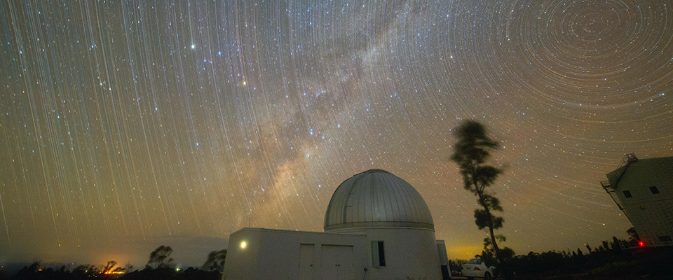
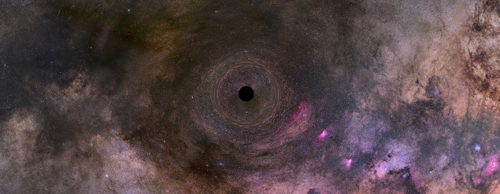
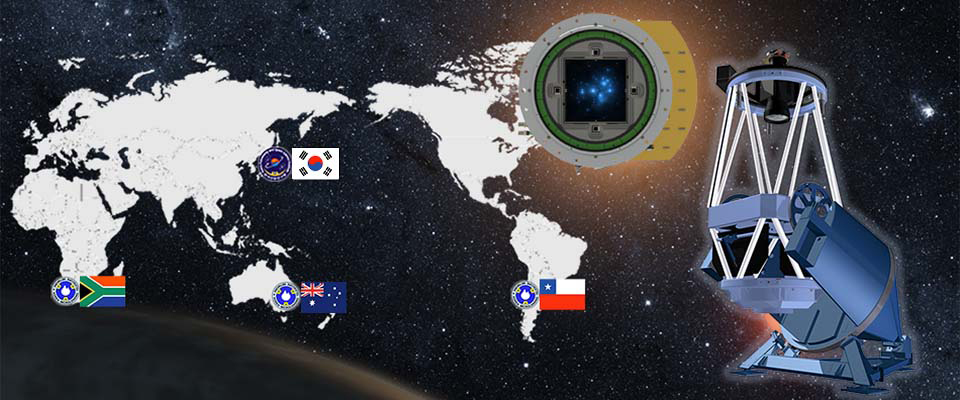

# Weighing Black Holes with a Ten-Year KMTNet Archive Built to Hunt Planets

_Andrew Gould of Ohio State puts the Einstein radius error at 0.5 milliarcseconds, on the condition that ground-based systematics are controlled_

## Executive Summary

> [!callout]
> The paper Andrew Gould of Ohio State University posted to arXiv on 26 August 2026 uses no telescope at all. The microlensing records that KMTNet, run by the Korea Astronomy and Space Science Institute at three sites in the southern hemisphere, piled up between 2016 and 2026 stay exactly where they are. What the paper does is calculate how precisely those records could weigh a black hole drifting alone through the Galaxy.

> The answer is an Einstein radius error of 0.5 milliarcseconds. That figure holds only across the roughly 12 square degrees watched most intensively; over the 28 square degrees beyond it, the error doubles. What separates the two is not the objects being measured but how often that patch of sky was photographed. And a condition hangs over every one of these numbers: that the systematics peculiar to ground-based observation can be controlled.

> So the calculation asks two things at once. What has to be in place for that number to hold? And what had to survive in a collection system designed a decade ago to hunt exoplanets, before it could answer an entirely different question?

### Key numbers

The first two numbers say what this calculation believes it can do; the second two say what ground it stands on. The record over 25 years is a single object, and the reprocessing needed to pick out candidates has been finished for one year's worth of data.

Sources: Gould, A. (2026), [arXiv:2608.26399](https://arxiv.org/abs/2608.26399) · Segev et al. (2026) MNRAS 546, 1

<!-- stat-card -->
**0.5 mas** — Einstein radius error — Across the ~12 deg² monitored most intensively, assuming systematics are controlled

<!-- stat-card -->
**10 mas** — Scatter of a single measurement — What the Segev pilot reached at I = 18, the input to this calculation

<!-- stat-card -->
**1** — Isolated black holes with a settled mass — OGLE-2011-BLG-0462, out of more than 50,000 microlensing events

<!-- stat-card -->
**2023** — The only year re-reduced in full — The TLC re-reduction that candidate selection needs, applied at scale

## Not One Hour of New Telescope Time

[Gould's paper](https://arxiv.org/abs/2608.26399) reports no observations. It photographs no new stars and discovers no new events. What it uses instead is a Fisher analysis, a way of working out in advance how large the errors will be from the observing conditions alone, before any measurement is made. Feed in the number of observations, how they are spread in time, and the precision of a single measurement, and out comes the error on the quantity you finally want.

So what the paper delivers is closer to a map than to a discovery. It takes the KMTNet archive as it already exists and marks how well each region of it can measure. The author is one person, Andrew Gould of the Department of Astronomy at Ohio State University, and the paper is a preprint submitted on 26 August that has not yet been through journal review.

The calculation became possible because of something else. Segev, Ofek, Shvartzvald and colleagues published a pilot study in MNRAS in 2026: the first attempt to pull astrometric time series, records of how a star's position shifts, out of KMTNet's ten-year, roughly 100-square-degree ground-based database, and it reached a usable precision. Gould takes that precision as an input and builds the calculation on top of it. The observing technique belongs to the Segev team; working out what can be done with it is Gould's part.

The last sentence of the abstract states the goal. Combining photometric and astrometric searches, he sets out a practical program for identifying isolated black holes inside the KMTNet database and measuring their masses and distances.

*▲ What feeds this calculation is not a new observation but ten years of records already sitting in storage | Source: [KASI KMTNet](https://kmtnet.kasi.re.kr/kmtnet-eng/)*

## One Isolated Black Hole in 25 Years

A black hole drifting alone, with no companion star, gives off no light. With nothing nearby to swallow, it emits no X-rays either. Microlensing is the only known method for detecting such an object: as the black hole passes in front of a distant background star, its gravity bends the light and the star brightens for a while.

Gould himself predicted in 2000 that on the order of 1% of microlensing events would be caused by black holes. A quarter century later the known events number more than 50,000, and exactly one isolated black hole has been unambiguously identified: OGLE-2011-BLG-0462.

There is only one because settling a mass means measuring two different quantities at the same time. One is the angular Einstein radius, the size of the ring the lens draws on the sky. The other is the microlensing parallax, which shows up as a faint wobble in the light curve as the Earth's orbital motion shifts the vantage point. Know both and the mass and the distance follow together.

Of the two, the parallax is in better shape. It can be measured directly from the same light curve that discovers the event, and it comes out best for long events. Better does not mean easy. Black holes produce long events because they are massive, and that same mass makes their parallax small and therefore hard to measure accurately. Black holes in the Galactic bulge are the worst case. Gould writes that we cannot expect some machine to churn out reliable annual parallax measurements from pipeline reductions of hundreds of events taken with ground-based survey data. Still, the real wall is on the Einstein radius side. More than 100 events now have a measured Einstein radius, but the overwhelming majority came through a single route, the finite-source effect. The light curve is distorted when the background star passes directly over a caustic in the lens structure, and those structures come mostly from binary lenses. Planetary events are the prime example.

For an isolated lens the situation is different. That structure shrinks to a single point, so the chance of the background star crossing it falls to the ratio of the source radius to the Einstein radius. For a lens with an Einstein radius as large as a black hole's, that ratio is below one in a thousand. The larger the Einstein radius, the lower the odds of measuring it.

So other routes opened up. One is to track the tiny shift in the background star's position directly with a high-resolution telescope such as the Hubble Space Telescope. That is how OGLE-2011-BLG-0462 was confirmed. The lens was unusually nearby at about 1.5 kiloparsecs and the black hole was not exceptionally massive at around 8 solar masses, conditions that made the parallax relatively large at 0.095, and even so that single parallax took considerable effort to measure accurately, while the astrometric time series had to run a full decade. The other route is to resolve the two images directly with an interferometer, proposed in 2001, after which it took 25 years for the instruments to become sensitive enough to reach the faint sources involved.

*▲ An isolated black hole warping background starlight (illustration). Hubble astrometry confirmed the only settled case, OGLE-2011-BLG-0462 | Credit: NASA, ESA, Kailash Sahu (STScI); Image Processing: Joseph DePasquale (STScI), Source: [NASA Science](https://science.nasa.gov/missions/hubble/hubble-determines-mass-of-isolated-black-hole-roaming-our-milky-way-galaxy/)*

## Ten Years from a Planet-Hunting Telescope

KMTNet was not built to weigh black holes. The goal of the project, which the Korea Astronomy and Space Science Institute started in January 2009, is written plainly in its [official introduction](https://kmtnet.kasi.re.kr/kmtnet-eng/01): to find extrasolar planets by microlensing, and above all to detect Earth-mass planets in the habitable zone.

The three-continent layout follows from that goal. Three identical 1.6-metre telescopes sit at three southern sites with widely separated longitudes. The first went in at CTIO in Chile in May 2014, the second at SAAO in South Africa in August, the third at SSO in Australia in November. When it is daytime at one site it is night at another, so the bulge at the centre of the Galaxy can be watched around the clock. Each camera covers two degrees by two degrees, four square degrees in one exposure, and the bulge season runs from 20 February to 22 October, about 46% of the total observing time.

*▲ Identical telescopes at three southern sites let KMTNet watch the bulge around the clock | Source: [KASI KMTNet](https://kmtnet.kasi.re.kr/kmtnet-eng/)*

This is the record the Segev team went to work on. Their approach was not to examine events one at a time. It was to build astrometric time series for a large ensemble of stars at once, so that black hole candidates could be searched for independently of the light curves. Running their algorithm on the data from CTIO in Chile, they obtained a scatter of 10 milliarcseconds for a substantial fraction of stars at I = 18 magnitude in KMT field BLG17, which is relatively uncrowded.

So what kind of star sits at I = 18? At the extinctions typical of KMTNet fields, it is a low-luminosity giant. Such stars are certainly less common than the turnoff stars that dominate microlensing statistics, but they are not rare.

## Precision That Splits at 12 and 28 Square Degrees

Gould's calculation has six unknowns: two for the background star's position, two for its proper motion, one for the Einstein radius, and one for the direction in which the lens travels. Every observation delivers two position values, one along each axis, and the precision of a single value is fixed at the 10 milliarcseconds the Segev team achieved. Put all of that in, invert the matrix, and the error on the Einstein radius comes out.

The observing schedule is what decides the answer. Across the roughly 12 square degrees where the nominal cadence is four per hour, the rate holds at 40 a day for 40 days around the summer solstice, then falls linearly to 6 a day over the 105 days before that interval and the 95 days after it. That is a 240-day season with a nominal 6,200 observations a year. Weather and equipment problems typically bring it down to 4,800, and Gould scales it back once more to 4,000 usable observations a year, because KMTNet takes data under all conditions, including bright-moon nights.

Under those conditions the Einstein radius error comes out at 0.5 milliarcseconds. For a sense of scale, that is one 7.2-millionth of a degree, about what it takes to resolve a 0.8-millimetre dot in Busan while standing in Seoul. By the paper's own expression, a black hole of 10 solar masses passing with a parallax of 0.05 has an Einstein radius of 4.1 milliarcseconds, so against the quantity being measured, 0.5 milliarcseconds is a little over 12% of it. Other fields carry one extra factor, the square root of four per hour divided by that field's cadence. The 28 square degrees where the error doubles are simply the sky that was watched at a quarter of the cadence.

The same black hole passing in front of a star of the same brightness can be measured twice as precisely or half as precisely depending on which coordinates on the sky it happened to cross. What makes the difference is not a property of the object but an observing plan fixed ten years ago.
