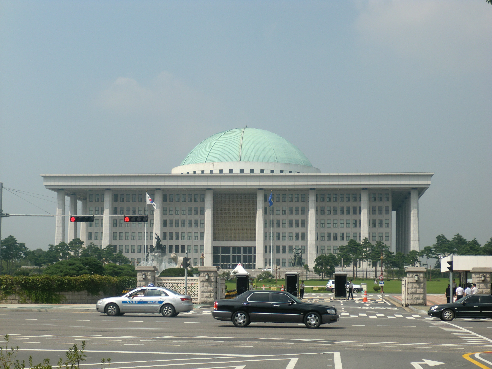

# Korea

_As the EU delays high-risk rules to 2027, Korea now requires impact assessments and transparency for AI in credit scoring, healthcare, and hiring_

## Executive Summary

> [!callout]
> On July 21, 2026, South Korea's AI Framework Act took full effect together with the enforcement decree that fills in its delegated details. Around the same moment, the EU turned the other way. Its "Digital Omnibus" amendment, passed in June, pushed the obligations for high-risk AI back to December 2027. Measured by what is actually in force, Korea is now the country that has put safety obligations on AI that judges people's credit, health, and jobs.

> The point is the nature of what the law asks for. Operators must record their safety and reliability measures in a "safety-reliability document" and keep it for five years, and that record must include explainability for both the AI and its training data. This is not a policy declaration you sign once. It is a continuous evidentiary trail: what data this decision was trained on, and how you can prove its provenance and quality.

> So what matters is less the statute itself than what it demands of the people who handle the data. The substance of compliance is not paperwork but the provenance, quality, and auditability of data — and the AI Framework Act turns data governance from a cost line into a precondition for doing business.

<!-- stat-card -->
**2026.7.21** — Korea AI Framework Act in full force — First country to actually run high-impact AI rules

<!-- stat-card -->
**2027.12** — EU high-risk AI obligations apply — 16-month delay from Aug 2026 (Digital Omnibus)

<!-- stat-card -->
**5 years** — Safety-reliability document retention — Includes explainability of training data

<!-- stat-card -->
**10** — Designated high-impact AI domains — Credit scoring, healthcare, hiring, and more

## The First Country to Flip the Switch

Korea's Framework Act on the Development of Artificial Intelligence and the Establishment of a Foundation of Trust passed the National Assembly in December 2024, and the main body of the law entered into force on January 22, 2026. But the moment "full enforcement" actually points to comes a little later. The amendment and enforcement decree that spell out operators' obligations cleared the Cabinet on July 14, 2026, and took effect on July 21 — the point at which the rules for high-impact AI began to operate as real duties.

*▲ National Assembly Building of South Korea — where the AI Framework Act passed in December 2024 | Source: [Wikimedia Commons](https://commons.wikimedia.org/wiki/File:National_Assembly_Building_of_South_Korea10.JPG)*

Around the same time, the EU moved in the opposite direction. The "Digital Omnibus" amendment, approved by the European Parliament on June 16, delayed the obligations for use-based high-risk AI (Annex III) — hiring, credit scoring, education, access to essential services — from August 2, 2026 to December 2, 2027, a 16-month slip. Only some transparency duties, such as deepfake labeling, stayed close to the original schedule. With the two timelines pulling apart in opposite directions, Korea became the jurisdiction that put safety obligations first on AI that judges people directly.

2026.1.22 · Korea

Main body of the AI Framework Act takes effect. Definitions and the promotion framework come into force.

2026.8.2 → 2027.12.2 · EU

High-risk AI (Annex III) obligations delayed by 16 months. The Omnibus amendment pushed the enforcement date back.

2026.7.21 · Korea

Amendment and enforcement decree take effect. This is the reference point for "full enforcement," where operator obligations for high-impact AI actually begin to work.

The weight of the delay is not only about timing. Because the EU amendment does not apply retroactively, there is a concern that high-risk systems placed on the market before December 2027 may escape the new obligations permanently. It is not merely that the rules switch on a year late; a large share of systems deployed in the meantime are left outside the regulatory net.

"World first" is a phrase worth handling with care, but for AI that judges people's credit, health, and jobs, the claim that Korea activated binding rules first is not an exaggeration. And what those rules actually require is a far more important question for anyone who works with data.

## What "High-Impact AI" Actually Means

The law concentrates its rules on "high-impact AI." Article 2(4) enumerates ten domains and classifies as high-impact any AI that, within those domains, risks a serious effect on people's life and physical safety or on their fundamental rights. The listed domains are energy, drinking water, healthcare and medical devices, nuclear power, biometric identification, hiring, assessment of individual rights such as loan screening, transportation, public services, and student evaluation.

Read that list through a data practitioner's eyes and a common thread appears. Credit scoring, loan screening, medical reading, and hiring evaluation are all the work of judging people with data. What underpins the judgment is less the model's architecture than the composition of the data it was trained on. A hiring model trained on biased résumé data, or a scoring model trained on credit data in which certain groups are underrepresented, becomes a channel for rights violations in itself. That is why the law targets these domains.

> [!callout]
> Deciding whether your service is high-impact AI takes two steps. First, does it fall within one of the ten domains? Then, does that judgment risk a serious effect on people's rights or safety? The moment both conditions overlap, the regulation stops asking about the model's performance and starts asking about the data the judgment stands on.

## The Obligation Is About Data, Not Paperwork

The obligations placed on high-impact AI operators fall broadly into two categories: impact assessment and safety-and-reliability assurance. They differ in character. The impact assessment is closer to a best-efforts duty than a mandatory one. But it is designed so that public bodies must give priority to products and services that have completed an impact assessment when procuring — which means in practice it operates much like a qualification for entering the market.

### 3.1. The Safety-Reliability Document and Five-Year Retention

The more concrete burden lies on the safety-and-reliability side. Under Article 8 of the draft notification on duties, operators must document the measures they have taken in a "safety-reliability document," keep it for five years, and review and update it periodically. And that document explicitly includes securing explainability for the AI and its training data.

What the law requires here is not one signed policy declaration. It is evidence — that you can still explain, five years later, what data this judgment was trained on and how you can vouch for its provenance and quality. It also means that the record must carry through even as you retrain the model and swap out datasets.

### 3.2. The Premise Behind Mutual Recognition

If you already carry out equivalent measures under other laws — the Digital Medical Products Act, the Credit Information Act, the Financial Consumer Protection Act — you are recognized as having met the AI Framework Act's obligations. At first glance this looks like a clause that eases the burden, but the premise of that recognition is what matters. The recognition asks whether you already had risk management, explainability, and data governance in place. Whichever law you travel through, the destination is the same.

- Impact assessment: a best-efforts duty, but a de facto market incentive through priority in public procurement.
- Safety-reliability document: five-year retention and periodic updates, including explainability of training data.
- Mutual recognition: compliance under other laws is recognized, but data governance is the precondition.
- On violation: a corrective order or an administrative fine of up to KRW 30 million.

## Compliance Is Really Data Governance

The law's question ultimately narrows to three things about data. Can you trace where the training data came from? Can you verify that its quality meets a standard? Can you reproduce and audit that verification five years later? In order: lineage, quality, and auditability.

### 4.1. Provenance, Quality, Auditability

Data lineage is an unbroken record of where each piece of training data came from and what processing it went through. Quality is managed with measurable indicators such as label accuracy and representativeness, and data quality standards like ISO/IEC 5259 provide the language for it. Auditability is the problem of storage and version control that lets you pull those two back out even after time has passed. The "explainability" the safety-reliability document demands is, in practice, a requirement that runs through all three layers.

> [!callout]
> So the safety-reliability document is called a document, but its substance is a record of data lineage. The gap opens here — between a company that scrambles to produce documents after the regulation arrives, and a company that built lineage, quality, and audit functions into its pipeline from the start. The former has to reconstruct five years of evidence after the fact; the latter simply organizes logs it has already accumulated and submits them.

## What to Start During the Grace Period

Full enforcement does not mean fines land today. A grace period of at least one year is given across operators' obligations as a whole. The one exception: the duty to label generated content, such as deepfakes, applies immediately with no reprieve — so if you run a generative service, this part cannot wait.

The real use of the grace period is not to buy time for filling in documents after the fact. It is better spent as a reprieve to build a data governance system into the pipeline. If you start recording the provenance of the data going into training now, in a year that record simply becomes your safety-reliability document. Put it off, and a year from now you will be reconstructing the provenance of data that has already flowed past.

> [!callout]
> What the AI Framework Act changed is the position of data governance. It used to be a management cost that was nice to have; now it is a precondition for putting high-impact AI on the market. If the substance of compliance is not paperwork but the provenance, quality, and auditability of data, then the starting point for preparation should not be a document template either — it should be the data pipeline.

## References

### Official Documents & Statutes

- 1.Korea Law Information Center. (2026). "[Framework Act on the Development of Artificial Intelligence and the Establishment of a Foundation of Trust](https://www.law.go.kr/lsInfoP.do?lsiSeq=268543)." Ministry of Government Legislation.

### Industry & Press Analysis

- 2.AI Citizen Lab. (2026). "[The AI Framework Act Takes Effect July 21, 2026: How Will It Change My Life and Business?](https://aicitizenlab.com/entry/korea-ai-regulations-grace-period-2026)."
- 3.Shin & Kim. (2026). "[Newsletter on the Enforcement of the AI Framework Act](https://www.shinkim.com/kor/media/newsletter/3114)." Shin & Kim Newsletter 3114.
- 4.Lawtimes. (2026). "[Issues and Challenges Arising from the Enforcement of the AI Framework Act](https://www.lawtimes.co.kr/news/articleView.html?idxno=215368)."
- 5.Lexology. (2026). "[Duties of High-Impact AI Operators — AI Framework Act Guideline Commentary Series (4)](https://www.lexology.com/library/detail.aspx?g=45171c0a-9e28-4952-89eb-fd2619c7ecfa)."

### EU AI Act Comparison

- 6.Gibson Dunn. (2026). "[EU AI Act Omnibus Agreement: Postponed High-Risk Deadlines and Other Key Changes](https://www.gibsondunn.com/eu-ai-act-omnibus-agreement-postponed-high-risk-deadlines-and-other-key-changes/)."
- 7.Morgan Lewis. (2026). "[EU Approves Delays and Other Amendments to Certain EU AI Act Obligations](https://www.morganlewis.com/pubs/2026/06/eu-approves-delays-and-other-amendments-to-certain-eu-ai-act-obligations-what-businesses-should-know)."
- 8.Tech Policy Press. (2026). "[EU's AI Act Delays Let High-Risk Systems Dodge Oversight](https://www.techpolicy.press/eus-ai-act-delays-let-highrisk-systems-dodge-oversight/)."
