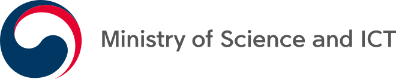
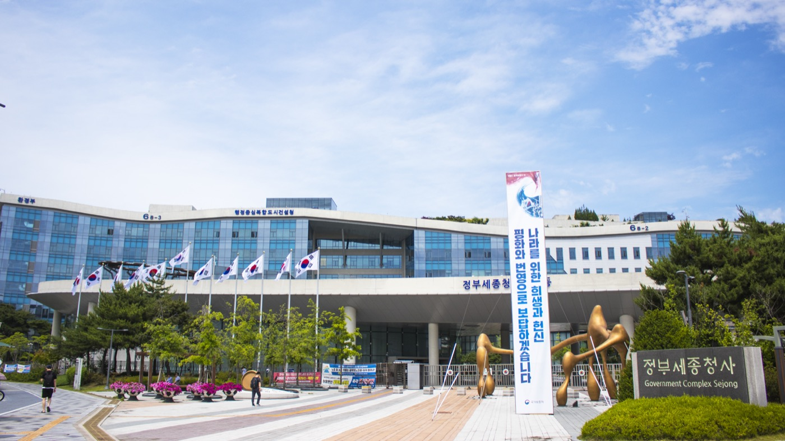

# Korea

_The second draft released by the science ministry on August 14 adds accountability, and the actual bar will be set by the guide due later this year_

## Executive Summary

> [!callout]
> Korea's Ministry of Science and ICT (MSIT) and the Korea Information Society Development Institute (KISDI) held a public forum on the national AI ethics principles in central Seoul on August 14 and released a second draft. The first draft, published in May, listed six principles. This one lists seven. The new slot went to accountability.

> Lee Jin-su, MSIT's director general for AI policy planning, drew the line this way: statute is hard law, and the ethics principles are soft law. That reads like an exemption from obligation, and yet the sentences underneath the principles already spell out practical demands. In the published draft, the transparency principle requires that decisions with a material effect on someone's rights come with an explanation, and that a route exist for raising an objection or asking for review.

> So the place to read is not the headcount of principles but the sentences underneath. Translated into operational language, two questions remain. Is there a record of where this data came from, and does a person affected by a decision have somewhere to contest it?

### Key Numbers

The first two numbers point to where this revision came from. The last two point to the moment the document turns into an actual yardstick.

Sources: [ZDNet Korea (2026-08-14)](https://zdnet.co.kr/view/?no=20260814161240), [Digital Daily (2026-08-14)](https://www.ddaily.co.kr/page/view/2026081411354358021)

<!-- stat-card -->
**6 → 7** — Change in principle count — Accountability is the only genuinely new entry

<!-- stat-card -->
**116** — Written comments on the first draft — Between the May release and the August revision

<!-- stat-card -->
**6 years** — Since the 2020 ethics standards — Agentic and physical AI drove the rewrite

<!-- stat-card -->
**H2 2026** — Guide and self-checklist due — Where wording becomes a test you can fail

## The New Slot Went to Accountability

By the count, one item was added. Put the two drafts side by side and you also see items trading places. Trustworthiness of technology, which held the third slot among the three core values, moved down into the principles, and sustainability, which had been a principle, moved up into the values as sustainability of humanity.

*▲ Korea's Ministry of Science and ICT, which drafted the second version of the AI ethics principles | Source: [Wikimedia Commons](https://commons.wikimedia.org/wiki/File:Ministry_of_Science_and_ICT_of_the_Republic_of_Korea_Logo_(English)_(horizontal).svg)*

| Layer | First draft (May 28) | Second draft (August 14) |
| --- | --- | --- |
| Three core values | Human dignity, public good of society, trustworthiness of technology | Human dignity, public good of society, sustainability of humanity |
| Principles | Human autonomy, privacy, fairness and inclusiveness, sustainability, safety, transparency (6) | Human-centeredness, privacy protection, fairness and inclusiveness, accountability, safety, trustworthiness, transparency (7) |

The first draft is the version published on May 28, 2026; the second draft is the version presented at the August 14 forum.

Some items were renamed. Human autonomy became human-centeredness, privacy became privacy protection, and transparency was tidied into its noun form in the Korean text. Strip out everything that only moved or got a new label and one principle is left standing: accountability. Several outlets singled out that line as the core change in this revision.

MSIT and KISDI published the first draft in May, collected 116 written comments, and built this version from them. A final text is planned for adoption and publication later in August, so the labels may still shift a little. Some outlets render safety without the Korean noun suffix, which is why wording varies slightly across coverage.

The reason for reopening the document after six years lies on the technology side. Generative AI, agentic AI, and physical AI did not exist in the field when the 2020 standards were written. Choi Woo-seok, who heads MSIT's AI safety and trust support division, said securing safety and trust across the whole arc from development to use has become the central task, and that making good use of AI first requires easing the public's concerns about it.

> [!callout]
> The 2020 document, adopted that December under the title Human-Centered Artificial Intelligence Ethics Standards, was built from three principles and ten core requirements, and accountability and transparency were already in it. This revision did not invent missing concepts. It folded in six years of new technology categories and rearranged the items.

## Not Binding, but Still the Baseline

The government said the principles are not regulation that loads new obligations onto companies. In Lee Jin-su's framing, statute is hard law and the ethics principles are soft law. This draft also writes out the role of each actor, covering users, civil society, and the government alongside developers and operators.

*▲ Government Complex Sejong, home to MSIT and other central ministries | Source: [Wikimedia Commons](https://commons.wikimedia.org/wiki/File:Government_Complex_Sejong_20190611_Main_Entrance.jpg) (CC BY-SA 3.0, *Youngjin)*

A statute already exists, so why ethics principles? Kim Kyung-man, head of MSIT's AI policy office, answered that the AI Framework Act put legally binding rules in place, but that enjoying the benefits of AI while limiting the harms takes a minimum standard the public, industry, and civil society can agree on before the law speaks. What the government wants from the document is plainer in Choi Woo-seok's remarks: if these principles are observed well, there will be no need to bring in additional regulation. That makes it closer to a buffer, where voluntary compliance holds back the expansion of hard law.

Industry read the same text from the opposite direction, as a voluntary standard that could become the de facto baseline in the legislative debates ahead. Kim Kyung-hoon, AI safety lead at Kakao, said that on the scope of training-data disclosure, there is concern about whether matters the law has not settled belong in a set of ethics principles. Disclosure scope is tangled up with copyright, trade secrets, and industrial competitiveness. Kim did call it a positive that the principles give companies a reason to revisit their internal guidelines.

Others questioned the sequence. Byun Soon-yong, a professor at Seoul National University of Education, said the natural order runs from ethics to law, with whatever needs force becoming statute, whereas here the AI Framework Act asked for ethics, inverting that order. Even so, Byun added, when you do not know which way to go, a compass that points somewhere is worth having.

Hard and soft also diverge in reach. The [AI Framework Act](/blog/korea-ai-basic-act-data-governance/en/), in full force since July 21, imposes impact assessments and safety-and-trust documentation on high-impact AI across ten domains, including credit scoring, healthcare, and hiring. The targets are named, and violations carry fines. The ethics principles do the reverse: they address everyone and compel no one. The vocabulary overlaps; the way each one binds does not.

## Two Sentences Already in Transparency

Of the seven principles, the one a data owner should read first is transparency. According to the explanation attached to the published draft, it breaks into three sub-items.

- Disclosure of AI use: whether and why AI is used, its main functions and how it works, its scope and limits, and its risks and cautions, all provided in a form users and society can understand.
- Proportionate transparency: calibrated to purpose, risk level, and the characteristics of users, and balanced against competing values such as privacy and trade secrets.
- Explanation and appeal procedures: an explanation of the main reasons and factors behind a decision, provided so the person subject to it can understand, plus a procedure for raising an objection or requesting review.

The passage industry read most closely is training-data disclosure. Outlets covering the forum reported that this transparency principle contains language on disclosing training data. The clause Kakao asked the ministry to weigh carefully sits inside this very principle.

Put the three sub-items into operational sentences and the preparation narrows. The first is keeping a record of where the data came from. What the model trained on, and where and under what terms that data was obtained, has to be attached to the pipeline as a record before there is any basis for answering a disclosure notice or a question about training data. The fight over how far training-data disclosure should go also reads differently at a company that keeps those records than at one that does not.

The second is a route for contesting a decision. A candidate rejected in hiring or an applicant whose credit limit was cut needs somewhere to ask why that decision came out that way and to request a review. Build the channel and people and records follow it. Review only holds up if you can trace which version of which model produced that judgment on which data.

> [!callout]
> The newly added accountability principle is what names those two sentences. Records make explanation possible, a channel makes review possible, and taking responsibility requires both to exist first. It is the same structure as the [safety-and-trust documentation](/report/korea-ai-basic-act-highimpact-governance/en/) the AI Framework Act asks of high-impact AI, which turned out to be a record substantiating the provenance and quality of training data.

## Opposite Demands Landed on the Same Clause

At the forum, civil society asked that fundamental rights protection and remedy procedures be written out in more detail, and industry asked for guidance it could apply on the ground, plus a support system to go with it.

Hong Yun-hee, chair of the nonprofit Muui, noted that the word inclusiveness can land as charity, as though a benefit were being bestowed on minorities, and proposed either shifting the wording toward inclusion or writing accessibility into the principles as something covering the rights of all citizens. The demand is to treat people affected by AI as parties exercising rights rather than as subjects of protection. Lee Ji-eun, senior coordinator at People's Solidarity for Participatory Democracy, said the role of ethics principles is to think through and act on the territory the law does not cover.

There was a request about data itself as well: define information that markets struggle to collect, such as data on people with disabilities and other minorities, as public-interest data, and have the government support the basis for building and using it. Lee added that companies need an internal audit function that can assess AI's social impact independently.

The industry ask is more operational. Kim Hyun-joo, a division head at the Korea Software Industry Association, reported that companies mostly do not ask what an individual legal provision means. They ask whether their own service falls within scope. What that calls for is a detailed guide small companies and startups can actually follow, plus a channel to ask questions.

The two requests meet in the same place. Saying that affected parties exercise rights means the objection and review procedures actually function, and asking whether a company is in scope means asking how far it has to build those procedures out. Neither answer lives in the wording of the principles. Both live in the commentary that goes underneath.

## The Self-Checklist Sets the Real Test

MSIT laid out what comes after the final text due later in August: an explanatory guide for the general public, a voluntary self-checklist for companies, AI ethics teaching materials for students and general readers, and outreach sharing the principles with international bodies and global firms.

The item on that list that sets the operational burden is the self-checklist. As they stand, the three sentences of the transparency principle only point in a direction. Once a checklist exists, which records you must keep and to what depth for transparency to count as met, and how far the appeals channel must be built out, come down as line items. Read the principles and move on, and when the checklist arrives the provenance of training data already used has to be reconstructed after the fact.

Records are the kind of preparation that does not work retroactively. Start logging the provenance of the data going into training now and there will be material to answer with, whatever the checklist asks in the second half of the year. That is the value in reading a nonbinding document early.

## References

### News Coverage

- 1.ZDNet Korea. (Aug. 14, 2026). "[정부, 'AI 윤리원칙' 초안 공개…업계 '권리 보호·기업 지침 보강해야'](https://zdnet.co.kr/view/?no=20260814161240)" [Government unveils "AI ethics principles" draft — industry calls for stronger rights protection and clearer guidelines].
- 2.Financial News (파이낸셜뉴스). (Aug. 14, 2026). "[AI 만들고 쓸때 지켜야할 AI윤리 8월 나온다…규제 아닌 자율규범](https://www.fnnews.com/news/202608141218124650)" [AI ethics rules for building and using AI arrive in August — a voluntary code, not regulation].
- 3.Digital Daily (디지털데일리). (Aug. 14, 2026). "[AI윤리원칙 두고 '사전규제vs완충제'…업계·정부 미묘한 시각차](https://www.ddaily.co.kr/page/view/2026081411354358021)" ["Pre-emptive regulation vs. buffer" — industry and government split subtly over AI ethics principles].
- 4.inews24. "[과기정통부, AI 윤리원칙 6년 만에 손질... '국민 우려 해소'에 방점](http://inews24.com/view/1995072)" [MSIT revises AI ethics principles after six years, focused on easing public concern].
- 5.Money Today (머니투데이). (May 28, 2026). "[AI 개발시 지켜야 할 '6대 원칙' 나왔다…정부, 공개 의견수렴](https://www.mt.co.kr/tech/2026/05/28/2026052810145480413)" [Government unveils six AI development principles, opens public comment].
- 6.Financial News (파이낸셜뉴스). (May 28, 2026). "['AI도 공공선 지켜야'…정부, AI 윤리원칙 초안 공개](https://www.fnnews.com/news/202605280925495314)" ["AI must serve the public good too" — government releases draft AI ethics principles].
- 7.ZDNet Korea. (Dec. 23, 2020). "['한국판 AI 윤리기준' 10대 원칙 담았다](https://zdnet.co.kr/view/?no=20201223105913)" [Korea's AI ethics standard sets out ten core requirements].

### Official Documents

- 8.Korea Information Society Development Institute (KISDI), AI Ethics Communication Channel. "[AI 윤리원칙(안)](https://ai.kisdi.re.kr/aieth/main/contents.do?menuNo=400054)" [AI Ethics Principles (Draft)].
- 9.Korea Information Society Development Institute (KISDI), AI Ethics Communication Channel. (2020). "[인공지능 윤리기준](https://ai.kisdi.re.kr/aieth/main/contents.do?menuNo=400029)" [National AI Ethics Standard].
