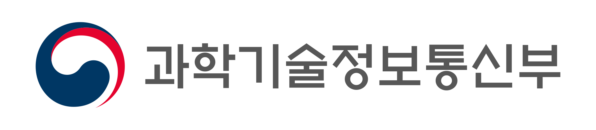

# 여섯에서 일곱으로 늘어난 대한민국 AI 윤리원칙

_과기정통부가 8월 14일 공개한 2차안에 책임성이 새 원칙으로 들어갔고 실제 기준은 하반기 해설서가 정한다_

## Executive Summary

> [!callout]
> 과학기술정보통신부와 정보통신정책연구원이 8월 14일 서울 중구에서 대한민국 인공지능 윤리원칙 대토론회를 열고 2차안을 공개했습니다. 5월에 나온 1차안의 원칙은 여섯 개였고 이번 안은 일곱 개입니다. 늘어난 자리에 들어온 것은 책임성 하나입니다.

> 이진수 과기정통부 AI정책기획관은 법이 경성규범이라면 윤리원칙은 연성규범이라고 성격을 구분했습니다. 의무가 아니라는 말로 읽히지만 원칙 문장 아래에는 이미 실무 요구가 적혀 있습니다. 공개된 안의 투명성 원칙은 사람의 권리에 중대한 영향을 주는 결정에 설명을 제공하고, 이의를 제기하거나 재검토를 요청할 절차를 두라고 명시합니다.

> 그래서 읽을 곳은 원칙 개수가 아니라 그 아래 문장입니다. 실무 언어로 옮기면 질문 두 개가 남습니다. 이 데이터가 어디서 왔는지 기록에 남아 있는가, 그리고 영향을 받은 사람이 이의를 제기할 경로가 있는가.

### 주요 수치

앞의 두 숫자는 이번 수정안이 어디서 왔는지를 가리키고, 뒤의 두 숫자는 이 문서가 실제 기준으로 바뀌는 시점을 가리킵니다.

출처: [ZDNet Korea (2026-08-14)](https://zdnet.co.kr/view/?no=20260814161240), [디지털데일리 (2026-08-14)](https://www.ddaily.co.kr/page/view/2026081411354358021)

<!-- stat-card -->
**6 → 7** — 원칙 개수 변화 — 순수하게 신설된 항목은 책임성

<!-- stat-card -->
**116건** — 1차안에 접수된 서면 의견 — 5월 공개 후 8월 수정안까지

<!-- stat-card -->
**6년** — 2020년 윤리기준 이후 경과 — 에이전틱 AI·피지컬 AI가 재정비 배경

<!-- stat-card -->
**하반기** — 해설서·자율점검표 예정 — 원칙 문구가 판단 기준으로 번역되는 단계

## 새로 생긴 원칙은 책임성 하나

개수만 보면 하나 늘었습니다. 두 안을 나란히 놓으면 항목 사이의 자리 이동이 함께 보입니다. 3대 가치의 세 번째 자리에 있던 기술의 신뢰성이 원칙 쪽으로 내려오고, 원칙에 있던 지속가능성이 인류의 지속가능성이라는 이름으로 가치 쪽에 올라갔습니다.

*▲ 대한민국 AI 윤리원칙 2차안을 마련한 과학기술정보통신부 | Source: [Wikimedia Commons](https://commons.wikimedia.org/wiki/File:Ministry_of_Science_and_ICT_of_the_Republic_of_Korea_Logo_(horizontal).svg)*

| 구분 | 1차안 (5월 28일) | 2차안 (8월 14일) |
| --- | --- | --- |
| 3대 가치 | 인간의 존엄성, 사회의 공공선, 기술의 신뢰성 | 인간의 존엄성, 사회의 공공선, 인류의 지속가능성 |
| 원칙 | 인간의 자율성, 프라이버시, 공정성·포용성, 지속가능성, 안전성, 투명 (6개) | 인간중심성, 프라이버시 보호, 공정성·포용성, 책임성, 안전성, 신뢰성, 투명성 (7개) |

1차안은 2026년 5월 28일 공개본, 2차안은 8월 14일 대토론회 공개본 기준입니다.

이름이 바뀐 항목도 있습니다. 인간의 자율성은 인간중심성으로, 프라이버시는 프라이버시 보호로, 투명은 투명성으로 정리됐습니다. 자리를 옮기거나 이름을 고친 항목을 걷어내면 새로 생긴 원칙은 책임성 하나입니다. 여러 매체가 이번 수정의 핵심 변경점으로 이 대목을 지목했습니다.

과기정통부와 KISDI는 5월에 1차 초안을 공개하고 서면 의견 116건을 받아 이번 안을 만들었습니다. 8월 중 최종안을 제정해 공표할 계획이라, 항목 이름은 아직 조금 더 움직일 수 있습니다. 매체에 따라 안전성이 안전으로 표기되기도 합니다.

6년 만에 문서를 다시 꺼낸 이유는 기술 쪽에 있습니다. 2020년 윤리기준을 만들 때는 없던 생성형 AI와 에이전트 AI, 피지컬 AI가 그사이 현장에 들어왔습니다. 최우석 과기정통부 인공지능안전신뢰지원과장은 개발부터 이용까지 전 과정의 안전과 신뢰 확보가 주요 과제로 떠올랐다며, AI를 잘 활용하려면 AI에 대한 국민의 우려를 먼저 해소할 필요가 있다고 설명했습니다.

> [!callout]
> 2020년 12월 의결된 사람이 중심이 되는 인공지능 윤리기준은 3대 원칙과 10대 핵심요건으로 짜여 있었고, 그 안에도 책임성과 투명성은 이미 있었습니다. 이번 개정은 없던 개념을 만든 작업이 아니라 여섯 해 동안 늘어난 기술 범주를 넣고 항목을 다시 배치한 작업에 가깝습니다.

## 구속력은 없는데 기준점은 된다

정부는 이번 원칙이 기업에 새 의무를 지우는 규제가 아니라고 설명했습니다. 이진수 AI정책기획관의 표현으로는 법이 경성규범이고 윤리원칙이 연성규범입니다. 개발자와 사업자만이 아니라 이용자와 시민사회, 정부까지 각 주체의 역할을 함께 적은 것도 이번 안의 특징입니다.

*▲ 정부세종청사 — 과학기술정보통신부를 비롯한 중앙행정기관이 입주해 있다 | Source: [Wikimedia Commons](https://commons.wikimedia.org/wiki/File:Government_Complex_Sejong_20190611_Main_Entrance.jpg) (CC BY-SA 3.0, *Youngjin)*

법이 이미 있는데 왜 또 윤리원칙인가. 김경만 과기정통부 인공지능정책실장은 AI 기본법으로 법적 효력이 있는 규범은 마련했지만, 부작용을 줄이면서 AI의 혜택을 누리려면 법 이전에 국민과 산업계, 시민사회가 공감할 최소한의 기준이 필요하다고 답했습니다. 정부의 기대는 최우석 과기정통부 과장의 말에서 더 분명해집니다. 원칙이 잘 지켜지면 규제를 추가로 도입할 필요가 없어진다는 것입니다. 자율 이행으로 경성규범의 확대를 막는 완충장치에 가깝습니다.

산업계는 같은 문서를 반대 방향에서 읽었습니다. 자율 기준이 앞으로의 입법 논의에서 사실상의 기준점이 될 수 있다는 쪽입니다. 카카오 AI 세이프티 리더 김경훈은 학습데이터 공개 범위를 두고, 아직 법제에서 해결되지 않은 내용이 윤리원칙에 들어가는 것이 맞는지 우려가 있다고 말했습니다. 공개 범위가 저작권과 영업비밀, 산업 경쟁력과 얽혀 있다는 이유입니다. 다만 이번 원칙이 기업 내부 가이드라인을 다시 점검할 기준이 된다는 점은 긍정적이라고 평가했습니다.

순서를 문제 삼는 지적도 나왔습니다. 변순용 서울교육대학교 교수는 윤리가 먼저 서고 그 가운데 필요한 것이 법으로 가는 것이 순리인데 이번에는 AI 기본법이 윤리를 만들라고 요청한 역순이라고 말했습니다. 그러면서도 어디로 가야 할지 모를 때 방향을 알려주는 나침반은 필요하다고 평가했습니다.

경성과 연성의 구분은 적용 범위에서도 갈립니다. 지난 7월 21일 전면 시행에 들어간 [AI 기본법](/blog/korea-ai-basic-act-data-governance/ko/)은 신용평가·의료·채용 등 열 개 영역의 고영향 AI에 영향평가와 안전신뢰문서 의무를 지웁니다. 대상이 정해져 있고 위반에 과태료가 붙습니다. 윤리원칙은 대상을 가리지 않는 대신 강제하지 않습니다. 다루는 이름은 겹치는데 구속하는 방식이 다릅니다.

## 투명성 원칙이 이미 적어 둔 두 문장

일곱 개 원칙 가운데 데이터 담당자가 먼저 읽어야 할 항목은 투명성입니다. 공개된 안의 설명에 따르면 투명성 원칙은 세 개의 세부 항목으로 나뉩니다.

- 인공지능 활용 고지: 사용 여부와 목적, 주요 기능과 작동 방식, 적용 범위와 한계, 위험과 유의사항을 이용자와 사회가 이해할 수 있는 방식으로 제공합니다.
- 비례적 투명성 확보: 활용 목적과 위험 수준, 이용자 특성에 맞게 정도를 조절하고 프라이버시·영업비밀 같은 다른 가치와 균형을 맞춥니다.
- 설명 및 이의제기 절차 보장: 결정의 대상이 주요 이유와 판단 요소를 이해할 수 있도록 설명을 제공하고, 이의를 제기하거나 재검토를 요청할 절차를 마련합니다.

이 가운데 산업계가 가장 예민하게 읽은 대목은 학습데이터 공개입니다. 토론회를 취재한 매체들은 이번 투명성 원칙에 학습데이터 공개에 관한 내용이 들어갔다고 전했습니다. 앞에서 카카오가 신중한 검토를 요청한 조항이 바로 이 원칙 안에 있습니다.

세 항목을 실무 문장으로 옮기면 준비할 것이 좁혀집니다. 첫째는 데이터가 어디서 왔는지 남기는 일입니다. 어떤 데이터로 학습했고 그 데이터를 어디서 어떤 조건으로 받았는지가 파이프라인에 기록으로 붙어 있어야, 활용 고지든 학습데이터 설명이든 답할 근거가 생깁니다. 카카오가 우려한 학습데이터 공개 범위 논쟁도 결국 이 기록이 있는 회사와 없는 회사 사이에서 다르게 읽힙니다.

둘째는 이의를 제기할 경로입니다. 채용 심사에서 떨어진 지원자, 한도가 깎인 대출 신청자가 왜 그런 결정이 나왔는지 묻고 재검토를 요청할 창구가 있어야 합니다. 창구를 만들면 그 뒤에 사람과 기록이 따라옵니다. 어떤 모델의 어느 버전이 어떤 데이터로 그 판단을 냈는지 되짚을 수 있어야 재검토가 성립합니다.

> [!callout]
> 새로 들어온 책임성은 이 두 문장에 이름을 붙이는 원칙입니다. 기록이 있어야 설명할 수 있고, 창구가 있어야 재검토할 수 있고, 책임을 지려면 그 둘이 먼저 있어야 합니다. AI 기본법이 고영향 AI에 요구한 [안전신뢰문서](/report/korea-ai-basic-act-highimpact-governance/ko/)가 결국 학습 데이터의 출처와 품질을 증빙하는 기록이었던 것과 같은 구조입니다.

## 요구는 갈렸는데 가리킨 조항은 같았다

토론회에서 시민사회는 기본권 보호와 피해 구제 절차를 더 구체적으로 적으라고 했고, 산업계는 현장에서 적용할 지침과 지원 체계를 요청했습니다.

홍윤희 사단법인 무의 이사장은 포용성이라는 표현이 소수자에게 혜택을 베푼다는 시혜적 의미로 읽힐 수 있다고 지적하고, 표현을 포함성으로 바꾸거나 모든 시민의 권리를 아우르는 접근성을 원칙에 명시하자고 제안했습니다. AI의 영향을 받는 사람을 보호 대상이 아니라 권리를 행사하는 당사자로 놓자는 요구입니다. 이지은 참여연대 선임간사는 법이 포괄하지 못하는 영역까지 함께 고민하고 실천하자는 것이 윤리원칙의 역할이라고 말했습니다.

데이터를 두고 낸 요구도 있습니다. 장애인과 소수자 관련 정보처럼 시장에서 모이기 어려운 데이터를 공익 데이터로 규정하고, 정부가 구축과 활용 기반을 지원해 달라는 것입니다. 이 선임간사는 기업 내부에도 AI의 사회적 영향을 독립적으로 평가할 감사 체계가 필요하다고 덧붙였습니다.

산업계 쪽 요구는 더 실무적입니다. 김현주 KOSA 본부장은 기업들이 개별 법 조항의 의미보다 자사 서비스가 적용 대상인지를 주로 묻는다고 전했습니다. 중소기업과 스타트업이 이해할 수 있는 상세 해설서와 상담 채널이 필요하다는 이야기입니다.

두 요구는 같은 자리에서 만납니다. 당사자가 권리를 행사한다는 말은 이의제기와 재검토 절차가 실제로 작동한다는 뜻이고, 기업이 적용 대상인지 알고 싶다는 말은 그 절차를 어디까지 갖춰야 하는지 알려 달라는 뜻입니다. 둘 다 원칙 문구가 아니라 그 아래 붙을 해설에서 답이 나옵니다.

## 판단 기준은 하반기 점검표에서 나온다

과기정통부는 8월 중 최종안을 공표한 뒤 후속 작업을 예고했습니다. 일반 국민용 해설서, 기업용 자율점검표, 학생과 일반인을 위한 AI 윤리교육 교재를 만들고 국제기구와 글로벌 기업에 원칙을 공유한다는 계획입니다.

실무 부담이 정해지는 곳은 이 목록 가운데 자율점검표입니다. 투명성 원칙의 세 문장은 지금 상태로는 방향만 가리킵니다. 점검표가 나오면 어떤 기록을 어느 수준까지 남겨야 투명성을 지킨 것으로 보는지, 이의제기 창구를 어디까지 갖춰야 하는지가 항목으로 내려옵니다. 원칙을 읽고 넘겼다가 점검표를 받고 준비를 시작하면, 그때는 이미 지나간 학습 데이터의 출처를 거슬러 복원해야 합니다.

기록은 소급되지 않는 종류의 준비물입니다. 지금 학습에 들어가는 데이터의 출처를 남기기 시작하면 하반기에 점검표가 무엇을 묻더라도 답할 재료가 쌓입니다. 구속력 없는 문서를 미리 읽어 둘 값은 여기에 있습니다.

## 참고문헌

### 보도

- 1.ZDNet Korea. (2026.08.14). "[정부, 'AI 윤리원칙' 초안 공개…업계 '권리 보호·기업 지침 보강해야'](https://zdnet.co.kr/view/?no=20260814161240)."
- 2.파이낸셜뉴스. (2026.08.14). "[AI 만들고 쓸때 지켜야할 AI윤리 8월 나온다…규제 아닌 자율규범](https://www.fnnews.com/news/202608141218124650)."
- 3.디지털데일리. (2026.08.14). "[AI윤리원칙 두고 '사전규제vs완충제'…업계·정부 미묘한 시각차](https://www.ddaily.co.kr/page/view/2026081411354358021)."
- 4.inews24. "[과기정통부, AI 윤리원칙 6년 만에 손질... '국민 우려 해소'에 방점](http://inews24.com/view/1995072)."
- 5.머니투데이. (2026.05.28). "[AI 개발시 지켜야 할 '6대 원칙' 나왔다…정부, 공개 의견수렴](https://www.mt.co.kr/tech/2026/05/28/2026052810145480413)."
- 6.파이낸셜뉴스. (2026.05.28). "['AI도 공공선 지켜야'…정부, AI 윤리원칙 초안 공개](https://www.fnnews.com/news/202605280925495314)."
- 7.ZDNet Korea. (2020.12.23). "['한국판 AI 윤리기준' 10대 원칙 담았다](https://zdnet.co.kr/view/?no=20201223105913)."

### 공식 문서

- 8.정보통신정책연구원(KISDI) 인공지능 윤리 소통채널. "[AI 윤리원칙(안)](https://ai.kisdi.re.kr/aieth/main/contents.do?menuNo=400054)."
- 9.정보통신정책연구원(KISDI) 인공지능 윤리 소통채널. (2020). "[인공지능 윤리기준](https://ai.kisdi.re.kr/aieth/main/contents.do?menuNo=400029)."
