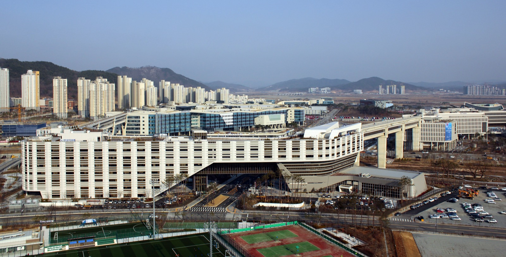

# 전 국민 무료 AI에 걸린 국산 모델 절반 이상 조건

_과기정통부 모두의 AI에는 국산 모델 최소 80% 의무와 복지 자격을 먼저 읽는 공공 에이전트가 함께 담겼다_

## Executive Summary

> [!callout]
> 대한민국이 G20 국가 가운데 처음으로 5,200만 전 국민에게 무료 AI를 공공서비스로 제공한다. 과학기술정보통신부가 공개한 '모두의 AI' 사업이다. 이용량 제한 없는 무료 챗봇을 2026년 말 출시하고, 이후 개인의 복지·행정을 대신 찾아 신청까지 해 주는 공공 에이전트로 확장한다. 그런데 이 무료 서비스에는 조건이 하나 붙어 있다. 서비스 사업자는 국산 AI 모델을 최소 80% 써야 한다.

> 국산 모델 비중을 법으로 못 박는 것은 데이터 주권의 실행 규정처럼 보인다. 하지만 한국어 학습 데이터는 여전히 희소하다. 페블러스가 앞서 짚었듯 한국어는 대표적 웹 코퍼스인 Common Crawl의 0.823%에 불과하다. 모델의 국적은 지정할 수 있어도, 그 모델을 먹일 한국어 데이터는 지정으로 만들어지지 않는다.

> 더 무거운 질문은 그다음 단계에 있다. 공공 에이전트가 개인의 소득·의료비·고용·주거 신호를 종합해 복지 '자격'을 먼저 읽고 통지하도록 설계됐다는 점이다. 무료라는 이름 뒤에서, 데이터는 누가 만들고 누가 지키는가라는 오래된 질문이 국가 규모로 커진다. 이 글은 그 두 갈래의 질문을 정책 수치 위에서 따라간다.

### 주요 수치

출처: 과학기술정보통신부 '모두의 AI' 사업 공모(2026-07-13), 서울경제·전자신문 외. 한국어 코퍼스 수치는 업스테이지 리포트.

네 숫자가 이 정책의 뼈대를 압축한다. 무료 대상인 전 국민 규모, 사업자에게 요구되는 국산 모델 비중, 정부가 물려주는 연산 인프라, 그리고 그 조건으로도 풀리지 않는 데이터의 희소성이다.

<!-- stat-card -->
**5,200만** — 무료 AI 대상 전 국민 — G20 국가 중 최초의 전 국민 공공 AI

<!-- stat-card -->
**80%** — 의무 국산 모델 비중 — 자사 파운데이션 50% + 타사 국산 30%

<!-- stat-card -->
**512장** — 정부 제공 NVIDIA B200 GPU — 선정 사업자에게 투입, 조속한 출시용

<!-- stat-card -->
**0.823%** — Common Crawl 속 한국어 비중 — 모델 비중은 정해도 데이터는 희소

## 5,200만 명에게 무료 AI를 주는 나라

2026년 7월 13일, 과학기술정보통신부는 '모두의 AI(AI for Everyone)' 사업 공모를 냈다. 대한민국 국민 약 5,200만 명 전체에게 이용량 제한이나 비용 부담 없이 AI를 쓰게 하겠다는 것이다. 국가가 전 국민에게 AI를 공공서비스로 제공하는 것은 G20 국가 중 처음이다. 공모는 8월 11일까지 진행되고, 8월 사업자 선정, 9월 협약과 베타서비스를 거쳐 12월 본서비스를 출시한다는 일정이 함께 나왔다.

*▲ 과학기술정보통신부가 입주한 정부세종청사. '모두의 AI' 사업 공모가 이곳에서 나왔다 | Source: [Wikimedia Commons](https://commons.wikimedia.org/wiki/File:Government_Complex_Sejong_(N).jpg)*

서비스는 두 단계로 설계됐다. 1단계는 누구나 무료로 쓰는 범용 챗봇이고, 2단계는 공공서비스를 대신 찾아 안내하고 신청까지 해 주는 공공 AI 에이전트다. 정부는 이 에이전트를 점차 고도화해 자산관리·학습코칭·주거계획까지 돕는 '1인 1 AI 에이전트'로 넓히겠다는 구상도 밝혔다.

정책의 배경에는 벌어진 격차가 있다. 국내 생성형 AI 이용자는 약 2,300만 명에 이르지만, 국민의 약 3분의 1은 AI를 아예 써 본 적이 없다. 과기정통부·NIA의 디지털정보격차 실태조사에서 저소득층·고령층 등 디지털 취약계층의 AI 서비스 경험률은 31.9%로, 일반 국민의 59.4%의 절반 수준에 그쳤다. 게다가 이용자 대부분은 ChatGPT(약 2,345만 명), Gemini(약 845만 명), Claude(약 241만 명) 같은 외산 AI의 무료 버전에 기대고 있다. '무료 AI'는 이 두 가지 격차, 곧 쓰는 사람과 못 쓰는 사람 사이의 격차와 국산 인프라의 부재를 동시에 겨냥한다.

## 붙은 조건, 국산 모델 절반 이상

무료 뒤에 붙은 조건은 명확하다. 서비스 사업자는 자사가 만든 국산 파운데이션 모델을 50% 이상 쓰고, 여기에 다른 국내 기업의 국산 모델을 30% 이상 함께 써야 한다. 합치면 국산 모델 비중이 최소 80%다. 외산 모델은 제한적 기능에만 허용되고, 그 부분은 정부의 비용 지원 대상에서 빠진다. 외산을 쓰고 싶으면 사업자가 제 돈으로 부담하라는 뜻이다.

정부는 이 조건을 뒷받침할 인프라도 함께 내놨다. 보유한 NVIDIA B200 GPU 512장을 선정 사업자에게 투입해 서비스를 빠르게 띄우도록 지원하고, 2027년부터 2030년 12월 31일까지 전 국민 서비스 운영비를 예산으로 대겠다고 약속했다. 국산 기초 모델을 만드는 LG AI연구원(EXAONE), 업스테이지(Solar), SK텔레콤(A.X), 모티프테크놀로지스 등이 모델 공급처로 거론되고, 대국민 서비스 운영 경험이 있는 민간 기업 2~3곳이 사업자로 선정된다. 카카오가 유력 후보로 꼽힌다.

*▲ NVIDIA가 공개한 블랙웰(Blackwell) GPU 아키텍처. 정부가 사업자에게 지원하는 B200도 같은 세대의 데이터센터용 GPU다 | Source: [Wikimedia Commons](https://commons.wikimedia.org/wiki/File:Jensen_Huang_-_RTX_Blackwell_-_Nvidia_Keynote_-_CES_2025_Las_Vegas_(3).jpg)*

여기서 이 조건을 단순한 산업 육성책으로만 읽으면 절반을 놓친다. 국산 모델 비중을 법으로 정한다는 것은, 전 국민이 매일 던지는 질문과 대화가 어느 나라의 모델을 거쳐 처리되는지를 국가가 지정한다는 뜻이다. 전 국민에게 AI를 나눠 준다는 것은 곧 전 국민 규모의 데이터 수집면을 만든다는 것이기도 하다. 그 수집면을 국산 모델로 채우겠다는 결정은, 산업 정책의 언어로 쓰였지만 실제로는 데이터 주권의 실행 규정에 가깝다.

> [!callout]
> '어떤 모델로 채우느냐'는 '누가 국민의 데이터를 처리하느냐'와 같은 질문이다. 국산 80% 조건은 이 처리의 주체를 국내로 묶어 두려는 시도다. 문제는 모델의 국적을 정하는 것만으로 데이터 주권이 완성되지 않는다는 데 있다.

## 절반을 채워도 못 채우는 것

국산 모델을 80% 쓰라는 조건은 모델이라는 그릇을 국산으로 지정한다. 하지만 그 그릇을 채우는 내용물, 곧 한국어 학습 데이터는 조건으로 만들어지지 않는다. 페블러스가 [앞선 리포트](https://blog.pebblous.ai/report/upstage-national-fund-2026-05/ko/)에서 짚었듯, 한국어는 대표적 웹 학습 데이터인 Common Crawl에서 0.823%를 차지할 뿐이다. 영어가 절대 다수를 점한 데이터 바다에서, 한국어는 소수 언어에 가깝다.

이 병목은 국산 모델 비중을 아무리 높여도 그대로 남는다. 모델을 국내에서 학습시키더라도, 그 학습을 먹일 양질의 한국어 데이터가 충분하지 않으면 성능의 천장은 낮게 유지된다. 모델의 국적은 정책으로 정할 수 있다. 그러나 데이터는 지정으로 생기지 않는다. 데이터는 만들어지고, 정제되고, 권리 관계가 정리돼야 비로소 학습에 쓸 수 있는 자산이 된다.

그래서 '국산 모델 80%'라는 숫자는 정책의 끝이 아니라 시작점이어야 한다. 진짜 과제는 그 국산 모델들이 딛고 설 한국어 데이터를 누가, 어떤 품질로, 어떤 권리 위에서 준비하느냐다. 데이터의 양과 질과 출처를 다루는 일이 뒷받침되지 않으면, 국산 모델 의무화는 껍데기의 국적만 바꾸는 규정에 그칠 위험이 있다.

## 당신의 '자격'을 먼저 읽는 에이전트

정책의 2단계인 공공 AI 에이전트는 더 깊은 질문을 연다. 이 에이전트는 청년 주거지원, 취업 프로그램, 복지 지원금 같은 제도를 개인이 찾기 전에 먼저 찾아 안내하고, 신청까지 대행하도록 설계됐다. 부처 간 데이터 장벽이 낮아진 국가 정보망 위에서, AI가 개인의 소득 변화·의료비 지출·고용 상태·주거 환경의 이상 신호를 종합 분석해 위기 가구를 조기에 감지하고 복지를 선제적으로 연계한다는 구상이다.

이 설계는 갑자기 나온 것이 아니다. 이미 행정안전부의 'AI 국민비서'가 그 앞 단계를 밟았다. 2021년 캐릭터 '구삐'로 시작한 국민비서는 2022년 가입자 1,500만 명을 넘었고, 2026년 3월에는 카카오와 함께 시범서비스를 열었다. 카카오톡 채널에서 "주민등록등본 발급해 줘"라고 말하면 100여 종의 전자증명서를 떼 주고, 공공체육시설을 예약해 준다. 이때 쓰인 모델이 카카오의 자체 모델 카나나(Kanana)와 가드레일 모델 '카나나 세이프가드'다. 증명서 발급 자동화가 그 앞 단계라면, 개인의 자격을 먼저 읽어 통지하는 선제적 복지는 그다음 단계다.

편리함은 분명하다. 몰라서 못 받던 복지를 AI가 챙겨 준다면, 정보 격차 때문에 소외되던 사람에게 실질적 도움이 된다. 그러나 개인의 자격을 먼저 읽는다는 것은, 그만큼 개인의 데이터를 먼저 들여다본다는 뜻이기도 하다. 여기서 누가 그 데이터를 만들고(소득·의료·고용·주거 신호를 누가 수집하는가) 누가 그 데이터를 지키는가(부처 간 공유 범위, 감사 추적, 동의의 경계)라는 데이터 거버넌스 질문이 국가 규모로 등장한다.

국내에서도 같은 물음이 나왔다. 르몽드디플로마티크 한국판은 "'모두의 AI'는 정말 공짜일까"라고 물으며, 공공 인프라라는 이름 아래 이용자의 질문과 데이터가 중앙 서버에 쌓일 때 개인정보 유출 위험과 국가에 의한 사상·성향 모니터링 가능성이 함께 커진다고 지적했다. '보편적 기술 복지'라는 이름과 달리 초기 모델 학습과 인프라 구축에 수천억 원 규모의 세금이 든다는 비용 문제도 짚었다. 무료라는 표현이 데이터와 비용의 흐름을 가려서는 안 된다는 것이다.

이 우려는 한국만의 것이 아니다. 선제적 복지 AI를 먼저 도입한 나라들에서 같은 위험이 반복됐다. 덴마크에서는 부정수급 탐지 알고리즘이 비전통적 동거 형태나 비-EEA 국가 출신 수급자를 우선 조사 대상으로 분류해 대규모 감시로 이어졌다는 국제앰네스티 조사(2024)가 나왔다. 네덜란드의 보육수당 스캔들에서는 알고리즘이 비네덜란드 국적자를 부정수급 고위험군으로 오분류했고, 영국에서는 디지털 복지 시스템이 불평등을 완화하기보다 심화했다는 보고가 나왔다. 유엔 인권 기구는 이런 '디지털 복지국가'에서 사회보장이 통제의 수단으로 변질될 위험을 경고해 왔다.

*▲ 네덜란드 국세청 보육수당(Toeslagen) 담당 부서의 우편물. 알고리즘 오분류가 대규모 부정수급 스캔들로 번진 발신처다 | Source: [Wikimedia Commons](https://commons.wikimedia.org/wiki/File:Belastingdienst_Toeslagen_enveloppen.jpg)*

> [!callout]
> 선제적 복지의 국제적 교훈은 한 방향을 가리킨다. '주권'이나 '효율'이라는 프레임은 대외적으로는 자립을 뜻하지만, 대내적으로는 감시와 차별을 정당화하는 논리로 쓰일 수 있다. 자격을 먼저 읽는 편의가 커질수록, 그 데이터를 어떻게 다스릴지에 대한 규칙도 함께 커져야 한다.

## 무료 뒤에 남는 질문

'전 국민 무료 AI'는 좋은 뉴스다. 격차를 줄이고, 국산 인프라를 키우고, 소외된 사람에게 복지를 연결하겠다는 방향은 지지받을 만하다. 다만 '무료'와 '보편적 기술 복지'라는 이름은 그 뒤에 놓인 두 가지 데이터 문제를 가리기 쉽다. 하나는 국산 모델을 채울 한국어 데이터가 여전히 희소하다는 것, 다른 하나는 국민의 자격을 먼저 읽는 에이전트가 국민의 데이터를 먼저 들여다본다는 것이다.

페블러스가 줄곧 물어온 질문은 단순하다. 데이터는 누가 만들고 누가 지키는가. '모두의 AI'는 그 질문을 기업 규모에서 국가 규모로 옮겨 놓은 사례다. 국산 모델 비중을 정하는 결정은 국민의 데이터를 누가 처리할지를 정하는 결정이고, 공공 에이전트를 설계하는 일은 국민의 데이터를 누가 지킬지를 정하는 일이다. 모델의 국적을 지정하는 것보다, 그 모델을 먹일 데이터의 품질과 출처와 권리를 다루는 일이 결국 더 오래 남는 과제다. 소버린 AI를 국가 자립·거버넌스·데이터 주권의 축으로 정리한 [SovereignAI 시리즈](https://blog.pebblous.ai/project/SovereignAI/ko/)의 문제의식이 여기서 그대로 이어진다.

12월에 무료 챗봇이 나오고, 이후 공공 에이전트가 개인의 자격을 읽기 시작하면, 이 정책의 진짜 성적표는 편의가 아니라 데이터를 다루는 방식에서 결정될 것이다. 무료 뒤에 남는 질문은 여전히 같다. 그 데이터는 누가 만들고, 누가 지키는가.

## 참고문헌

### 정책 발표·1차 보도

- 1.The Korea Economic Daily. (2026). "[Korea Launches 'AI for All' Project, Deploying 512 GPUs for Free Public AI Service](https://en.sedaily.com/technology/2026/07/13/korea-launches-ai-for-all-project-deploying-512-gpus-for)."
- 2.전자신문. (2026). "[과기정통부, '모두의 AI' 사업 공모](https://www.etnews.com/20260713000383)."
- 3.TheNextWeb. (2026). "[South Korea will give all 52 million citizens free AI access — with domestic models](https://thenextweb.com/news/south-korea-free-ai-chatbot-all-citizens-domestic-models)."
- 4.카카오. (2026). "[AI 국민비서 시범서비스](https://www.kakaocorp.com/page/detail/11962)." Kakao Corp.

### 데이터 거버넌스·국제 비교

- 5.르몽드디플로마티크 한국판. (2026). "['모두의 AI'는 정말 공짜일까 — '국민 무료'의 어폐와 우려](https://www.ilemonde.com/news/articleView.html?idxno=30146)."
- 6.Amnesty International. (2024). "[Denmark: AI-powered welfare system fuels mass surveillance and risks discriminating against marginalized groups](https://www.amnesty.org/en/latest/news/2024/11/denmark-ai-powered-welfare-system-fuels-mass-surveillance-and-risks-discriminating-against-marginalized-groups-report/)."
- 7.JURIST. (2025). "[UK use of AI in digital welfare system sparks human rights concerns](https://www.jurist.org/news/2025/07/uk-use-of-ai-in-digital-welfare-system-sparks-human-rights-concerns/)."

### 페블러스 관련 리포트

- 8.Pebblous Data Communication Team. (2026). "[업스테이지 국가AI펀드 리포트 — 한국어 코퍼스는 Common Crawl의 0.823%](https://blog.pebblous.ai/report/upstage-national-fund-2026-05/ko/)." Pebblous Blog.
