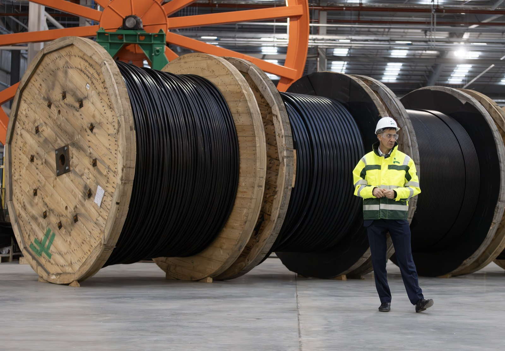
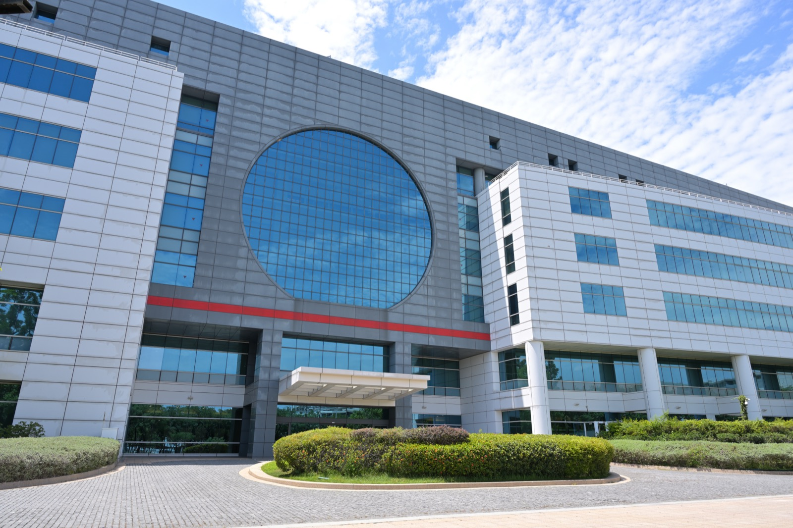
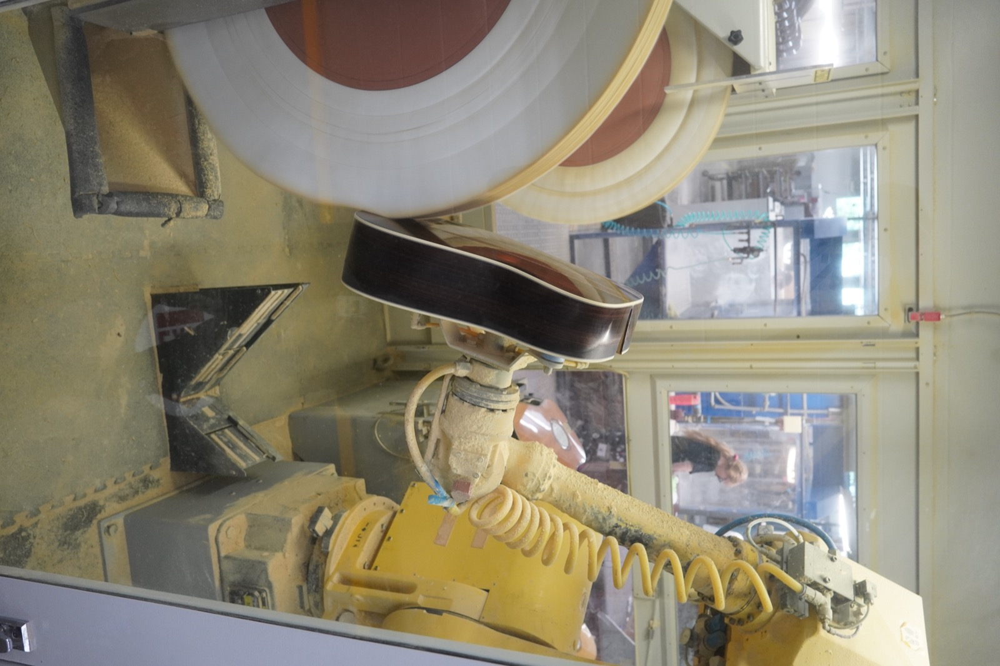
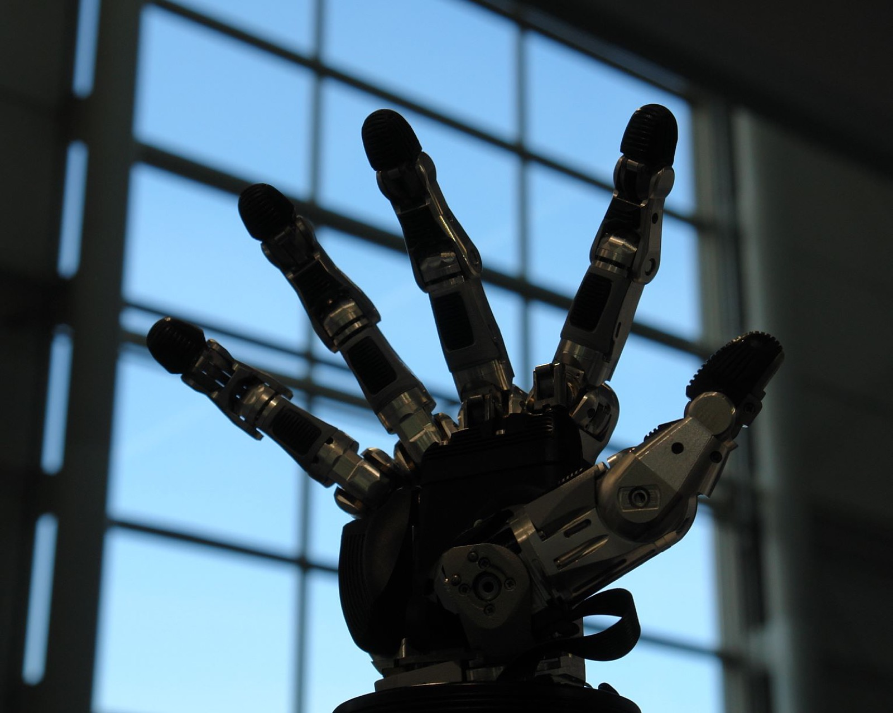
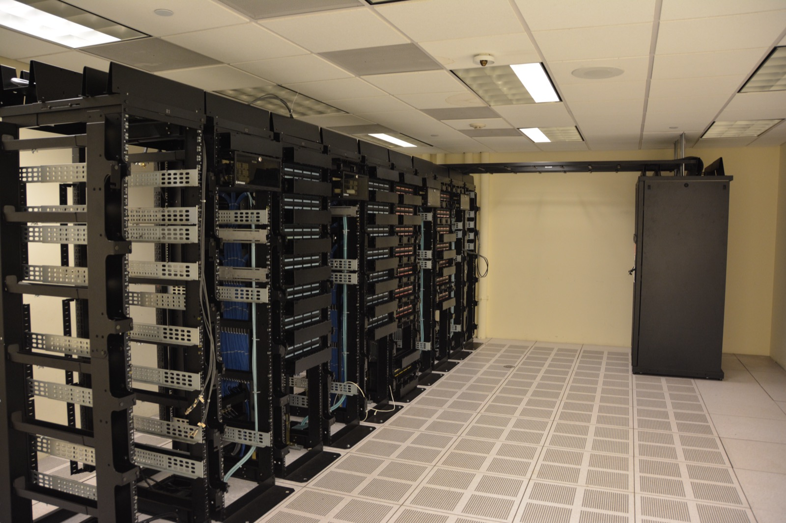

# The Data Gap in Korea

_Korea_

## Executive Summary

> [!callout]
> On July 1, 2026, Korea's Financial Services Commission and Ministry of Trade, Industry and Energy announced roughly ₩16 trillion (about $10.3 billion) in policy financing for the "physical AI" of six industries, including robotics, next-generation vehicles, and semiconductors. Supplied by the National Growth Fund, the money flows into factory expansion and robot and chip manufacturing facilities. But weigh what that budget buys against what it doesn't from the standpoint of data supply, and one line item is conspicuously empty.

> Digital AI learns by scraping the text and images already piled up on the web. Physical AI is different. Physical data such as the force a robot applies when gripping an object, the moment it slips, or the noise of a factory floor is created only at the instant of contact, and none of it can be crawled. The allocation makes no explicit room for collecting and refining that data.

> This isn't about judging whether the policy is right or wrong. As capital piles onto hardware, who secures the data that actually trains the machines the ₩16 trillion will build, and where? That lag between the hardware and the data to run it is the open question.

### Key Figures

Sources: [Korea.kr Policy Briefing](https://www.korea.kr/news/policyNewsView.do?newsId=148967448), [Let's Data Science](https://letsdatascience.com/news/south-korea-announces-103b-physical-ai-financing-push-3860bd22)

<!-- stat-card -->
**$10.3B** — Physical AI financing — 2026 allocation across 6 industries (₩16T)

<!-- stat-card -->
**$1T+** — Triple-axis mega-plan — Chips, physical AI, data centers over 10 years

<!-- stat-card -->
**₩80B** — First project low-rate loan — LS Cable subsea plant (₩160B total)

<!-- stat-card -->
**1%→20%** — Humanoid share target — Government's 2030 domestic goal

## Where the $10.3 Billion Goes

At the public-private "National Growth Fund–M.AX Frontier Project" meeting held on July 1, 2026, at the Korea Development Bank headquarters in Yeouido, Seoul, the Financial Services Commission and the Ministry of Trade, Industry and Energy said they would allocate roughly ₩16 trillion (about $10.3 billion) in policy financing this year to six physical AI industries: AI, robotics, next-generation vehicles, defense, semiconductors, and secondary batteries. FSC Chairman Lee Eok-won said physical AI "can contribute to productivity gains and the creation of new growth engines."

That ₩16 trillion is about half of the National Growth Fund's ₩30 trillion supply for this year. Since the fund's five-year target is ₩150 trillion (split evenly between public and private capital), it is worth keeping the ₩16 trillion straight: it is this year's physical AI share, not the size of the entire fund.

How the money actually moves is shown by the first project. The expansion of LS Cable & System's extra-high-voltage subsea cable plant in Donghae was the first approval. Of a total investment of ₩160 billion, the National Growth Fund supplies ₩80 billion as a 10-year low-rate loan. In form, it is a loan for expanding manufacturing facilities.

*▲ A subsea high-voltage cable plant (illustrative image, not LS Cable's Donghae plant) | Source: [Wikimedia Commons (CC BY 4.0)](https://commons.wikimedia.org/wiki/File:Secretary_of_State_for_Energy_Security_and_Net_Zero,_Ed_Miliband,_visits_JDR_Cables_(54976707522).jpg)*

## The $1 Trillion Picture Behind It

The ₩16 trillion is not an end in itself but the first disbursement of a far larger plan. On June 29, President Lee Jae-myung unveiled a "triple-axis strategy" linking semiconductors, physical AI, and AI data centers, and signaled roughly ₩1,350 trillion (over $1 trillion) in investment over ten years. This policy financing is the move that begins turning the physical AI axis of that strategy within the capital markets first.

*▲ A semiconductor foundry fab (illustrative image, the semiconductor axis of the triple-axis strategy) | Source: [Wikimedia Commons (CC BY 4.0)](https://commons.wikimedia.org/wiki/File:TSMC_Fab_6_front_May_2025.jpg)*

On the same day, the Ministry of Science and ICT released a "Strategy for Securing Core Physical AI Competitiveness." Its goals: become the world's number one in physical AI and number three in AI robotics by 2030, and raise the domestic humanoid robot market share from 1% to 20%. The policy declared scale and direction at once.

> [!callout]
> The announcement was reflected in the capital markets right away. A domestic humanoid robot ETF that listed after CES 2026 returned more than 19% in its first week. It is a sign that expectations for hardware and manufacturing infrastructure are already being priced in.

## What This Budget Buys

The roster of participating companies makes clear what the money turns into. In the AI factory segment are LS Cable & System, CJ Logistics, ISU Petasys, and Daesung Hi-Tech; in robotics, Doosan Robotics and Wonik Robotics; in next-generation vehicles, Hyundai Mobis, LX Semicon, and Magnachip Semiconductor. The funding is supplied jointly by the financial sector, including the Korea Development Bank, the Industrial Bank of Korea, and NH Financial Group.

What runs through the list is physical assets. Factory expansion, production-line automation, semiconductor fabs, robot bodies: what the budget buys is mostly equipment you can touch. Nowhere in the policy documents or the participating companies' announcements does a separate line item stand out for collecting data, labeling it, or accumulating field logs.

*▲ An industrial robot arm on a factory automation line (illustrative image) | Source: [Wikimedia Commons (CC BY 4.0)](https://commons.wikimedia.org/wiki/File:Robotic_Arm_Polishing_Guitars_at_Martin_Guitar_Factory.jpg)*

This is where the question forks. The straight news covered "how much to whom." Yet for those facilities to actually work, for a robot arm to grip a part precisely and adjust the process on its own, there has to be data that trains those motions. In the budget, the hardware is visible but the data is hard to find.

## Physical AI's Data Bottleneck

Digital AI and physical AI differ in the very nature of their training data. Large language models learn by gathering the vast text already piled up on the web. Images and video are secured by crawling too. The structure is one in which the data exists in the world first, and the model reads it later.

Physical AI is the opposite. Physical data such as the contact force when a robot grips an object, the moment of a slip, the torque on a joint, or the vibration of a factory floor is generated only at the instant real contact happens. It is not piled up anywhere on the web in advance, and it cannot be scraped by a crawler. To create it, a sensor-equipped machine has to actually move in the field.

*▲ A five-finger tactile-sensing robotic hand (illustrative image, Schunk SVH) | Source: [Wikimedia Commons (CC BY-SA 4.0)](https://commons.wikimedia.org/wiki/File:Servo-electric_5-Finger_gripping_hand_-_Schunk_SVH.JPG)*

In an earlier article, ["The Tactile Data Humanoid Capital Skipped,"](https://blog.pebblous.ai/blog/humanoid-capital-tactile-data/en/) Pebblous traced the structure in which private venture capital pours into robot hardware and foundation models while flowing to physical data such as touch at hundreds of times a smaller rate. In fact, while the German robotics firm Neura Robotics raised $1.4 billion in a single Series C round, the pre-seed funding of a startup dedicated to tactile sensing came to just $1.75 million. This policy financing extends that observation into the realm of public capital. After private capital, is government capital, too, tilting toward hardware and models while data still stands at the back of the line?

## Who Secures That Data?

Made concrete, the question forks in two. First, do the companies receiving policy financing have the incentive and the capacity to build up field data themselves? Manufacturers such as Doosan Robotics or Hyundai Mobis are positioned to secure the data coming off their own lines, but refining that data into a shareable training asset is a different kind of effort from investing in equipment.

Second, is there a share for the government to build separate data infrastructure? Public datasets, robot testbeds, and standardized systems for collecting field logs are hard for any single company to build alone, and even when built, they tend to stay locked inside that company. If a hardware subsidy attaches to individual equipment, data infrastructure is closer to a foundation common to the whole industry.

*▲ Server racks inside a data center (illustrative image, shared industry data infrastructure) | Source: [Wikimedia Commons (CC BY 2.0)](https://commons.wikimedia.org/wiki/File:Datacenter_Server_Racks_(22370909788).jpg)*

It is not yet time to settle the conclusion. But for a goal like "humanoid market share from 1% to 20%" to be realized, the answer to where the data that actually moves those robots will come from has to be written somewhere in the budget. If the ₩16 trillion was the first chapter of raising hardware, the data to train those machines is the share the next chapter has to cover.

## References

### Official Policy Announcement

- 1.Korea Policy Briefing. (2026). "National Growth Fund Supplies ₩16 Trillion in Policy Financing to Six Physical AI Industries." [korea.kr](https://www.korea.kr/news/policyNewsView.do?newsId=148967448)

### Domestic Press Coverage

- 2.Financial News (fnnews). (2026). "National Growth Fund Allocates ₩16 Trillion Across Six Physical AI Sectors." [fnnews.com](https://www.fnnews.com/news/202607011807584120)
- 3.Edaily. (2026). "National Growth Fund's Physical AI Financing: First Investment Goes to LS Cable." [edaily.co.kr](https://edaily.co.kr/News/Read?mediaCodeNo=257&newsId=04083606645510256)

### International Press Coverage

- 4.Let's Data Science. (2026). "South Korea Announces $10.3B Physical AI Financing Push." [letsdatascience.com](https://letsdatascience.com/news/south-korea-announces-103b-physical-ai-financing-push-3860bd22)
- 5.Al Jazeera. (2026). "South Korea announces more than $1 trillion AI, chip investment drive." [aljazeera.com](https://www.aljazeera.com/news/2026/6/29/south-korea-announces-more-than-1-trillion-ai-chip-investment-drive)
- 6.UPI. (2026). "South Korea unveils physical AI financing under National Growth Fund." [upi.com](https://www.upi.com/amp/Top_News/World-News/2026/07/01/physical-ai-national-growth-fund/1251782951422/)
- 7.The Korea Herald. (2026). "Korea's physical AI policy financing push." [koreaherald.com](https://www.koreaherald.com/article/10794267)

### Related Pebblous Content

- 8.Pebblous Data Communication Team. (2026). "The Tactile Data Humanoid Capital Skipped." [blog.pebblous.ai](https://blog.pebblous.ai/blog/humanoid-capital-tactile-data/en/)
