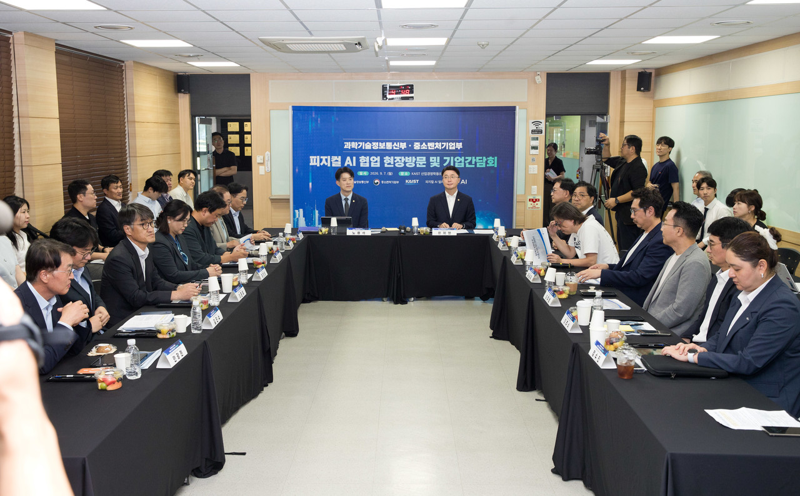
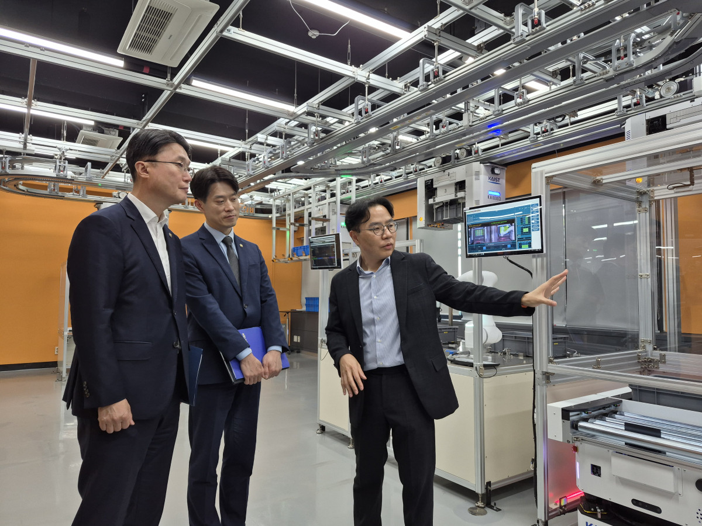

# Physical AI Moves Into Small Korean Factories Short on Data

_Two of the four obstacles the science and SME ministries wrote down were a shortage of data and a shortage of demonstration opportunities_

## Executive Summary

> [!callout]
> On September 7 the Ministry of Science and ICT and the Ministry of SMEs and Startups visited the physical AI demonstration lab at KAIST together. In the material the two ministries put out, the reason small manufacturers cannot get new technology onto their floors is written as four items: skilled staff, experience with adopting technology, data, and demonstration opportunities. The first two shrink when people and consulting are added. The last two are a different kind of thing.

> Neither ministry's press release explains why. The diagnosis is there and the reason is not. The people who gave a reason were the companies sitting in the meeting that day. Lee Sang-ho, CEO of IMPIX, said that even briefly halting a factory already in production is very hard, and that basic manufacturing infrastructure, data collection and digitization, has to come first before advanced physical AI reaches the floor. The data physical AI feeds on cannot be made outside the factory and poured in. The factory the government described as short on data is the only place that data comes from.

> Sections 1 through 3 follow what the press releases and the reporting establish. Section 4, which turns to who holds the data and in what format it is kept, is this article's reading and is not in the announcement. Every quotation below is our translation from the Korean original.

### Key Figures

Sources: [MSIT press release](https://www.korea.kr/briefing/pressReleaseView.do?newsId=156780527) and [MSS press release](https://www.korea.kr/briefing/pressReleaseView.do?newsId=156780513) (distributed 2026-09-07, for 09-08 morning papers), [Etoday](https://www.etoday.co.kr/news/view/2622772) and [HelloDD](https://www.hellodd.com/news/articleView.html?idxno=113082) (2026-09-07)

<!-- stat-card -->
**Two of four** — Shortage of data and of demonstration opportunities — The other two the government listed are skilled staff and experience with adopting technology

<!-- stat-card -->
**5th gen vs 2nd gen** — What the technology talks about and what the floor runs — The gap Lee Jung-ho of Rainbow Robotics named at the meeting

<!-- stat-card -->
**2027** — The year precision manufacturing data is due to be provided — Phase 1 this year is consulting on AMRs and AGVs in logistics zones

<!-- stat-card -->
**Not stated** — Custody and format of the demonstration data — Not found in either ministry's press release or in the reporting on it

## The Four Obstacles the Government Wrote Down Are Not Solved the Same Way

The two ministries visited the KAIST physical AI demonstration lab on September 7. The day ran in three parts: a tour of the lab, an introduction to the cooperation plan between the two ministries, and a meeting of supply and demand companies. Ryu Je-myung, Second Vice Minister of Science and ICT, and Noh Yong-seok, First Vice Minister of SMEs and Startups, were there, along with Joh Joon Hee, the private-sector chair of the Physical AI Alliance, and the heads of its subcommittees. The companies named in the footnote of both press releases are six: Rainbow Robotics, Persona AI, Pebblous, IMPIX, Baekje Food, and New Hi-Tech.

*▲ The physical AI cooperation site visit and company briefing held at KAIST's Industrial and Systems Engineering building on September 7 | Source: [HelloDD](https://www.hellodd.com/news/articleView.html?idxno=113082) (photo: Ministry of Science and ICT)*

The part of the release worth pausing on is the diagnosis rather than the support plan. The government wrote the difficulty small manufacturers face this way.

> [!callout]
> Small manufacturing companies are having difficulty applying new technology on their actual sites, owing to shortages of skilled personnel and experience with adopting technology, and of data and demonstration opportunities.

The four items sit on one line, and even so the way each one gets filled is not the same. Skilled staff comes from training and hiring, and experience with adoption comes from consulting and from leading cases. The collaboration announced that day is built for those two. It connects the science ministry's Everyone's AI Factory Manager with the SME ministry's Smart Manufacturing Innovation program, opening a path that runs from technology development through demonstration and commercialization to adoption on the floor. Vice Minister Noh said that building verified leading models for small manufacturers to benchmark is essential.

The back two are hard to fill by supply. Data and demonstration opportunities come into being as time passes in that factory, so they cannot be set down from outside as finished goods. The remarks at the meeting show the same difficulty plainly. Kim Cheol-yu, CEO of Baekje Food, said that adopting Everyone's AI Factory Manager right away is hard for a small company and that a little more time is needed, and that using physical AI efficiently would require the whole process to be turned into a smart factory and automated to some degree first. Lee Jung-ho, CEO of Rainbow Robotics, said that the industry talks about fifth-generation systems while many actual sites remain at the second generation, and that how to close that gap is the large task. The side selling the technology and the side buying it pointed at the same distance from the same table.

Data is also on the list of things the companies asked the government for. Both ministries issued a press release for the same event, most of the sentences match, and the lists part. In the science ministry's version a cooperation platform comes first, followed by expanded demonstration opportunities, support for using data, training of skilled staff, and stronger links between programs. The SME ministry's version puts, in the same slot, more sophisticated support policy, support for data-use infrastructure, training and education for skilled staff, and stronger links between programs. First on one list is expanded demonstration opportunities, and first on the other is more sophisticated support policy. Those words came from one room, and the record split once two people were writing it down.

## That Data Comes Only From That Factory

The press releases describe physical AI as technology in which artificial intelligence perceives its surroundings, judges for itself, and carries out work. They do not explain why data, of all things, ended up on the obstacle list. Read both versions to the end and the single diagnostic sentence above is all there is. The reason came out the same day, at the meeting.

Lee Sang-ho of IMPIX spoke to why putting new technology into a running factory is hard. Halting a factory that is already in production, even for a moment, is a very difficult thing, he said, and existing small-manufacturer plants often lack both the room for an AGV or AMR to travel and an equipment layout that anticipates automation. He then proposed that basic manufacturing infrastructure, data collection and digitization among it, has to be in place before advanced physical AI can be applied on the floor. Why the shortage of data and the shortage of demonstration opportunities were written on the same line lives inside that remark. A line that cannot be stopped cannot be tested on, and what is never tested leaves no record.

KAIROS, the system opened to view at the KAIST lab that day, shows what such a record amounts to. In the demonstration lab set up in the Industrial and Systems Engineering building, a robot in motion stopped as a person stepped into the work area and said that an obstacle had been detected and asked the person to step aside for a moment. When a worker asked what was going on with a carrier that the system showed as present but that was not actually there, the system answered that the trouble was most likely on the load-detection sensor and said it would check the connection. The sensor's error, and the state the equipment was in at that moment, are the material that goes into training. That scene is made only in that factory.

*▲ Professor Young Jae Jang (far left) explains KAIROS to Vice Minister Ryu Je-myung (far right) and Vice Minister Noh Yong-seok | Source: [eToday](https://www.etoday.co.kr/news/view/2622772) (photo: Kim Yeon-jin)*

KAIROS is short for KAIST AI Robot Orchestration System. Through digital-twin-based simulation it optimizes a real factory's logistics and schedule in real time, with the aim of letting a small company raise its factory operations without foreign solutions. Young Jae Jang, the KAIST professor leading the demonstration, called the core of KAIROS a single brain that moves the whole factory, a system that controls heterogeneous robots and equipment under one operating layer and joins the warehouse to the factory. He also laid out the distribution plan. Building the Everyone's AI Factory Manager solution as a cloud service together with KT and distributing it free to small companies is the phase one goal, he said; this year the team is building an AI logistics design lead, and the ambition is to grow it into an AI production operations lead that carries the knowledge of running a factory.

The small company receives this brain. The brain can be downloaded for free, and the material it learns and judges from has to come out of each company's own factory. The three-phase roadmap the government set out puts data at exactly that point.
