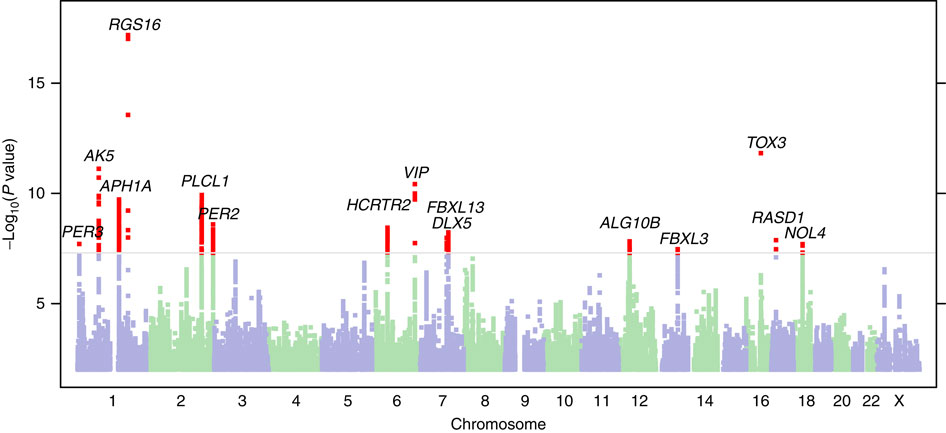

# The Diffusion Autoencoder That Read Genes From Cardiac MRI Without a Single Label

_How self-supervised learning on 70,000 UK Biobank heart scans surfaced 7 novel genetic loci_

## Executive Summary

> [!callout]
> Picture 70,000 cardiac scans that no one ever labeled. That is exactly what Craig Glastonbury's group at Human Technopole in Italy worked with, in a 2026 paper published in **Nature Communications**. The team fed cardiac MRIs from 71,021 UK Biobank participants into a 3D diffusion autoencoder with no clinical labels at all, letting the model build 182 latent phenotypes that summarize the heart on its own. Until now, cardiac imaging has been summarized only by a handful of human-defined metrics such as ejection fraction.

> What matters is that these phenotypes were not decorative. They proved heritable (h² of 4–18%), a genome-wide association study (GWAS) tied them to 42 genetic loci, and 7 of those had never been reported before. A polygenic risk score drawn from the phenotypes separated high-risk individuals for some cardiac conditions by up to 26-fold. One caveat: the UK Biobank skews toward middle-aged, European-ancestry participants, so these numbers do not transfer cleanly to other populations.

> This article reads that result through the lens of data. Labeling well has often been treated as the whole of AI-Ready Data, yet this study shows that clinically meaningful discovery can come from raw scans no human ever touched. For some data, the bar for "ready" may not be the amount of annotation but the method of learning a representation.

### Key Figures

Source: Ometto et al., [Nature Communications (2026)](https://www.nature.com/articles/s41467-026-74575-y)

<!-- stat-card -->
**71,021** — Cardiac MRI participants — Raw scans learned without a single label

<!-- stat-card -->
**182** — Latent phenotypes — Derived by the model, not defined by people

<!-- stat-card -->
**42 loci** — GWAS genetic loci — 7 of them novel

<!-- stat-card -->
**Up to 26×** — Risk stratification — Cumulative risk via polygenic score

## 70,000 Heart Scans With No Name Tags

The standard recipe for medical imaging AI has long been a single one. Gather data that experts have labeled, then train a model by supervised learning that treats those labels as ground truth. For cardiac MRI, a cardiologist measures left-ventricular ejection fraction, gauges wall thickness, and flags abnormal findings. The model learns to predict the small set of numbers that person defined. The belief that label quality equals data value comes from here.

This study inverted that recipe. It took cardiac MRIs from 71,021 participants sitting in the UK Biobank and fed them, without a single line of labeling, straight into a 3D diffusion autoencoder. The data are four-chamber long-axis CINE images, that is, time-series 3D volumes captured while the heart beats. No one told the model "this one is 55% ejection fraction" or "this one shows a wall-motion abnormality."

*▲ An example frame from a four-chamber long-axis cardiac MRI CINE sequence (not an actual scan from this study) | Source: [Wikimedia Commons (CC BY-SA 4.0)](https://commons.wikimedia.org/wiki/File:4CH_cine_infarct.gif)*

Metrics like ejection fraction are convenient, but they come at a cost. The moment you compress the heart's complex motion and shape into a few numbers, any signal that does not fit those few numbers is discarded. A subtle pattern that people have not yet named has no label, so it never becomes a target for learning in the first place. The researchers' question was simple. What happens if you give the model only the raw imagery, before any human summary, and let it summarize the heart itself?

The full pipeline runs in five steps. It starts from raw scans, the model extracts phenotypes, and those phenotypes connect to the genome and to disease risk.

## Phenotypes the Model Built on Its Own

"Diffusion autoencoder" is a long name, but the idea splits into two parts. A diffusion model is a generative model that repeatedly adds a bit of noise to an image and then strips it back off, learning the structure of the data in the process. An autoencoder is a structure that compresses input into a small latent space and then reconstructs something close to the original. Put them together and you get a model that compresses a heart image into a low-dimensional latent vector while the diffusion process fills in the lost detail during reconstruction. That latent vector is the representation that summarizes the heart.

From this latent space the researchers drew 182 phenotypes. Here a phenotype is not a metric a person named "ejection fraction," but an axis the model itself judged necessary for reconstructing the image and captured on its own. The catch is that, at first, no one knows what each axis means. The researchers used latent space manipulation. They pushed a single axis up or down and then watched how that change showed up in the reconstructed image. Move one axis and the ventricular wall motion shifts; another axis changes the shape of the heart. This is how they interpreted each axis in reverse.

Two gates checked whether phenotypes built without name tags could be trusted. One is reproducibility. A similar value has to come out of a different scan of the same person, or it is just chance noise. The other is heritability. If a phenotype is a real biological trait, it should be shaped by genes. The 182 phenotypes showed heritability (h²) in the 4–18% range and were significantly associated with real conditions such as atrial fibrillation (P = 8.5×10⁻²⁹) and myocardial infarction (P = 3.7×10⁻¹²). That is a signal the model's axes have their feet on clinical ground.

Reproducibility

Values reproduced stably across different scans of the same person. The minimum condition for a phenotype not to be noise.

Heritability

h² of 4–18%. Support that a phenotype is a real trait shaped by genes.

Disease association

Statistically significant links to atrial fibrillation, myocardial infarction, and more. A signal of clinical meaning.

## The Bridge From Phenotype to Gene

If a phenotype is heritable, you can search for the genes that shape it. The method that builds this link is the genome-wide association study (GWAS). GWAS scans the entire genomes of tens of thousands of people and tests statistically whether people carrying a given genetic variant show systematically different values on some trait. Here the trait slot was filled not by a human-defined metric but by the model's 182 phenotypes.

The result was 89 significant common variants (P < 2.3×10⁻⁹). After conditional analysis cleaned up variants that sit close together and reflect the same signal, 44 independent lead SNPs remained, grouped into 42 unique genetic loci. Of these, 7 had never been reported in prior cardiac GWAS. In effect, phenotypes drawn without labels pointed to genetic signals people had missed.

A concrete case shows how sturdy this bridge is. Two different latent phenotypes (Z49_S1, Z82_S1) were jointly associated with the **SOX5 locus** (lead variant rs4963772). That variant has been reported repeatedly in past GWAS of blood pressure, ECG traits, and atrial fibrillation. An axis the model built without labels independently landed on the same spot as already-known cardiac biology. Z82_S1 was also associated with type 2 diabetes (β = 0.26, P = 3.74×10⁻¹⁸) and atrial fibrillation (β = -0.17, P = 8.47×10⁻¹⁰).

*▲ An example Manhattan plot summarizing GWAS results (from a different GWAS, not this study's actual plot) — x-axis: chromosome, y-axis: −log₁₀(P-value) | Source: [Hu et al., Nature Communications (2016), Wikimedia Commons (CC BY 4.0)](https://commons.wikimedia.org/wiki/File:Manhattan_plot_of_the_GWAS_of_self-reporting_of_being_a_morning_person.jpg)*

> [!callout]
> What matters here is direction. People did not first decide "let's find this gene" and then attach labels. The order ran raw image → phenotype built by the model → genome, and the data pointed to a biological reality on its own, without passing through human prior definitions. The picture that different cardiac traits share a common genetic basis also emerged from this process.

## A Risk Score That Separated Risk 26-Fold

Had it stopped at finding loci, this would have stayed an academic discovery. The researchers went a step further. They gathered the variants associated with the phenotypes and built a polygenic risk score (PRS). A PRS weights and sums the risk variants an individual carries, summarizing that person's genetic predisposition to a given condition as a single score.

For some cardiac conditions, this score separated individuals with high cumulative risk by up to 26-fold. That means the risk gap between the top and bottom score groups opened that wide. It is a magnitude that could offer a lead for early screening. A pipeline that began without labels reached individual-level risk prediction by way of gene discovery, making it a rare demonstration of self-supervised learning carried through to clinical usefulness.

*▲ Polygenic risk score (PRS) concept diagram — left: score distribution for cases vs. controls, right: risk gap by age between high- and low-score groups (a general illustration, not this study's actual figures) | Source: [Wand et al., Wikimedia Commons (CC BY 4.0)](https://commons.wikimedia.org/wiki/File:PRS_Illustration.png)*

That said, before generalizing this 26-fold figure, look at the conditions. The UK Biobank is a cohort weighted toward middle-aged, European-ancestry participants. There is no guarantee that the same magnitude of stratification would reproduce in other age groups or other ancestral populations. The population portability of PRS is a known limitation across genetics, and this study is no exception. The size of a number has to be read alongside the data it came from.

## Asking What "Ready" Means Again

Seen through a data practitioner's eyes, the real message of this study is not in the genetics but in the data. When we talk about AI-Ready Data, we mostly picture labeling well: annotation accuracy, inter-annotator agreement, class balance. Yet this study pulled novel genetic loci and risk stratification out of raw scans on which no human placed a single label. What unlocked the value of the data was not the amount of annotation but the method of learning a representation. Pebblous has touched this ground before, in [Yann LeCun's JEPA and world models](/blog/yann-lecun-jepa-world-models/en/), where the path of learning representations without labels came up; this cardiac MRI study is a concrete case that the idea can carry through to real clinical and genetic discovery.

This is not a conclusion that says "don't invest in labeling." There are conditions. First, a large body of unlabeled raw data has to already exist. The UK Biobank's 70,000 scans met that. Second, there has to be a method and infrastructure to learn representations from that data. The diffusion autoencoder and GWAS pipeline played that role. Third, there has to be a gate to verify that the representations built connect to reality. Reproducibility and heritability were that gate. When the three conditions hold, representation learning can come before labeling.

The same structure exists outside medicine. Inspection images piling up in manufacturing lines, time series pouring out of satellites and sensors, logs no one has labeled yet. In a domain where labeling costs are enormous and raw data overflows, one more question arises. Is the value of our data unlocked only once everything is labeled, or is it already ripe enough without labels?

> [!callout]
> The definition of AI-Ready differs by dataset. For some data, careful annotation is the core of readiness; for others, the core is a method that turns the raw material directly into a representation. What this study leaves is not an answer but an axis for judgment. We have to ask first which side the raw material in our hands falls on.

## FAQ

## References

### R.1. Academic papers

- 1.Ometto S, Chatterjee S, Vergani A, Landini A, Glastonbury CA, et al. (2026). "[Hundreds of cardiac MRI traits derived using 3D diffusion autoencoders share a common genetic architecture](https://www.nature.com/articles/s41467-026-74575-y)." **Nature Communications**. DOI: 10.1038/s41467-026-74575-y.
- 2.Ometto S, Glastonbury CA, et al. (2024). "[Unsupervised cardiac MRI phenotyping with 3D diffusion autoencoders reveals novel genetic insights](https://www.medrxiv.org/content/10.1101/2024.11.04.24316700v2)." **medRxiv** (preprint). DOI: 10.1101/2024.11.04.24316700.

### R.2. Code & models

- 3.Glastonbury Group. (2026). "[CardiacDiffAE_GWAS — 3D diffusion autoencoder + GWAS pipeline code](https://github.com/GlastonburyGroup/CardiacDiffAE_GWAS)." GitHub (Apache-2.0).
- 4.Glastonbury Group. (2026). "[UKBBLatent_Cardiac_20208_DiffAE3D_L128_S42 — pretrained 3D diffusion autoencoder](https://huggingface.co/GlastonburyGroup/UKBBLatent_Cardiac_20208_DiffAE3D_L128_S42)." Hugging Face (Apache-2.0).

Thank you for reading. As you prepare AI-Ready Data, a habit of asking "how well did we label it" alongside "what representation can we turn the raw material into" should help you gauge the latent value of your data more accurately. If you have thoughts or counterarguments on this topic, we would be glad to hear them.

**Pebblous Data Communication Team**  
July 17, 2026
