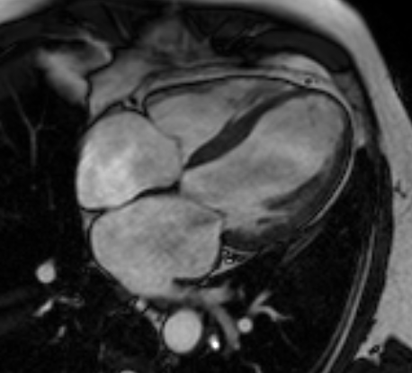
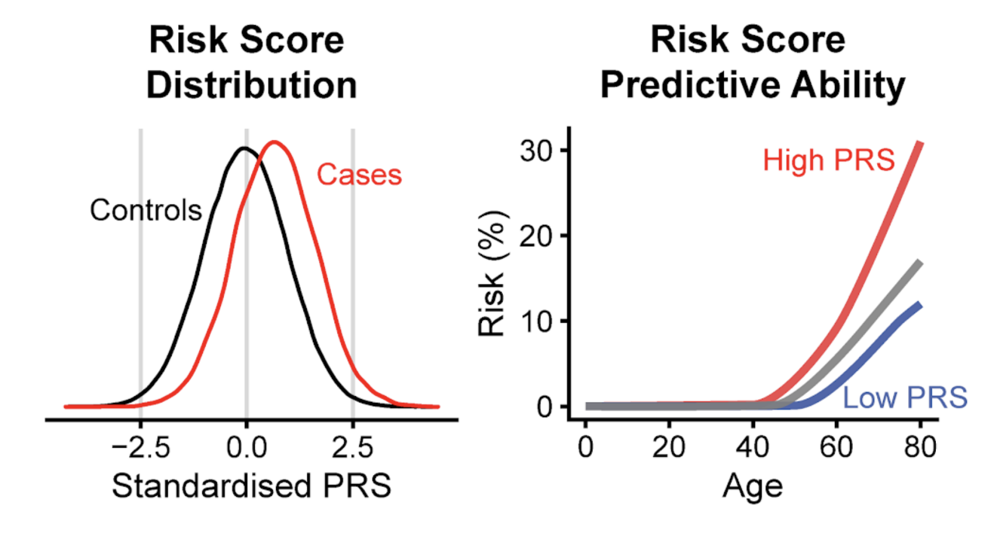

# 라벨 없이 심장 MRI를 읽어 유전자를 찾아낸 확산 오토인코더

_UK 바이오뱅크 7만 명의 심장 MRI를 자기지도학습으로 분석해 신규 유전자좌 7곳을 찾은 연구_

## Executive Summary

> [!callout]
> 이름표를 한 줄도 붙이지 않은 심장 사진 7만 장이 있다고 해 보자. 2026년 **Nature Communications**에 실린 이탈리아 Human Technopole의 Craig Glastonbury 연구진 논문이 실제로 그렇게 했다. UK 바이오뱅크 참가자 7만1021명의 심장 MRI를 임상 라벨 없이 3D 확산 오토인코더에 통째로 넣어, 심장을 요약하는 182개의 잠재 표현형을 모델이 스스로 만들게 한 것이다. 지금까지 심장 영상은 박출률처럼 사람이 미리 정의한 소수의 지표로만 요약되어 왔다.

> 핵심은 이 표현형들이 장식이 아니었다는 데 있다. 유전 가능성이 확인됐고(h² 4~18%), 전장유전체 연관분석(GWAS)으로 42개의 유전자좌와 연결됐으며 그중 7곳은 기존에 보고된 적 없는 신규 유전자좌였다. 표현형에서 뽑아낸 다각형 위험 점수는 일부 심장질환에서 위험이 높은 개인을 최대 26배까지 갈라냈다. 다만 UK 바이오뱅크는 중장년·유럽계에 치우친 코호트라, 이 수치를 다른 인구집단으로 곧장 옮기기는 어렵다.

> 이 글은 그 결과를 데이터의 렌즈로 읽는다. 라벨을 잘 붙이는 일이 AI-Ready Data의 전부처럼 이야기되어 왔지만, 이 연구는 사람이 손대지 않은 원본 스캔만으로도 임상적으로 의미 있는 발견에 이를 수 있음을 보인다. 어떤 데이터에서는 '준비됨'의 기준이 주석의 양이 아니라 표현을 학습하는 방법일 수 있다.

### 주요 수치

출처: Ometto et al., [Nature Communications (2026)](https://www.nature.com/articles/s41467-026-74575-y)

<!-- stat-card -->
**71,021** — 심장 MRI 참가자 — 라벨 한 줄 없이 학습한 원본 스캔

<!-- stat-card -->
**182** — 잠재 표현형 — 사람이 정의하지 않고 모델이 도출

<!-- stat-card -->
**42곳** — GWAS 유전자좌 — 이 중 신규 7곳

<!-- stat-card -->
**최대 26배** — 위험군 층화 — 다각형 위험 점수 누적 위험

## 이름표 없는 심장 사진 7만 장

의료 영상 AI의 표준 공식은 오랫동안 하나였다. 전문의가 라벨을 붙인 데이터를 모으고, 그 라벨을 정답 삼아 지도학습으로 모델을 훈련한다. 심장 MRI라면 심장 전문의가 좌심실 박출률을 재고, 벽 두께를 측정하고, 이상 소견을 표시한다. 모델은 그 사람이 정한 소수의 숫자를 예측하도록 배운다. 라벨의 품질이 곧 데이터의 가치라는 통념은 여기서 나온다.

이 연구는 그 공식을 뒤집었다. UK 바이오뱅크에 쌓여 있던 참가자 7만1021명의 심장 MRI를 가져와, 라벨을 단 한 줄도 붙이지 않고 3D 확산 오토인코더에 그대로 넣었다. 데이터는 4-챔버 장축 뷰의 시네(CINE) 영상, 즉 심장이 뛰는 동안의 시계열 3차원 볼륨이다. 사람이 "이건 박출률 55%", "이건 벽운동 이상"이라고 알려 주지 않았다는 뜻이다.

*▲ 4-챔버 장축 뷰 심장 MRI CINE 영상의 한 프레임 예시(연구에 쓰인 실제 스캔은 아님) | Source: [Wikimedia Commons (CC BY-SA 4.0)](https://commons.wikimedia.org/wiki/File:4CH_cine_infarct.gif)*

박출률 같은 지표는 편리하지만 대가가 있다. 심장의 복잡한 움직임과 형태를 숫자 몇 개로 압축하는 순간, 그 몇 개에 담기지 않는 신호는 버려진다. 사람이 아직 이름 붙이지 못한 미세한 패턴은 라벨이 없으니 애초에 학습 대상이 되지 못한다. 연구진의 질문은 단순했다. 사람이 요약하기 전의 원본 영상만으로, 모델이 스스로 심장을 요약하게 하면 어떤 일이 벌어질까.

전체 파이프라인은 다섯 걸음으로 이어진다. 원본 스캔에서 출발해 모델이 표현형을 뽑고, 그 표현형이 유전체와 질병 위험으로 연결된다.

## 모델이 스스로 만든 심장의 표현형

확산 오토인코더는 이름이 길지만 발상은 두 부분으로 나뉜다. 확산 모델은 영상에 잡음을 조금씩 더했다가 다시 걷어내는 훈련을 반복하며 데이터의 구조를 익히는 생성 모델이다. 오토인코더는 입력을 작은 잠재 공간으로 압축했다가 원본에 가깝게 복원하는 구조다. 둘을 합치면, 심장 영상을 저차원의 잠재 벡터로 압축하면서도 잃어버린 세부를 확산 과정이 채워 넣어 복원하는 모델이 된다. 이 잠재 벡터가 바로 심장을 요약한 표현이다.

연구진은 이 잠재 공간에서 182개의 표현형을 뽑았다. 여기서 표현형은 사람이 "박출률"이라고 이름 붙인 지표가 아니라, 모델이 영상을 복원하는 데 필요하다고 판단해 스스로 잡아낸 축이다. 문제는 각 축이 무엇을 뜻하는지 처음에는 아무도 모른다는 점이다. 연구진은 잠재 공간 조작(latent space manipulation) 기법을 썼다. 특정 축의 값만 키우거나 줄인 뒤 그 변화가 복원 영상에서 어떻게 나타나는지를 관찰하는 방식이다. 어떤 축을 움직이면 심실 벽의 운동이 달라지고, 어떤 축은 심장의 형태를 바꾼다. 이렇게 각 축을 역으로 해석해 냈다.

이름표 없이 만든 표현형이 신뢰할 만한지 확인하는 관문은 두 가지였다. 하나는 재현성이다. 같은 사람의 다른 스캔에서도 비슷한 값이 나와야 우연한 잡음이 아니다. 다른 하나는 유전 가능성이다. 표현형이 실제 생물학적 특성이라면 유전자의 영향을 받아야 한다. 182개 표현형의 유전 가능성(h²)은 4~18% 범위로 확인됐고, 심방세동(P = 8.5×10⁻²⁹), 심근경색(P = 3.7×10⁻¹²) 같은 실제 질환과도 유의하게 연관됐다. 모델이 만든 축이 임상 현실에 발을 딛고 있다는 신호다.

재현성

같은 사람의 다른 스캔에서도 값이 안정적으로 재현됐다. 표현형이 잡음이 아니라는 최소 조건.

유전 가능성

h² 4~18%. 표현형이 유전자의 영향을 받는 실제 형질임을 뒷받침.

질환 연관

심방세동·심근경색 등과 통계적으로 유의하게 연관. 임상적 의미가 있다는 신호.

## 표현형에서 유전자로 이어진 다리

표현형이 유전 가능하다면, 그 표현형에 영향을 주는 유전자를 찾을 수 있다. 이 연결을 놓는 방법이 전장유전체 연관분석(GWAS)이다. GWAS는 수만 명의 유전체 전체를 훑으며, 특정 유전 변이를 가진 사람이 어떤 형질에서 체계적으로 다른 값을 보이는지를 통계로 검정한다. 여기서는 사람이 정의한 지표가 아니라 모델이 만든 182개 표현형이 형질 자리에 들어갔다.

결과는 89개의 유의미한 공통 변이(P < 2.3×10⁻⁹)였다. 서로 가까이 있어 같은 신호를 반영하는 변이를 조건부 분석으로 정리하자 44개의 독립 lead SNP가 남았고, 이들은 42개의 고유 유전자좌로 묶였다. 이 가운데 7곳은 기존 심장 GWAS에서 보고된 적 없는 신규 유전자좌였다. 라벨 없이 뽑은 표현형이 사람이 놓친 유전 신호를 새로 가리킨 셈이다.

구체적인 사례가 이 다리의 튼튼함을 보여 준다. 서로 다른 두 잠재 표현형(Z49_S1, Z82_S1)이 공통으로 **SOX5 유전자좌**(대표 변이 rs4963772)와 연관됐다. 그런데 이 변이는 과거 혈압, 심전도 형질, 심방세동 GWAS에서도 반복해 보고된 자리다. 모델이 라벨 없이 만든 축이, 이미 알려진 심장 관련 생물학과 같은 지점을 독립적으로 짚어 낸 것이다. Z82_S1은 제2형 당뇨병(β = 0.26, P = 3.74×10⁻¹⁸), 심방세동(β = -0.17, P = 8.47×10⁻¹⁰)과도 연관됐다.

*▲ GWAS 결과를 요약하는 맨해튼 플롯의 예시(다른 GWAS 연구의 결과이며 본 연구의 실제 플롯은 아님) — x축은 염색체, y축은 −log₁₀(P값) | Source: [Hu et al., Nature Communications (2016), Wikimedia Commons (CC BY 4.0)](https://commons.wikimedia.org/wiki/File:Manhattan_plot_of_the_GWAS_of_self-reporting_of_being_a_morning_person.jpg)*

> [!callout]
> 여기서 중요한 것은 방향이다. 사람이 먼저 "이 유전자를 찾자"고 정하고 라벨을 붙인 것이 아니다. 원본 영상 → 모델이 만든 표현형 → 유전체 순서로, 사람의 사전 정의를 거치지 않고 데이터가 스스로 생물학적 실체를 가리켰다. 서로 다른 심장 형질이 공통 유전 기반을 공유한다는 그림도 이 과정에서 드러났다.

## 위험군을 26배 갈라낸 위험 점수

유전자좌를 찾는 데서 그쳤다면 학술적 발견에 머물렀을 것이다. 연구진은 한 걸음 더 갔다. 표현형과 연관된 변이들을 모아 다각형 위험 점수(PRS)를 만들었다. PRS는 개인이 가진 위험 변이들을 가중 합산해, 그 사람이 특정 질환에 걸릴 유전적 소인을 하나의 점수로 요약한다.

이 점수는 일부 심장 관련 질환에서 누적 위험이 높은 개인을 최대 26배까지 갈라냈다. 점수 상위군과 하위군의 위험 격차가 그만큼 벌어졌다는 뜻이다. 조기 스크리닝의 실마리가 될 수 있는 크기다. 라벨 없이 시작한 파이프라인이 유전자 발견을 지나 개인 단위의 위험 예측까지 닿았다는 점에서, 자기지도학습이 임상적 유용성으로 이어진 드문 실증이다.

*▲ 다각형 위험 점수(PRS) 개념도 — 좌: 대조군·환자군의 점수 분포 차이, 우: 점수 상·하위군의 나이별 위험도 격차(일반 개념 예시, 본 연구의 실제 수치는 아님) | Source: [Wand et al., Wikimedia Commons (CC BY 4.0)](https://commons.wikimedia.org/wiki/File:PRS_Illustration.png)*

다만 이 26배를 그대로 일반화하기 전에 조건을 봐야 한다. UK 바이오뱅크는 중장년·유럽계 참가자에 치우친 코호트다. 다른 연령대나 다른 조상 집단에서 같은 크기의 층화가 재현되리라는 보장은 없다. PRS의 인구집단 이전성(portability)은 유전학 전반에서 알려진 한계이고, 이 연구도 예외가 아니다. 수치의 크기만큼이나 그 수치가 어떤 데이터에서 나왔는지가 함께 읽혀야 한다.

## '준비됨'을 다시 묻는다

데이터 실무자의 눈으로 보면 이 연구의 진짜 메시지는 유전학이 아니라 데이터에 있다. AI-Ready Data를 이야기할 때 우리는 대체로 라벨을 잘 붙이는 일을 떠올린다. 주석의 정확도, 라벨러 간 일치도, 클래스 균형 같은 것들이다. 그런데 이 연구는 사람이 라벨을 한 줄도 붙이지 않은 원본 스캔에서 신규 유전자좌와 위험 층화를 끌어냈다. 데이터의 가치를 연 것은 주석의 양이 아니라 표현을 학습하는 방법이었다. 페블러스도 앞서 [얀 르쿤의 JEPA와 월드 모델](/blog/yann-lecun-jepa-world-models/ko/)을 다루며 라벨 없이 표현을 학습하는 길을 짚은 적이 있는데, 이 심장 MRI 연구는 그 발상이 실제 임상·유전학적 발견으로 이어질 수 있음을 보여 준 구체적 사례다.

물론 이것이 "라벨링에 투자하지 말라"는 결론은 아니다. 조건이 있다. 첫째, 대량의 미라벨 원본 데이터가 이미 쌓여 있어야 한다. UK 바이오뱅크의 7만 장이 그 조건을 채웠다. 둘째, 그 데이터에서 표현을 학습할 방법과 인프라가 있어야 한다. 확산 오토인코더와 GWAS 파이프라인이 그 역할을 했다. 셋째, 만들어진 표현이 현실과 연결되는지 검증할 관문이 있어야 한다. 재현성과 유전 가능성이 그 관문이었다. 세 조건이 맞을 때, 표현학습은 라벨링보다 먼저 올 수 있다.

같은 구조는 의료 밖에도 있다. 제조 공정에서 쌓이는 검사 이미지, 위성과 센서가 쏟아내는 시계열, 아직 아무도 라벨을 붙이지 못한 로그. 라벨링 비용이 막대하고 원본은 넘쳐나는 도메인이라면, 던질 질문이 하나 더 늘어난다. 우리 데이터의 가치는 라벨을 다 붙여야 비로소 열리는가, 아니면 이미 라벨 없이도 충분히 익어 있는가.

> [!callout]
> AI-Ready의 정의는 데이터마다 다르다. 어떤 데이터에서는 정교한 주석이 준비의 핵심이고, 어떤 데이터에서는 원본을 그대로 표현으로 바꿔 내는 방법이 핵심이다. 이 연구가 남긴 것은 정답이 아니라 판단의 축이다. 우리 손에 쌓인 원본이 어느 쪽인지를 먼저 물어야 한다.

## FAQ

## 참고문헌

### R.1. 학술 논문

- 1.Ometto S, Chatterjee S, Vergani A, Landini A, Glastonbury CA, et al. (2026). "[Hundreds of cardiac MRI traits derived using 3D diffusion autoencoders share a common genetic architecture](https://www.nature.com/articles/s41467-026-74575-y)." **Nature Communications**. DOI: 10.1038/s41467-026-74575-y.
- 2.Ometto S, Glastonbury CA, et al. (2024). "[Unsupervised cardiac MRI phenotyping with 3D diffusion autoencoders reveals novel genetic insights](https://www.medrxiv.org/content/10.1101/2024.11.04.24316700v2)." **medRxiv** (프리프린트). DOI: 10.1101/2024.11.04.24316700.

### R.2. 코드·모델

- 3.Glastonbury Group. (2026). "[CardiacDiffAE_GWAS — 3D 확산 오토인코더 + GWAS 파이프라인 코드](https://github.com/GlastonburyGroup/CardiacDiffAE_GWAS)." GitHub (Apache-2.0).
- 4.Glastonbury Group. (2026). "[UKBBLatent_Cardiac_20208_DiffAE3D_L128_S42 — 사전학습 3D 확산 오토인코더](https://huggingface.co/GlastonburyGroup/UKBBLatent_Cardiac_20208_DiffAE3D_L128_S42)." Hugging Face (Apache-2.0).

읽어주셔서 감사합니다. AI-Ready Data를 준비하는 자리에서 "라벨을 얼마나 잘 붙였는가"와 함께 "원본을 어떤 표현으로 바꿔 낼 수 있는가"를 나란히 묻는 습관이, 데이터의 잠재 가치를 더 정확히 가늠하게 해 줄 것입니다. 이 주제에 대한 생각이나 반론이 있으시면 언제든 나눠 주세요.

**(주)페블러스 데이터 커뮤니케이션팀**  
2026년 7월 17일
