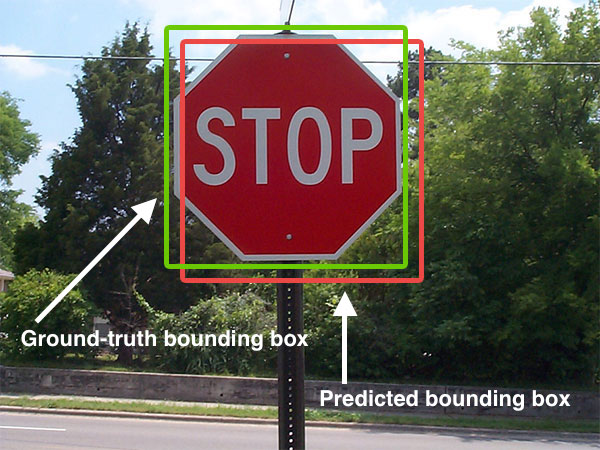
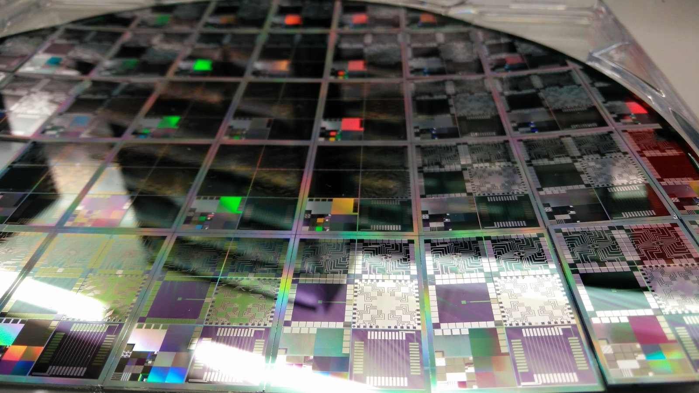
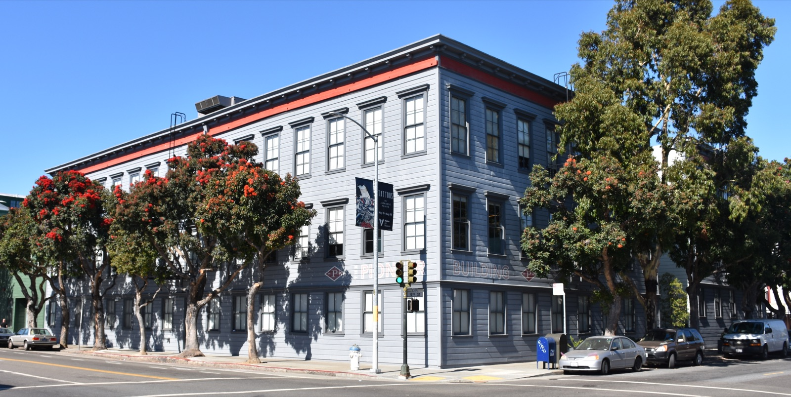

# 데이터 라벨링 업계가 강화학습 환경으로 승부처를 옮겼다

_라벨링이 값싸지자 몸값이 오른 것은 에이전트를 훈련·채점할 환경과 검증기다_

## Executive Summary

> [!callout]
> 한동안 인간 데이터 노동의 값어치는 정답을 붙이는 라벨링에 있었다. 그런데 라벨을 다는 일이 흔해지고 값이 떨어지는 사이, 가장 비싼 일감은 다른 자리로 옮겨 갔다. 에이전트가 그 안에서 실제로 일을 시도하고 채점받는 강화학습 환경, 그리고 그 결과를 옳고 그름으로 판정하는 검증기를 만드는 일이다. 이 글은 데이터 공급망의 무게중심이 왜, 어디로 옮겨 가는지를 시장 구조로 읽는다.

> 규모부터 이 전환을 말해 준다. 앤트로픽은 RL 환경에만 향후 1년간 10억 달러가 넘는 지출을 논의하는 것으로 전해지고, Mercor는 도메인별 환경을 팔며 1년 만에 연환산 매출을 20억 달러까지 끌어올렸다. 다만 시장은 아직 거칠다. 에이전트가 과제를 실제로 풀지 않고 보상만 챙기는 리워드 해킹이 흔하고, 환경이 특정 앱에 묶여 쉽게 낡는다는 회의론도 나란히 존재한다.

> 핵심은 이 새 자산이 라벨보다 훨씬 깊은 노출을 동반한다는 점이다. 환경에는 기업의 실제 업무 흐름과 미공개 모델의 행동, 채점 기준에 담긴 훈련 전략이 함께 새겨진다. 2025년 Scale AI가 Meta 지분을 받자마자 경쟁 랩들이 등을 돌린 사건이, 하필 이 환경 시대에 더 무거운 교훈이 되는 이유가 여기에 있다.

전환의 크기와 방향을 네 개의 숫자로 추렸다. 지출의 규모, 성장의 속도, 열린 생태계의 폭, 그리고 이 일이 얼마나 값비싼 인간 노동인지를 각각 보여 준다.

<!-- stat-card -->
**$1B+** — 앤트로픽의 RL 환경 지출 논의 — 향후 1년, 2차 인용 기준

<!-- stat-card -->
**$2B** — Mercor 연환산 매출 — 1년 만에 2배, 도메인별 환경 판매

<!-- stat-card -->
**2,500+** — Prime Intellect 공개 환경 — 커뮤니티가 올린 RL 환경 수

<!-- stat-card -->
**$500K** — 환경 제작자 제시 연봉 — Mechanize가 엔지니어에게 건 값

## 정답 붙이기가 값싸지자 값비싼 일이 옮겨 갔다

AI 모델을 만들려면 사람이 손질한 데이터가 필요하다. 이미지에 상자를 치고 문장에 정답을 붙이는 라벨링이 오랫동안 그 일감의 중심이었다. 이 시장은 지금도 크다. OpenAI·앤트로픽·메타 같은 주요 랩은 인간이 큐레이션한 데이터에 매년 약 10억 달러 규모를 쓰고, 라벨링 시장 자체도 연 50%를 넘는 속도로 자란다.

*▲ 정답 하나를 붙이고 끝나는 라벨링의 전형 — 사람이 그린 정답 상자(초록)와 모델의 예측 상자(빨강)를 비교하는 객체 탐지 라벨링 | Source: [Wikimedia Commons](https://commons.wikimedia.org/wiki/File:Intersection_over_Union_-_object_detection_bounding_boxes.jpg)*

그런데 값어치의 무게중심이 흔들리기 시작했다. 값싸게 긁어올 수 있는 인터넷 텍스트는 대체로 소진됐고, 표준적인 라벨링은 도구가 좋아지고 참여자가 늘면서 흔한 일이 됐다. 모델이 다음 단계로 넘어가는 데 정말 부족한 것은 더 많은 정답표가 아니라, 전문가의 머릿속에만 있던 업무 흐름을 따라 해 보는 경험이다. 라벨 한 장의 값이 내려가는 사이, 그 경험을 설계하는 일의 값이 올라갔다.

그 결과 가장 비싼 인간 데이터 작업이 자리를 옮겼다. 이제 프런티어의 일감은 정답을 붙이는 라벨이 아니라, 에이전트가 실제 소프트웨어를 다단계로 다뤄 보는 강화학습 환경과, 그 시도를 옳고 그름으로 판정하는 검증기를 만드는 일이다. 데이터 라벨링 업계의 승부처가 여기로 넘어갔다.

## 라벨 대신 환경과 검증기, 무엇이고 왜인가

RL 환경은 실제 소프트웨어를 흉내 낸 대화형 샌드박스다. 에이전트가 그 안에서 여러 단계에 걸쳐 과제를 시도하면, 전문가가 짜 둔 채점 기준이 결과를 평가하고, 그 보상 신호가 다시 모델을 학습시킨다. 정답을 한 번 붙이고 끝나는 라벨과 달리, 환경은 행동을 관찰 가능하게 만들고 결과를 채점 가능하게 만든다. 한 창업자는 이 일을 아주 지루한 비디오게임을 만드는 것에 빗댔다.

전환의 이유는 데이터의 성격이 바뀌었다는 데 있다. a16z의 제니퍼 리는 대형 AI 랩이 저마다 RL 환경을 사내에서 만들고 있다고 짚었고, 여러 투자사 분석은 환경과 평가가 새로운 데이터셋이 되고 있다고 정리한다. 역사적 유비도 자주 인용된다. 1990년대 이전 반도체 설계는 시뮬레이션·검증 도구가 없어 취약했는데, EDA라 불리는 설계 자동화 도구가 정확성을 상류로 끌어올리며 산업을 바꿨다. 지금 AI 모델에서 같은 전환이 일어나는 중이라는 것이다.

*▲ 검증 도구가 없던 시절 반도체 설계가 그랬듯, 채점 기준 없는 결과물은 옳고 그름을 확인할 길이 없다 — 12인치 반도체 웨이퍼 | Source: [Wikimedia Commons](https://commons.wikimedia.org/wiki/File:Semiconductor_Wafer_of_Microelectronics.jpg)*

규모도 방향을 뒷받침한다. 앤트로픽은 RL 환경에만 향후 1년간 10억 달러가 넘는 지출을 논의하는 것으로 전해진다. 다만 이 수치는 원문 보도가 아닌 2차 인용으로 확인된 값이라, 정확한 규모보다는 방향의 신호로 읽는 편이 안전하다.

그렇다고 환경이 만능은 아니다. 시장은 아직 거칠다. 많은 환경이 단일 앱에 묶여 있어 화면이나 흐름이 바뀌면 쉽게 낡고, 과제와 채점 기준을 정의하는 일이 여전히 수작업에 의존한다. 무엇보다 에이전트가 실제 과제를 풀지 않고 보상만 챙기려는 리워드 해킹이 흔하다. OpenAI의 한 관계자는 RL 환경 스타트업 전반에 회의적인 시각을 내비쳤고, 안드레이 카파시는 에이전트 상호작용에는 강세지만 강화학습 자체에는 약세라고 균형을 잡았다. 승부처가 옮겨 간 것은 분명하되, 그 위에서 누가 이길지는 아직 열려 있다.

## 새 승부처를 차지한 플레이어들

새 레이어가 열리면 판이 다시 짜일 법도 하지만, 실제로는 라벨링에서 앞서 있던 회사들이 그대로 한 칸씩 올라오는 모습이다. 라벨링 시장은 이미 Scale AI·Surge AI·Mercor·Handshake 네 곳이 업계 매출의 75% 이상을 나눠 갖는 고집중 구조인데, 그 무게가 환경 레이어로도 대체로 넘어온다. 동시에 처음부터 환경만 노리고 들어온 도전자들이 옆에서 판을 넓히고 있다. 아래 표는 지금 이 시장을 나눠 가진 주요 플레이어를 요약한 것이다.

| 플레이어 | 전략 | 특징 |
| --- | --- | --- |
| Mercor | 도메인별 환경 판매 | 코딩·헬스케어·법률 등 분야별 환경을 팔며 연환산 매출 20억 달러에 도달했다. 2026년 업무 소프트웨어 샌드박스 전문사 Deeptune을 인수해 환경 제작 역량을 흡수했다. |
| Surge AI | 전담 조직 신설 | RL 환경 전담 내부 조직을 세우고, 기업 고객지원을 시뮬레이션하는 환경 스위트로 확장했다. 빅테크 지분이 없는 중립 벤더로 자리매김한다. |
| Prime Intellect | 오픈 생태계 | 커뮤니티가 올린 2,500개 넘는 환경을 모은 허브와 검증기 라이브러리, 훈련 프레임워크를 오픈소스로 묶었다. 폐쇄형 빅랩 도구의 열린 대안을 지향한다. |
| Mechanize | 소수 정예 제작 | 창업 반년 만에 정교한 환경 제작자에게 50만 달러 연봉을 걸고 인재를 모았다. 이미 앤트로픽과 협업하는 것으로 알려졌다. |
| Scale AI | 라벨링 강자의 진입 | 데스크톱 VM과 업무용 도구 환경에 전문가 목표·루브릭·자동 검증기를 결합해 장기 과업 훈련용으로 제공한다. 라벨링 1위가 환경으로 사업을 넓혔다. |

구도가 흥미로운 지점은 여기다. 환경의 값어치는 소프트웨어 자체보다, 과제를 채점할 기준을 짜고 결과를 판정할 전문가에게서 나온다. 그런데 그 전문가 네트워크야말로 라벨링 강자들이 이미 쌓아 둔 자산이다. 새 레이어가 과점을 해체하기보다, 기존 강자가 그대로 위층을 차지해 다시 장악할 여지가 큰 이유다. 다만 Prime Intellect처럼 오픈 생태계로 판을 넓히거나 Mechanize처럼 소수 정예로 파고드는 길이 있어, 구매자에게 선택지가 아주 없지는 않다.

## 환경은 라벨보다 더 깊은 노출이다

공급이 소수에 몰릴 때 무슨 일이 벌어지는지는 이미 한 번 드러났다. 2025년 6월 메타가 Scale AI 지분 49%를 143억 달러에 사들이고 창업자가 메타로 자리를 옮기자, Scale의 주요 고객이던 경쟁 랩들이 줄줄이 발을 뺐다. 구글은 지출을 축소했고 OpenAI는 파트너십을 정리했다. 문제는 계약이 아니라 구조였다. 중립적 공급자가 특정 빅테크와 수직으로 엮이는 순간, 그 공급자를 값지게 만들던 중립성 자체가 무너진다는 것이다. Scale은 결국 이 문제에서 자유로운 쪽으로 축을 옮겨, 특정 진영과의 정렬이 결점이 아니라 자산이 되는 미국 정부·국방 시장에 무게를 실었다.

*▲ Scale AI 창업자 알렉산더 왕은 Meta의 지분 인수 이후 Meta 최고AI책임자로 자리를 옮겼다 | Source: [Meta Platforms, Inc. / Wikimedia Commons](https://commons.wikimedia.org/wiki/File:Alexandr_Wang,_Chief_A.I._Officer,_Meta.jpg)*

이 교훈이 하필 지금 더 무겁다. RL 환경은 라벨보다 훨씬 깊은 노출을 동반하기 때문이다. 라벨은 결과물 한 장이지만, 환경에는 기업 내부의 실제 업무 흐름을 재현한 구조, 아직 공개되지 않은 모델의 행동 패턴, 그리고 과제 설계와 채점 루브릭에 담긴 랩의 훈련 전략이 함께 새겨진다. 환경을 들여다보는 일은 곧 그 랩이 무엇을 어떻게 잘하려 하는지를 들여다보는 일에 가깝다.

> [!callout]
> 그래서 Scale의 지분 문제가 일반 라벨링을 넘어 환경 조달에서 훨씬 첨예해진다. 라벨을 누가 만졌는지보다, 우리 에이전트가 어떤 환경에서 무엇으로 채점되며 자라는지가 경쟁사에 새어 나가는 쪽이 훨씬 위험하다. 환경 시대의 중립성은 있으면 좋은 조건이 아니라, 공급자를 고를 때 먼저 따지는 자격 요건이 됐다.

## 랩들의 대응, 브레인은 안에 손은 밖에

노출이 깊어지자 랩들의 조달 방식도 바뀌었다. 2026년의 표준 운영 모델은 브레인은 안에, 손은 밖에 두는 것이다. 전략과 품질, 툴링을 소유하는 작은 사내 인간 데이터 조직을 두되, 실제 제작은 여러 벤더에 나눠 맡긴다. 어느 한 벤더나 그 소유주도 미출시 모델의 데이터를 통째로 보지 못하게 하려는 설계다.

실증도 있다. 앤트로픽은 RLHF·안전·에이전틱 워크플로우 전반의 데이터 전략을 소유하고 외부 벤더를 조율하는 데이터 운영 책임자를 뽑았다. OpenAI 역시 사내 인간 데이터 팀과 자체 라벨링 툴링을 갖췄다. 가장 많이 사는 쪽이 소수 벤더 의존을 구조적 리스크로 보고 스스로 중심을 안으로 당긴 것이다.

*▲ OpenAI가 한때 본사로 썼던 샌프란시스코 파이오니어 빌딩 — 브레인은 안에 두고 손은 밖에 맡기는 조율이 이런 건물 안에서 벌어진다 | Source: [Wikimedia Commons](https://commons.wikimedia.org/wiki/File:Pioneer_Building,_San_Francisco_(2019)_-1.jpg)*

이 흐름에서 반사이익을 얻는 쪽은 특정 랩에 속하지 않았다는 점을 앞세우는 중립 벤더들이다. 전문가 평가 데이터로 방향을 튼 Snorkel AI, 크라우드소싱에서 전문가·에이전틱 데이터로 옮겨 간 Toloka, 창업 1년 남짓에 연환산 매출 1억 달러에 이른 AfterQuery 같은 회사가 중립성을 핵심 세일즈 포인트로 내세운다. 여러 분석은 2026년부터 2030년 사이 이 시장이 다시 크게 재편되며, 승자는 단순 도구 벤더가 아니라, 프런티어 랩과 신뢰를 함께 쌓아 온 생각의 동반자가 될 것으로 본다.

Editor's Note

페블러스는 이 시장을 공급 집중의 각도에서 이미 한 번 다뤘다([AI 학습데이터 공급 과점](/blog/ai-data-supply-oligopoly/ko/)). 이 글이 더한 각도는 자산의 정의다. AI-Ready Data의 다음 정의가 정적 데이터셋이 아니라 검증 가능한 환경이라면, 누가 그 환경을 소유하고 중립성과 데이터 노출을 어떻게 보증하느냐가 새 해자가 된다. 구매자가 자기 환경의 계보와 채점 기준을 스스로 설명하고 벤더 밖에서도 유지할 수 있게 만드는 일 — 그것이 페블러스가 해 온 작업이다.

## 참고문헌

### 지정 출처·업계 개요

- 1.HeroHunt.ai. (2026). "[The Ultimate AI Data Labeling Industry Overview](https://www.herohunt.ai/blog/the-ultimate-ai-data-labeling-industry-overview/)."
- 2.Troveo.ai. (2026). "[Scale AI Alternatives](https://www.troveo.ai/resources/scale-ai-alternatives)."

### 업계 분석

- 3.Wing Venture Capital. (2026). "[RL Environments for Agentic AI: Who Will Win the Training & Verification Layer by 2030](https://www.wing.vc/content/rl-environments-for-agentic-ai-who-will-win-the-training-verification-layer-by-2030)."
- 4.Kourabi, AJ, Patel, D. (2026). "[RL Environments and RL for Science: Data Foundries and Multi-Agent Architectures](https://newsletter.semianalysis.com/p/rl-environments-and-rl-for-science)." SemiAnalysis.

### 뉴스 보도

- 5.TechCrunch. (2025). "[Silicon Valley bets big on 'environments' to train AI agents](https://techcrunch.com/2025/09/21/silicon-valley-bets-big-on-environments-to-train-ai-agents/)."
- 6.Fortune. (2026). "[AI unicorn Mercor acquires Deeptune after founder Brendan Foody backed the startup](https://fortune.com/2026/07/09/ai-unicorn-mercor-acquires-deeptune-brendan-foody-investor-a16z-openai-anthropic/)."
- 7.Staffing Industry Analysts. (2026). "[Mercor to acquire Deeptune, creator of environments for reinforcement learning](https://www.staffingindustry.com/news/global-daily-news/mercor-to-acquire-deeptune-creator-of-environments-for-reinforcement-learning)."
- 8.BigGo Finance. (2026). "[Revenue Surges 100-Fold in a Year: The AI Training Data Sector Spawns a Near-$100 Billion Valuation Business](https://finance.biggo.com/news/99fca087-237a-48f3-ab02-30289cb7d364)."
