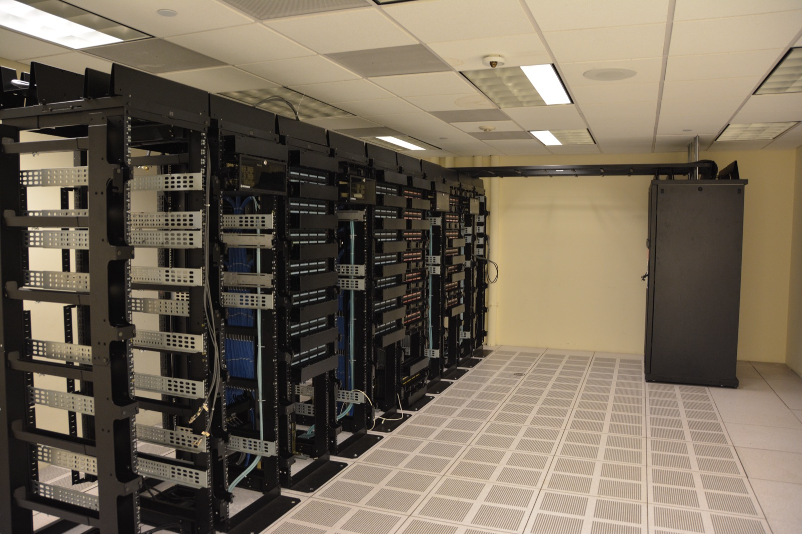
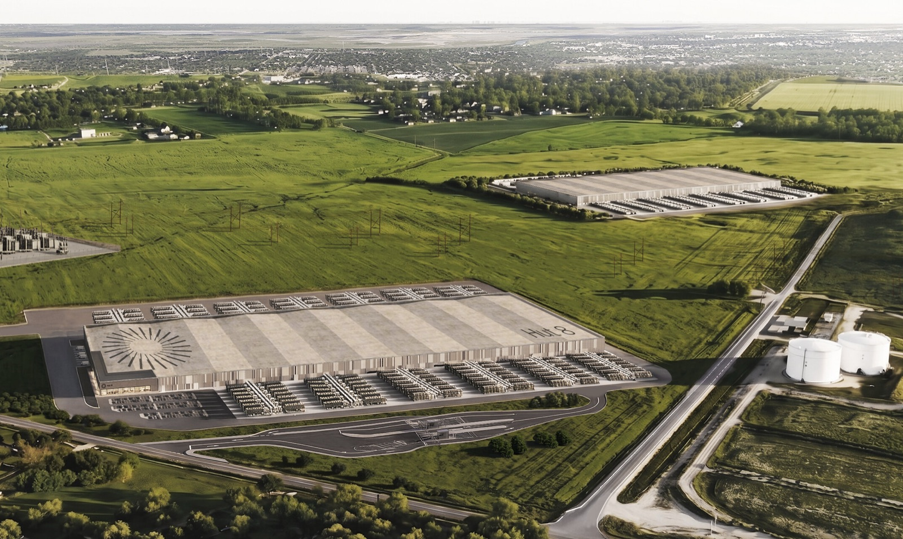

# Most of AI Cloud Lambda

_Lambda_

## Executive Summary

> [!callout]
> This article reads one funding story, reported by TechCrunch on October 6, 2026, from the side of the numbers. Lambda, the American company that rents out the computing power used to train AI, is raising up to $4 billion in a round led by Coatue Management and Blackstone, at a pre-money valuation of $14.5 billion. It is reported to be the last private round before a listing planned for 2027.

> The number holding that price up is the order backlog. The sum of contracts signed but not yet booked as revenue went from $15 billion in June to $50 billion in September. Split by customer, $35 billion of that $50 billion is the commitment Anthropic made in late August, which is 70%, and the same figure as the growth across those three months. A line written as a total carries none of that distribution.

> Sections 1 through 4 are facts from reporting by TechCrunch and The Wall Street Journal, from Lambda's own announcements, and from the reports CoreWeave files with the U.S. Securities and Exchange Commission. Section 5 is this article's reading of those facts, from the side that receives numbers rather than writes them.

### Key Figures

Four numbers. The first three come out of Lambda's books, and the last one shows the shape in which a listed company in the same business publishes its customer concentration.

Source: [TechCrunch (2026-10-06)](https://techcrunch.com/2026/10/06/ai-computing-startup-lambda-to-raise-4b-ahead-of-planned-ipo), [CoreWeave Form 10-Q (Q2 2026)](https://sec-api.io/insights/coreweave-crwv-2026-revenue-analysis-top-customer-concentration-exposure).

<!-- stat-card -->
**$50 billion** — Order backlog as of September — 3.3 times the $15 billion standing three months earlier in June

<!-- stat-card -->
**$35 billion** — Commitment from Anthropic alone — 70% of the $50 billion, and equal to the increase over those three months

<!-- stat-card -->
**$14.5 billion** — Pre-money valuation in this round — Eleven months ago the Series E was reported to close at $5.9 billion post-money

<!-- stat-card -->
**36%** — CoreWeave's largest customer's share of revenue — Q2 2026 filing, which writes the second at 26% and the third at 10% in the same quarter

## Lambda Is Raising Up to $4 Billion at a $14.5 Billion Valuation

Lambda was founded in 2012. It introduces itself as a company that "builds supercomputers for AI training and inference" and says its customers number in the tens of thousands. Put briefly, the business is buying Nvidia chips, racking them together, and renting out the computing power. Companies like this are called neoclouds. They are not full-service clouds the way Amazon's or Google's are; they carve out the computing resources AI training needs and sell that alone.

TechCrunch reported that the company is raising up to $4 billion at a pre-money valuation of $14.5 billion, with Coatue Management and Blackstone leading the round. The previous round was the Series E of November 2025, led by TWG Global and USIT, which brought in more than $1.5 billion. The post-money valuation then was reported at $5.9 billion, so in eleven months the pre-money figure alone has passed twice that. The listing was originally set for this year and has been pushed to 2027.

*▲ What a neocloud sells is compute plugged into racks like these (illustrative image, not Lambda's actual facility) | Source: [Carl Lender / Wikimedia Commons (CC BY 2.0)](https://commons.wikimedia.org/wiki/File:Datacenter_Server_Racks_(22370909788).jpg)*

Equity is not the only thing running this business. TechCrunch writes that for neoclouds "raising capital is easier than covering the cost of expansion," noting that data center construction is financed largely with debt. Lambda recently closed $1 billion in senior secured fixed-rate financing and is in talks for more. Lenders have grown stricter than they were. That is what makes a figure like the order backlog matter. It is offered to equity investors as evidence of future revenue and to lenders as grounds for the ability to repay, both at once.

## The Order Backlog Grew 3.3 Times in Three Months

A backlog is the sum of amounts under contract but not yet booked as revenue. It is not a record of money that came in but of money promised, closer to a restaurant's book of reservations than to the day's takings. A full book does not guarantee revenue. The guests may not show, and the restaurant may not add tables fast enough to seat all of them.

According to an investor letter seen by The Wall Street Journal, Lambda's backlog went from $15 billion in June to $50 billion in September. That is 3.3 times in three months. For a private company with no filed financial statements, this is the most concrete number available to support the claim that demand is exploding. The $14.5 billion price tag ultimately stands on it.

That much is as reported. One question remains after it. Where did the $35 billion of growth come from?

## The Increase and the Anthropic Contract Are Both $35 Billion

In late August, Anthropic signed a $35 billion contract with Lambda for compute capacity. The Wall Street Journal reported it first on September 1; the term was reported as about six years and the capacity as about 350 megawatts. The backlog grew by $35 billion between June and September, and this contract is $35 billion. That is the basis on which TechCrunch wrote that most of the increase appears to come from this one deal.

Two figures matching does not mean no other contract was signed in those three months. Part of the existing backlog will have drained out into actual revenue over that stretch, which means other contracts filled in at least that much. How much left and how much came in cannot be read off a line that carries only a total. Nor can the growth figure alone tell you precisely how much new demand was added.

Anthropic is not the only customer whose name is known. Lambda announced directly on November 3, 2025 that it had signed a multi-year agreement with Microsoft to deploy tens of thousands of GPUs including Nvidia's GB300 NVL72, and the announcement described the size only as "multibillion-dollar." Two months before that, in September, it was reported that Nvidia had agreed to lease back around 18,000 GPU servers from Lambda. It is a deal to rent back the chips it sold, reported at $1.5 billion, and the report said that as of that moment Nvidia would become Lambda's largest customer. Less than a year later, the largest-customer slot had changed hands to a $35 billion contract.

Both agreements predate June, so they would have sat inside the $15 billion. But Lambda itself did not disclose the amount on the Microsoft deal, and the Nvidia figure is known only through reporting. What cannot be split out, in other words, is not only Anthropic's share. There is no way from outside to break the remaining $15 billion down by customer either.

What is clear is the share. Out of $50 billion, $35 billion is 70%. A single customer holds more than two-thirds of the book. The diagram below sets the same book side by side as a total and split by customer.

▲ Original Pebblous diagram. Backlog figures from TechCrunch (2026-10-06), citing an investor letter seen by The Wall Street Journal.

The contract has one more layer in its structure. According to reporting, four companies stand in a single line here. Hut 8 builds a data center in Nueces County, Texas; Nvidia leases the site; Lambda installs chips it bought from Nvidia inside it; and Anthropic buys the computing power that comes out. Hut 8 disclosed in July that a single investment-grade tenant had signed two 15-year leases covering 704 megawatts, with an initial-term contract value of $19.6 billion, but did not name the tenant. Anthropic's portion is reported at about 350 megawatts, roughly half of that. Nvidia is Lambda's investor and chip supplier, the tenant of this building, and, as seen above, a customer too.

*▲ Where the four companies line up — rendering of Hut 8's Beacon Point campus (Nueces County, Texas) | Source: [Hut 8 / PR Newswire](https://www.prnewswire.com/news-releases/hut-8-fully-commercializes-1-gw-beacon-point-ai-data-center-campus-with-second-352-mw-it-lease-bringing-campus-level-base-term-contract-value-to-19-6-billion-302829514.html)*

> [!callout]
> None of this says the structure is wrong. Being able to land a contract this large without sourcing the land and the power directly is a favorable design for Lambda. What changes is what sits folded behind the line that reads "a $50 billion order backlog." That the customer is one company, that the building this customer will use was leased by the chip supplier, that the contract runs six years so the revenue lines up that far out: all of it is inside that one line.

## CoreWeave Writes Its Revenue Down by Customer, Every Quarter

There is a place to compare. CoreWeave, a listed company in the same business, writes into the reports it files with the U.S. Securities and Exchange Commission what percentage of revenue its largest customer accounts for, period by period. That share was 35% in fiscal 2023, rose to 62% in 2024 and 67% in 2025, and the customer is Microsoft. In 2026 it came down to 45% in the first quarter and 36% in the second. The second-quarter report also writes the second-largest customer at 26% and the third at 10%.

The point here is not that CoreWeave is less concentrated than Lambda. As recently as a year ago, 67% of its revenue came from a single customer. Lambda's 70% is a share of backlog and CoreWeave's is a share of revenue, so the two cannot be set directly against each other, but by level of concentration they sit in a similar place. What differs is whether the number can be seen from outside. CoreWeave's share is written into a filing every quarter and anyone can open it, while Lambda's composition surfaced only because a reporter obtained an investor letter.

The same goes for the clock. CoreWeave put its remaining performance obligations at $103.7 billion as of the end of June 2026, and added that it expects to recognize 41% of that as revenue within 24 months, meaning by June 2028. On top of how large the backlog is, it writes down when the money arrives. Lambda's $50 billion does not yet carry that clock.

▲ Original Pebblous diagram. CoreWeave figures from the Q2 2026 Form 10-Q, Lambda figures from TechCrunch (2026-10-06).

There is one more number CoreWeave writes down split. Power. For a backlog to become revenue, a contract is not enough: the buildings and the electricity have to actually be running. In its second-quarter 2026 earnings call the company put contracted power at the end of June at about 3.7 gigawatts and stated separately that active power running at the same point was 1.5 gigawatts. That is a little over 40% of the power under contract switched on, with the rest arriving over the next several years. The Texas site the Anthropic contract will use is also a place where the lease was signed in July. The speed at which the $35 billion on the books turns into revenue cannot exceed the speed at which power arrives at that site.

Turn the direction around and something else appears. On Anthropic's own books this $35 billion is not concentration. According to reporting that cites a private listing document Anthropic prepared, seen by Reuters, the company plans to spend at least $518 billion on compute over close to the next decade, and that amount is divided across several suppliers: $111.1 billion with Google, $110.0 billion with Amazon, $31.4 billion with Microsoft, and $161.2 billion in equipment leases with Broadcom. The same purchase is recorded as diversification on the buyer's books and as concentration on the seller's.

Nor does concentration mean trouble by itself. The same reporting says about 80% of the commitments in that document are non-cancellable or payable regardless of actual usage, which is to say the contracts Anthropic signs with suppliers bind that tightly. But the document was reported as filed in June and the Lambda contract was signed in late August, so what terms hold the $35 billion is not something this reporting can tell us. What remains is a total being read with its terms unknown.

## Why Pebblous Is Watching This Number

This article does not argue that Lambda is in danger. The material an investment judgement needs runs far past what is written here, and much of that material has presumably already reached investors in the letter. The point is on a different side. The same $50 billion becomes an entirely different piece of information depending on how it is written down.

A $50 billion spread evenly across ten customers and a $50 billion with 70% in one place are completely different books. The moment they are totalled, the two take the same shape. What an average does to a distribution, a total does as well, and yet people who guard against the average often take the total as it comes. A total looks as though no calculation happened, which makes it easier to accept.

The same structure turns up constantly in work with data. A line reading 95% accuracy says nothing about the distribution it stands on. A label reading one million training records is the same: it does not say how many sources those million came from, or whether one source accounts for half. The problem is not that the number is wrong. It is that a correct number travels all the way to the conclusion without ever being split. What is unusual about this case is only that the picture after the split actually became public.

So three questions ought to follow any number handed over as a total.

- How many places did the increase come from? A change in a total is not by itself evidence that demand has broadened. Growth produced entirely by one customer is written in the same shape.
- When does it materialize? A backlog carries no dates. $35 billion arriving in pieces over six years and $35 billion arriving in full next year are written as the same number and are not the same value.
- Is there a record kept split? Risk cannot be measured on a number that will not come apart. And a split record is generally not made after the fact. It survives only where someone decided to write it that way from the start.

The last item is closest to the work on the data side. CoreWeave can write a per-customer share partly because it is listed, but mostly because it recorded revenue by customer to begin with. The unit a record is kept in gets decided long before any number goes out.

Thank you for reading this far. The funding and backlog figures in this article come from [TechCrunch's reporting](https://techcrunch.com/2026/10/06/ai-computing-startup-lambda-to-raise-4b-ahead-of-planned-ipo), and the customer shares and remaining performance obligations used for comparison were checked separately against [a summary of CoreWeave's quarterly reports](https://sec-api.io/insights/coreweave-crwv-2026-revenue-analysis-top-customer-concentration-exposure). We would be glad to hear what unit your team uses to split the totals it receives.

## References

- 1.Bellan, R. (2026). "[AI computing startup Lambda to raise $4B ahead of planned IPO](https://techcrunch.com/2026/10/06/ai-computing-startup-lambda-to-raise-4b-ahead-of-planned-ipo)." _TechCrunch_, 2026-10-06. — The primary report for this article, carrying the round size, the valuation, the lead investors, the change in the order backlog and the debt financing. The backlog figures cite an investor letter seen by The Wall Street Journal.
- 2.CoreWeave, Inc. (2026). "[Form 10-Q, Q2 2026 — customer concentration and remaining performance obligations](https://sec-api.io/insights/coreweave-crwv-2026-revenue-analysis-top-customer-concentration-exposure)." _U.S. Securities and Exchange Commission_. — Source for the largest customer at 36%, the second at 26% and the third at 10%, and for remaining performance obligations of $103.7 billion with 41% expected within 24 months.
- 3.Cryptopolitan. (2026). "[Anthropic's $35 billion deal runs on a campus Nvidia leased in July](https://www.cryptopolitan.com/anthropic-lambda-nvidia-hut8-texas-lease/)." 2026-09-01. — Source for Hut 8's disclosure of 704 megawatts of leases with an initial-term contract value of $19.6 billion, Anthropic's portion of about 350 megawatts, and the four-company structure of the contract.
- 4.Lambda. (2025). "[Lambda Raises Over $1.5B from TWG Global, USIT to Build Superintelligence Cloud Infrastructure](https://lambda.ai/blog/lambda-raises-over-1.5b-from-twg-global-usit-to-build-superintelligence-cloud-infrastructure)." 2025-11-18. — The primary announcement used to confirm the founding year, the company's own self-description, and the size and lead investors of the preceding Series E.
- 5.Lambda. (2025). "[Lambda Announces Multibillion-Dollar Agreement With Microsoft to Deploy AI Infrastructure Powered by Tens of Thousands of NVIDIA GPUs](https://lambda.ai/blog/lambda-announces-multibillion-dollar-agreement-with-microsoft-to-deploy-ai-infrastructure-powered-by-tens-of-thousands-of-nvidia-gpus)." 2025-11-03. — The primary announcement of the Microsoft agreement. Source for the size being given only as "multibillion-dollar" with no figure disclosed, for the inclusion of the GB300 NVL72, and for the CEO's remark that the two companies have dealt with each other for more than eight years.
- 6.RCR Wireless News. (2025). "[Nvidia strikes $1.5B deal to lease back GPUs from Lambda](https://www.rcrwireless.com/20250908/ai-infrastructure/nvidia-lambda)." 2025-09-08. — Source for the $1.5 billion arrangement under which Nvidia agreed to lease back around 18,000 GPU servers, and for the line about Nvidia becoming the largest customer as of that moment. The original report is from The Information, and no official announcement from Lambda or Nvidia has been confirmed.
- 7.CoreWeave, Inc. (2026). "[Q2 2026 Earnings Call Transcript](https://s205.q4cdn.com/133937190/files/doc_financials/2026/q2/CRWV-US-CORRECTED-TRANSCRIPT-CoreWeave-Q2-2026-Earnings-Call-11August2026.pdf)." 2026-08-11. — Source for the passage stating contracted power of about 3.7 gigawatts at the end of June and active power of 1.5 gigawatts at the end of the second quarter as separate figures.
