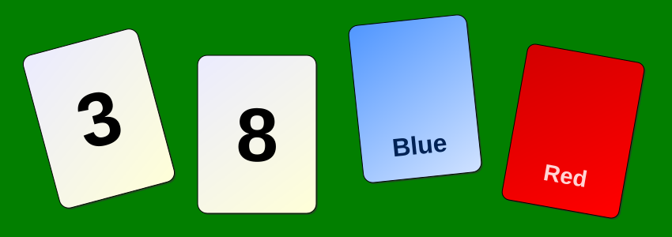

# AI Groups That Stand In for People Agree Too Easily, Even on Wrong Answers

_A preregistered Waseda University study replayed 100 human Wason-task discussions with LLM agents and found consensus gaps of 34.0 to 44.4 points_

## Executive Summary

> [!callout]
> This article looks at a study that took discussions people actually had and replayed them with groups of LLM agents. Tengfei Shao of the Global Education Center at Waseda University posted it to arXiv on September 17 as a preregistered study, and the material is 100 human groups working through a logic puzzle in a public corpus of chat transcripts. One agent stands in for each participant, seeded with the answer that participant had written down before the discussion began. No agent was given the answer key, and none was shown what the other participants said.

> In the 45 groups that had no silent member, reasoning-mode agent groups still reach full consensus 44.4 points more often than the people they replay. One human participant in five never posted a word, which widens the raw gap, but the gap stayed once that silence was taken out of the count. Then the cards were swapped for neutral words that carry no memorized answer, and most of the agreement moved onto wrong answers. As the author sums it up, how often the agents agreed did not track how often the group was right.

> Sections 1 through 6 follow the numbers the paper reports, the control runs behind them, and the limits the author draws around them. Section 7 is this article's reading of what the result means for the move to replace surveys and focus groups with agents.

### Key Figures

Source: [Shao, T. (2026), arXiv:2609.20543](https://arxiv.org/abs/2609.20543) · preregistration [osf.io/5jp7s](https://osf.io/5jp7s)

<!-- stat-card -->
**+44.4 pts** — Excess consensus in reasoning-mode agent groups — Paired across the 45 groups where everyone spoke. People 51.1%, agents 95.6%. 95% confidence interval 29.6 to 59.3

<!-- stat-card -->
**74.0%** — Groups that agreed on a wrong answer — On the task whose cards became neutral words, which takes the memorized answer away. The same mode was at 12.0% on the original task

<!-- stat-card -->
**20.1% ↔ 0.2%** — Share who never posted a word — People first, agents second. Agents could pass on any round and almost never used it

<!-- stat-card -->
**0.98 ↔ 0.61** — How concentrated the final answers are — Herfindahl index for reasoning-mode agent groups and for human groups. Closer to 1 means one answer took the whole group

## What the Agents Were Given, and What They Never Saw

The material is DeliData, a corpus released in 2023 that holds 500 groups discussing the Wason card selection task over chat, with 1,974 participants and 14,003 utterances. The task itself has been in psychology textbooks since 1968. Four cards lie face up and one rule is given, and the question is which cards you have to turn over to find out whether the rule holds. One answer is logically correct, and most people have long been known to get it wrong. Each participant writes an answer before the discussion, talks freely, then writes an answer again afterwards.

*▲ A typical Wason selection task setup — the question is which of the four cards must be flipped to test a rule like "if a card shows an even number, its other side is blue." Devised by psychologist Peter Wason in 1968. Source: [Wikimedia Commons](https://commons.wikimedia.org/wiki/File:Wason_selection_task_cards.svg) (CC BY-SA)*

Shao split those 500 groups into 400 and 100 with a fixed hash of the group identifier. The 400 served only to set the configuration, and the 100 were held out. The SHA256 values of both lists went into an [Open Science Framework preregistration](https://osf.io/5jp7s) on July 4, 2026, so neither list could be changed after the results came in. Only one quantity was tuned on the 400, the group improvement rate. Human groups improved in 35.8% of cases, and the configuration that came closest to that value was the one selected. No other measure was examined during calibration.

The most consequential design decision was not to let the agents work freely. A contamination check run before the main study found that current models solve this task far better than individual people even when the cards are relabelled. With the agents unconstrained, a group's improved score would come from model skill rather than from discussion. So each agent was seeded with the answer its assigned participant had written down alone, before any discussion. An agent sees its own alias, that injected answer, the four cards and the rule. It does not see the answer key, the other participants' pre-discussion answers, the conversation those people actually had, or anyone's final answer. Whatever an agent learns, it learns inside the replayed conversation.

The model was a single served build from DeepSeek (deepseek-v4-flash), called in two settings, a chat mode and a reasoning mode. Crossing those with three role-fidelity scaffolds (none, a stay-in-character instruction, and that instruction plus a per-turn re-injection of the original belief) and three seeds over 100 groups yields 1,800 confirmatory cells. Seven reasoning-mode cells (0.4%) failed on network errors, and Shao dropped them rather than refilling the slots. To see whether the same thing happens in another model family, the open-weights Qwen3-14B was served locally and run over the same 100 groups.

The paper also gathers the warnings that had already accumulated around synthetic respondents: model samples that hit the population average while collapsing the variance of the responses, and personas that flatten the diversity inside a group. Group cognition research has long found that accuracy comes from preserved diversity and independence rather than from agreement, which is why Shao treats over-convergence as a failure mode rather than a success. Of the two earlier replay studies, one used subjective questions with no ground truth, so its consensus could not be split into correct and wrong; the other matched agents to real participants but did not simulate the dialogue at all. This study simulates the dialogue and picks a task that has a right answer.

> [!callout]
> Scoring people and agents with the same code sits at the center of this study. As the author notes, identical code is not identical measurement. DeliData records a final state by carrying forward the last choice of a participant who went quiet, while an agent is forced to produce an answer at the end. How that asymmetry gets handled moves every number in the next section.

## The Human Consensus Rate More Than Doubles Depending on How You Count

Full consensus means every member of a group ends on the same answer. Whether that answer is correct does not enter the definition. Simple as it reads, four scoring rules give four different values on the same 100 groups. The table has them.

| Scoring rule | Full consensus | Groups | What the rule does |
| --- | --- | --- | --- |
| Carry-forward | 24.0% | 100 | The corpus default. A silent participant's older choice stays in place |
| Submitted answers | 52.0% | 98 | Reduces the difference in how the endpoint is measured |
| Active members only | 57.0% | 100 | Reduces the difference in participation structure |
| Groups where everyone spoke | 51.1% | 45 | Serves as the baseline for the paired comparison |

The same 100 groups, scored by the same code. Change one rule and 24.0% becomes 57.0%. Table 2 of the paper.

What separates 24.0% from 57.0% is silence. In this corpus 20.1% of participants never posted during the discussion. Under a rule that requires every member's answer to match, one silent member leaves an old choice standing and drops the whole group out of consensus. In data where one person in five stays quiet, that rule pushes the consensus rate down mechanically.

Here the paper's first claim arrives. A full-consensus rate is not a property of deliberation. It is an estimate produced by decisions about who counts as a participant and how someone who did not answer gets written down. If a study reports one consensus rate for human groups, the first question is whether that value came from the 24% rule or the 57% rule.

## The Gap That Survives Matched Participation

If silence is what loads the human denominator, then removing that disadvantage should make the gap disappear. Shao removed it two ways: keep only the 45 groups in which every member spoke at least once, and use the humans' actual submitted answers. The two routes reduce different kinds of error.

Among the 45 groups where everyone spoke, human full consensus is 51.1%. Chat-mode agents replaying the same groups reach 85.2% and reasoning mode 95.6%. Paired group by group, the differences are 34.1 points (95% confidence interval 19.3 to 48.9) and 44.4 points (29.6 to 59.3), and both intervals clear zero with room to spare. On the 98 groups scored by submitted answers the gaps are 34.0 points (24.1 to 44.2) and 43.9 points (34.0 to 53.7). Two routes that reduce different errors landed within half a point of each other. With no correction at all, the comparison across all 100 groups widens to 62.0 and 72.0 points, and those values mix the participation difference together with the carry-forward difference.

Which 45 groups those are deserves a separate look. Supplementary Table S3 sets out the composition of the subset. Groups where everyone spoke average 3.20 members against 3.86 across all 100, they hold 2.73 distinct pre-discussion answers against 3.07, and 9.0% of their members start out with the correct answer against 11.2%. So the author pins down how to read the number. It "should be interpreted as a participation-matched sensitivity estimate for predominantly two- to five-member groups that generally began in disagreement and with low initial accuracy, rather than as evidence that the same difference applies to larger groups." Two considerations narrow the concern without removing it. People and agents are measured inside the same group, so group size does not take one side, and the submit-based route, whose composition differs, lands within 0.5 points.
