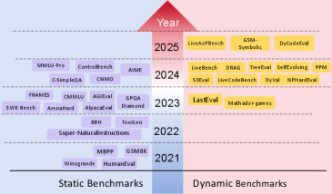
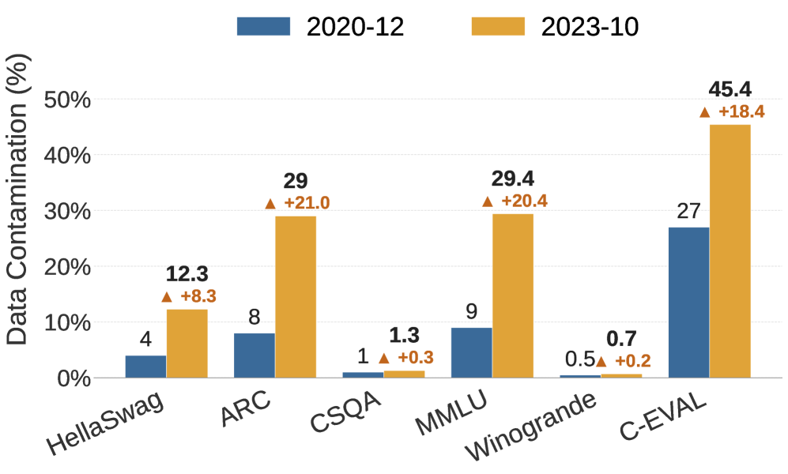
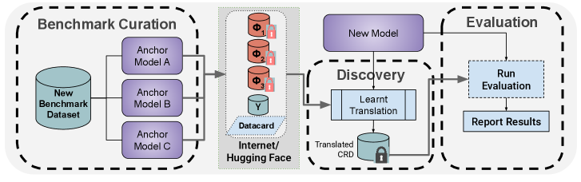

# The Test Was Already in the Training Data

_From 29% MMLU contamination to a 13-point GSM8K drop — the real problem is evaluation-set integrity_

## Executive Summary

> [!callout]
> Every quarter, another model at the top of the leaderboard is announced as having surpassed human experts. Yet much of the test it solved was already sitting inside its training data before any grading began. Public benchmarks are free to download, and the pretraining process that scrapes the entire internet to build training corpora pulls in the questions and their answers along with everything else. This article looks at how that leaked evaluation data inflates scores, and why this is a problem of data rather than of models.

> Johns Hopkins researchers, measuring at NAACL 2024, found that 29.1% of MMLU test items showed signs of contamination. When contaminated items are swapped for clean mirrors and re-solved, the same model's score falls — Mistral dropped by as much as 13 percentage points on a clean GSM8K test. In other words, part of the numbers we were comparing reflected memorization, not ability.

> For anyone who works on data quality, the implication is direct: the definition of "clean data" cannot stop at the training set. What a model was measured with shapes the score as much as what it was trained with.

<!-- stat-card -->
**29.1%** — MMLU contamination — Test items showing contamination signals (JHU, NAACL 2024)

<!-- stat-card -->
**45.8%** — C-Eval contamination — Chinese benchmark, same study

<!-- stat-card -->
**13pt** — GSM8K score drop — Mistral, re-measured on a clean mirror

<!-- stat-card -->
**22.9%** — Inflation removed — MMLU, with inference-time decontamination (ITD)

## What the Leaderboard Hides

Benchmarks are the LLM industry's shared exam paper. MMLU holds multiple-choice questions across 57 subjects, GSM8K holds grade-school word problems, and HumanEval holds coding tasks. When a new model ships, it is graded on these papers, and those numbers set the rankings. The trouble is that the exam paper is public. Datasets posted to GitHub and Hugging Face are free for anyone to download — and "anyone" includes the pretraining crawlers that vacuum up the entire web.

So the model reads the exam before it ever sits for it. Not just the questions, but the answers too, end up inside the training data. Even when the score comes back high, there is no way to tell whether it reflects reasoning or the memory of an item already seen. The simple fact that the model had the paper in hand is enough to shake the meaning of the number.

*▲ The LLM benchmark landscape 2021–2025: static benchmarks (MMLU, GSM8K) dominated early; dynamic benchmarks (LiveBench, DyCodeEval) emerged in response to growing contamination concerns. | Source: [arXiv 2502.17521](https://arxiv.org/abs/2502.17521)*

Model makers know this. To deal with it, they run filters that strip out passages overlapping with benchmarks. GPT-3 cut anything matching 13 consecutive words (a 13-gram), and GPT-4 raised the bar to 40-grams. But filters only fire when the text matches exactly. Reword a sentence slightly, translate it into another language, or reshape a table, and the same problem becomes a different string that slips past the filter. Contamination is not removed; it survives by changing form.

## How Far Has It Spread?

That contamination is not an abstract worry is shown by the measured numbers. Johns Hopkins researchers cross-checked several models and benchmarks to estimate which items had been exposed to training data. On MMLU, roughly 29.1% showed contamination signals; on the Chinese benchmark C-Eval, 45.8% did. Meta's own Llama 2 report found that 16% of MMLU items overlapped with its training data, some of them severely — with more than 80% of tokens matching. The ones pointing out contamination are not only outside critics. In its GPT-4 technical report, OpenAI itself disclosed that, across 34 academic and professional exams it checked directly, 9 had more than 20% of items overlapping with training data.

It gets worse in multilingual settings. One analysis reported contamination rates of up to 91.8% on some multilingual benchmarks. As English source questions are translated into many languages and spread across the web, the same item ends up scattered through training data in varied forms. A single exam paper, copied tenfold, settles into the model's memory.

So how much does contamination actually lift a score? The cleanest experiment is to build fresh, uncontaminated "mirror" questions and have the same model solve them again. Re-measuring Mistral on a clean GSM8K mirror dropped its accuracy by as much as 13 percentage points. On MMLU, an inference-time decontamination technique (ITD) that screens out contaminated items shaved off 22.9% of the inflated score. On MMLU-CF, which Microsoft rebuilt with a private test set, GPT-4o scored 73.4% — lower than its score on the public MMLU.

### 2.1. Contamination by Benchmark

Even the same contamination varies sharply by benchmark and by model. The table below gathers the published measurements in one place.

| Target | Contamination / drop | Source |
| --- | --- | --- |
| MMLU | 29.1% of items contaminated | JHU, NAACL 2024 |
| C-Eval | 45.8% of items contaminated | JHU, NAACL 2024 |
| Llama 2 / MMLU | 16% overlap, some severe | Meta Llama 2 report |
| GPT-4 / 34 academic exams | 9 exams with 20%+ items contaminated | OpenAI GPT-4 report |
| Multilingual benchmarks | Up to 91.8% contaminated | Contamination-resistance research |
| Mistral / GSM8K | 13pt drop on clean mirror | Contamination-resistance research |
| MMLU (with ITD) | 22.9% of inflation removed | Inference-Time Decontamination |

*▲ Contamination rates compared between December 2020 and October 2023. MMLU tripled from 9% to 29.4% in three years; C-EVAL shows a similar trajectory. | Source: [arXiv 2605.19999](https://arxiv.org/html/2605.19999v1)*

## A Data Problem, Not a Model Problem

It is easy to read contamination as a flaw in the model. But changing the model architecture or improving the training algorithm does not make the leaking exam paper go away. What is broken is not the model but the procedure for handling evaluation data — specifically, the lifecycle management that creates the exam, distributes it, and keeps it isolated from model training.

Contamination enters at two main points. The first is pretraining: benchmark questions and answers get mixed into the internet-crawl data, and because most models never disclose their training data, it is nearly impossible to verify from the outside. The second is post-training: during alignment and fine-tuning, data resembling the benchmark slips in unintentionally, or test sets released after the knowledge cutoff flow straight in.

Detection being hard makes the problem worse. The n-gram method that counts character overlap misses paraphrased items. An indirect signal that asks the model to guess the answer choice (TS-Guessing) hints at contamination: ChatGPT guesses MMLU answers as often as 57% of the time, but that is inference, not proof. Membership inference attacks are imprecise too. The root cause keeps converging on one thing: when training data is not disclosed, no one can honestly confirm what leaked in.

> [!callout]
> Put in the language of data quality, this is a problem of measurement-tool integrity. The evaluation set is the ruler that measures the model — and if that ruler was raised on the same data as the model, the reading is a tick mark taken with a contaminated instrument. Fixing the model does not straighten a bent ruler.

## Three Ways to Remake the Exam

Once the problem showed up in hard numbers, efforts to change the evaluation method itself followed. They split into three broad directions: keep printing a fresh exam, lock the exam away, or distribute it in a form the model cannot read.

### 4.1. Dynamic benchmarks — print a new exam every month

LiveBench draws fresh questions each month from the latest math competitions, newly posted arXiv papers, and recent news. When the moment a question becomes public falls later than a model's training cutoff, the model has no way to memorize it in advance. This approach, co-authored by Yann LeCun, turns the freshness of the exam itself into a line of defense against contamination.

### 4.2. Private test sets — lock the exam away

Microsoft's MMLU-CF keeps the test set private and offers only grading. With the questions never released to the web, there is nothing for a crawler to collect. At the same difficulty, scores come out lower than on the public version — and GPT-4o's 73.4% on this private test is closer to the more honest coordinate left once contamination is stripped away.

*▲ (Top) On original MMLU, the LLM echoes the exact same answer choices as the training data — evidence of memorization. (Bottom) On MMLU-CF, questions are rephrased so the model cannot recall memorized answers. | Source: [MMLU-CF arXiv 2412.15194](https://arxiv.org/abs/2412.15194)*

### 4.3. Contamination-resistant distribution — release it in a form the model can't read

The third is more fundamental: distribute the benchmark in a form a human can use for grading but a model cannot use for training. One research group proposed encoding questions into a form such as a KV cache, so that even if they are crawled as plaintext, the training pipeline cannot swallow them directly. Instead of hiding the exam, the idea is to make it unmemorizable even when it leaks.

*▲ Contamination-Resistant Deployment (CRD) pipeline. The benchmark is projected into a latent space and distributed; only a model that learns the inverse translation (Discovery) can perform inference — making raw crawling useless for training. | Source: [arXiv 2605.19999](https://arxiv.org/html/2605.19999v1)*

- •**What they share** — none of the three touch the model. What they change is the procedure for creating and distributing evaluation data.
- •**The trade-offs** — dynamic benchmarks carry operating cost, private test sets sacrifice reproducibility and transparency, and contamination-resistant distribution leaves standardization unsolved.

## The Boundary of Clean Data

The ability of an AI system is decided by two kinds of data: what it was trained with, and what it was measured with. The data-quality conversation has long stayed on the first. Is the training data clean, are the labels accurate, is it free of bias? Benchmark contamination turns that gaze toward the second. If the data used for measurement is contaminated, then however carefully the first is groomed, the resulting number cannot be trusted.

So the definition of "clean data" widens by one notch. Training-set integrity is no longer enough; evaluation-set integrity becomes a managed asset of the same grade. Tracking when an evaluation set was created, whether its timing overlaps with model training data, and whether it has ever been exposed externally enters the scope of data-quality work. Just as training data carries provenance and license history, evaluation data should carry exposure history too.

For practitioners who translate leaderboard numbers into business decisions, one extra line of questioning becomes a habit worth keeping. Has the model ever seen the exam this score came from? That single line is the boundary between an illusion the data created and real ability.

> [!callout]
> **In one line.** Part of the scores we trust may be an illusion created not by a model's ability but by contamination in the evaluation data. Widening the boundary of clean data from the training set to the evaluation set is the task ahead.

## References

### Detection & Measurement

- 1.New, J., Marone, M., & Van Durme, B. (2024). "[Investigating Data Contamination in Modern Benchmarks for Large Language Models](https://arxiv.org/abs/2311.09783)." _NAACL 2024_. MMLU 29.1%, C-Eval 45.8% contamination; TS-Guessing method.
- 2.Chen, S. et al. (2025). "[Recent Advances in Large Language Model Benchmarks against Data Contamination: From Static to Dynamic Evaluation](https://arxiv.org/abs/2502.17521)." arXiv:2502.17521. Comprehensive survey on static-to-dynamic benchmark transition.
- 3.Xu, A. et al. (2026). "[When Benchmarks Leak: Inference-Time Decontamination for LLMs](https://arxiv.org/abs/2601.19334)." arXiv:2601.19334. ITD removes 22.9% of MMLU score inflation.

### Contamination-Resistant Evaluation

- 4.White, C., Dooley, S., LeCun, Y. et al. (2024). "[LiveBench: A Challenging, Contamination-Limited LLM Benchmark](https://openreview.net/forum?id=sKYHBTAxVa)." OpenReview:sKYHBTAxVa. Monthly-refresh dynamic benchmark.
- 5.Gema, A. P. et al. (2024). "[MMLU-CF: A Contamination-Free Multi-Task Language Understanding Benchmark](https://arxiv.org/abs/2412.15194)." arXiv:2412.15194. Closed test set; GPT-4o scores 73.4%.
- 6.Al-Lawati, H. et al. (2026). "[LLM Benchmark Datasets Should Be Contamination-Resistant](https://arxiv.org/abs/2605.19999)." arXiv:2605.19999. KV-cache contamination-resistant deployment (CRD); Mistral GSM8K drops 13 pp on clean mirror.
