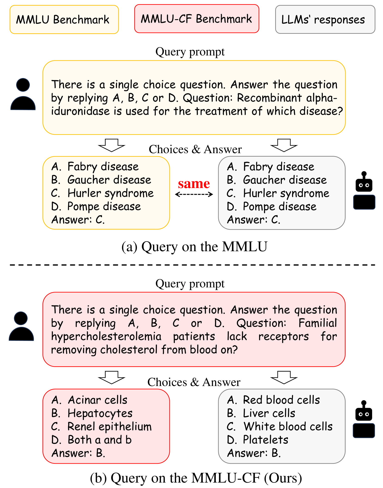

# 그 시험지는 이미 학습 데이터에 있었다

_MMLU 29% 오염부터 GSM8K 13% 점수 하락까지 — 평가셋 무결성이 진짜 문제다_

## Executive Summary

> [!callout]
> 리더보드 상단의 모델이 인간 전문가를 넘어섰다는 발표는 이제 분기마다 반복된다. 그런데 그 모델이 푼 시험지의 상당 부분은 채점 전에 이미 모델의 학습 데이터 안에 들어 있었다. 공개된 벤치마크는 누구나 내려받을 수 있고, 인터넷을 통째로 긁어 학습 데이터를 만드는 사전학습 과정에서 문제와 정답이 함께 빨려 들어간다. 이 글은 그렇게 새어 든 평가 데이터가 점수를 어떻게 부풀리는지, 그리고 왜 이것이 모델이 아니라 데이터의 문제인지를 본다.

> 존스홉킨스 연구진이 NAACL 2024에서 측정한 바로는 MMLU 테스트 문항의 29.1%가 오염 신호를 보였다. 오염된 문항을 깨끗한 미러로 바꿔 다시 풀리면 같은 모델의 점수가 내려간다 — Mistral은 GSM8K 클린 테스트에서 정확도가 최대 13%포인트 떨어졌다. 즉 우리가 비교하던 숫자의 일부는 실력이 아니라 암기였다.

> 데이터 품질을 다루는 실무자에게 이 사건의 함의는 분명하다. '깨끗한 데이터'의 정의가 학습셋에서 멈추면 안 된다. 무엇으로 학습했는가만큼 무엇으로 측정했는가가 점수를 결정하기 때문이다.

<!-- stat-card -->
**29.1%** — MMLU 오염률 — 테스트 문항 중 오염 신호 (JHU, NAACL 2024)

<!-- stat-card -->
**45.8%** — C-Eval 오염률 — 중국어 벤치마크, 같은 연구 측정

<!-- stat-card -->
**13%p** — GSM8K 점수 하락 — Mistral, 클린 미러로 재측정 시

<!-- stat-card -->
**22.9%** — 인플레이션 감소 — MMLU, 추론 시점 정화(ITD) 적용

## 리더보드가 가린 사실

벤치마크는 LLM 업계의 공용 시험지다. MMLU는 57개 과목의 객관식 문제, GSM8K는 초등 수준 서술형 수학, HumanEval은 코딩 문제를 담는다. 새 모델이 나오면 이 시험지로 점수를 매기고, 그 숫자로 순위를 세운다. 문제는 시험지가 공개돼 있다는 점이다. 깃허브와 허깅페이스에 올라온 데이터셋은 누구나 내려받을 수 있고, 그 누구에는 인터넷을 통째로 수집하는 사전학습 크롤러도 포함된다.

그래서 모델은 시험을 치르기 전에 시험지를 먼저 읽는다. 문제뿐 아니라 정답까지 학습 데이터 안에 들어가는 것이다. 채점 결과가 높게 나와도 그것이 추론 능력인지, 본 적 있는 문항을 떠올린 기억인지 구분할 길이 없다. 시험지가 손에 있었다는 사실 하나만으로 점수의 의미가 흔들린다.

*▲ 2021~2025년 LLM 벤치마크 지형: MMLU·GSM8K 등 정적 벤치마크가 먼저 등장했고, 오염 문제에 대한 대응으로 LiveBench 같은 동적 벤치마크가 확산됐다. | Source: [arXiv 2502.17521](https://arxiv.org/abs/2502.17521)*

모델 제작사들은 이 문제를 안다. 그래서 학습 데이터에서 벤치마크와 겹치는 부분을 걸러 내는 필터를 둔다. GPT-3는 13개 단어가 연속으로 겹치면(13-gram) 잘라 냈고, GPT-4는 기준을 40-gram으로 키웠다. 그러나 필터는 글자가 똑같을 때만 작동한다. 문장을 살짝 바꿔 쓰거나, 다른 언어로 옮기거나, 표 형식을 바꾸면 같은 문제도 다른 문자열이 되어 필터를 통과한다. 오염은 걸러진 게 아니라 형태를 바꿔 살아남는다.

## 오염은 얼마나 퍼졌나

오염이 추상적인 우려가 아니라는 것은 측정된 수치가 보여 준다. 존스홉킨스 연구진은 여러 모델과 벤치마크를 교차 점검해 어느 문항이 학습 데이터에 노출됐는지 추정했다. MMLU에서는 약 29.1%, 중국어 벤치마크 C-Eval에서는 45.8%가 오염 신호를 보였다. Meta가 공개한 Llama 2 보고서에서도 MMLU 문항의 16%가 학습 데이터와 겹쳤고, 그중 일부는 토큰의 80% 이상이 일치하는 심각한 오염이었다. 오염을 지적하는 쪽이 외부 비판자만은 아니다. OpenAI는 GPT-4 기술 보고서에서 직접 점검한 학술·전문 시험 34종 가운데 9종에서 문항의 20% 이상이 학습 데이터와 겹쳤다고 스스로 밝혔다.

다국어로 가면 사정이 더 나쁘다. 한 분석은 일부 다국어 벤치마크의 오염률이 최대 91.8%에 이른다고 보고했다. 영어 원본 문제가 여러 언어로 번역돼 웹에 퍼지면서 학습 데이터 곳곳에 같은 문항이 변형된 채 흩어진 결과다. 시험지 한 장이 열 갈래로 복제돼 모델의 기억 속에 자리 잡은 셈이다.

그렇다면 오염이 점수를 실제로 얼마나 끌어올릴까. 가장 깨끗한 실험은 오염되지 않은 '미러' 문제를 새로 만들어 같은 모델에게 다시 풀리는 방식이다. Mistral을 GSM8K의 클린 미러로 재측정하자 정확도가 최대 13%포인트 내려갔다. MMLU에서는 추론 시점에 오염 문항을 골라내는 정화 기법(ITD)이 부풀려진 점수의 22.9%를 깎아 냈다. Microsoft가 비공개 테스트셋으로 새로 만든 MMLU-CF에서 GPT-4o가 받은 점수는 73.4%로, 공개 MMLU에서의 점수보다 낮았다.

### 2.1. 벤치마크별 오염률

같은 오염이라도 벤치마크와 모델에 따라 정도가 크게 갈린다. 아래는 공개된 측정값을 한자리에 모은 것이다.

| 대상 | 오염·하락 정도 | 출처 |
| --- | --- | --- |
| MMLU | 문항의 29.1% 오염 | JHU, NAACL 2024 |
| C-Eval | 문항의 45.8% 오염 | JHU, NAACL 2024 |
| Llama 2 / MMLU | 16% 겹침, 일부 심각 오염 | Meta Llama 2 보고서 |
| GPT-4 / 학술시험 34종 | 9종에서 20%+ 문항 오염 | OpenAI GPT-4 보고서 |
| 다국어 벤치마크 | 최대 91.8% 오염 | 오염 저항성 연구 |
| Mistral / GSM8K | 클린 미러에서 13%p 하락 | 오염 저항성 연구 |
| MMLU (ITD 적용) | 인플레이션 22.9% 감소 | Inference-Time Decontamination |

*▲ 2020년 말과 2023년 말 기준 오염률 비교. MMLU는 3년 사이 9%에서 29.4%로 세 배 이상 높아졌다. C-EVAL도 유사한 추세를 보인다. | Source: [arXiv 2605.19999](https://arxiv.org/html/2605.19999v1)*

## 모델이 아니라 데이터의 문제

오염을 모델의 결함으로 읽기 쉽다. 그러나 모델 아키텍처를 바꾸거나 학습 알고리즘을 개선해도 시험지가 새는 문제는 사라지지 않는다. 깨진 것은 모델이 아니라 평가 데이터를 다루는 절차다. 정확히는 시험지를 만들고, 배포하고, 모델 학습과 분리해 보관하는 생명주기 관리가 무너진 것이다.

오염은 크게 두 시점에서 들어온다. 하나는 사전학습 단계다. 인터넷 크롤 데이터에 벤치마크 문제와 정답이 섞여 들어가는 경우로, 대부분의 모델이 학습 데이터를 공개하지 않기 때문에 외부에서 검증하기가 거의 불가능하다. 다른 하나는 사후학습 단계다. 정렬·파인튜닝 과정에서 벤치마크와 닮은 데이터가 의도와 무관하게 포함되거나, 지식 컷오프 이후 공개된 테스트셋이 그대로 흘러 들어간다.

탐지가 어렵다는 점이 문제를 더 키운다. 글자 겹침을 세는 n-gram 방식은 패러프레이즈된 문항을 놓친다. 정답 선택지를 모델에게 맞혀 보게 하는 간접 지표(TS-Guessing)는 ChatGPT가 MMLU 정답을 57%나 맞히는 식으로 오염을 시사하지만, 추론일 뿐 증명은 아니다. 멤버십 추론 공격 역시 부정확하다. 근본 원인은 한 가지로 모인다. 학습 데이터가 공개되지 않으면, 무엇이 새어 들었는지 누구도 정직하게 확인할 수 없다.

> [!callout]
> 데이터 품질의 언어로 옮기면 이것은 측정 도구의 무결성 문제다. 평가셋은 모델을 재는 자(尺)인데, 그 자가 모델과 같은 데이터를 먹고 자랐다면 측정값은 도구가 오염된 채 찍은 눈금이다. 모델을 고쳐도 자가 휜 것은 펴지지 않는다.

## 시험지를 바꾸는 세 가지 길

문제가 정량으로 드러나자 평가 방식 자체를 바꾸려는 시도가 이어졌다. 방향은 크게 셋으로 나뉜다. 시험지를 계속 새로 찍거나, 시험지를 잠가 두거나, 시험지를 모델이 읽을 수 없는 형태로 배포하는 것이다.

### 4.1. 동적 벤치마크 — 시험지를 매달 새로 찍는다

LiveBench는 매월 최신 수학 경시대회, 갓 올라온 arXiv 논문, 최근 뉴스에서 문제를 새로 뽑는다. 문항이 공개되는 시점이 모델의 학습 컷오프보다 늦으면 모델이 미리 외울 방법이 없다. Yann LeCun이 공동 저자로 참여한 이 접근은 시험지의 신선도 자체를 오염 방어선으로 삼는다.

### 4.2. 비공개 테스트셋 — 시험지를 잠가 둔다

Microsoft의 MMLU-CF는 테스트셋을 공개하지 않고 채점만 제공한다. 문제가 웹에 풀려 있지 않으니 크롤러가 수집할 길이 없다. 같은 난이도라도 공개본보다 점수가 낮게 나오는데, GPT-4o가 이 비공개 테스트에서 받은 73.4%가 오염이 걷힌 뒤의 더 정직한 좌표에 가깝다.

*▲ (위) MMLU 원본: LLM이 학습 데이터와 동일한 선택지를 그대로 출력 — 암기의 증거. (아래) MMLU-CF: 문항을 재구성해 동일 정답이 나오지 않도록 차단. | Source: [MMLU-CF arXiv 2412.15194](https://arxiv.org/abs/2412.15194)*

### 4.3. 오염 저항형 배포 — 모델이 못 읽는 형태로 푼다

세 번째는 더 근본적이다. 벤치마크를 사람은 채점에 쓸 수 있지만 모델 학습에는 쓸 수 없는 형태로 배포하자는 제안이다. 한 연구진은 문제를 KV 캐시 같은 형태로 풀어, 평문 텍스트로 크롤링되더라도 학습 파이프라인이 곧바로 삼킬 수 없게 만드는 방법을 내놓았다. 시험지를 숨기는 대신, 새어 나가도 외울 수 없게 만드는 발상이다.

*▲ 오염 저항형 배포(CRD) 파이프라인. 벤치마크를 앵커 모델로 잠재 공간에 투영해 배포하고, 평가 대상 모델이 학습된 역변환(Discovery)을 거쳐야만 추론할 수 있다 — 크롤링만으로 학습에 쓰는 것이 불가능하다. | Source: [arXiv 2605.19999](https://arxiv.org/html/2605.19999v1)*

- •**공통점** — 세 방법 모두 모델을 손대지 않는다. 손대는 것은 평가 데이터를 만들고 배포하는 절차다.
- •**트레이드오프** — 동적 벤치마크는 운영 비용이, 비공개 테스트셋은 재현성과 투명성이, 오염 저항형 배포는 표준화가 과제로 남는다.

## 깨끗한 데이터의 경계

AI 시스템의 실력은 두 종류의 데이터가 결정한다. 무엇으로 학습했는가, 그리고 무엇으로 측정했는가다. 데이터 품질 논의는 오랫동안 앞쪽에 머물렀다. 학습 데이터가 깨끗한가, 라벨이 정확한가, 편향이 없는가. 벤치마크 오염은 그 시선을 뒤쪽으로 돌려놓는다. 측정에 쓴 데이터가 오염되면, 앞쪽을 아무리 정성껏 다듬어도 결과 숫자는 믿을 수 없다.

그래서 '깨끗한 데이터'의 정의가 한 칸 넓어진다. 학습셋 무결성만으로는 부족하고, 평가셋 무결성이 같은 등급의 관리 대상이 된다. 평가셋이 언제 만들어졌고, 모델 학습 데이터와 시점이 겹치지 않는지, 외부에 노출된 적이 있는지를 추적하는 일이 데이터 품질 업무의 범위로 들어온다. 학습 데이터에 출처와 라이선스 이력을 붙이듯, 평가 데이터에도 노출 이력을 붙여야 한다는 뜻이다.

리더보드의 숫자를 경영 판단의 근거로 옮기는 실무자라면, 그 숫자 옆에 한 줄을 더 묻는 습관이 필요하다. 이 점수가 나온 시험지는 모델이 본 적 없는 것인가. 이 한 줄이 데이터가 만든 착시와 실제 실력을 가르는 경계가 된다.

> [!callout]
> **한 줄 요약.** 우리가 믿는 점수의 일부는 모델의 실력이 아니라 평가 데이터의 오염이 만든 착시일 수 있다. 깨끗한 데이터의 경계를 학습셋에서 평가셋으로 넓히는 것이 다음 과제다.

## 참고문헌

### 오염 탐지·측정 연구

- 1.New, J., Marone, M., & Van Durme, B. (2024). "[Investigating Data Contamination in Modern Benchmarks for Large Language Models](https://arxiv.org/abs/2311.09783)." _NAACL 2024_. MMLU 29.1%, C-Eval 45.8% 오염률; TS-Guessing 방법론.
- 2.Chen, S. et al. (2025). "[Recent Advances in Large Language Model Benchmarks against Data Contamination: From Static to Dynamic Evaluation](https://arxiv.org/abs/2502.17521)." arXiv:2502.17521. 정적→동적 벤치마크 전환 종합 서베이.
- 3.Xu, A. et al. (2026). "[When Benchmarks Leak: Inference-Time Decontamination for LLMs](https://arxiv.org/abs/2601.19334)." arXiv:2601.19334. MMLU 22.9% 인플레이션 감소.

### 오염 저항형 평가 방법론

- 4.White, C., Dooley, S., LeCun, Y. et al. (2024). "[LiveBench: A Challenging, Contamination-Limited LLM Benchmark](https://openreview.net/forum?id=sKYHBTAxVa)." OpenReview:sKYHBTAxVa. 월별 갱신 동적 벤치마크.
- 5.Gema, A. P. et al. (2024). "[MMLU-CF: A Contamination-Free Multi-Task Language Understanding Benchmark](https://arxiv.org/abs/2412.15194)." arXiv:2412.15194. 비공개 테스트셋; GPT-4o 73.4%.
- 6.Al-Lawati, H. et al. (2026). "[LLM Benchmark Datasets Should Be Contamination-Resistant](https://arxiv.org/abs/2605.19999)." arXiv:2605.19999. KV 캐시 오염 저항형 배포(CRD); Mistral GSM8K 13%p 하락.
