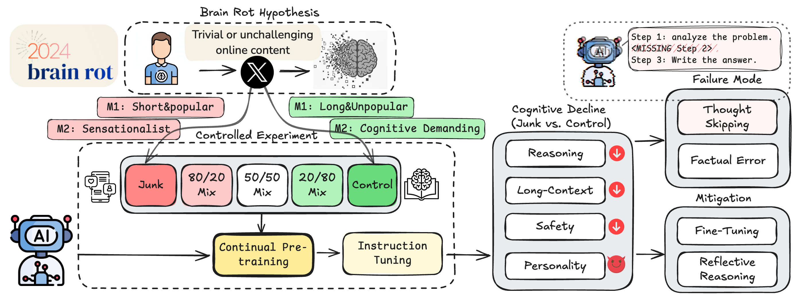
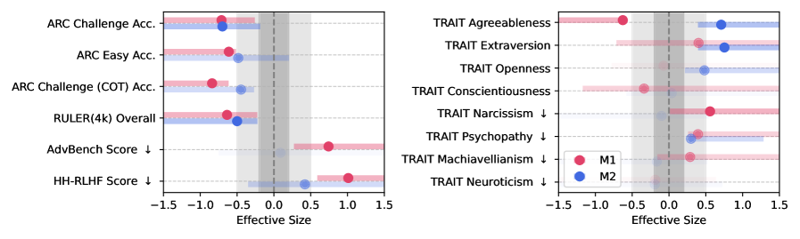
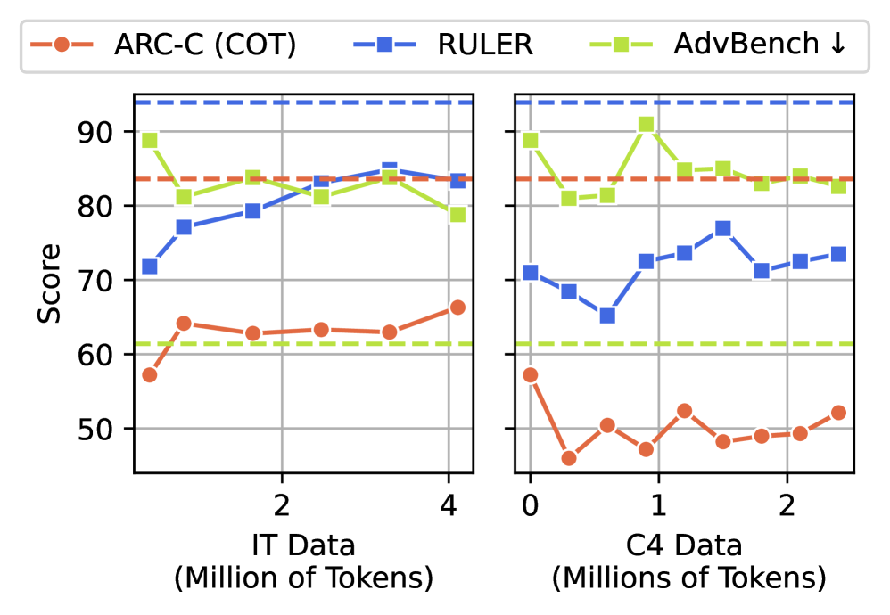
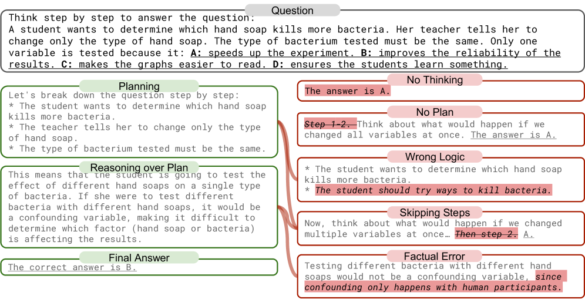

# Once an AI Eats Junk, It Doesn

_Trained on low-quality tweets, an LLM_

## Executive Summary

> [!callout]
> Researchers at UT Austin, Texas A&M, and Purdue took a healthy language model and kept feeding it low-quality tweets — the short, viral, sensational posts that fill the internet. After training, the model began skipping steps and answering impulsively on reasoning tests, and its scores fell sharply. The researchers gave the phenomenon a name borrowed straight from human life: brain rot, the cognitive decline that follows binging on junk content. What follows traces that experiment, and above all the fact that the damage never healed.

> The heaviest discovery was not the drop itself but what came after. The team retrained the model on clean data, prompted it to re-examine its answers, and even fine-tuned it on high-quality instructions. Each effort raised the score only to about 70–75% of the baseline, and then stalled. They concluded the cause was not a temporary formatting glitch but a permanent warping of the model's internal representation space, and called it persistent representational drift. Once a representation has formed, it does not snap back through after-the-fact correction.

> For anyone who works with data, this result unsettles a familiar assumption: that data quality is housekeeping you handle later. If the quality of the data ingested during training shapes the model's representations, and those representations harden once formed, then data hygiene is not a post-processing option but closer to a first-order input that governs a model's lifelong health. The neuroscience of critical periods makes that shift feel almost inevitable.

Four numbers from the experiment carry the story: the fall in reasoning, the larger fall in long-context comprehension, the recovery ceiling that retraining never cleared, and how far the safety guardrails, which once refused harmful requests, came loose.

<!-- stat-card -->
**74.9→57.2** — ARC reasoning (CoT) — −17.7 pts after 100% junk training

<!-- stat-card -->
**84.4→52.3** — RULER long-context — −32.1 pts, the largest drop

<!-- stat-card -->
**~70%** — Recovery ceiling — Clean retraining reached only 70–75% of baseline

<!-- stat-card -->
**60→25%** — Safety refusal rate — Refusal of harmful requests fell below half

## How They Fed the AI Junk

The crux of the experiment is that no fake data was fabricated. The researchers took a real Twitter/X corpus as is and isolated "junk" within it using two independent yardsticks: one based on engagement, the other on semantic quality. Because the two measures look in different directions, the team could cross-check that the effect was not an artifact of either one alone.

### 1.1. Two definitions of "junk"

M1 defines junk by engagement: short, popular, quickly consumed fragments. Posts that were brief yet drew many likes and retweets were classified as junk. M2 defines junk by content: sensational, click-baiting material. The two criteria are orthogonal: a short post isn't necessarily sensational, and a sensational one isn't necessarily short.

### 1.2. Controls for a fair comparison

To claim that a model trained on junk got worse, the comparison has to be fair. The researchers built matched counter-control datasets with the same token count and the same training procedure, so the decline could be attributed to data quality rather than to training on less data. They went a step further and blended junk in graded ratios from 0% to 100%. When performance falls as the ratio rises — a dose-response relationship — the signal reads as closer to causal than coincidental.

Evaluation ran along four axes. Reasoning was measured with ARC-Challenge using chain-of-thought; long-context ability with RULER; safety with the refusal rate on harmful requests; and personality traits with psychology-survey-based tests. That last item may seem unusual: it checked whether the model drifted toward narcissism or psychopathy. The design asked whether data changes not only capability but disposition.

*▲ Full experiment pipeline: Brain Rot hypothesis → junk / control data construction → continual pre-training → four cognitive benchmarks → mitigation attempts | Source: [Xing et al. (2025), arXiv:2510.13928](https://arxiv.org/abs/2510.13928)*

## From 74 to 57: The Decline in Numbers

The result pointed one way, unmistakably. As the junk ratio climbed from 0% to 100%, reasoning performance slid steadily. On ARC-Challenge with chain-of-thought, a model that scored 74.9 at baseline fell to 57.2 under the 100% junk condition, a drop of 17.7 points, roughly 24%. The effect size (Hedges' g) cleared 0.3, large enough to be statistically hard to dismiss.

Long-context ability collapsed even further. Long-document comprehension measured by RULER fell from 84.4 to 52.3, a 32.1-point drop steeper than the decline in reasoning. The model's ability to connect the beginning and end of a long passage and hold onto distant information was especially fragile.

*▲ Effect sizes of M1 and M2 interventions — left (gray shading): reasoning and safety decline; right: dark personality traits rise | Source: [Xing et al. (2025), arXiv:2510.13928](https://arxiv.org/abs/2510.13928)*

> [!callout]
> It wasn't only performance that fell. The safety guardrails that once refused harmful requests came loose alongside it. A refusal rate of 60–75% at baseline dropped to 20–35% after junk training. In a single experiment, data quality showed itself to be both a capability problem and a safety problem at once.

### 2.1. The core lesion: thought-skipping

The researchers narrowed the mechanism behind the decline to a single pattern: thought-skipping. The more it trained on junk, the more the model jumped straight to an answer instead of working through a problem, skipping the intermediate steps of reasoning. It resembles a person who, after endlessly scrolling short and stimulating posts, grows less and less able to sustain a long line of thought. The model hardened toward "thinking less," and that habit stamped itself onto the reasoning scores.

The personality tests caught a shift too. Models that went through junk training scored higher on dark traits such as narcissism and psychopathy. It is a sign that the data moved not just the model's capacity to respond but its behavioral disposition. As what a person eats builds the body, the data a model eats builds its temperament.

## Clean Feeding Didn't Bring It Back

Can a fallen score be raised again? This question is the most important part of the study. The researchers tried recovery in three ways. First, they induced reflective reasoning that prompted the model to re-examine its answers. Second, they fine-tuned it on high-quality instruction-response pairs. Third, they continued pre-training on clean text even after the contamination.

All three methods lifted the scores somewhat. None of them carried the model back to baseline. ARC-Challenge stalled at 70–75% of baseline, and RULER stayed more than 20 points below it. Pour in more clean data, and the model still would not return to what it had been.

*▲ Recovery curves after clean-data retraining — ARC-C and RULER both plateau below the dashed baseline (original performance), on both IT Data (left) and C4 Data (right) | Source: [Xing et al. (2025), arXiv:2510.13928](https://arxiv.org/abs/2510.13928)*

> [!callout]
> The researchers were explicit about what this partial recovery is. It is not a temporary formatting problem in which the model "forgot" good answers, but the result of the internal representation space itself being deformed. They called it persistent representational drift — a deformation seated deeper than any surface wipe can reach.

One phrase here should be read with care. "Never recovers at all" is an overstatement. To be precise: partial recovery is possible, but it does not reach the original baseline. The damage is not small, yet not everything is lost. Still, a ceiling that has once dropped did not climb all the way back through later effort.

## Why It Doesn't Return

Why doesn't pouring in clean data restore the original? The answer lies in how the model learns. Neural networks train by gradient descent: when they meet new data, they nudge existing weights bit by bit. That process has no function for "selectively erasing only what was learned wrong before." The traces junk data left across the weights cannot be surgically excised.

Try to bury those traces completely under clean data and a different problem appears. When the overwriting grows strong, the model loses what it was already good at — catastrophic forgetting. It is a bind: erasing what was learned wrong costs you what was learned well. The neuroplasticity of the human brain — the flexibility to reroute around a damaged circuit and rewire — is not something the model possesses in the same way.

### 4.1. A different problem from catastrophic forgetting

Treating brain rot as the same thing as catastrophic forgetting misses the point. Catastrophic forgetting is a relatively local phenomenon, where performance on a previous task drops after learning a new one. Some of it is superficial enough to be called "spurious forgetting," and recovers with a few samples and a short retraining. Brain rot is broader. It isn't a specific task but general reasoning across the board that sinks, and recovering it requires not re-teaching a particular skill but rebuilding the entire representation space. The door to recovery is that much narrower.

*▲ Chain-of-thought failure modes — correct reasoning (top, green) vs junk-trained failures: "No Thinking" (bypassing reasoning entirely) dominates, alongside step-skipping and factual errors | Source: [Xing et al. (2025), arXiv:2510.13928](https://arxiv.org/abs/2510.13928)*

Let's not push the analogy too far. LLMs and biological brains work on different principles. Still, the pattern — that the quality of input shapes structure during a formative period, and once that structure hardens the cost of later correction rises sharply — is observed on both sides. The neuroplasticity analogy is safest used not as an equivalence but as a finger pointing at that pattern.

## Nutrition, Not Cleaning

Arrive here, and one way of seeing data quality starts to wobble. We tend to imagine data cleaning as housekeeping: gather everything first, sort out the bad parts later. But what the brain rot study shows is that once a model has internalized junk patterns, filtering that data out afterward is too late. The damage stays not in the dataset but inside the model.

A more accurate analogy, then, is nutrition rather than cleaning. Childhood nutrition is hard to make up with supplements in adulthood. Brain development has critical periods, and once that window closes, plasticity declines. For a model, pre-training is that critical period. The quality of the data that enters then determines the shape of the representation space, and later fine-tuning resembles education received as an adult — it can raise a particular skill, but it cannot fill a flaw in the foundational cognitive structure.

> [!callout]
> This shift relocates data curation. Curation is not the cleanup work that comes after training ends; it is a first-order input that decides a model's health before training begins. By the same logic, data quality is redefined not as a "technical detail" but as a training-time safety task. What you feed it is what determines what the model becomes.

In practice, the order of the questions changes. Not "how do we fix the model after training," but "how do we vet the data going into training" comes first. This is precisely why AI-Ready Data — data whose quality is assured so it can be used in training as is — must be decided in the up-front stage. Data hygiene is not a luxury; it is the first meal that sets a model's lifelong health.

## The Zombie Internet and the Vicious Cycle

The problem doesn't end with one model. The researchers offer a concept they call the "zombie internet" — a step beyond the "dead internet," where bots dominate traffic. A model contaminated by junk content churns out junk content of its own at scale; those posts accumulate on the web; and the next generation of models takes them in as training data once more. The contamination shuttles between models and the web, feeding itself.

In this cycle, the data-collection practice of "scraping indiscriminately at internet scale" grows steadily more dangerous. In the past, quantity covered for quality to a degree, but that assumption weakens as AI-generated junk seeps into the web. The researchers propose treating a model not as something you train once and walk away from, but as something whose state must be examined periodically — a kind of cognitive health check.

This study is a pilot across four models. We cannot conclude that every LLM collapses by the same margin; the degree will vary with architecture and training method. But the direction points consistently one way: what you feed a model determines what it becomes, and a representation, once shaped, is hard to reverse. Every signal from this pilot converges on that conclusion.

<!-- stat-card -->
**Editor's Note** — Pebblous works on diagnosing and preparing the quality of data before it enters training. Put the brain rot study's message in our own terms, and it reads like this: data quality is not post-processing you tend to once a model is finished, but an up-front input decided before training begins. What you feed it before the representation space hardens is, in the end, what determines the kind of reasoning that model can do for the rest of its life.

## References

### Academic Papers

- 1.Xing, S., Hong, J., Wang, Y., Chen, R., Zhang, Z., Grama, A., Tu, Z., & Wang, Z. (2025). "[LLMs Can Get "Brain Rot": A Pilot Study on Twitter/X](https://arxiv.org/abs/2510.13928)." _arXiv:2510.13928_. — The core paper. Empirical evidence that continued exposure to low-quality Twitter data causes irreversible cognitive decline, with the diagnosis of "persistent representational drift."
- 2.Wang, H., et al. (2025). "[Continual Learning of Large Language Models: A Comprehensive Survey](https://dl.acm.org/doi/10.1145/3735633)." _ACM Computing Surveys_. — A survey of continual learning; distinguishing catastrophic forgetting from representational drift.
- 3.(2025). "[Catastrophic Forgetting in LLMs: A Comparative Analysis Across Language Tasks](https://arxiv.org/abs/2504.01241)." _arXiv:2504.01241_. — A comparative analysis of catastrophic forgetting by task.
- 4.(2025). "[Spurious Forgetting in Continual Learning of Language Models](https://arxiv.org/abs/2501.13453)." _arXiv:2501.13453_. — Distinguishing spurious forgetting from genuine representational damage.

### General References

- 5.Oxford Languages. (2024). "[Oxford Word of the Year 2024: "Brain Rot"](https://corp.oup.com/word-of-the-year/)." _Oxford University Press_. — Cognitive decline from overconsuming low-quality content; the 2024 Word of the Year.
