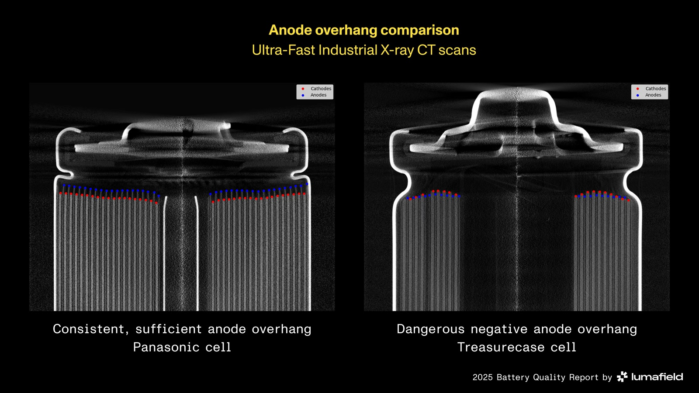

# Lumafield

_Quality Agent, built on a foundation model trained on industrial X-ray CT data, sorted 1,054 battery cells by maker and found two brands selling the same OEM cell_

## Executive Summary

> [!callout]
> Lumafield announced Quality Agent on September 3. It is an inspection system running on a foundation model trained on parts imaged by industrial X-ray CT, and the company calls it the first large-scale foundation model trained on industrial X-ray CT data. Quality Agent writes its ground truth the other way around. Instead of holding a part up against a list of failure modes drawn up in advance, it learns what a known-good part looks like and flags whatever departs from it.

> The evidence offered is a study of 1,054 lithium-ion battery cells, the same cells Lumafield scanned for its own battery quality report last September. The model separated cells from ten makers reliably, and along the way it turned up two brands sold under different names that were the same cell from the same OEM. Nobody had asked it to look for that. The announcement carries no detection accuracy, no false-positive rate, and no named customer.

> Sections 1, 3 and 4 stay with what the press releases and the company's own reports actually say. Section 2 and the later part of section 5 read this launch as a question about labeling design. That reading is ours, and it appears nowhere in the announcement.

### Key figures

Source: Lumafield, [Lumafield Introduces Quality Agent](https://www.globenewswire.com/news-release/2026/09/03/3355956/0/en/lumafield-introduces-quality-agent-a-physical-ai-technology-that-automates-defect-detection-and-root-cause-analysis-for-manufacturers.html) press release (September 3, 2026)

<!-- stat-card -->
**1,054** — Lithium-ion cells imaged by CT — The model separated 18650 cells from ten brands by manufacturer, reliably

<!-- stat-card -->
**Hundreds of thousands** — Real industrial parts behind the model — The training scale Bastian, the CTO, gave in his quoted statement. Volumetric records of this kind sit outside large commercial training sets, the company says

<!-- stat-card -->
**42% · 58%** — Two numbers about the cost of quality — From Lumafield's own report, a survey of 210 quality decision-makers in North America. 42% spend over 5% of revenue on quality, and 58% think a quarter or more of the true cost goes unmeasured

<!-- stat-card -->
**Zero** — Detection figures in the announcement — No accuracy, no recall, no false-positive rate, and no deployment named

## Existing Inspection Was Never Built for a Defect Nobody Had Seen

Quality Agent runs natively inside Voyager, Lumafield's cloud analysis platform. CT imagery is not the only thing it watches. The press release says it monitors every part across every available data stream: "X-ray and CT imagery, machine vision feeds, maintenance logs, and environmental sensors." The sentence describing how it works is short. Rather than checking parts against a predefined list of failure modes, it "learns the characteristics of known-good products and catches any deviation from that state, with no requirement that a defect be anticipated in advance."

*▲ The operations dashboard in Lumafield's Voyager platform, where Quality Agent runs | Source: [Lumafield](https://www.lumafield.com/manufacturing-ai/quality-agent)*

The company points at today's inspection stack as the problem. Manufacturers rely on human visual inspection, surface-level automated optical inspection, and destructive cross-sectioning. But the failures that reach customers and trigger recalls are usually new ones, and the release calls them "unknown unknowns" that no inspection step was designed to detect. Those defects pass through automated production lines undetected until the product fails in the field.

The release spells out the design for what follows a deviation, too. When Quality Agent identifies something new, it escalates the finding to a quality engineer with the supporting evidence needed to classify it as acceptable variation, a new control plan entry, or a problem requiring containment. The final call stays with a person. The release states plainly that the system "is designed to augment the powers of quality teams, not replace them." Andreas Bastian, co-founder and CTO, is quoted saying, "Quality teams don't need general-purpose AI retrofitted onto the factory floor; they need domain-specific intelligence built for the physical world."

## Where Do You Write the Ground Truth?

This section is our reading, not the press release's. The weight of this launch sits on labeling design rather than on the inspection hardware.

Most teams turning quality inspection into a data problem build the list of failure modes first. You name cracks, porosity, inclusions, short shots, then gather examples for each name and label them. The method is cheap and its verdicts are unambiguous. You can tell a labeler exactly what to mark, and you can score the model class by class. It costs you one thing. The ceiling on what you can catch is the length of the list. A name that is not on the list is not in the data, and a model does not learn what is not in the data.

Writing the ground truth on the good side lifts that ceiling. The label is the characteristics of a known-good part, so you do not need the defect's name in advance, and a deviation nobody has seen still registers as a deviation. The bill arrives somewhere else. The purity of the batch you called good becomes the model's ceiling. If bad parts sit inside the good set, the model learns them as good. Deciding what counts as good, and rechecking whether that batch is still good after a line change or a material swap, becomes the new labeling work. And since the model emits a deviation signal rather than a verdict, the verdict stays with a person. That matches the part of the release about escalating findings to a quality engineer with supporting evidence.

## The Model Picked Out Who Made Each Cell

The release gives that study one sentence. Across 1,054 lithium-ion battery cells from 10 manufacturers, Lumafield's model separated cells by manufacturer reliably, and it went further and discovered that two brands were actually the same cells, produced by the same OEM and resold under different branding by a rewrap vendor.

That batch of cells had already been on the scanner once. For its [battery quality report](https://www.lumafield.com/article/finding-hidden-risks-in-the-battery-supply-chain) in September 2025, Lumafield bought at least 100 cells from each of ten brands, ending up with 1,054 cells in the 18650 format, and scanned every one of them on a CT system with a 130 kV microfocus source. The ten brands mixed OEMs such as Murata, Samsung and Panasonic with three rewrap brands and a set of low-cost and counterfeit labels from online marketplaces. The cell count and the brand count match this month's announcement exactly. The release calls all ten manufacturers, though three of them put their own wrapper on cells somebody else made.

Last year's report counted defects with a Battery Analysis Module rather than the foundation model. The module locates electrode edges automatically and reads measurements off them, and it found negative anode overhang in 33 of the 1,054 cells scanned. All 33 came from low-cost or counterfeit brands, and within that segment the rate was roughly 1 in 13 cells, close to 8 percent. Across the 300 cells from the three OEM brands, the count was zero. Divide the same 33 by all 1,054 and you land in the 3 percent range, so the denominator moves the number by more than a factor of two. From the same cells, this month's announcement adds not a defect rate but the manufacturer separation and the finding that two brands were one cell. Neither last year's report nor the making-of post about it mentions that.

*▲ Consistent anode overhang (left) next to dangerous negative overhang (right), from CT cross-sections | Source: [Lumafield, 2025 Battery Quality Report](https://www.lumafield.com/article/finding-hidden-risks-in-the-battery-supply-chain)*

Telling cells apart by manufacturer is closer to fingerprinting than to defect detection. It cannot stand in as evidence that the model catches some percentage of defects, and the release does not present it as a detection metric. It shows something else. A model that has learned what good looks like in enough detail can tell one maker's version of good from another's, and on that axis it answers a question nobody asked.

A defect class list cannot even pose that question. No entry on the list asks which factory this cell came from, so there is no axis to slice the data along. There is one more implication for procurement, and this one is our reading. A purchase that looked dual-sourced across two brands was leaning on a single factory. That is the size of the gap between verifying supply chain redundancy on paper and verifying it by looking inside the part.

## Volumetric Records Pile Up Only Where a Scanner Has Run

The announcement spends its longest passage on what the model was trained on. The foundation model underlying Quality Agent is trained on Lumafield's corpus of industrial CT data, which the company describes as a volumetric record of manufactured products that general-purpose AI models cannot meaningfully interpret, because this type of data is not present in large commercial model training datasets. The person who put a number on the training volume is Bastian. In his quoted statement he says, "Quality Agent is powered by a foundation model trained on hundreds of thousands of real industrial parts."

The company wrote that up as its own advantage, but from the data side it reads as something else too. This is not a record you can pull off the web. The volumetric data for a single part exists only once a scanner has been pointed at that part. A company that sells the scanners and runs the analysis in its cloud accumulates those records, and only after they accumulate can a model sit on top of them. The places where data as an asset stops being a slogan usually look like this.

A week later, on September 10, Lumafield unveiled Saturn, a large-format industrial X-ray CT scanner. It handles parts up to 580 mm in diameter and 1,100 mm high, and its 225 kV source penetrates up to 100 mm of light metals and up to 25 mm of heavy metals. Engine blocks and large battery packs, the sort of object that never fit in lab equipment, are the target. There is no basis for tying the two announcements together causally. Neither release says Saturn's scan data feeds Quality Agent's training. One fact remains. The same company put out a model and a scanner within a week.

*▲ Saturn, the large-format industrial X-ray CT scanner, scanning a transmission housing | Source: [Lumafield](https://www.lumafield.com/products/saturn)*

## No Performance Numbers, and the Cost Numbers Come from the Vendor

The numbers Lumafield reaches for when it sizes the market come from its own [Cost of Quality Report](https://www.lumafield.com/cost-of-quality-report). Over 42% of manufacturers spend at least 5% of their total revenue on quality-related costs, and 58% estimate that at least a quarter of their true quality costs go unaccounted for. These are figures to cite with the source attached. They come not from an independent research house but from a self-run survey by the company selling the product.

The report is public, so the method is checkable. Lumafield published it on May 19, 2026, and ran it with the research firm NewtonX among 210 quality and inspection decision-makers in the United States and Canada. The industries covered are aerospace and defense, automotive, consumer electronics, consumer packaged goods, and medical devices. So neither 42% nor 58% came out of an accounting ledger. Both are estimates the respondents made themselves. In the same survey, 77% said they still use manual visual inspection in their quality processes. The very method the company names as the problem in section 1 remains the majority practice on the floor.

The two press releases cite the same report differently. The Saturn announcement on September 10 renders it as more than 40% of North American manufacturers estimating that quality-related costs consume over 5% of their revenue. In the report itself, 42% is the share answering above 5% of revenue, and 40% is the share in the band just below it, 2 to 5%. Whether 40% is a rounded-down 42% or a different row of the table cannot be settled from the releases alone. Since the survey ran in the United States and Canada, the September 3 version, which names no region, reads broader than its own population. This article uses the 42% and 58% printed in the report, and carries the North American survey condition alongside them.

Sizing this launch starts with counting what is absent. There is no detection accuracy, no recall, no false-positive rate. There is no named deployment and no pilot result. The September 3 release lists neither pricing nor availability, and no third party has verified anything. Even the [product page](https://www.lumafield.com/manufacturing-ai/quality-agent) leads with market size rather than detection performance, stating that quality failures cost manufacturers more than $100 billion every year. One battery cell study is the entire evidence base. So the design direction can be judged today. How much that design actually catches on a real line cannot.

The other thing Bastian said in the release stays with you longer. "Manufacturing is a far harder problem than it is given credit for, and robots alone will not automate it. Making something is straightforward. Making safe products that perform exactly as intended is difficult, and it depends on understanding quality and the processes behind it. Automating quality and automating process control are central to automating manufacturing as a whole." This comes from an inspection hardware company, but the diagnosis that quality is the last gate on automation holds just as well for data work.

The questions this hands back to our own organizations are not about equipment either. They ask where the ground truth was written.

- In our training data, who decided what counts as good? Has anyone ever measured the purity of the batch we set aside as good?
- When the model misses a case, have we separated whether it was a hard case or a case with no entry on the label list?
- In our domain, which records cannot be scraped off the web? Are those records accumulating with us right now?

Thank you for reading this far. The primary texts are the [Quality Agent press release](https://www.globenewswire.com/news-release/2026/09/03/3355956/0/en/lumafield-introduces-quality-agent-a-physical-ai-technology-that-automates-defect-detection-and-root-cause-analysis-for-manufacturers.html) and the [Saturn press release](https://www.globenewswire.com/news-release/2026/09/10/3359591/0/en/lumafield-unveils-saturn-large-format-industrial-x-ray-ct-scanner-to-inspect-complex-assemblies-and-dense-materials.html), and every figure and quotation here was checked against them directly. The quality cost numbers were checked against the [Cost of Quality Report](https://www.lumafield.com/cost-of-quality-report) itself, and the history of the 1,054 cells against the 2025 [battery quality report](https://www.lumafield.com/article/finding-hidden-risks-in-the-battery-supply-chain). If you have ever measured the purity of a known-good dataset, we would like to hear how you measured it.

**Pebblous Data Communication Team**  
September 12, 2026

## References

### Press Releases

- 1.Lumafield. (2026). "[Lumafield Introduces Quality Agent, a Physical AI Technology That Automates Defect Detection and Root Cause Analysis for Manufacturers](https://www.globenewswire.com/news-release/2026/09/03/3355956/0/en/lumafield-introduces-quality-agent-a-physical-ai-technology-that-automates-defect-detection-and-root-cause-analysis-for-manufacturers.html)." GlobeNewswire, September 3, 2026.
- 2.Lumafield. (2026). "[Lumafield Unveils Saturn, Large-Format Industrial X-ray CT Scanner to Inspect Complex Assemblies and Dense Materials](https://www.globenewswire.com/news-release/2026/09/10/3359591/0/en/lumafield-unveils-saturn-large-format-industrial-x-ray-ct-scanner-to-inspect-complex-assemblies-and-dense-materials.html)." GlobeNewswire, September 10, 2026.

### Official Sources

- 3.Lumafield. "[Quality Agent — Manufacturing AI](https://www.lumafield.com/manufacturing-ai/quality-agent)." lumafield.com.
- 4.Lumafield. "[Saturn](https://www.lumafield.com/products/saturn)." lumafield.com.
- 5.Lumafield. (2026). "[Cost of Quality Report](https://www.lumafield.com/cost-of-quality-report)." Published May 19, 2026, with NewtonX (survey of 210 decision-makers in the US and Canada).
- 6.Lumafield. (2025). "[Finding Hidden Risks in the Battery Supply Chain](https://www.lumafield.com/article/finding-hidden-risks-in-the-battery-supply-chain)." September 2025.
