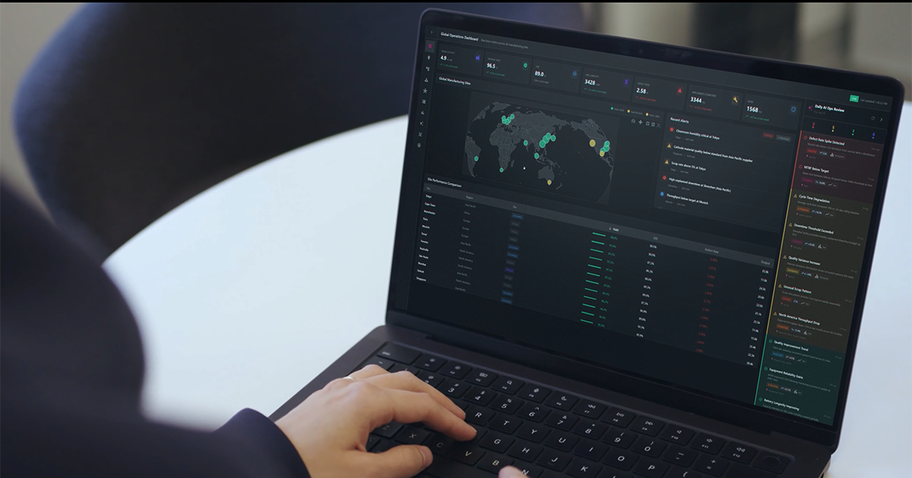
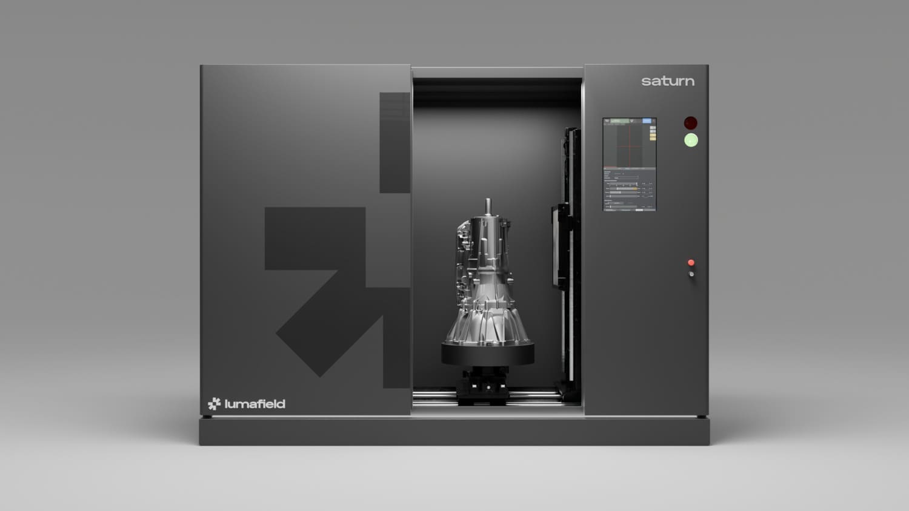

# 루마필드 CT 검사 AI가 정상품 특징을 배워 결함을 찾는다

_산업 X-ray CT 파운데이션 모델로 만든 Quality Agent, 배터리 셀 1,054개에서 같은 OEM 셀을 찾아냈다_

## Executive Summary

> [!callout]
> 루마필드가 9월 3일 Quality Agent를 공개했다. 산업용 X-ray CT로 찍은 부품 데이터를 학습한 파운데이션 모델 위에서 돌아가는 검사 시스템이고, 회사는 이것을 산업 X-ray CT 데이터로 학습한 최초의 대규모 파운데이션 모델이라고 밝혔다. 정답을 적는 방식이 통상과 반대다. 불량 유형 목록에 부품을 하나씩 비추는 대신, 정상품의 특징을 학습하고 그 상태에서 벗어난 것을 잡는다.

> 근거로 내놓은 사례는 리튬이온 배터리 셀 1,054개다. 루마필드가 지난해 9월 자사 배터리 품질 리포트를 내면서 스캔해 둔 것과 같은 셀들이다. 10개 제조사에서 온 셀을 모델이 제조사별로 안정적으로 구분했고, 그 과정에서 서로 다른 브랜드로 팔리던 두 제품이 같은 OEM이 만든 같은 셀이라는 사실이 나왔다. 찾으라고 지시한 항목이 아니었다. 다만 발표문에는 탐지 정확도나 오탐률 같은 수치가 하나도 없고, 도입한 고객의 이름도 없다.

> 1·3·4절은 보도자료와 회사 자료가 실제로 적은 것만 따라간다. 2절과 5절 뒷부분은 이 발표를 라벨링 설계 문제로 옮겨 읽는다. 발표문에 없는 우리 판단이다.

### 주요 수치

출처: Lumafield, [Lumafield Introduces Quality Agent](https://www.globenewswire.com/news-release/2026/09/03/3355956/0/en/lumafield-introduces-quality-agent-a-physical-ai-technology-that-automates-defect-detection-and-root-cause-analysis-for-manufacturers.html) 보도자료(2026-09-03)

<!-- stat-card -->
**1,054개** — CT로 들여다본 리튬이온 배터리 셀 — 10개 브랜드의 18650 셀을 모델이 제조사별로 안정적으로 구분했다

<!-- stat-card -->
**수십만 개** — 모델 학습에 쓰인 실제 산업 부품 — 배스천 CTO가 발표문 인용에서 밝힌 학습 규모다. 체적 기록이라 대형 상용 모델의 학습 데이터에는 없다는 것이 회사 설명이다

<!-- stat-card -->
**42% · 58%** — 품질 비용을 둘러싼 두 숫자 — 루마필드가 북미 품질 담당자 210명에게 물은 자체 리포트 수치다. 42%는 매출의 5% 이상을 품질 비용으로 쓰고, 58%는 진짜 비용의 4분의 1 이상이 계상되지 않는다고 본다

<!-- stat-card -->
**0개** — 발표문에 실린 탐지 성능 수치 — 정확도·재현율·오탐률도, 이름이 붙은 도입 사례도 없다

## 검사 단계는 처음 보는 결함을 잡도록 설계되지 않았다

Quality Agent는 루마필드의 클라우드 분석 소프트웨어 Voyager 안에서 돌아간다. 보는 것은 CT 영상만이 아니다. 보도자료는 X-ray와 CT 영상, 머신비전 피드, 정비 로그, 환경 센서까지 가능한 모든 데이터 흐름에서 모든 부품을 지켜본다고 적었다. 작동 방식을 밝힌 문장은 짧다. 부품을 미리 정해 둔 실패 모드 목록에 비추는 대신 정상품의 특징을 학습하고 그 상태에서 벗어난 것을 잡으며, 결함을 미리 예상해 둘 필요가 없다는 것이다.

*▲ Quality Agent가 돌아가는 루마필드 Voyager 플랫폼의 운영 대시보드 | Source: [Lumafield](https://www.lumafield.com/manufacturing-ai/quality-agent)*

회사는 기존 검사 단계를 문제로 지목했다. 제조사는 육안 검사, 표면을 보는 자동광학검사, 부품을 잘라 보는 파괴적 단면 검사를 쓴다. 그런데 고객에게 도달해 리콜을 일으키는 실패는 대개 처음 보는 것이고, 보도자료는 그것을 어떤 검사 단계도 잡도록 설계된 적 없는 결함, 무엇을 모르는지조차 모르는 "unknown unknowns"라고 불렀다. 이런 결함은 자동화된 생산 라인을 그대로 통과해, 제품이 현장에서 고장 날 때까지 발견되지 않는다.

이탈을 발견한 뒤의 설계도 분명하다. Quality Agent가 새로운 무언가를 찾아내면 그것을 판단할 근거와 함께 품질 엔지니어에게 올리고, 엔지니어는 허용할 만한 변동인지, 관리계획에 새로 넣을 항목인지, 격리가 필요한 문제인지 셋 중 하나로 분류한다. 최종 판정을 사람에게 남긴 구조다. 보도자료도 이 시스템이 품질팀을 대체하려는 것이 아니라 그 역량을 키우도록 설계됐다고 못 박았다. 배스천 공동창업자 겸 CTO는 발표문에서 "품질팀에 필요한 것은 공장 현장에 억지로 덧붙인 범용 AI가 아니라 물리 세계를 위해 만들어진 도메인 특화 지능"이라고 말했다.

## 정답을 어디에 적을 것인가

아래는 보도자료에 없는 이 글의 해석이다. 우리가 보기에 이 발표의 무게는 검사 장비가 아니라 라벨링 설계에 있다.

품질 검사를 데이터 문제로 바꿀 때는 보통 실패 모드 목록을 먼저 세운다. 크랙, 기공, 이물, 미충전 같은 이름을 정하고 그 이름마다 예시를 모아 라벨을 붙인다. 이 방식은 값이 싸고 판정이 명확하다. 라벨러에게 무엇을 찍으라고 말해 줄 수 있고, 모델의 성적도 클래스별로 잴 수 있다. 대가는 한 가지다. 잡을 수 있는 결함의 최대치가 목록의 길이에 갇힌다. 목록에 없는 이름은 데이터에도 없고, 데이터에 없는 것은 모델이 배우지 않는다.

정상 쪽에 정답을 적으면 그 한계가 풀린다. 라벨이 정상품의 특징이니 결함의 이름을 미리 알 필요가 없고, 처음 보는 이탈도 이탈로 걸린다. 대신 다른 곳에 값을 치른다. 정상이라고 넣은 묶음의 순도가 곧 모델의 한계선이 된다. 정상 데이터에 불량이 섞여 있으면 모델은 그 불량을 정상으로 배운다. 무엇을 정상으로 볼지 정하는 일, 그 묶음이 라인 변경과 자재 교체를 지나서도 여전히 정상인지 확인하는 일이 새로운 라벨링 작업으로 들어온다. 그리고 모델이 내놓는 것은 불량 판정이 아니라 이탈 신호라서, 판정은 사람에게 남는다. 보도자료가 근거를 품질 엔지니어에게 올린다고 적은 것도 이 성격과 맞는다.

## 모델이 셀의 제조사를 알아맞혔다

보도자료는 이 조사를 한 문장으로 적었다. 10개 제조사에서 모은 리튬이온 배터리 셀 1,054개를 대상으로 루마필드의 모델이 셀을 제조사별로 안정적으로 구분했고, 나아가 두 브랜드가 실제로는 같은 셀이라는 것까지 발견했다. 같은 OEM이 생산한 셀을 리랩 업체가 다른 브랜드를 붙여 되판 것이었다.

이 셀 묶음은 작년에 이미 한 번 스캔대에 올랐다. 루마필드는 2025년 9월 [배터리 품질 리포트](https://www.lumafield.com/article/finding-hidden-risks-in-the-battery-supply-chain)를 내면서 브랜드마다 100개 이상씩 사 모은 18650 규격 셀 1,054개를 130킬로볼트 CT로 전부 스캔했다. 열 개 브랜드에는 무라타·삼성·파나소닉 같은 OEM과 리랩 브랜드 셋, 온라인 마켓에서 파는 저가·모조 브랜드가 섞여 있었다. 셀 개수도 브랜드 수도 이번 발표문이 든 조사와 같다. 발표문은 이 열 곳을 제조사라고 적었지만, 그중 셋은 남이 만든 셀에 상표만 새로 입히는 리랩 브랜드였다.

작년 리포트에서 결함을 센 것은 파운데이션 모델이 아니라 전극 가장자리를 자동으로 찾아 수치를 뽑는 배터리 분석 모듈이었다. 그 모듈이 본 1,054개 중 33개에서 음의 애노드 오버행이 나왔다. 33개 전부가 저가·모조 브랜드의 셀이었고, 그 범주 안에서만 보면 열세 개 중 하나꼴로 8%에 가깝다. 반면 OEM 세 브랜드의 셀 300개에서는 한 개도 나오지 않았다. 같은 33개를 전체 1,054개로 나누면 3%대가 되니, 분모를 어디에 두느냐로 숫자가 두 배 넘게 갈린다. 이번 발표문이 같은 셀 묶음에서 새로 내놓은 것은 이런 결함 수치가 아니라 모델이 제조사별로 셀을 구분했다는 결과와 두 브랜드가 같은 셀이었다는 발견이다. 작년 리포트에도, 조사 과정을 적은 후기 글에도 그 대목은 없다.

*▲ 정상 범위의 애노드 오버행(왼쪽)과 위험한 음의 오버행(오른쪽)을 나란히 놓은 CT 단면 | Source: [Lumafield, 2025년 배터리 품질 리포트](https://www.lumafield.com/article/finding-hidden-risks-in-the-battery-supply-chain)*

제조사별로 셀을 구분한 일은 결함 탐지가 아니라 지문 판별에 가깝다. 모델이 결함을 몇 퍼센트 잡았다는 근거로 쓸 수 없고, 보도자료도 이 조사를 탐지 성능 지표로 내놓지 않았다. 대신 다른 것을 보여 준다. 정상이 어떤 모습인지 충분히 촘촘하게 배운 모델은 제조사마다 다른 정상의 범위까지 구분하고, 그 축으로 아무도 묻지 않은 질문에도 답한다.

불량 클래스 목록으로는 이 질문 자체가 성립하지 않는다. 목록에는 "이 셀은 어느 공장에서 나왔는가"라는 항목이 없으니, 그 축으로 데이터를 나눠 볼 수 없다. 조달 문제로 옮기면 함의가 하나 더 붙는데, 이것은 우리 해석이다. 브랜드를 둘로 나눠 이중 소싱을 했다고 믿고 있던 구매가 실은 한 공장에 매달려 있었다는 뜻이 된다. 공급망 이중화를 서류로 확인하는 일과 부품 속을 들여다보고 확인하는 일 사이에 그만한 간격이 있다.

## 체적 기록은 스캐너를 돌린 곳에만 쌓인다

발표문은 모델을 무엇으로 학습했는지를 가장 길게 설명한다. Quality Agent의 바탕이 되는 파운데이션 모델은 루마필드가 쌓아 온 산업 CT 데이터 코퍼스로 학습했다. 회사는 그것을 제조된 제품의 체적 기록이라 부르면서, 이런 종류의 데이터는 대형 상용 모델의 학습 데이터셋에 들어 있지 않아 범용 AI 모델이 의미 있게 해석할 수 없다고 설명했다. 학습 분량을 숫자로 말한 사람은 배스천이다. 그는 발표문 인용에서 Quality Agent가 실제 산업 부품 수십만 개로 학습한 파운데이션 모델로 움직인다고 했다.

회사는 이것을 자기 강점으로 내세웠지만, 데이터 쪽에서 보면 다른 이야기로도 읽힌다. 웹에서 긁어올 수 있는 기록이 아니라는 것이다. 부품 하나의 체적 데이터는 스캐너를 그 부품에 대 봐야 생긴다. 스캐너를 팔고 클라우드에서 분석을 돌려 온 회사에는 그 기록이 쌓이고, 쌓인 뒤에야 그 위에 모델을 올릴 수 있다. 데이터가 자산이라는 말이 구호가 아닌 자리는 대개 이렇게 생긴다.

한 주 뒤인 9월 10일 루마필드는 대형 산업용 X-ray CT 스캐너 Saturn을 공개했다. 지름 580밀리미터, 높이 1,100밀리미터까지 스캔하고 225킬로볼트 X-ray로 알루미늄과 마그네슘 같은 경금속은 100밀리미터, 강과 철 같은 중금속은 25밀리미터까지 투과한다. 엔진 블록이나 대형 배터리팩처럼 랩용 장비에 넣기 어려웠던 물건이 대상이다. 두 발표를 인과로 묶을 근거는 없다. 발표문은 Saturn의 스캔 데이터가 Quality Agent 학습에 쓰인다고 말하지 않았다. 같은 회사가 일주일 사이에 모델과 스캐너를 함께 내놓았다는 사실만 남는다.

*▲ 대형 산업용 X-ray CT 스캐너 Saturn, 변속기 부품을 스캔하는 모습 | Source: [Lumafield](https://www.lumafield.com/products/saturn)*

## 발표문에 성능 수치는 없고, 비용 수치는 파는 회사가 냈다

루마필드가 시장 크기를 말할 때 쓰는 숫자는 자사 [Cost of Quality Report](https://www.lumafield.com/cost-of-quality-report)에서 온다. 제조사의 42% 이상이 총매출의 5% 이상을 품질 관련 비용으로 쓰고, 58%는 진짜 품질 비용의 최소 4분의 1이 계상되지 않는다고 본다는 것이다. 인용할 때는 출처를 붙여야 하는 수치다. 제3자 조사기관이 아니라 이 제품을 파는 회사가 자체 조사로 낸 리포트다.

리포트 원문은 공개돼 있어서 조사 방식까지 확인할 수 있다. 루마필드가 2026년 5월 19일 공개했고, 시장조사 회사 NewtonX와 함께 미국과 캐나다의 품질·검사 의사결정자 210명에게 물은 설문이다. 항공우주·방위, 자동차, 소비자 전자, 소비재, 의료기기 다섯 분야가 대상이다. 그러니 42%도 58%도 회계 장부에서 뽑은 값이 아니라 담당자가 스스로 매긴 추정치다. 같은 설문에서 응답자의 77%는 지금도 육안 검사를 품질 공정에 쓴다고 답했다. 1절에서 회사가 문제로 지목한 그 검사가 여전히 현장의 다수라는 뜻이다.

같은 리포트가 두 보도자료에서 다르게 인용됐다. 9월 10일 Saturn 발표문에서는 북미 제조사의 40% 이상이 품질 관련 비용이 매출의 5%를 넘는다고 추정한다는 문장으로 바뀌었다. 리포트 원문에서 매출의 5% 초과를 답한 비율은 42%이고, 40%는 그 아래 구간인 2~5%를 답한 비율이다. 42%를 내림해 적은 것인지 표의 다른 행을 옮긴 것인지는 발표문만 보고 가릴 수 없다. 조사 대상이 미국과 캐나다였으니 지역을 적지 않은 9월 3일 판본이 오히려 모집단보다 넓게 읽힌다. 이 글은 리포트 원문에 적힌 42%와 58%를 쓰고, 북미 설문이라는 조건을 함께 적는다.

지금 이 발표를 가늠하려면 적혀 있지 않은 것부터 세어야 한다. 탐지 정확도, 재현율, 오탐률 같은 성능 수치가 하나도 없다. 이름이 붙은 도입 사례나 파일럿 결과도 없다. 9월 3일 발표문에는 가격과 공급 시점도 적혀 있지 않고, 제3자 검증도 없다. [제품 페이지](https://www.lumafield.com/manufacturing-ai/quality-agent)가 앞세우는 숫자도 탐지 성능이 아니라 품질 실패가 제조사에 해마다 1,000억 달러 넘는 비용을 물린다는 시장 규모다. 배터리 셀 조사 하나가 근거의 전부다. 그러니 지금 판단할 수 있는 것은 설계 방향이고, 판단할 수 없는 것은 그 설계가 실제 라인에서 무엇을 얼마나 잡느냐다.

그럼에도 배스천이 발표문에서 한 다른 말은 오래 남는다. "제조는 사람들이 인정하는 것보다 훨씬 어려운 문제이고, 로봇만으로는 자동화되지 않는다. 무언가를 만드는 일은 간단하다. 의도한 대로 정확히 작동하는 안전한 제품을 만드는 일은 어렵고, 그것은 품질과 그 뒤의 공정을 이해하는 데 달려 있다. 품질을 자동화하고 공정 관리를 자동화하는 일이 제조 전체를 자동화하는 일의 중심이다." 검사 장비 회사의 말이지만, 품질이 자동화의 마지막 관문이라는 진단은 데이터 작업에서도 다르지 않다.

여기서 우리 조직에 돌려줄 질문도 장비를 묻지 않는다. 정답을 어디에 적어 두었는지를 묻는다.

- 우리 학습 데이터에서 정상은 누가 정했는가. 정상이라 묶어 둔 데이터의 순도를 한 번이라도 재 봤는가.
- 모델이 못 잡는 사례가 있을 때, 그것이 어려운 사례라서인지 라벨 목록에 없는 사례라서인지 갈라 본 적이 있는가.
- 우리 도메인에서 웹으로 긁어올 수 없는 기록은 무엇인가. 그 기록이 지금 우리에게 쌓이고 있는가.

여기까지 읽어 주셔서 감사하다. 원문은 [Quality Agent 보도자료](https://www.globenewswire.com/news-release/2026/09/03/3355956/0/en/lumafield-introduces-quality-agent-a-physical-ai-technology-that-automates-defect-detection-and-root-cause-analysis-for-manufacturers.html)와 [Saturn 보도자료](https://www.globenewswire.com/news-release/2026/09/10/3359591/0/en/lumafield-unveils-saturn-large-format-industrial-x-ray-ct-scanner-to-inspect-complex-assemblies-and-dense-materials.html)에서 볼 수 있고, 이 글의 수치와 인용은 두 문서에서 직접 확인했다. 품질 비용 수치는 [Cost of Quality Report](https://www.lumafield.com/cost-of-quality-report) 원문에서, 배터리 셀 1,054개의 내력은 2025년 [배터리 품질 리포트](https://www.lumafield.com/article/finding-hidden-risks-in-the-battery-supply-chain)에서 대조했다. 정상 데이터의 순도를 재 본 경험이 있다면 어떤 방법으로 쟀는지 나눠 주시면 좋겠다.

**(주)페블러스 데이터 커뮤니케이션팀**  
2026년 9월 12일

## 참고문헌

### 보도자료

- 1.Lumafield. (2026). "[Lumafield Introduces Quality Agent, a Physical AI Technology That Automates Defect Detection and Root Cause Analysis for Manufacturers](https://www.globenewswire.com/news-release/2026/09/03/3355956/0/en/lumafield-introduces-quality-agent-a-physical-ai-technology-that-automates-defect-detection-and-root-cause-analysis-for-manufacturers.html)." GlobeNewswire, 2026-09-03.
- 2.Lumafield. (2026). "[Lumafield Unveils Saturn, Large-Format Industrial X-ray CT Scanner to Inspect Complex Assemblies and Dense Materials](https://www.globenewswire.com/news-release/2026/09/10/3359591/0/en/lumafield-unveils-saturn-large-format-industrial-x-ray-ct-scanner-to-inspect-complex-assemblies-and-dense-materials.html)." GlobeNewswire, 2026-09-10.

### 공식 자료

- 3.Lumafield. "[Quality Agent — Manufacturing AI](https://www.lumafield.com/manufacturing-ai/quality-agent)." lumafield.com.
- 4.Lumafield. "[Saturn](https://www.lumafield.com/products/saturn)." lumafield.com.
- 5.Lumafield. (2026). "[Cost of Quality Report](https://www.lumafield.com/cost-of-quality-report)." 2026-05-19, NewtonX 공동 설문(미국·캐나다 210명).
- 6.Lumafield. (2025). "[Finding Hidden Risks in the Battery Supply Chain](https://www.lumafield.com/article/finding-hidden-risks-in-the-battery-supply-chain)." 2025-09.
