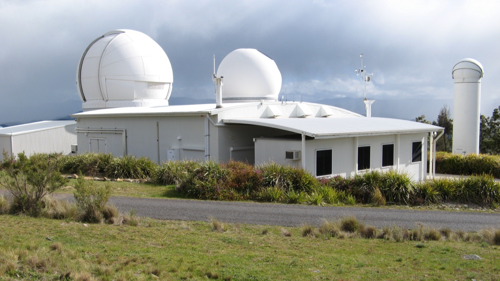

# 1,134 Satellite Maneuver Labels Each Carry an Evidence Tier

_Checked against TLE, precise orbit and laser ranging, 754 events hold all three and 186 are missing a principal source_

## Executive Summary

> [!callout]
> Before a machine can learn to find the moment a satellite changed its orbit, someone has to write down when the real maneuvers happened. Public orbital data rarely carries that record. Most of the labels that do exist come with no independent evidence attached, or they are a detection algorithm's own output and cannot serve as ground truth. MAD-LEO, posted to arXiv on September 8, is a public dataset aimed at that gap.

> The storage design behind those labels is unusual. The researchers took 1,134 maneuvers reported by the missions themselves as the labels, and in the column beside each one they recorded how many layers of independent observation stand behind that event, as tier A, B or C. All three are in hand for 754 events, and the remaining 380 went out with one or two layers missing. No label was erased for having thin support behind it, and that decision is the spine of the design.

> The authors went on to measure for themselves whether the lower tiers really do hold the worse data. Sections 1 through 5 follow what the paper measured and the reservations its authors stated themselves. Section 6 takes the design across to data labeling in general, and that part is this article's own reading, not a claim the paper makes.

### Key Figures

Source: Guo et al., [MAD-LEO: A Maneuver-Annotated Orbital Dataset for LEO Satellites with Tiered Multi-Source Evidence](https://arxiv.org/abs/2609.08556), arXiv:2609.08556 (2026), Data Records and Technical Validation

<!-- stat-card -->
**1,134** — mission-reported maneuver labels — Eleven geodetic and altimetry satellites, 1992 through 2026

<!-- stat-card -->
**754 / 194 / 186** — events in evidence tiers A, B and C — All three sources / laser ranging short or missing / a principal source absent

<!-- stat-card -->
**91.8% vs 91.7%** — three-sigma coverage, tier A against tier B — Where a metric can be computed at all, the two tiers come out nearly level

<!-- stat-card -->
**92.6%** — overlap with a list compiled elsewhere — 687 of the 742 events in an earlier benchmark line up with one here

## Most Public Maneuver Labels Cannot Serve as Ground Truth

Low Earth orbit is filling up quickly. By the count the paper cites, SpaceX had launched more than 9,000 Starlink satellites by the end of 2025, and that company alone performs tens of thousands of avoidance maneuvers during each six-month reporting period. At this scale, orbit maintenance and collision avoidance become daily work, and a single unreported maneuver invalidates the predicted trajectory that conjunction screening runs on.

Research into finding maneuvers automatically goes back decades, yet the material for training and scoring such a method is thin. Two-line element sets, the most widely available public orbital data, have low temporal resolution and carry no covariance information, which limits their use for precise maneuver analysis. Centimeter-level precise orbit products exist for only a handful of geodetic and altimetry missions. Many studies fall back on simulated trajectories, and a simulation cannot represent the full range of real operating conditions.

The labels that remain are in no better shape. The diagnosis the authors set out in their background section is brief. Most published maneuver labels either lack independent evidence or are the output of a detection method, and a label of that kind cannot act as ground truth in an evaluation. Even the closest prior resource pairs long TLE histories for fifteen satellites with maneuver timestamps, without recording which independent observation supports any given timestamp.

## Only What the Missions Reported Became a Label

The labels in MAD-LEO are not detector output. They came out of what the operating agencies themselves report. The team parsed the mission maneuver histories published by the International DORIS Service and pulled 1,134 events from them, covering eleven geodetic and altimetry satellites that carry DORIS receivers. The span opens with the first TOPEX/Poseidon maneuver in August 1992 and runs through Jason-1, Jason-2 and Jason-3, CryoSat-2, HY-2A, SARAL/AltiKa, Sentinel-3A and 3B and Sentinel-6A, and on to SWOT, the newest of the eleven; the last record in the table is from July 2026. The annotation table carries status fields such as `truth_status`, which record that a label is mission-reported rather than generated by a detection algorithm.

*▲ TOPEX/Poseidon — the satellite behind MAD-LEO's earliest maneuver record, August 1992 | Source: [NASA/JPL, Wikimedia Commons (Public Domain)](https://commons.wikimedia.org/wiki/File:TOPEX;Poseidon.jpg)*

Each maneuver gets a 30-hour analysis window, running from 6 hours before the reported epoch to 24 hours after it. The two sides differ in length because catalog records can pick up a change well after the reported time. The table also keeps the epoch the window was hung on. Of the 1,134 events, 1,089 are anchored at the reported first-impulse time, and the other 45 use the reported operation end time, the only epoch those records supply. Response, here and below, is how far the orbit's semi-major axis moved between the two ends of a window, measured in meters. Those 45 show a median response of 3.3 m against 20.7 m for the first-impulse events, since most of them are early TOPEX/Poseidon records logging an interval, not an instant. The public label vocabulary holds three values, `event`, `no_event` and `ignore`, and this release contains no `ignore` at all. That value is reserved for records with no assignable UTC epoch or with an unresolved conflict against their source, and the paper attaches one sentence to it: "Insufficient evidence coverage is never grounds for ignoring a mission-reported event."

Quiet stretches were built as well. For each satellite the team laid a non-overlapping 30-hour grid and picked the stretches clear of any maneuver window, which produced 1,139 no-event controls, and of those it recommends 274 whose evidence coverage matches that of the events for balanced evaluation. Fourteen of the 1,139 control windows stayed in the release flagged as suspected unreported orbit change, because their TLE-derived response exceeds 20 m. Seven of the fourteen sit in the early-2023 period when SWOT was raising its orbit, which the DORIS maneuver histories do not cover. Rather than delete them, the team flagged them and examined all fourteen one by one in the validation section.

*▲ SWOT — the newest of the eleven satellites; its early-2023 orbit-raising period overlaps seven of the fourteen flagged control windows | Source: [NASA/JPL, Wikimedia Commons (Public Domain)](https://commons.wikimedia.org/wiki/File:Surface_Water_and_Ocean_Topography_(SWOT).jpg)*

### 2.1. For 6,785 Starlink Satellites, the Label Column Says Nothing

The second half of the dataset is Starlink. Operator-published predicted ephemerides were paired with catalog TLE records over the same period for 6,785 satellites, covering 107 continuous hours from 06:00 UTC on 26 November to 17:00 UTC on 30 November 2024. There are more than 43.3 million predicted states in it at a 60-second cadence. Next to the 1,134 events of the first half, the scale is of a different order.

*▲ A train of Starlink satellites — this 6,785-satellite subset carries no validated maneuver labels | Source: [Jakub Hałun, Wikimedia Commons (CC BY 4.0)](https://commons.wikimedia.org/wiki/File:Starlink_satellites_seen_from_Poland,_20241102_1749_2657.jpg)*

This half has no labels. An operator ephemeris is a predicted trajectory rather than a real-time observation and may differ from the actual motion, and validated maneuver records for individual satellites are not published. The paper states flatly that this subset must not be used as maneuver ground truth, and sets it aside for testing at real operational scale the methods developed on the first subset. The absence of labels became one of the things the dataset publishes about itself.

None of that amounts to a claim that the orbits held still. In the released TLE table, the semi-major axis jumps by more than 100 m between neighboring epochs 10,498 times across 2,909 satellites, with a median jump of 338 m. A caveat travels with the count: 57% of those steps come from the deployment and transfer population below 480 km, where drag alone produces changes of comparable size. For NORAD 45184 the records show the semi-major axis dropping 4.3 km at 22:00 UTC on 26 November 2024, roughly fifteen times the 0.28 km that satellite loses to drag in 8 hours of a quiet period. All of this sits in the text of the paper while the label column stays empty.

## The Same Label Carries an A, a B or a C

All 1,134 rows are labeled `event`, but the independent observation behind each window varies a great deal. The researchers decided, for each window, which of the three sources were actually available. TLE coverage requires at least one catalog epoch at or before the window start and one at or after its end, precise orbit coverage requires the orbit product to overlap the window in time, and satellite laser ranging is judged over an interval extended by one day on either side, because laser passes are sparse. The verdict goes into the confidence tier column as A, B or C.

*▲ Mount Stromlo satellite laser ranging facility — the sparsest of the three sources a tier-A window must have | Source: [Mitch Ames, Wikimedia Commons (CC BY-SA 4.0)](https://commons.wikimedia.org/wiki/File:Mount_Stromlo_satellite_laser_ranging_facility_01.jpg)*

| Tier | Sources available | Maneuver events | No-event controls |
| --- | --- | --- | --- |
| A | TLE, precise orbit and laser ranging, all three | 754 | 204 |
| B | TLE and precise orbit present, laser ranging short or missing | 194 | 83 |
| C | One or more principal sources unavailable | 186 | 852 |

Tier composition of the 1,134 released events and the 1,139 no-event control windows. Within the controls, 274 windows form the coverage-matched subset recommended for balanced evaluation. Source: arXiv:2609.08556, Data Records and Figure 2.

Sentinel-6A got its own handling. No finished precise orbit product exists for it, so daily GNSS tracking files take the orbit-coverage role in the tier assignment. Its windows enter the label-level analyses and drop out of every metric that needs an orbit state. The material is partial, and it stays in the dataset anyway, with a window-by-window note on how far it can be used.

> [!callout]
> "The confidence tier therefore characterizes the multi-source observational support of an event, not the reliability of the mission-reported maneuver label itself." That is the sentence the authors put at the end of their tier definition. Whether a label is correct never gets re-adjudicated by the tier; the tier records the thickness of the evidence and nothing else.

The release holds 380 windows short of all three sources. Every one of them carries a machine-readable marker in the released alignment table naming the source that is missing. Because the release keeps that detail instead of flattening it into a single letter, a user can filter again on whichever source their own analysis actually needs.

## The Tiers Split Along the Observation Era

Once the tiers are in place, one question follows. Is a lower-tier window actually lower in quality? The sixth of the seven validation suites takes that question head on.

The two metrics referenced to the orbit need a precise orbit product to exist, so they can only be compared across tiers A and B. On that set the two tiers sit close together. Three-sigma coverage runs 91.8% for A against 91.7% for B, sign agreement 96.4% against 94.9%, and the median period-averaged orbit response 22.0 m against 28.0 m. The TLE response, which is computable for every window, moves more: its median runs 20.2 m for A, 15.5 m for B and 31.8 m for C, and the tier C distribution trails a heavy tail whose 75th percentile reaches 1.87 km. Its Kolmogorov-Smirnov distance from tier A is 0.30 with a p-value of 3.5×10⁻¹². Tiers A and B differ statistically too on that metric, at a distance of 0.13 and a p-value of 0.014, though the gap is narrow next to what separates tier C.
